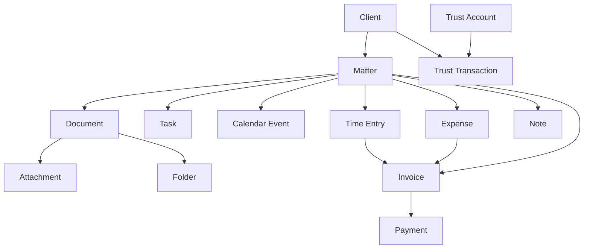

# APZHUB Law Platform — Canonical Domain Model

> **Story:** LAW-001-03 — Canonical Legal Domain Model  
> **Product:** Law Firm Platform v1.0  
> **Platform baseline:** [Platform Version 5.0](../releases/APZHUB-Platform-v5.0.md) — **frozen**  
> **Status:** **Canonical** — authoritative business vocabulary  
> **Authority:** [Law Platform Reference Architecture](./APZHUB-Law-Platform-Reference-Architecture.md) · [Law Capability Map](./APZHUB-Law-Capability-Map.md)

---

## Purpose

This document defines the **canonical business vocabulary** for the entire Law Platform. Every future module, manifest, API, persistence model, and UI screen must reference these entity definitions.

| Rule                   | Detail                                                                                          |
| ---------------------- | ----------------------------------------------------------------------------------------------- |
| Single source of truth | This document is the only authoritative definition of legal business entities                   |
| No duplication         | Modules must not redefine entities under alternate names                                        |
| Consumption only       | Modules reference entities; they do not extend the canonical model without architecture review  |
| Platform separation    | Platform concepts (Workbench view, Action, Platform Notification) are not legal domain entities |

---

## Architecture rules

1. **One entity, one name** — e.g. `Matter` is always `Matter`, never Case, File, or Engagement in domain language.
2. **No module-owned synonyms** — module code may use display labels, not alternate entity types.
3. **Relationships are explicit** — cardinality and ownership are defined here; modules must not invent parent/child rules.
4. **Enumerations are shared** — status, priority, and type values are drawn from the Enumeration Catalogue (§5).
5. **Platform projections are distinct** — `Notification`, `Activity`, and platform Knowledge documents are runtime projections; legal domain entities describe business meaning only.
6. **Identifiers are stable** — once assigned, entity IDs and reference numbers are immutable; display names may change.

---

## Domain overview

```text
                    ┌─────────────┐
                    │ Organisation │
                    └──────┬──────┘
                           │ employs / retains
              ┌────────────┼────────────┐
              ▼            ▼            ▼
          ┌────────┐  ┌────────┐  ┌──────────┐
          │ Client │  │ Contact│  │ Attorney │
          └───┬────┘  └───┬────┘  └────┬─────┘
              │           │            │
              └─────┬─────┘            │
                    ▼                  │
               ┌─────────┐             │
               │ Matter  │◄────────────┘ (team roles)
               └────┬────┘
    ┌───────────────┼───────────────┬──────────────┐
    ▼               ▼               ▼              ▼
┌─────────┐   ┌─────────┐    ┌──────────┐   ┌──────────┐
│Document │   │  Task   │    │Calendar  │   │Time Entry│
└────┬────┘   └────┬────┘    │  Event   │   └────┬─────┘
     │             │          └──────────┘        │
     │             └──────────┬───────────────────┘
     ▼                        ▼
┌─────────┐              ┌─────────┐
│ Folder  │              │ Invoice │
└─────────┘              └────┬────┘
                              ▼
                         ┌─────────┐
                         │ Payment │
                         └─────────┘
```

---

## 1. Canonical entity definitions

### 1.1 Party and relationship domain

#### Client

| Attribute           | Definition                                                                                                                             |
| ------------------- | -------------------------------------------------------------------------------------------------------------------------------------- |
| **Definition**      | A party that retains the firm for legal services. May be a person or an organisation acting as client.                                 |
| **Identity**        | `clientId` (UUID), `clientReference` (firm-assigned code)                                                                              |
| **Key attributes**  | `displayName`, `clientType` (individual \| organisation), `status`, `primaryContactId`, `billingAddressId`, `tags[]`, `customFields{}` |
| **Lifecycle**       | prospect → active → inactive → archived                                                                                                |
| **Owned by module** | Client Management (LAW-002)                                                                                                            |

#### Organisation

| Attribute          | Definition                                                                                                                                  |
| ------------------ | ------------------------------------------------------------------------------------------------------------------------------------------- |
| **Definition**     | A structured legal entity (company, trust, government body) that may be a Client, opposing party, court registry body, or contact employer. |
| **Identity**       | `organisationId`, `organisationReference`                                                                                                   |
| **Key attributes** | `legalName`, `tradingName`, `registrationNumber`, `taxIdentifier`, `organisationType`, `addresses[]`, `contacts[]`                          |
| **Notes**          | When an Organisation is the Client, Client record references this Organisation.                                                             |

#### Contact

| Attribute          | Definition                                                                                                                          |
| ------------------ | ----------------------------------------------------------------------------------------------------------------------------------- |
| **Definition**     | A person associated with a Client, Organisation, Matter, or Court who is not necessarily a firm User.                               |
| **Identity**       | `contactId`, `contactReference`                                                                                                     |
| **Key attributes** | `givenName`, `familyName`, `displayName`, `title`, `roleTitle`, `emails[]`, `phones[]`, `addresses[]`, `preferredCommunicationType` |
| **Cardinality**    | 0..n Contacts per Client; 0..n Contacts per Organisation                                                                            |

#### Relationship

| Attribute          | Definition                                                                                                                                     |
| ------------------ | ---------------------------------------------------------------------------------------------------------------------------------------------- |
| **Definition**     | A typed association between two domain parties (Client–Client, Client–Contact, Contact–Organisation, Matter–Contact).                          |
| **Identity**       | `relationshipId`                                                                                                                               |
| **Key attributes** | `relationshipType` (enum), `sourceEntityType`, `sourceEntityId`, `targetEntityType`, `targetEntityId`, `effectiveFrom`, `effectiveTo`, `notes` |
| **Examples**       | spouse, director, opposing_counsel, witness, billing_contact                                                                                   |

#### Address

| Attribute          | Definition                                                                                                                                |
| ------------------ | ----------------------------------------------------------------------------------------------------------------------------------------- |
| **Definition**     | A structured postal or physical location linked to Client, Organisation, Contact, Court, or Matter.                                       |
| **Identity**       | `addressId`                                                                                                                               |
| **Key attributes** | `addressType` (postal \| physical \| registered \| service), `line1`, `line2`, `city`, `region`, `postalCode`, `countryCode`, `isPrimary` |

#### Communication

| Attribute          | Definition                                                                                                                                                              |
| ------------------ | ----------------------------------------------------------------------------------------------------------------------------------------------------------------------- |
| **Definition**     | A recorded interaction (call, meeting summary, letter, portal message) between firm Users and domain parties.                                                           |
| **Identity**       | `communicationId`, `communicationReference`                                                                                                                             |
| **Key attributes** | `communicationType` (enum), `subject`, `body`, `occurredAt`, `direction` (inbound \| outbound \| internal), `participants[]`, `matterId?`, `clientId?`, `attachments[]` |

#### Email

| Attribute          | Definition                                                                                                                   |
| ------------------ | ---------------------------------------------------------------------------------------------------------------------------- |
| **Definition**     | An email address or a stored email message linked to Contact, Client, User, or Communication.                                |
| **Identity**       | `emailId`                                                                                                                    |
| **Key attributes** | As address: `address`, `label`, `isPrimary`. As message: `messageId`, `from`, `to[]`, `subject`, `sentAt`, `communicationId` |

#### Phone

| Attribute          | Definition                                                                                       |
| ------------------ | ------------------------------------------------------------------------------------------------ |
| **Definition**     | A telephone number linked to Contact, Client, Organisation, Court, or User.                      |
| **Identity**       | `phoneId`                                                                                        |
| **Key attributes** | `number`, `extension`, `phoneType` (mobile \| office \| home \| fax), `isPrimary`, `countryCode` |

---

### 1.2 Matter domain

#### Matter

| Attribute           | Definition                                                                                                                                                                                                        |
| ------------------- | ----------------------------------------------------------------------------------------------------------------------------------------------------------------------------------------------------------------- |
| **Definition**      | The central unit of legal work — a case, file, or engagement linking client instructions, documents, time, billing, and calendar activity.                                                                        |
| **Identity**        | `matterId`, `matterReference`                                                                                                                                                                                     |
| **Key attributes**  | `title`, `description`, `clientId`, `matterTypeId`, `matterStatus`, `practiceAreaId`, `priority`, `openedAt`, `closedAt`, `courtId?`, `judgeId?`, `leadAttorneyId`, `teamMemberIds[]`, `tags[]`, `customFields{}` |
| **Lifecycle**       | See Matter Status enum (§6)                                                                                                                                                                                       |
| **Owned by module** | Matter Management (LAW-003)                                                                                                                                                                                       |

#### Matter Type

| Attribute          | Definition                                                                                                                           |
| ------------------ | ------------------------------------------------------------------------------------------------------------------------------------ |
| **Definition**     | A firm-configured classification template defining default workflows, document categories, and billing rules for a class of Matters. |
| **Identity**       | `matterTypeId`, `matterTypeCode`                                                                                                     |
| **Key attributes** | `name`, `description`, `defaultPracticeAreaId`, `defaultWorkflowId?`, `isActive`                                                     |

#### Matter Status

| Attribute          | Definition                                                                   |
| ------------------ | ---------------------------------------------------------------------------- |
| **Definition**     | The current lifecycle state of a Matter within the firm’s operational model. |
| **Representation** | Enumeration — not a freetext field (§6.1)                                    |
| **Transitions**    | Governed by Workflow rules; status changes emit domain events                |

#### Practice Area

| Attribute          | Definition                                                                                                             |
| ------------------ | ---------------------------------------------------------------------------------------------------------------------- |
| **Definition**     | A firm practice grouping (e.g. Litigation, Corporate, Family) used for reporting, staffing, and matter classification. |
| **Identity**       | `practiceAreaId`, `practiceAreaCode`                                                                                   |
| **Key attributes** | `name`, `description`, `isActive`, `parentPracticeAreaId?`                                                             |

#### Court

| Attribute          | Definition                                                      |
| ------------------ | --------------------------------------------------------------- |
| **Definition**     | A judicial forum or tribunal associated with a Matter.          |
| **Identity**       | `courtId`, `courtCode`                                          |
| **Key attributes** | `name`, `courtLevel`, `jurisdiction`, `addressId`, `contacts[]` |

#### Judge

| Attribute          | Definition                                                  |
| ------------------ | ----------------------------------------------------------- |
| **Definition**     | A judicial officer presiding over a Matter in a Court.      |
| **Identity**       | `judgeId`                                                   |
| **Key attributes** | `displayName`, `title`, `courtId`, `chamber?`, `contactId?` |

#### Advocate

| Attribute          | Definition                                                                               |
| ------------------ | ---------------------------------------------------------------------------------------- |
| **Definition**     | External counsel (barrister/advocate) engaged on a Matter, distinct from firm Attorneys. |
| **Identity**       | `advocateId`                                                                             |
| **Key attributes** | `displayName`, `chambers`, `contactId`, `registrationNumber?`, `matterIds[]`             |

#### Attorney

| Attribute          | Definition                                                                                                             |
| ------------------ | ---------------------------------------------------------------------------------------------------------------------- |
| **Definition**     | A qualified lawyer employed by or contracted to the firm with matter responsibility. Maps to User where authenticated. |
| **Identity**       | `attorneyId`, links to `userId`                                                                                        |
| **Key attributes** | `displayName`, `registrationNumber`, `practiceAreaIds[]`, `defaultRate`, `isActive`                                    |

#### Candidate Attorney

| Attribute          | Definition                                                                            |
| ------------------ | ------------------------------------------------------------------------------------- |
| **Definition**     | A trainee or candidate lawyer under supervision; may record time with approval rules. |
| **Identity**       | `candidateAttorneyId`, links to `userId?`                                             |
| **Key attributes** | `displayName`, `supervisingAttorneyId`, `admissionDate?`, `isActive`                  |

#### Secretary

| Attribute          | Definition                                                                                 |
| ------------------ | ------------------------------------------------------------------------------------------ |
| **Definition**     | Firm administrative staff supporting Attorneys on Matters (diary, correspondence, filing). |
| **Identity**       | `secretaryId`, links to `userId?`                                                          |
| **Key attributes** | `displayName`, `supportedAttorneyIds[]`, `isActive`                                        |

#### Paralegal

| Attribute          | Definition                                                                             |
| ------------------ | -------------------------------------------------------------------------------------- |
| **Definition**     | Legal support staff performing document and research tasks under Attorney supervision. |
| **Identity**       | `paralegalId`, links to `userId?`                                                      |
| **Key attributes** | `displayName`, `supervisingAttorneyId`, `practiceAreaIds[]`, `isActive`                |

---

### 1.3 Document domain

#### Document

| Attribute           | Definition                                                                                                                                                                                           |
| ------------------- | ---------------------------------------------------------------------------------------------------------------------------------------------------------------------------------------------------- |
| **Definition**      | A versioned legal artefact (pleading, contract, correspondence, evidence) stored and managed by the firm.                                                                                            |
| **Identity**        | `documentId`, `documentReference`                                                                                                                                                                    |
| **Key attributes**  | `title`, `documentType`, `documentStatus`, `documentCategoryId`, `matterId`, `clientId?`, `folderId?`, `version`, `fileName`, `mimeType`, `sizeBytes`, `createdByUserId`, `tags[]`, `customFields{}` |
| **Owned by module** | Document Management (LAW-004)                                                                                                                                                                        |

#### Document Category

| Attribute          | Definition                                                                                |
| ------------------ | ----------------------------------------------------------------------------------------- |
| **Definition**     | A firm taxonomy node for classifying Documents (e.g. Pleading, Contract, Correspondence). |
| **Identity**       | `documentCategoryId`, `categoryCode`                                                      |
| **Key attributes** | `name`, `parentCategoryId?`, `matterTypeIds[]?`, `retentionPolicy?`                       |

#### Folder

| Attribute          | Definition                                                                     |
| ------------------ | ------------------------------------------------------------------------------ |
| **Definition**     | A hierarchical container organising Documents within a Matter or Client scope. |
| **Identity**       | `folderId`                                                                     |
| **Key attributes** | `name`, `parentFolderId?`, `matterId?`, `clientId?`, `sortOrder`               |

#### Attachment

| Attribute          | Definition                                                                                            |
| ------------------ | ----------------------------------------------------------------------------------------------------- |
| **Definition**     | A binary file linked to Document, Communication, Email, Task, Note, or Invoice.                       |
| **Identity**       | `attachmentId`                                                                                        |
| **Key attributes** | `fileName`, `mimeType`, `sizeBytes`, `storageRef`, `parentEntityType`, `parentEntityId`, `uploadedAt` |

#### Template

| Attribute          | Definition                                                                                |
| ------------------ | ----------------------------------------------------------------------------------------- |
| **Definition**     | A reusable document skeleton used to generate new Documents.                              |
| **Identity**       | `templateId`, `templateCode`                                                              |
| **Key attributes** | `name`, `documentCategoryId`, `practiceAreaId?`, `mergeFields[]`, `storageRef`, `version` |

#### Precedent

| Attribute          | Definition                                                                                              |
| ------------------ | ------------------------------------------------------------------------------------------------------- |
| **Definition**     | An approved exemplar Document or clause library entry used for Knowledge and drafting.                  |
| **Identity**       | `precedentId`, `precedentCode`                                                                          |
| **Key attributes** | `title`, `practiceAreaId`, `documentCategoryId`, `sourceDocumentId?`, `approvalStatus`, `effectiveFrom` |

---

### 1.4 Work management domain

#### Task

| Attribute           | Definition                                                                                                                                            |
| ------------------- | ----------------------------------------------------------------------------------------------------------------------------------------------------- |
| **Definition**      | A unit of work assigned to a User with due date, priority, and optional Matter linkage.                                                               |
| **Identity**        | `taskId`, `taskReference`                                                                                                                             |
| **Key attributes**  | `title`, `description`, `taskStatus`, `taskPriority`, `assigneeUserId`, `matterId?`, `clientId?`, `dueAt`, `completedAt`, `workflowStepId?`, `tags[]` |
| **Owned by module** | Workflow (LAW-008)                                                                                                                                    |

#### Workflow

| Attribute          | Definition                                                                            |
| ------------------ | ------------------------------------------------------------------------------------- |
| **Definition**     | A defined sequence of stages and Tasks applied to Matter Types or individual Matters. |
| **Identity**       | `workflowId`, `workflowCode`                                                          |
| **Key attributes** | `name`, `description`, `steps[]`, `matterTypeIds[]`, `isActive`                       |

#### Appointment

| Attribute          | Definition                                                                                                                   |
| ------------------ | ---------------------------------------------------------------------------------------------------------------------------- |
| **Definition**     | A scheduled in-person or virtual meeting with participants and optional Matter context.                                      |
| **Identity**       | `appointmentId`                                                                                                              |
| **Key attributes** | `title`, `startsAt`, `endsAt`, `location`, `matterId?`, `participantUserIds[]`, `participantContactIds[]`, `calendarEventId` |

#### Calendar Event

| Attribute           | Definition                                                                                                                               |
| ------------------- | ---------------------------------------------------------------------------------------------------------------------------------------- |
| **Definition**      | A time-bound calendar entry (hearing, deadline, appointment, reminder) on firm or User calendars.                                        |
| **Identity**        | `calendarEventId`                                                                                                                        |
| **Key attributes**  | `title`, `eventType`, `startsAt`, `endsAt`, `allDay`, `matterId?`, `courtId?`, `ownerUserId`, `reminderMinutes[]`, `calendarEventStatus` |
| **Owned by module** | Calendar (LAW-007)                                                                                                                       |

---

### 1.5 Financial domain

#### Time Entry

| Attribute           | Definition                                                                                                                                             |
| ------------------- | ------------------------------------------------------------------------------------------------------------------------------------------------------ |
| **Definition**      | A recorded increment of billable or non-billable work performed by a User on a Matter.                                                                 |
| **Identity**        | `timeEntryId`, `timeEntryReference`                                                                                                                    |
| **Key attributes**  | `matterId`, `userId`, `entryDate`, `durationMinutes`, `narrative`, `activityCode?`, `billable`, `billingStatus`, `rate`, `amount`, `approvedByUserId?` |
| **Owned by module** | Time Recording (LAW-005)                                                                                                                               |

#### Expense

| Attribute          | Definition                                                                                                                                    |
| ------------------ | --------------------------------------------------------------------------------------------------------------------------------------------- |
| **Definition**     | A disbursement cost incurred on behalf of a Client or Matter, recoverable via billing.                                                        |
| **Identity**       | `expenseId`, `expenseReference`                                                                                                               |
| **Key attributes** | `matterId`, `clientId`, `expenseDate`, `description`, `amount`, `currency`, `taxAmount?`, `receiptAttachmentId?`, `billable`, `billingStatus` |

#### Invoice

| Attribute           | Definition                                                                                                                                          |
| ------------------- | --------------------------------------------------------------------------------------------------------------------------------------------------- |
| **Definition**      | A formal billing document aggregating Time Entries, Expenses, and Disbursements for a Client/Matter.                                                |
| **Identity**        | `invoiceId`, `invoiceReference`                                                                                                                     |
| **Key attributes**  | `clientId`, `matterId?`, `invoiceStatus`, `issueDate`, `dueDate`, `subtotal`, `taxTotal`, `total`, `currency`, `lineItems[]`, `trustAppliedAmount?` |
| **Owned by module** | Billing (LAW-006)                                                                                                                                   |

#### Trust Account

| Attribute          | Definition                                                                                               |
| ------------------ | -------------------------------------------------------------------------------------------------------- |
| **Definition**     | A regulated client trust ledger account holding funds on behalf of Clients.                              |
| **Identity**       | `trustAccountId`, `trustAccountCode`                                                                     |
| **Key attributes** | `name`, `currency`, `institutionName`, `accountNumberMasked`, `balance`, `isActive`, `complianceRules{}` |

#### Trust Transaction

| Attribute          | Definition                                                                                                                                                            |
| ------------------ | --------------------------------------------------------------------------------------------------------------------------------------------------------------------- |
| **Definition**     | A credit or debit movement on a Trust Account linked to Client, Matter, or Payment.                                                                                   |
| **Identity**       | `trustTransactionId`                                                                                                                                                  |
| **Key attributes** | `trustAccountId`, `trustTransactionType`, `amount`, `currency`, `transactionDate`, `clientId`, `matterId?`, `invoiceId?`, `paymentId?`, `narrative`, `runningBalance` |

#### Disbursement

| Attribute          | Definition                                                                                      |
| ------------------ | ----------------------------------------------------------------------------------------------- |
| **Definition**     | An amount paid by the firm on a Client’s behalf, billed through Invoice line items.             |
| **Identity**       | `disbursementId`                                                                                |
| **Key attributes** | `matterId`, `expenseId?`, `amount`, `disbursementDate`, `vendorName`, `invoiceId?`, `recovered` |

#### Payment

| Attribute          | Definition                                                                                                      |
| ------------------ | --------------------------------------------------------------------------------------------------------------- |
| **Definition**     | An inbound or outbound monetary settlement applied to Invoice or Trust Account.                                 |
| **Identity**       | `paymentId`, `paymentReference`                                                                                 |
| **Key attributes** | `paymentStatus`, `amount`, `currency`, `paymentDate`, `method`, `clientId`, `invoiceId?`, `trustTransactionId?` |

---

### 1.6 Security and audit domain

#### User

| Attribute          | Definition                                                                                                                                                            |
| ------------------ | --------------------------------------------------------------------------------------------------------------------------------------------------------------------- |
| **Definition**     | An authenticated platform identity (`@apzhub/auth`) representing a firm member. User is the bridge between platform auth and legal roles (Attorney, Secretary, etc.). |
| **Identity**       | `userId` (platform), `userReference` (firm)                                                                                                                           |
| **Key attributes** | `email`, `displayName`, `roleIds[]`, `isActive`, `lastLoginAt`                                                                                                        |
| **Platform note**  | User record authority remains Platform auth; legal module stores extensions only                                                                                      |

#### Role

| Attribute          | Definition                                                                           |
| ------------------ | ------------------------------------------------------------------------------------ |
| **Definition**     | A named collection of Permissions assigned to Users for legal module access control. |
| **Identity**       | `roleId`, `roleCode`                                                                 |
| **Key attributes** | `name`, `description`, `permissionIds[]`, `isSystem`                                 |

#### Permission

| Attribute          | Definition                                                                                                          |
| ------------------ | ------------------------------------------------------------------------------------------------------------------- |
| **Definition**     | An atomic authorisation key gating legal actions and data access. Aligns with manifest permission keys (`legal.*`). |
| **Identity**       | `permissionKey` (string, dot notation)                                                                              |
| **Key attributes** | `label`, `description`, `module`, `isSystem`                                                                        |
| **Examples**       | `legal.client.view`, `legal.matter.manage`, `legal.billing.approve`                                                 |

#### Audit Record

| Attribute          | Definition                                                                                                      |
| ------------------ | --------------------------------------------------------------------------------------------------------------- |
| **Definition**     | An immutable log entry capturing who changed what on a domain entity and when.                                  |
| **Identity**       | `auditRecordId`                                                                                                 |
| **Key attributes** | `entityType`, `entityId`, `action`, `actorUserId`, `occurredAt`, `beforeState?`, `afterState?`, `correlationId` |
| **Platform note**  | Complements `capability.action.executed` platform audit events                                                  |

---

### 1.7 Platform projection and knowledge domain

#### Notification

| Attribute                       | Definition                                                                                                                                                           |
| ------------------------------- | -------------------------------------------------------------------------------------------------------------------------------------------------------------------- |
| **Definition**                  | A user-facing alert derived from a domain event via the Event & Notification Framework. **Not a persisted legal entity** — documented here for vocabulary alignment. |
| **Domain meaning**              | Business intent: inform User of deadline, assignment, payment, or status change                                                                                      |
| **Platform owner**              | Event & Notification Framework — NotificationService                                                                                                                 |
| **Legal module responsibility** | Declare notification routes; never store duplicate notification tables as source of truth                                                                            |

#### Activity

| Attribute                       | Definition                                                                                                                         |
| ------------------------------- | ---------------------------------------------------------------------------------------------------------------------------------- |
| **Definition**                  | A timeline item representing a significant business occurrence. **Projected** by Activity & Timeline Framework from domain events. |
| **Domain meaning**              | Business narrative: matter opened, document filed, time recorded, invoice sent                                                     |
| **Platform owner**              | Activity & Timeline Framework — ActivityService (session scope)                                                                    |
| **Legal module responsibility** | Register activity types; publish events — not parallel activity stores                                                             |

#### Knowledge Article

| Attribute           | Definition                                                                                                                                             |
| ------------------- | ------------------------------------------------------------------------------------------------------------------------------------------------------ |
| **Definition**      | Firm-authored legal research, guidance, or procedure content searchable via Knowledge Framework. Distinct from platform help entries (`legal.help.*`). |
| **Identity**        | `knowledgeArticleId`, `articleCode`                                                                                                                    |
| **Key attributes**  | `title`, `summary`, `body`, `practiceAreaIds[]`, `precedentIds[]`, `matterTypeIds[]`, `status`, `publishedAt`, `authorUserId`                          |
| **Owned by module** | Knowledge (LAW-009)                                                                                                                                    |

---

### 1.8 Cross-cutting domain

#### Custom Field

| Attribute          | Definition                                                                                                                      |
| ------------------ | ------------------------------------------------------------------------------------------------------------------------------- |
| **Definition**     | Firm-configured metadata field extending supported entities (Client, Matter, Document, etc.).                                   |
| **Identity**       | `customFieldId`, `fieldCode`                                                                                                    |
| **Key attributes** | `label`, `fieldType` (text \| number \| date \| boolean \| picklist), `entityType`, `picklistValues[]?`, `required`, `isActive` |

#### Tag

| Attribute          | Definition                                                                                              |
| ------------------ | ------------------------------------------------------------------------------------------------------- |
| **Definition**     | A lightweight label applied to Clients, Matters, Documents, Tasks, or Knowledge Articles for filtering. |
| **Identity**       | `tagId`                                                                                                 |
| **Key attributes** | `name`, `colour?`, `entityTypes[]`                                                                      |

#### Note

| Attribute          | Definition                                                                                                                                         |
| ------------------ | -------------------------------------------------------------------------------------------------------------------------------------------------- |
| **Definition**     | Free-text annotation attached to Client, Matter, Contact, Document, or Task.                                                                       |
| **Identity**       | `noteId`                                                                                                                                           |
| **Key attributes** | `body`, `authorUserId`, `createdAt`, `updatedAt`, `parentEntityType`, `parentEntityId`, `isPinned`, `visibility` (internal \| team \| matter_team) |

---

## 2. Entity relationships

### 2.1 Core matter chain

The primary operational chain for legal work:

```text
Client (1) ──< (0..n) Matter
Matter (1) ──< (0..n) Document
Matter (1) ──< (0..n) Task
Matter (1) ──< (0..n) Calendar Event
Matter (1) ──< (0..n) Time Entry
Matter (1) ──< (0..n) Expense
Matter (0..1) ──< (0..n) Invoice        (invoice may span matters — see §2.4)
Time Entry (0..n) ──> (1) Invoice Line
Expense (0..n) ──> (1) Invoice Line
Invoice (1) ──< (0..n) Payment
Client (1) ──< (0..n) Trust Transaction
Trust Account (1) ──< (0..n) Trust Transaction
```



### 2.2 Party relationships

| From         | Relationship | To                              | Cardinality |
| ------------ | ------------ | ------------------------------- | ----------- |
| Organisation | is_client    | Client                          | 0..1        |
| Client       | has_primary  | Contact                         | 0..1        |
| Client       | has_many     | Contact                         | 0..n        |
| Client       | has_many     | Address                         | 0..n        |
| Client       | has_many     | Communication                   | 0..n        |
| Contact      | has_many     | Email                           | 0..n        |
| Contact      | has_many     | Phone                           | 0..n        |
| Relationship | links        | Client / Contact / Organisation | n..m        |

### 2.3 Matter team and forum

| From        | Relationship  | To                                                    | Cardinality |
| ----------- | ------------- | ----------------------------------------------------- | ----------- |
| Matter      | lead          | Attorney                                              | 1           |
| Matter      | team          | Attorney / Paralegal / Secretary / Candidate Attorney | 0..n        |
| Matter      | external      | Advocate                                              | 0..n        |
| Matter      | heard_in      | Court                                                 | 0..1        |
| Court       | presided_by   | Judge                                                 | 0..n        |
| Matter      | classified_as | Matter Type                                           | 1           |
| Matter      | belongs_to    | Practice Area                                         | 1           |
| Matter Type | default       | Workflow                                              | 0..1        |

### 2.4 Document hierarchy

| From          | Relationship   | To                | Cardinality |
| ------------- | -------------- | ----------------- | ----------- |
| Matter        | contains       | Folder            | 0..n        |
| Folder        | contains       | Folder            | 0..n (tree) |
| Folder        | contains       | Document          | 0..n        |
| Document      | categorized_by | Document Category | 1           |
| Document      | generated_from | Template          | 0..1        |
| Precedent     | derived_from   | Document          | 0..1        |
| Task          | references     | Document          | 0..n        |
| Communication | attaches       | Attachment        | 0..n        |

### 2.4 Billing aggregation

| From              | Relationship | To                     | Cardinality                           |
| ----------------- | ------------ | ---------------------- | ------------------------------------- |
| Client            | billed_on    | Invoice                | 0..n                                  |
| Matter            | source_for   | Time Entry             | 0..n                                  |
| Matter            | source_for   | Expense / Disbursement | 0..n                                  |
| Invoice           | consolidates | Matter                 | 1..n (multi-matter invoice permitted) |
| Payment           | settles      | Invoice                | 0..n                                  |
| Trust Transaction | applies_to   | Invoice                | 0..1                                  |

### 2.5 Cross-entity cardinality summary

| Entity   | Typical parent     | Typical children                                                                         |
| -------- | ------------------ | ---------------------------------------------------------------------------------------- |
| Client   | —                  | Matters, Contacts, Addresses, Invoices, Trust Transactions                               |
| Matter   | Client             | Documents, Tasks, Calendar Events, Time Entries, Expenses, Notes, Activities (projected) |
| Document | Matter (or Folder) | Attachments, versions                                                                    |
| Task     | Matter (optional)  | —                                                                                        |
| Invoice  | Client             | Line items (Time, Expense, Disbursement)                                                 |
| User     | Platform auth      | Roles; maps to Attorney / Secretary / Paralegal                                          |

---

## 3. Ownership rules

Ownership defines **authoritative parent scope** and **cascade behaviour** for future persistence design.

### 3.1 Matter as operational hub

**Matter owns** (scoped child records must reference `matterId`):

| Owned entity             | Rule                                                                             |
| ------------------------ | -------------------------------------------------------------------------------- |
| Documents                | Every matter document belongs to exactly one Matter                              |
| Folders                  | Folder tree rooted per Matter (or Client pre-matter intake)                      |
| Tasks                    | Matter-scoped tasks require `matterId`; firm-wide tasks are exception (nullable) |
| Calendar Events          | Hearing/deadline events require `matterId` when legal in nature                  |
| Time Entries             | Billable time requires `matterId`                                                |
| Expenses / Disbursements | Recoverable costs require `matterId`                                             |
| Notes                    | Matter notes require `matterId`                                                  |
| Activities (projected)   | Matter-scoped timeline uses `matterId` in event payload                          |
| Knowledge references     | Matter may link Knowledge Articles; does not own article content                 |

**Matter does not own**:

| Entity        | Owner                                            |
| ------------- | ------------------------------------------------ |
| Client        | Client Management — Matter references `clientId` |
| Invoice       | Billing — may aggregate multiple Matters         |
| User / Role   | Administration                                   |
| Trust Account | Billing / Compliance — Client-scoped             |

### 3.2 Client ownership

**Client owns**:

| Owned entity              | Rule                                                |
| ------------------------- | --------------------------------------------------- |
| Contacts (client-scoped)  | Contacts primarily serving the client relationship  |
| Client Addresses          | Billing and service addresses                       |
| Client-level Documents    | Intake/onboarding only; transfers to Matter on open |
| Invoices (client billing) | Invoice always references `clientId`                |
| Trust Transactions        | Client trust balance is client-scoped               |

### 3.3 Document ownership

| Rule                    | Detail                                                                 |
| ----------------------- | ---------------------------------------------------------------------- |
| Single matter authority | A Document belongs to one Matter except explicit Client intake staging |
| Version lineage         | New version = same `documentId` family with incremented `version`      |
| Folder containment      | Document appears in one primary Folder; shortcuts prohibited in v1     |

### 3.4 Financial ownership

| Rule              | Detail                                                         |
| ----------------- | -------------------------------------------------------------- |
| Time Entry        | Owned by Matter + User                                         |
| Invoice           | Owned by Client; references one or more Matters via line items |
| Trust Transaction | Owned by Trust Account + Client; optional Matter reference     |
| Payment           | Owned by Client; applied to Invoice                            |

### 3.5 Delete and archive semantics (conceptual)

| Entity       | Delete policy                                                 |
| ------------ | ------------------------------------------------------------- |
| Client       | Archive only when no open Matters                             |
| Matter       | Close then archive; no hard delete if financial records exist |
| Document     | Soft delete with audit; retention policy applies              |
| Invoice      | Void — never hard delete posted invoices                      |
| Audit Record | Never deleted                                                 |

---

## 4. Naming standards

### 4.1 Identifier conventions

| Identifier type      | Format                          | Example                                | Immutable         |
| -------------------- | ------------------------------- | -------------------------------------- | ----------------- |
| **Entity ID**        | UUID v4                         | `550e8400-e29b-41d4-a716-446655440000` | Yes               |
| **Reference number** | `{PREFIX}-{YYYY}-{SEQ}`         | `MAT-2026-000042`                      | Yes               |
| **Code**             | lowercase snake or dot notation | `matter_type.litigation`               | Yes after publish |
| **Permission key**   | `legal.{module}.{action}`       | `legal.matter.close`                   | Yes               |
| **Event ID**         | `legal.{entity}.{verb}`         | `legal.matter.opened`                  | Yes               |
| **Activity type ID** | `legal.activity.{noun}.{verb}`  | `legal.activity.matter.opened`         | Yes               |

### 4.2 Reference number prefixes

| Entity            | Prefix | Example          |
| ----------------- | ------ | ---------------- |
| Client            | `CLT`  | `CLT-2026-00001` |
| Matter            | `MAT`  | `MAT-2026-00001` |
| Document          | `DOC`  | `DOC-2026-00001` |
| Task              | `TSK`  | `TSK-2026-00001` |
| Time Entry        | `TIM`  | `TIM-2026-00001` |
| Invoice           | `INV`  | `INV-2026-00001` |
| Payment           | `PAY`  | `PAY-2026-00001` |
| Trust Transaction | `TRX`  | `TRX-2026-00001` |

### 4.3 Display names

| Entity   | Display name rule                                           |
| -------- | ----------------------------------------------------------- |
| Client   | Organisation `legalName` or Contact `displayName`           |
| Matter   | `{matterReference} — {title}` in lists                      |
| Document | `{title}` with optional version suffix `(v{n})`             |
| User     | Platform auth name; Attorney uses `displayName` in legal UI |
| Court    | Official court name + jurisdiction                          |

### 4.4 Prohibited naming

| Prohibited                               | Use instead               |
| ---------------------------------------- | ------------------------- |
| Case, File, Engagement (as entity names) | Matter                    |
| Customer, Account (for legal client)     | Client                    |
| Job, Work item (for legal task)          | Task                      |
| Bill (as entity)                         | Invoice                   |
| Lawyer (as entity)                       | Attorney                  |
| Platform Notification (as domain entity) | Notification (projection) |

---

## 5. Enumeration catalogue

All modules must use these enumerations. Module-specific values require architecture amendment.

### 5.1 Matter Status

| Value      | Label    | Description                   |
| ---------- | -------- | ----------------------------- |
| `prospect` | Prospect | Pre-instruction enquiry       |
| `open`     | Open     | Active matter                 |
| `pending`  | Pending  | Awaiting external event       |
| `on_hold`  | On Hold  | Paused by firm or client      |
| `closed`   | Closed   | Work complete, may still bill |
| `archived` | Archived | Read-only historical record   |

### 5.2 Matter Priority

| Value    | Label  |
| -------- | ------ |
| `low`    | Low    |
| `normal` | Normal |
| `high`   | High   |
| `urgent` | Urgent |

### 5.3 Matter Type

Matter Type is a **configurable entity** (`MatterType`), not a closed enum. Standard seed codes:

| Code            | Name          |
| --------------- | ------------- |
| `litigation`    | Litigation    |
| `transactional` | Transactional |
| `advisory`      | Advisory      |
| `regulatory`    | Regulatory    |
| `family`        | Family Law    |
| `criminal`      | Criminal      |
| `other`         | Other         |

### 5.4 Task Status

| Value         | Label       |
| ------------- | ----------- |
| `not_started` | Not Started |
| `in_progress` | In Progress |
| `blocked`     | Blocked     |
| `completed`   | Completed   |
| `cancelled`   | Cancelled   |

### 5.5 Task Priority

| Value      | Label    |
| ---------- | -------- |
| `low`      | Low      |
| `normal`   | Normal   |
| `high`     | High     |
| `critical` | Critical |

### 5.6 Document Status

| Value        | Label      |
| ------------ | ---------- |
| `draft`      | Draft      |
| `review`     | In Review  |
| `approved`   | Approved   |
| `filed`      | Filed      |
| `superseded` | Superseded |
| `archived`   | Archived   |

### 5.7 Document Type

| Value            | Label          |
| ---------------- | -------------- |
| `pleading`       | Pleading       |
| `contract`       | Contract       |
| `correspondence` | Correspondence |
| `evidence`       | Evidence       |
| `research`       | Research       |
| `invoice`        | Invoice        |
| `other`          | Other          |

### 5.8 Invoice Status

| Value            | Label          |
| ---------------- | -------------- |
| `draft`          | Draft          |
| `issued`         | Issued         |
| `sent`           | Sent           |
| `partially_paid` | Partially Paid |
| `paid`           | Paid           |
| `overdue`        | Overdue        |
| `void`           | Void           |
| `written_off`    | Written Off    |

### 5.9 Payment Status

| Value       | Label     |
| ----------- | --------- |
| `pending`   | Pending   |
| `completed` | Completed |
| `failed`    | Failed    |
| `reversed`  | Reversed  |

### 5.10 Trust Transaction Type

| Value          | Label        |
| -------------- | ------------ |
| `deposit`      | Deposit      |
| `withdrawal`   | Withdrawal   |
| `transfer_in`  | Transfer In  |
| `transfer_out` | Transfer Out |
| `fee_transfer` | Fee Transfer |
| `adjustment`   | Adjustment   |

### 5.11 Communication Type

| Value            | Label          |
| ---------------- | -------------- |
| `email`          | Email          |
| `phone`          | Phone Call     |
| `meeting`        | Meeting        |
| `letter`         | Letter         |
| `portal_message` | Portal Message |
| `other`          | Other          |

### 5.12 Relationship Type

| Value               | Label             |
| ------------------- | ----------------- |
| `spouse`            | Spouse / Partner  |
| `director`          | Director          |
| `employee`          | Employee          |
| `opposing_party`    | Opposing Party    |
| `opposing_counsel`  | Opposing Counsel  |
| `witness`           | Witness           |
| `billing_contact`   | Billing Contact   |
| `emergency_contact` | Emergency Contact |
| `other`             | Other             |

### 5.13 Calendar Event Type

| Value         | Label          |
| ------------- | -------------- |
| `hearing`     | Hearing        |
| `deadline`    | Deadline       |
| `appointment` | Appointment    |
| `reminder`    | Reminder       |
| `internal`    | Internal Event |

### 5.14 Client Status

| Value      | Label    |
| ---------- | -------- |
| `prospect` | Prospect |
| `active`   | Active   |
| `inactive` | Inactive |
| `archived` | Archived |

---

## 6. Future module → entity mapping

Every module consumes canonical entities only.

| Module                   | Milestone | Primary entities                                                                                                              | Secondary entities                       |
| ------------------------ | --------- | ----------------------------------------------------------------------------------------------------------------------------- | ---------------------------------------- |
| **Foundation**           | LAW-001   | — (platform shell only)                                                                                                       | Notification, Activity (projections)     |
| **Client Management**    | LAW-002   | Client, Contact, Organisation, Address, Relationship, Tag, Note, Custom Field                                                 | Communication, Email, Phone              |
| **Matter Management**    | LAW-003   | Matter, Matter Type, Matter Status, Practice Area, Attorney, Paralegal, Secretary, Candidate Attorney, Court, Judge, Advocate | Client, Contact, Tag, Note, Custom Field |
| **Document Management**  | LAW-004   | Document, Document Category, Folder, Attachment, Template                                                                     | Matter, Client, Tag, Note                |
| **Time Recording**       | LAW-005   | Time Entry                                                                                                                    | Matter, User (Attorney), Task            |
| **Billing**              | LAW-006   | Invoice, Expense, Disbursement, Payment, Trust Account, Trust Transaction                                                     | Client, Matter, Time Entry               |
| **Calendar**             | LAW-007   | Calendar Event, Appointment                                                                                                   | Matter, Court, Contact, User             |
| **Workflow**             | LAW-008   | Task, Workflow                                                                                                                | Matter, User, Document                   |
| **Knowledge**            | LAW-009   | Knowledge Article, Precedent                                                                                                  | Practice Area, Matter Type, Document     |
| **Reporting**            | LAW-010   | (read-only aggregates)                                                                                                        | All major entities                       |
| **Administration**       | LAW-011   | User, Role, Permission, Custom Field, Matter Type, Practice Area, Document Category                                           | Audit Record                             |
| **Production Readiness** | LAW-012   | Audit Record                                                                                                                  | All modules                              |

### Platform 5.0 alignment

| Platform concept             | Domain alignment                                                         |
| ---------------------------- | ------------------------------------------------------------------------ |
| `@apzhub/auth` User          | Maps to domain **User**                                                  |
| Action Framework permissions | Maps to domain **Permission** keys                                       |
| Event Registry               | Events use `legal.{entity}.{verb}` pattern on domain entities            |
| Notification routes          | Project **Notification** from domain events — not stored as legal entity |
| Activity types               | Project **Activity** from domain events — not stored as legal entity     |
| Knowledge sources            | Platform help (`legal.help.*`) + legal **Knowledge Article** content     |

---

## 7. Governance

| Change type             | Approval required                            |
| ----------------------- | -------------------------------------------- |
| New entity              | Architecture review + domain model amendment |
| New enum value          | Module lead + architecture review            |
| Relationship change     | Architecture review                          |
| Reference prefix change | Major version bump                           |

**Version:** 1.0.0 (LAW-001-03)  
**Next review:** Before LAW-002-01 implementation

---

_APZHUB Law Platform — Canonical Domain Model. Documentation only; no implementation._
