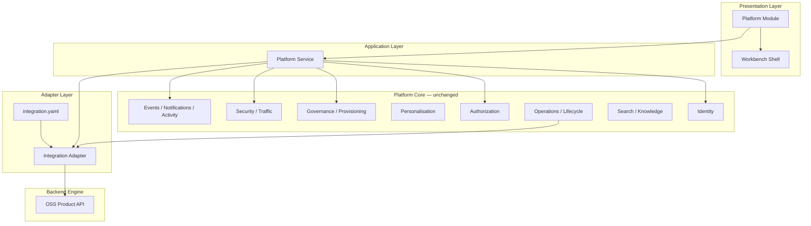
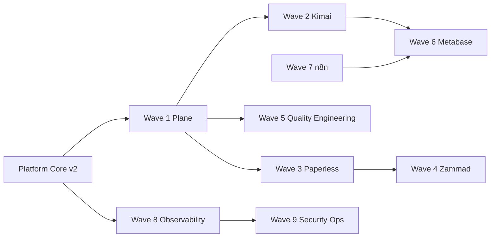

# APZHUB OSS Integration Master Architecture

**Milestone:** OSS-001  
**Status:** Authoritative integration architecture  
**Type:** Planning only

---

## Purpose

Define the canonical architecture every OSS product integration must follow. This architecture sits **above** individual adapters and **below** Platform Core — it does not modify Platform Core.

---

## Layered model



---

## Integration contract

| Layer                   | Responsibility                                   | Must not                         |
| ----------------------- | ------------------------------------------------ | -------------------------------- |
| **Module**              | Presentation, routes, commands, nav registration | Call OSS directly; implement IAM |
| **Platform Service**    | Business rules, orchestration, validation, audit | Expose engine models to UI       |
| **Integration Adapter** | API translation, health, error mapping, sync     | Implement business logic         |
| **OSS Engine**          | Domain SoR for engine data                       | Own platform identity or ops     |

Path: `Module → Platform Service → Integration Adapter → OSS Engine` (Documents 003, 008, 009, 026).

---

## Authentication model (all products)

| Concern                | Owner                        | Pattern                                                    |
| ---------------------- | ---------------------------- | ---------------------------------------------------------- |
| User authentication    | Better Auth + `@apzhub/auth` | Single SSO — no engine login screens                       |
| Service-to-engine auth | Integration Adapter          | Per-tenant service account / API token (Vault in PCv2-04+) |
| User-to-engine mapping | Platform Identity            | Tenant membership + optional engine user provisioning      |
| Session handoff        | Adapter + Security           | Token bridge, forward-auth, or signed embed — per engine   |

---

## Tenant model

| Rule                               | Implementation                                              |
| ---------------------------------- | ----------------------------------------------------------- |
| Platform tenant is authoritative   | `@apzhub/platform-identity`                                 |
| Engine tenant/workspace is derived | Provisioning on governance enablement                       |
| Cross-tenant isolation             | Platform RLS + engine-scoped credentials                    |
| One engine instance strategy       | Shared multi-tenant engine with tenant scoping (CE default) |

---

## RBAC model

| Rule                                   | Implementation                                     |
| -------------------------------------- | -------------------------------------------------- |
| APZHUB permissions are authoritative   | `@apzhub/platform-authorization`                   |
| Engine roles never shown in UI         | Role translation in Platform Service               |
| Permission checks before adapter calls | Service validates; adapter executes                |
| Admin vs user surfaces                 | Administration workspace for ops-tier integrations |

---

## Cross-cutting integrations

| Capability    | Registration                                 | OSS participation                         |
| ------------- | -------------------------------------------- | ----------------------------------------- |
| Navigation    | Module manifest (`module.yaml`)              | Module registers activity bar / sidebar   |
| Workbench     | Workbench framework                          | Module workspace routes                   |
| Search        | Search provider SDK (020)                    | Service registers async index provider    |
| Knowledge     | Knowledge provider SDK                       | Document/metadata extraction              |
| Notifications | Event catalog (021)                          | Service publishes events; ENF delivers    |
| Activity      | Activity mapper (007)                        | Service publishes activity events         |
| API           | `/api/platform/v1` or module API via gateway | Never expose engine API to client         |
| Diagnostics   | Consolidated via bootstrap loader            | Adapter reports health to connector probe |
| Operations    | Control plane capability registry            | Connector health in ops dashboard         |

---

## Repository layout (implementation)

```text
integrations/{engine-id}/
  integration.yaml          # Manifest first (026)
  src/
    adapter.ts              # Service Connector implementation
    client.ts               # Internal engine client (never exported to modules)
    health.ts
    error-translator.ts
  tests/

modules/{module-id}/
  module.yaml               # Manifest first (025)
  ...

services/{service-id}/
  service.yaml              # Platform Service manifest (027)
  ...
```

Canonical path: `integrations/` per Document 026 (reconcile with `/adapters` at OSS-101).

---

## Upgrade, backup, DR, monitoring

| Concern    | Platform owner             | Per-integration owner                   |
| ---------- | -------------------------- | --------------------------------------- |
| Upgrade    | Lifecycle + ops runbooks   | Adapter version matrix + contract tests |
| Backup     | Platform DR guide          | Engine-specific backup in catalog       |
| DR         | Platform resilience        | Engine RPO/RTO documented per product   |
| Monitoring | Wave 8 observability stack | Connector metrics + ops control plane   |

---

## Dependency graph (waves)



Wave 1 (Plane) validates the OSS adapter pattern for product modules. Wave 5 (Quality Engineering) validates the **native capability** pattern per OSS-002. Waves 2–4, 6–7 build on shared infrastructure. Wave 8 is operator-tier and enables Wave 9 monitoring.

---

## Related

- [OSS Product Integration Catalog](./APZHUB-OSS-Product-Integration-Catalog.md)
- [OSS Integration Standards](../governance/APZHUB-OSS-Integration-Standards.md)
