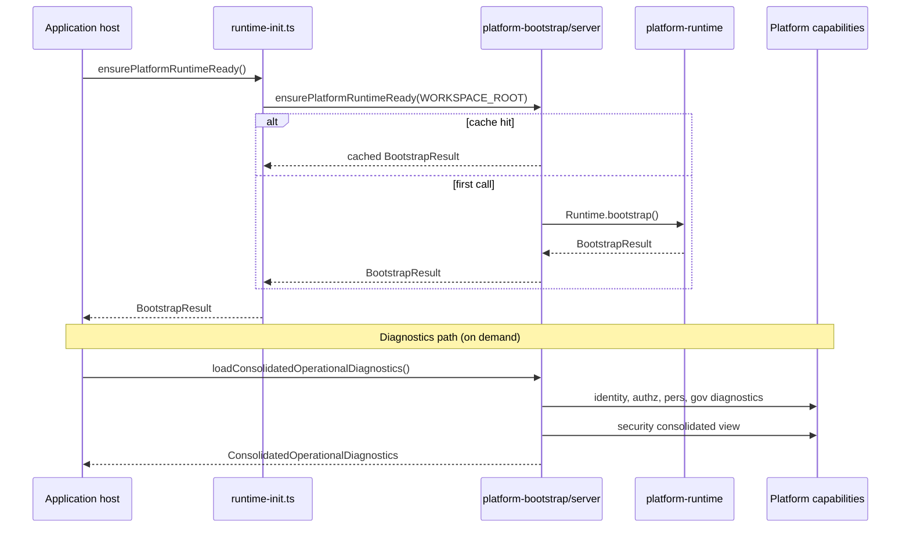

# APZHUB Platform Bootstrap Architecture

> **Milestone:** PCv2-01 — PRH-001  
> **Package:** `@apzhub/platform-bootstrap`  
> **Authority:** [ADR-0046](../adr/ADR-0046-production-readiness-bootstrap-consolidation.md)

---

## Purpose

Define the canonical application bootstrap and operational diagnostics loading architecture for all APZHUB application hosts. This document is the permanent baseline for PCv2-01 startup behaviour.

---

## Package boundaries

| Package | Responsibility | PRH-001 role |
|---------|----------------|--------------|
| `@apzhub/platform-runtime` | Manifest discovery, registry, lifecycle, health | Bootstrapped by platform-bootstrap |
| `@apzhub/platform-identity` | Tenants, sessions | Diagnostics source |
| `@apzhub/platform-authorization` | RBAC | Diagnostics source |
| `@apzhub/platform-personalisation` | Preferences | Diagnostics source |
| `@apzhub/platform-governance` | Governance, provisioning | Diagnostics source |
| `@apzhub/platform-security` | Security, resilience, consolidated diagnostics aggregation | Diagnostics sink |
| `@apzhub/platform-bootstrap` | **App-layer orchestration** — runtime init + diagnostics loader | **New — canonical host entry** |
| Framework packages (command, knowledge, event, activity) | Registry hydration | Per-app (unchanged PRH-001) |

**Rule:** platform-bootstrap orchestrates Platform Core capabilities; it does not replace them.

---

## Dependency graph (post-PRH-001)

```mermaid
flowchart TD
  subgraph Hosts
    WEB[apps/web]
    LAW[apps/law-platform]
  end

  subgraph Bootstrap
    PB_SERVER["@apzhub/platform-bootstrap/server"]
    PB_DIAG["@apzhub/platform-bootstrap/diagnostics"]
  end

  subgraph PlatformCore
    RT[@apzhub/platform-runtime]
    ID[@apzhub/platform-identity]
    AUTHZ[@apzhub/platform-authorization]
    PERS[@apzhub/platform-personalisation]
    GOV[@apzhub/platform-governance]
    SEC[@apzhub/platform-security]
  end

  WEB --> PB_SERVER
  LAW --> PB_SERVER
  WEB --> PB_DIAG
  LAW --> PB_DIAG

  PB_SERVER --> RT
  PB_DIAG --> PB_SERVER
  PB_DIAG --> ID
  PB_DIAG --> AUTHZ
  PB_DIAG --> PERS
  PB_DIAG --> GOV
  PB_DIAG --> SEC
```

---

## Startup sequence



### Instrumentation hook

Both `apps/web/instrumentation.ts` and `apps/law-platform/instrumentation.ts` call `ensurePlatformRuntimeReady()` at server startup via the shared bootstrap path.

---

## Export surfaces

| Export | Use when |
|--------|----------|
| `@apzhub/platform-bootstrap/server` | Runtime bootstrap only (instrumentation, hydration, health probes) |
| `@apzhub/platform-bootstrap/diagnostics` | Operations Console, security diagnostics aggregation |
| `@apzhub/platform-bootstrap` | Full API (documentation, tooling) |

---

## Product extensions

Products pass optional diagnostics blocks without forking bootstrap logic:

```typescript
loadConsolidatedOperationalDiagnostics(workspaceRoot, {
  lawPlatformDiagnostics: { product: "law-platform" },
  trustAccountingDiagnostics: { capability: "law.trust.accounting" },
});
```

---

## Validation matrix (PRH-001)

| Capability | Bootstrap path | Verified |
|------------|----------------|----------|
| Platform Runtime | `ensurePlatformRuntimeReady` | ✅ |
| Identity | consolidated `identity` block | ✅ |
| Authorization | consolidated `authorization` block | ✅ |
| Operations | `operations` + ops console routes | ✅ |
| Personalisation | consolidated `personalisation` block | ✅ |
| Governance | consolidated `governance` block | ✅ |
| Security | consolidated `security` block | ✅ |
| Law Platform | `lawPlatform` extension | ✅ |
| Trust Accounting | `trustAccounting` extension | ✅ |

---

## Remaining bootstrap debt

| Item | Target |
|------|--------|
| Framework hydration duplication (command, knowledge, event, activity) | Future consolidation story |
| Worker process bootstrap entry | PCv2-02 |
| Postgres diagnostics lazy import | Acceptable; optional hardening |

---

## References

- [ADR-0046](../adr/ADR-0046-production-readiness-bootstrap-consolidation.md)
- [PCv2-01 Production Readiness Architecture](./PCv2-01-Production-Readiness-Architecture.md)
- [Platform Core Reference Architecture](./APZHUB-Platform-Core-Reference-Architecture.md)
