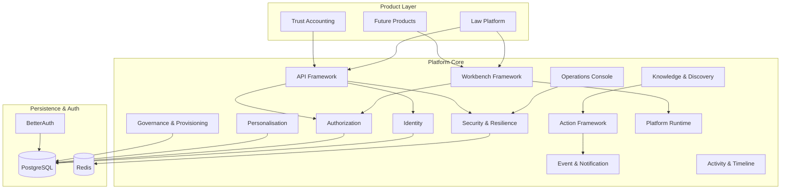
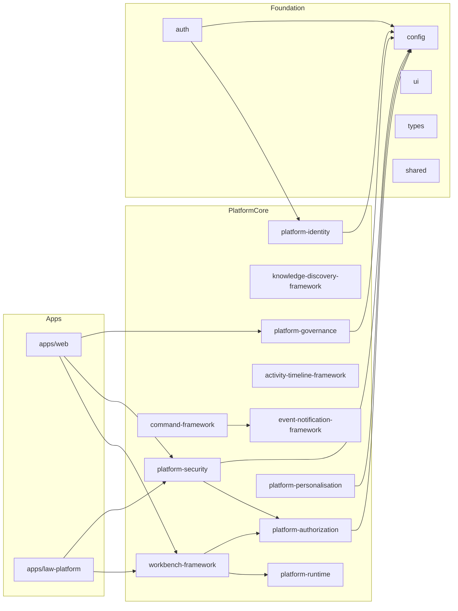
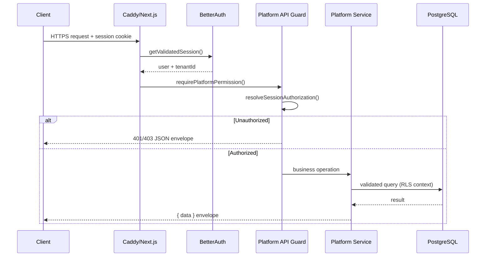
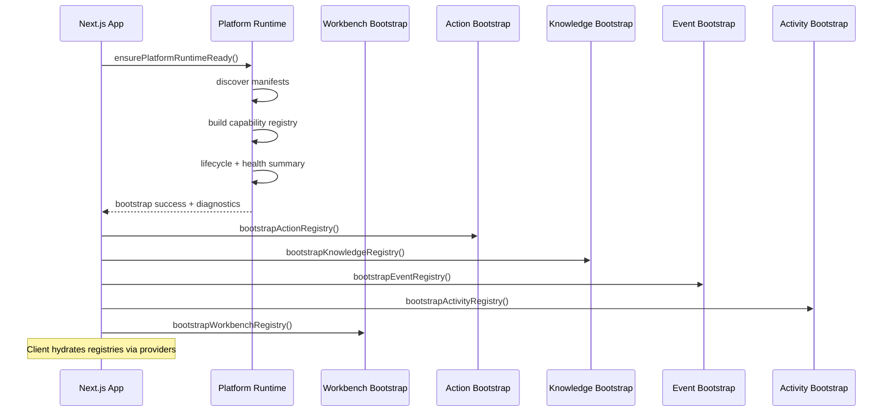
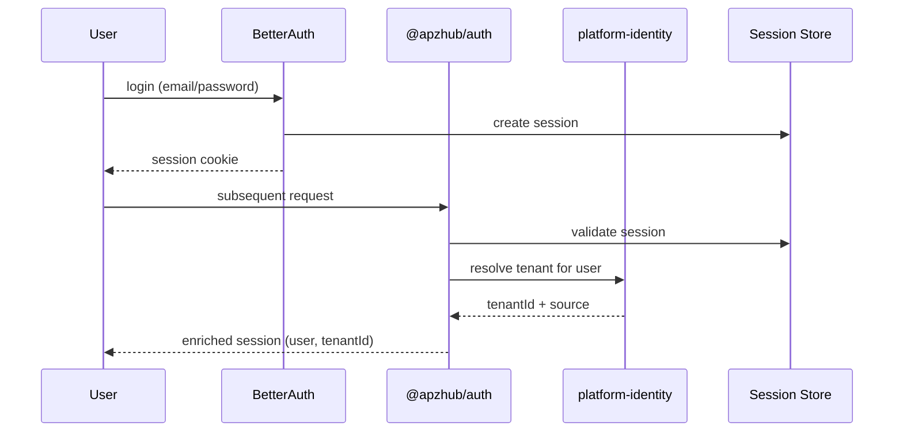
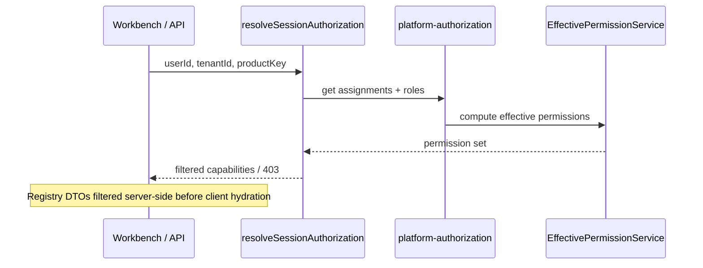
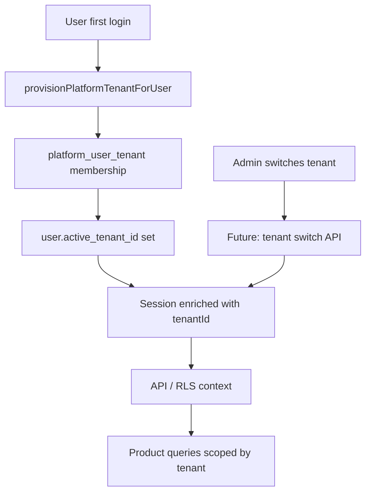
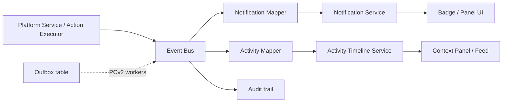
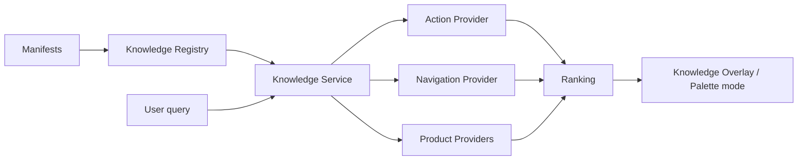
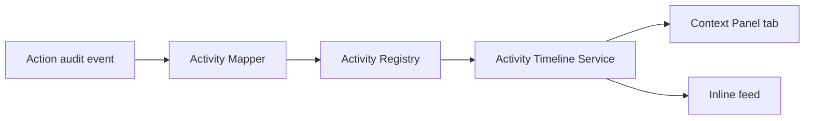

# APZHUB Platform Core — Reference Architecture

> **Status:** **Canonical** — definitive Platform Core architecture (PC-001)  
> **Supersedes:** [APZHUB Platform Reference Architecture](./APZHUB-Platform-Reference-Architecture.md) for Platform Core scope  
> **Authority:** [003 — Overall System Architecture](../003-overall-system-architecture-design-principles.md) · [Engineering Constitution](../000-apzhub-engineering-constitution.md)

---

## 1. Purpose

This document is the **canonical architecture** for the APZHUB Platform Core — the permanent foundation that all products consume. It consolidates Milestones 1–7 (capability frameworks) and Milestone 8 (identity, administration, governance, security) into a single reference.

Products (Law Platform, future Banking, Exchange, etc.) sit **above** Platform Core. They never duplicate Platform Core capabilities.

---

## 2. Platform Core composition

```text
┌─────────────────────────────────────────────────────────────────────────┐
│                         PRODUCT LAYER                                    │
│   Law Platform · Trust Accounting · Future products                    │
│   (business logic in Platform Services — never in shell/modules)         │
└─────────────────────────────────────────────────────────────────────────┘
                                    │
                                    ▼
┌─────────────────────────────────────────────────────────────────────────┐
│                      PLATFORM CORE (Phase 1 — CERTIFIED)                 │
├─────────────────────────────────────────────────────────────────────────┤
│  Presentation: Workbench Framework · Design System (@apzhub/ui)          │
│  Capabilities: Actions · Knowledge/Search · Events · Notifications · AT  │
│  Administration: Operations · Personalisation · Governance · Security    │
│  IAM: Identity · Authorization                                           │
│  Infrastructure: Runtime · Persistence · API Framework · Auth            │
└─────────────────────────────────────────────────────────────────────────┘
                                    │
                                    ▼
┌─────────────────────────────────────────────────────────────────────────┐
│                    INFRASTRUCTURE (self-hosted OSS first)                │
│   PostgreSQL · Redis · Caddy/Nginx · S3-compatible storage               │
└─────────────────────────────────────────────────────────────────────────┘
```

---

## 3. Layer diagram



---

## 4. Package dependency diagram



**Rule:** Products and modules never depend on connectors or backend engines directly. Platform packages never depend on product packages.

---

## 5. Request flow

Standard authenticated API request (Document 010):



**Path:** Client → Gateway → Auth → Authz → Validation → Platform Service → Connector → Engine (products only at Service layer).

---

## 6. Startup flow



Bootstrap runs once per process. Health endpoint exposes runtime readiness.

---

## 7. Authentication flow



BetterAuth handles authentication only. APZHUB owns tenant membership and enrichment.

---

## 8. Authorization flow



Permission keys are manifest-driven. Backend role names never reach UI.

---

## 9. Tenant flow



Tenant is platform metadata (Document 011). Business data tenant scoping is product responsibility with RLS.

---

## 10. Event flow



Events are in-process in Phase 1. Outbox workers deferred to PCv2.

---

## 11. Knowledge and search flow



Unified search (Document 020) is implemented via Knowledge & Discovery Framework. Persistent search index deferred.

---

## 12. Timeline flow



Timelines aggregate activity types registered in manifests.

---

## 13. Diagnostics flow

```mermaid
flowchart TB
  subgraph Sources
    RTD[Runtime diagnostics]
    IDD[Identity diagnostics]
    AZD[Authorization diagnostics]
    PD[Personalisation diagnostics]
    GD[Governance diagnostics]
    PSD[Security diagnostics]
    PDB[Persistence health]
  end

  subgraph Aggregation
    OD[operational-diagnostics.ts]
    CDS[ConsolidatedOperationalDiagnostics]
  end

  subgraph Surfaces
    OPS[Operations Console]
    API1[/security/diagnostics]
    API2[/operations/summary]
    API3[/system/health]
  end

  RTD & IDD & AZD & PD & GD & PSD & PDB --> OD
  OD --> CDS
  CDS --> OPS
  CDS --> API1
  CDS --> API2
  PSD --> API3
```

---

## 14. Operations flow

```mermaid
flowchart LR
  Admin[Administrator] --> WB[Operations Workbench]
  WB --> Router[OperationsWorkspaceRouter]
  Router --> S1[Dashboard / Health / Security]
  Router --> S2[Identity / Authz / Governance]
  Router --> S3[Diagnostics / Resilience]
  S1 & S2 & S3 --> API[/api/platform/v1/*]
  API --> Services[Platform Core Services]
  Services --> PG[(PostgreSQL)]
```

Operations Console is manifest-driven (19 sections). Permission: `platform.nav.administration.view`.

---

## 15. Data ownership (Document 011)

| Owner             | Data                                                                                                                                                                       |
| ----------------- | -------------------------------------------------------------------------------------------------------------------------------------------------------------------------- |
| **Platform Core** | Identity, sessions, permissions, nav, workspaces, prefs, notifications (metadata), audit, module registration, search index (derived), events, jobs, connector config refs |
| **Products**      | Matters, clients, invoices, trust journals, documents, tickets — authoritative in product/adapter stores                                                                   |

---

## 16. Extension rules

1. **Manifest first** — `module.yaml`, `service.yaml`, `integration.yaml`, `event.yaml` before code.
2. **No layer bypass** — Module → Platform Service → Connector → Engine.
3. **No duplicate cross-cutting** — identity, authz, audit, notify, search are platform-owned.
4. **Registry pattern** — bootstrap → DTO → client hydration for every capability framework.
5. **Permission-driven UI** — server is authoritative; client filters are presentation only.

---

## 17. Phase boundaries

| Phase                    | Status                                        |
| ------------------------ | --------------------------------------------- |
| Platform Core v1 (M1–M8) | **Certified** (PC-001)                        |
| Platform Core v2         | Planned — SaaS hardening, workers, gateway    |
| Product milestones       | Law Platform validation; FIN/Banking deferred |

---

## References

- [Platform Core Capability Reference](./APZHUB-Platform-Core-Capability-Reference.md)
- [Platform Capability Matrix](./APZHUB-Platform-Capability-Matrix.md)
- [Platform Core Certification](../reviews/APZHUB-Platform-Core-Certification.md)
- Foundation documents 003, 007–015, 019–024
