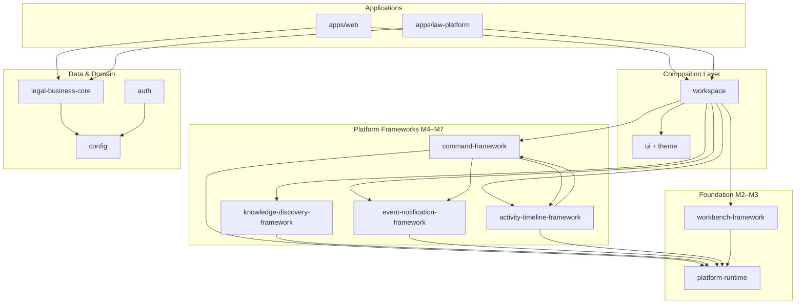

# APZHUB Platform — Dependency Review

> **Milestone:** M16 — Platform Stabilisation & Engineering Review  
> **Date:** 2026-07-08  
> **Type:** Analysis only — no changes permitted

---

## 1. Purpose

Analyse package boundaries, dependency direction, cyclic risks, and platform vs product separation across the APZHUB monorepo.

---

## 2. Workspace topology

```text
apps/
  web/              @apzhub/web          — platform shell + Law API proxy
  law-platform/     @apzhub/law-platform — Law validation application

packages/
  platform-runtime/           — M2 foundation (no workspace deps)
  workbench-framework/          — M3 (no workspace deps)
  command-framework/            — M4 → platform-runtime, event-notification, activity-timeline
  knowledge-discovery-framework/ — M5 → platform-runtime
  event-notification-framework/  — M6 → platform-runtime
  activity-timeline-framework/   — M7 → platform-runtime, command-framework
  workspace/                    — shell composition → all M3–M7 + ui + workbench
  ui/, theme/, types/, sdk/, shared/, auth/, config/
  legal-business-core/          — Law domain types → config

services/           — service.yaml manifests (no package.json)
integrations/       — scaffold only
events/             — event.yaml manifests
```

---

## 3. Dependency direction (intended)



**Verdict:** Downward dependency flow is **correct**. Applications do not import each other. Frameworks do not import applications.

---

## 4. Package boundary assessment

| Package                         | Boundary clarity | Violations observed                                            |
| ------------------------------- | ---------------- | -------------------------------------------------------------- |
| `platform-runtime`              | **Strong**       | None — UI-agnostic                                             |
| `workbench-framework`           | **Strong**       | None                                                           |
| `command-framework`             | **Strong**       | Depends on M6/M7 for audit pipeline — intentional              |
| `knowledge-discovery-framework` | **Strong**       | None                                                           |
| `event-notification-framework`  | **Strong**       | None                                                           |
| `activity-timeline-framework`   | **Strong**       | Depends on command-framework for audit mapping — intentional   |
| `workspace`                     | **Moderate**     | Integration hub — high fan-in by design                        |
| `legal-business-core`           | **Strong**       | Domain types only                                              |
| `config`                        | **Moderate**     | Contains Law Drizzle schema — product data in platform package |
| `apps/law-platform`             | **Strong**       | Domain logic contained                                         |
| `apps/web`                      | **Moderate**     | Law API handlers live here — API is product surface            |

---

## 5. Cyclic dependency analysis

| Potential cycle              | Status       | Evidence                                                      |
| ---------------------------- | ------------ | ------------------------------------------------------------- |
| command ↔ event-notification | **No cycle** | command imports ENF; ENF does not import command              |
| command ↔ activity-timeline  | **No cycle** | ATF imports command; command imports ATF types only via audit |
| workspace ↔ frameworks       | **No cycle** | Frameworks do not import workspace                            |
| config ↔ legal-business-core | **No cycle** | LBC → config one direction                                    |
| apps ↔ apps                  | **No cycle** | web and law-platform independent                              |

**pnpm workspace graph:** No cyclic dependencies detected in `package.json` `workspace:*` references.

---

## 6. Shared packages

| Package          | Role                                   | Risk                                                        |
| ---------------- | -------------------------------------- | ----------------------------------------------------------- |
| `@apzhub/types`  | Cross-cutting DTOs (health, hydration) | Low — stable contracts                                      |
| `@apzhub/shared` | Redis utilities                        | Low — minimal surface                                       |
| `@apzhub/sdk`    | Manifest types + stubs                 | Low — depends only on runtime                               |
| `@apzhub/config` | Env + DB schema                        | **Medium** — Law schema couples product to platform package |
| `@apzhub/theme`  | Tokens                                 | Low                                                         |
| `@apzhub/ui`     | Design system                          | Low — no business logic                                     |

**Recommendation:** Long-term, move Law Drizzle schema from `@apzhub/config` to `apps/law-platform` or `packages/legal-persistence` — **do not implement in M16**.

---

## 7. Layering compliance (003)

| Layer        | Packages                              | Compliance                            |
| ------------ | ------------------------------------- | ------------------------------------- |
| Presentation | `workspace`, `ui`, apps               | ✅ No business logic in UI components |
| Application  | apps handlers, workflow services      | ✅ Orchestration in services          |
| Domain       | `legal-business-core`, trust services | ✅ Rules in services                  |
| Services     | Platform frameworks                   | ✅ Cross-cutting                      |
| Adapters     | postgres repos in law-platform        | ✅ Backend isolation                  |
| Engines      | Not yet separate packages             | ⏸ Connectors deferred                 |

**Violation risk:** `apps/web/lib/api/trust/` handlers call law-platform services directly — acceptable for validation monolith; extract gateway in commercial phase.

---

## 8. Platform vs product separation

```text
PLATFORM (reusable)                    PRODUCT (Law-specific)
─────────────────────                  ────────────────────────
platform-runtime                       legal-business-core
workbench-framework                    apps/law-platform/lib/*
command-framework                      trust services
knowledge-discovery-framework        postgres law adapters
event-notification-framework         LAW manifests (modules/)
activity-timeline-framework          apps/web/lib/api/law/*
workspace + ui                         services/legal-platform/
```

| Component             | Classification | Maturity for reuse                      |
| --------------------- | -------------- | --------------------------------------- |
| Runtime bootstrap     | Platform       | **Mature**                              |
| Registry patterns     | Platform       | **Mature**                              |
| Desktop shell         | Platform       | **Mature**                              |
| Law workflow services | Product        | **Product-specific**                    |
| Trust accounting      | Product (Law)  | **Product-specific** (FIN-001 deferred) |
| Law API handlers      | Product        | **Product-specific**                    |
| Drizzle law schema    | Product data   | **Should move** from config             |

---

## 9. App-layer duplication (dependency symptom)

Both `apps/web` and `apps/law-platform` independently depend on the full framework stack and duplicate:

- `create-app-action-executor.ts`
- `create-app-activity-timeline-context.ts`
- `create-app-event-notification-context.ts`
- `load-shared-*-context.ts`
- `use-app-*-context.ts`
- `action-workbench-shell-provider.tsx`
- `e2e-*-hooks.ts`

**Impact:** Dependency graph is correct per-package, but **application composition is duplicated** — maintenance cost, not architectural cycle.

**Recommendation:** Introduce `@apzhub/app-bootstrap` package (M17+ proposal only).

---

## 10. Dependency risks

| ID   | Risk                                 | Severity | Mitigation                               |
| ---- | ------------------------------------ | -------- | ---------------------------------------- |
| D-01 | Law schema in `@apzhub/config`       | Medium   | Extract legal-persistence package        |
| D-02 | `workspace` fan-in                   | Low      | Document as intentional composition root |
| D-03 | App bootstrap duplication            | Medium   | Shared bootstrap package                 |
| D-04 | Trust services imported into web API | Medium   | API gateway boundary documentation       |
| D-05 | `command-framework` → M6/M7 deps     | Low      | Document as pipeline coupling            |

---

## 11. Verdict

**Dependency architecture: VERY GOOD**

- No cyclic package dependencies
- Correct downward flow from apps → composition → frameworks → runtime
- One moderate concern: product persistence schema in platform `config` package
- App-layer duplication is the primary maintainability debt, not package cycles

---

_Related: [Duplication Review](./APZHUB-Platform-Duplication-Review.md) · [Engineering Review](../reviews/APZHUB-Platform-Engineering-Review.md)_
