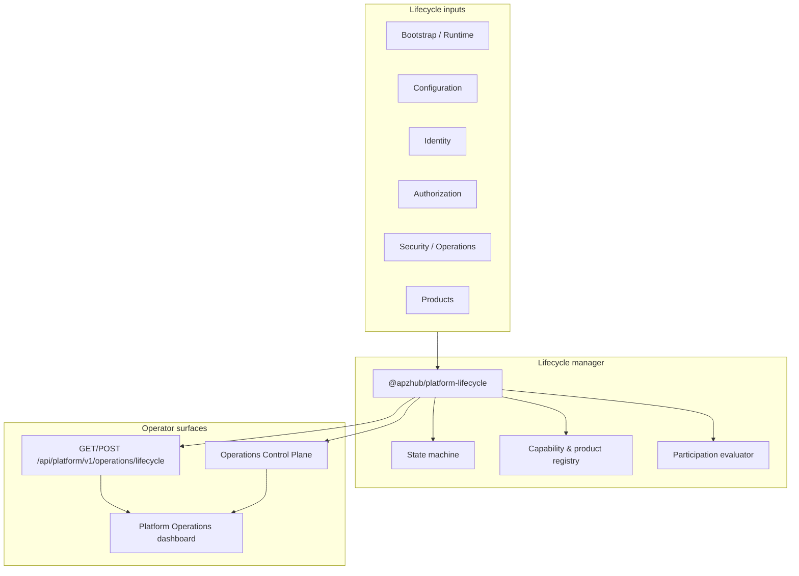

# APZHUB Platform Lifecycle Architecture

**Milestone:** PRH-009 — Platform Lifecycle Management  
**Status:** Authoritative platform lifecycle architecture  
**Owner:** `@apzhub/platform-lifecycle`

---

## Objective

Provide a **canonical Platform Lifecycle Manager** so the platform understands its operational lifecycle. Products participate in lifecycle reporting; the platform owns lifecycle state.

---

## Architecture

---

## Package responsibilities

| Package                       | Role                                                               |
| ----------------------------- | ------------------------------------------------------------------ |
| `@apzhub/platform-lifecycle`  | Canonical lifecycle state machine, registrations, operator actions |
| `@apzhub/platform-runtime`    | Manifest capability lifecycle (discovered → active)                |
| `@apzhub/platform-operations` | Control plane integration and production verification              |
| `@apzhub/platform-bootstrap`  | Bootstrap orchestration and diagnostics loading                    |

Runtime manifest lifecycle (SPR-002) remains in `@apzhub/platform-runtime`. PRH-009 adds the **platform operational lifecycle** layer above consolidated diagnostics.

---

## Lifecycle states

| State                 | Meaning                                   |
| --------------------- | ----------------------------------------- |
| `initializing`        | Platform startup initiated                |
| `bootstrapping`       | Runtime bootstrap in progress or complete |
| `configuration-ready` | Environment configuration valid           |
| `identity-ready`      | Identity services ready                   |
| `authorization-ready` | Authorization services ready              |
| `platform-ready`      | Core platform capabilities ready          |
| `products-ready`      | Registered products ready                 |
| `operational`         | Platform serving traffic                  |
| `maintenance`         | Operator maintenance mode                 |
| `degraded`            | Serving with degraded health              |
| `recovering`          | Recovery in progress                      |
| `stopping`            | Graceful shutdown draining                |
| `stopped`             | Platform lifecycle stopped                |

---

## Operator actions

| Action              | Effect                                 |
| ------------------- | -------------------------------------- |
| `enter-maintenance` | Enters maintenance mode                |
| `exit-maintenance`  | Returns to evaluated operational state |
| `begin-shutdown`    | Initiates graceful shutdown (draining) |
| `complete-shutdown` | Marks lifecycle stopped                |
| `begin-recovery`    | Initiates recovery toward operational  |

---

## Integration

- **Operations Control Plane:** `lifecycle` section on control plane snapshot
- **Production Verification:** unchanged; lifecycle complements readiness verdicts
- **Diagnostics:** derived from consolidated operational diagnostics (no secrets)

---

## Related documents

- [Lifecycle State Machine](./APZHUB-Lifecycle-State-Machine.md)
- [Operational Lifecycle Guide](../governance/APZHUB-Operational-Lifecycle-Guide.md)
- [Platform Lifecycle Developer Guide](../developer/APZHUB-Platform-Lifecycle-Developer-Guide.md)
- [Platform Operations Control Plane Architecture](./APZHUB-Platform-Operations-Control-Plane-Architecture.md)
