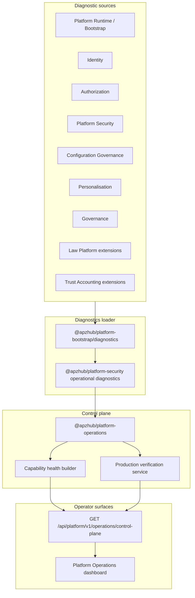

# APZHUB Platform Operations Control Plane Architecture

**Milestone:** PRH-008 — Platform Operations Control Plane & Production Verification  
**Status:** Authoritative for unified operational visibility  
**Owner:** `@apzhub/platform-operations`

---

## Objective

Transform existing platform diagnostics into a **single canonical Operations Control Plane** so operators can determine platform health, production readiness, degraded capabilities, and recommended actions from one place.

No new product functionality. Operational visibility only.

---

## Architecture

---

## Canonical package

| Package | Responsibility |
|---------|----------------|
| `@apzhub/platform-operations` | Capability registry, health normalization, production verification, control plane snapshot |
| `@apzhub/platform-bootstrap/diagnostics` | Loads consolidated diagnostics from all platform capabilities |
| `@apzhub/platform-security` | Security, resilience, configuration diagnostics aggregation |
| `apps/web/lib/platform-operations/` | Operations console client helpers and UI |

---

## Capability health model

Every registered capability publishes:

| Field | Description |
|-------|-------------|
| `status` | Overall signal (`healthy` \| `degraded` \| `unhealthy` \| `unknown`) |
| `health` | Current operational health |
| `readiness` | Ready to serve traffic |
| `configurationState` | `valid` \| `degraded` \| `invalid` \| `unknown` |
| `warnings` | Non-blocking observations |
| `recommendations` | Operator next steps |
| `dependencies` | Upstream capability IDs |
| `version` | Capability version |
| `maturityLevel` | `foundation` \| `operational` \| `production` \| `experimental` |
| `lastValidation` | ISO timestamp from consolidated diagnostics |
| `owner` | Owning package or app |
| `diagnostics` | Sanitized capability-specific payload (no secrets) |

Registry: `packages/platform-operations/src/capability-definitions.ts`

---

## Production verification

Deterministic verdicts:

| Verdict | Meaning |
|---------|---------|
| `READY` | All mandatory checks pass |
| `READY_WITH_OBSERVATIONS` | No failures; warnings present |
| `NOT_READY` | One or more mandatory checks failed |

Evaluated domains: bootstrap, configuration, health/readiness, dependencies, session security, traffic governance, tenant isolation posture, per-capability health.

Implementation: `packages/platform-operations/src/production-verification-service.ts`

---

## API

**Endpoint:** `GET /api/platform/v1/operations/control-plane`  
**Auth:** `platform.nav.administration.view` via `requirePlatformAdminRoute`

**Excludes by design:** secrets, tenant business data, raw environment values, sensitive configuration.

---

## Related documents

- [Operations Dashboard Guide](../developer/APZHUB-Operations-Dashboard-Guide.md)
- [Production Verification Guide](../governance/APZHUB-Production-Verification-Guide.md)
- [Capability Health Model](../architecture/APZHUB-Capability-Health-Model.md)
- [Operational Readiness Guide](../governance/APZHUB-Operational-Readiness-Guide.md)
- [Platform Operations Reference Architecture](./APZHUB-Platform-Operations-Reference-Architecture.md)
