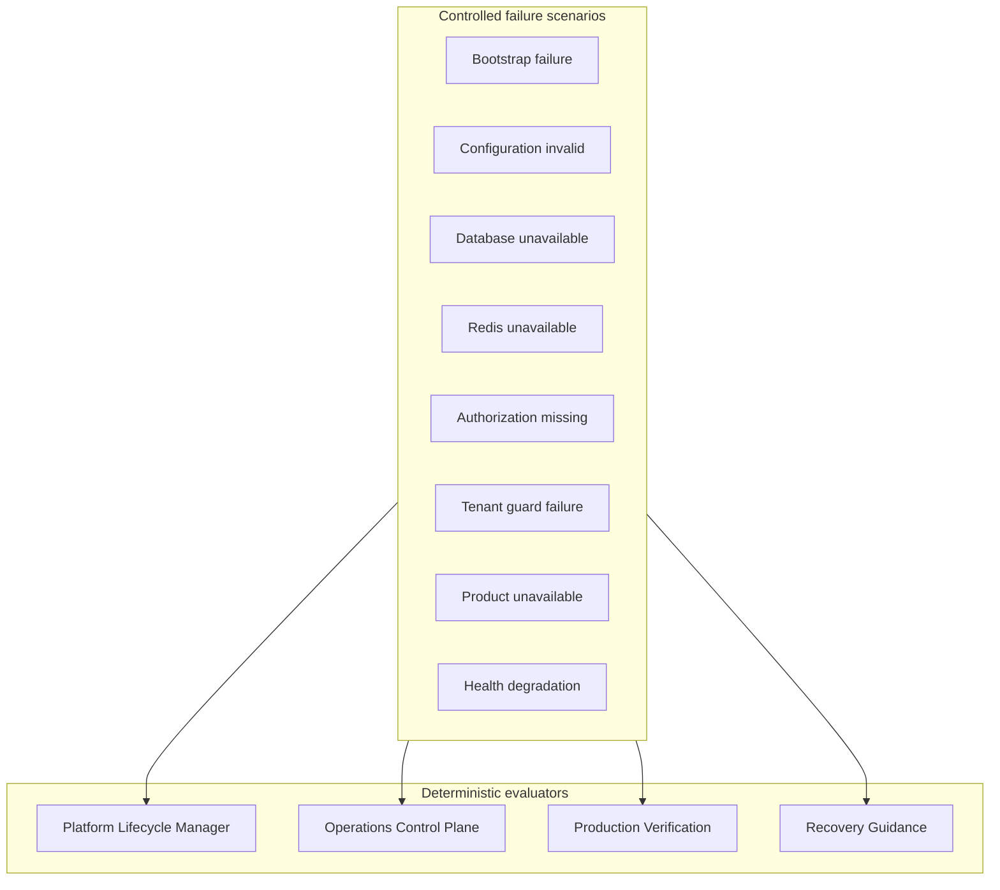

# APZHUB Platform Reliability Architecture

**Milestone:** PRH-010 — Platform Reliability & Failure Validation  
**Status:** Authoritative reliability validation architecture  
**Scope:** Production readiness validation — no new business functionality

---

## Objective

Validate Platform Core behaviour under controlled failure conditions. Operators and engineers must be able to predict startup outcomes, recovery paths, and control plane signals when dependencies fail.

---

## Validation layers

---

## Packages under validation

| Domain | Package / surface |
|--------|-------------------|
| Lifecycle | `@apzhub/platform-lifecycle` |
| Operations | `@apzhub/platform-operations` |
| Security & resilience | `@apzhub/platform-security` |
| Bootstrap | `@apzhub/platform-bootstrap` |
| Runtime | `@apzhub/platform-runtime` |

---

## Deterministic behaviour guarantees (PRH-010)

1. **Sequential readiness gates** — later gates cannot satisfy before earlier gates.
2. **Partial startup** — lifecycle state stops at the highest satisfied gate.
3. **Graceful degradation** — health degradation after core readiness surfaces `degraded`.
4. **Recovery** — operator recovery prefers `recovering` until operational or critical dependency loss.
5. **No secret leakage** — diagnostics and control plane snapshots exclude credentials and connection strings.
6. **Operator guidance** — recommendations emitted for persistence and lifecycle transitions.

---

## Test assets

| Asset | Location |
|-------|----------|
| Failure fixtures | `packages/platform-lifecycle/src/failure-fixtures.ts` |
| Lifecycle reliability tests | `packages/platform-lifecycle/src/platform-reliability-validation.test.ts` |
| Control plane reliability tests | `packages/platform-operations/src/platform-reliability-validation.test.ts` |

---

## Related documents

- [Failure Injection Guide](../governance/APZHUB-Failure-Injection-Guide.md)
- [Operational Recovery Guide](../governance/APZHUB-Operational-Recovery-Guide.md)
- [Reliability Validation Report](../reviews/APZHUB-Reliability-Validation-Report.md)
- [Platform Lifecycle Architecture](./APZHUB-Platform-Lifecycle-Architecture.md)
