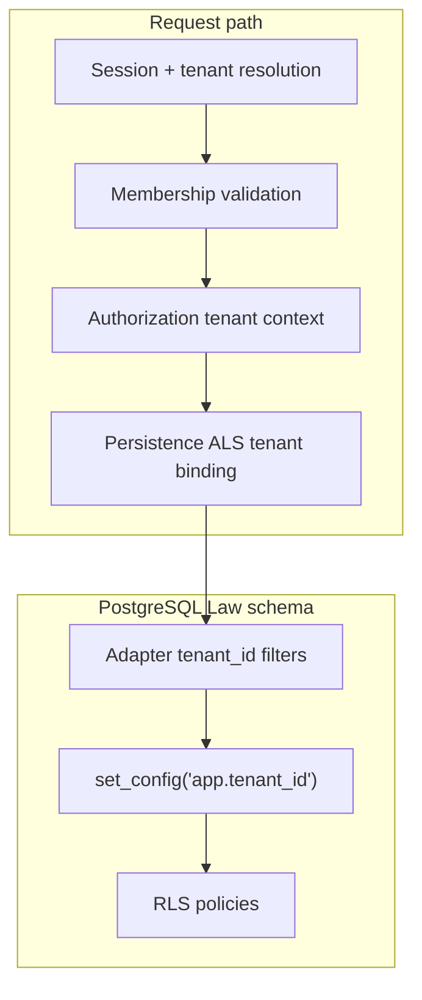

# APZHUB Tenant Isolation Architecture

**Milestone:** PRH-007 — Tenant Isolation & Data Protection Validation  
**Status:** Authoritative for platform tenant boundary enforcement  
**Supersedes:** Partial notes in LAW-API-Tenant-Binding-Notes only where this document is more specific

---

## Objective

Ensure no tenant can access another tenant's data across Law Platform persistence, APIs, search, diagnostics, reporting, trust accounting, and platform administration surfaces.

---

## Defense-in-depth model



| Layer                 | Mechanism                                                            | Owner                            |
| --------------------- | -------------------------------------------------------------------- | -------------------------------- |
| Session binding       | `getValidatedSession()` enriches tenant from platform identity       | `@apzhub/auth`                   |
| Membership validation | `validateUserTenantMembership()` rejects unassigned tenants          | `@apzhub/platform-identity`      |
| Law API binding       | `withLawApiAuth` → `buildLawApiAuthenticatedContext`                 | `apps/web/lib/api`               |
| Authorization         | `tenant_mismatch` outcome when role tenant ≠ request tenant          | `@apzhub/platform-authorization` |
| Persistence ALS       | `LawApiPersistenceContext` + `LawPersistenceContext`                 | Law platform persistence         |
| Adapter filters       | All Postgres repositories scope queries by `tenantId`                | `@apzhub/config/db/adapters`     |
| RLS                   | `app.tenant_id` session + `FORCE ROW LEVEL SECURITY`                 | PostgreSQL migrations            |
| Search                | `resolveLegalSearchTenantScope()` — empty results without ALS tenant | Law knowledge providers          |
| Platform admin APIs   | `requirePlatformAdminRoute()` permission gate                        | `@apzhub/platform-security`      |

---

## Law PostgreSQL RLS

All law business tables (clients, matters, documents, tasks, calendar, time, invoices, trust, outbox) use:

```sql
USING ("tenant_id" = current_setting('app.tenant_id', true))
WITH CHECK ("tenant_id" = current_setting('app.tenant_id', true))
```

Session binding is transaction-local via `applyPostgresTenantSession()` in every unit-of-work.

---

## Platform metadata tables

`platform_tenant`, `platform_user_tenant`, authorization, personalisation, and governance tables **do not** currently use PostgreSQL RLS. Isolation is application-layer only. Platform RLS is documented as future hardening — out of PRH-007 scope.

---

## Exempt routes

Law API routes intentionally without tenant ALS:

- `GET /api/law/v1/health`
- `GET /api/law/v1/openapi.json`
- `GET /api/law/v1/openapi.yaml`

All entity, trust, and diagnostics routes require `withLawApiAuth`.

---

## Validation suite

| Suite                         | Location                                                                     |
| ----------------------------- | ---------------------------------------------------------------------------- |
| RLS cross-tenant denial       | `packages/config/src/db/rls-cross-tenant-denial.integration.test.ts`         |
| Repository tenant isolation   | `apps/law-platform/lib/**/postgres-*-repository.integration.test.ts`         |
| Law API membership            | `apps/web/lib/api/tenant/tenant-membership-validation.test.ts`               |
| Law API ALS coverage          | `apps/web/lib/api/law-api-route-tenant-coverage.test.ts`                     |
| Search tenant scope           | `apps/law-platform/lib/knowledge/legal-search-tenant-isolation.test.ts`      |
| Authorization tenant mismatch | `packages/platform-authorization/src/authorization-tenant-isolation.test.ts` |
| Platform admin guard          | `apps/web/lib/api/platform/platform-api-tenant-guard.test.ts`                |

---

## Related documents

- [Platform Tenant Architecture](./APZHUB-Platform-Tenant-Architecture.md)
- [LAW-API Tenant Binding Notes](../security/LAW-API-Tenant-Binding-Notes.md)
- [PRH-007 Tenant Validation Report](../security/PRH-007-Tenant-Validation-Report.md)
- [PRH-007 Security Review](../security/PRH-007-Security-Review.md)
