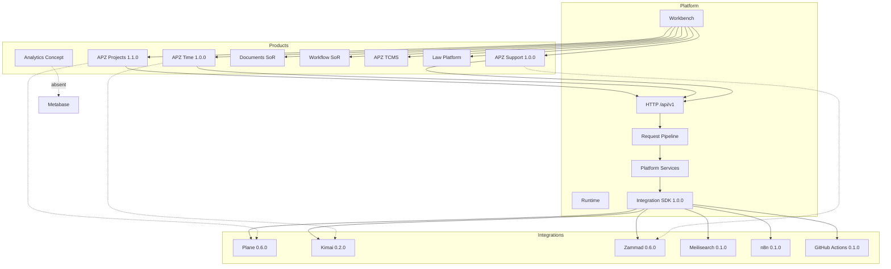
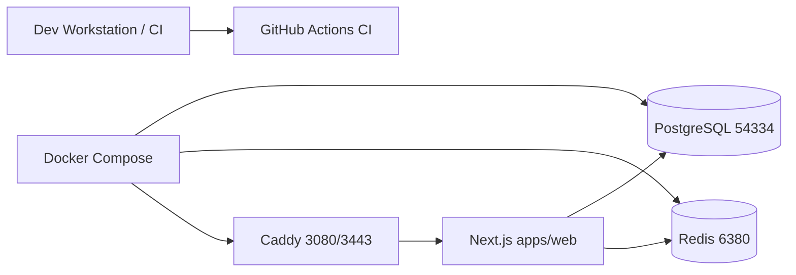
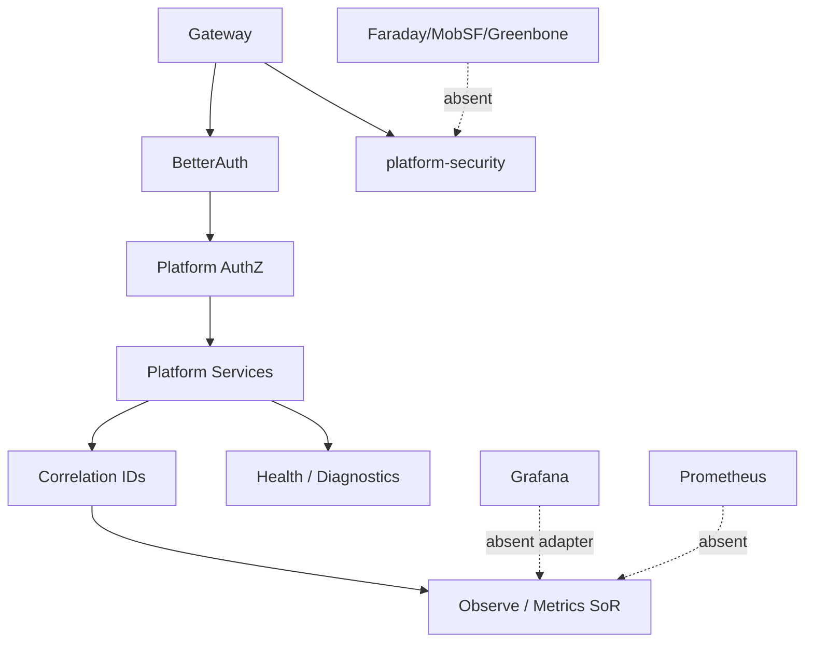
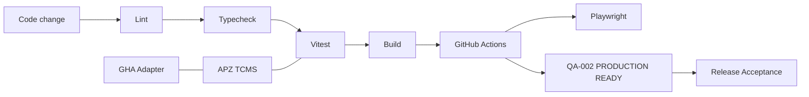
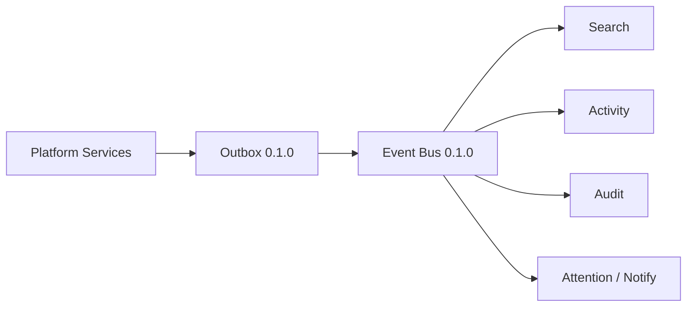

# APZHUB Architecture Relationships

> **Programme:** APZHUB-ARCHITECTURE-001  
> **Classification:** DOCUMENTATION ONLY  
> **Date:** 2026-07-19  
> **Companion:** [ENTERPRISE-ARCHITECTURE-CATALOGUE](./ENTERPRISE-ARCHITECTURE-CATALOGUE.md)

---

## 1. Platform → Products → Integrations

---

## 2. Infrastructure relationships

Legacy apz-stack (ports 8080 / 54333 / 80–443) coexists — see ENVIRONMENT.md.

---

## 3. Observability & security relationships

---

## 4. Quality relationships

---

## 5. Async event plane (relationship sketch)

Cross-product targets: [PORTFOLIO-INTEGRATION-STRATEGY](../products/PORTFOLIO-INTEGRATION-STRATEGY.md).

---

## Related

- [ARCHITECTURE-MATURITY-MATRIX.md](./ARCHITECTURE-MATURITY-MATRIX.md)
- [PLATFORM-CATALOGUE.md](./PLATFORM-CATALOGUE.md)
- [PRODUCT-CATALOGUE.md](./PRODUCT-CATALOGUE.md)
- [INTEGRATION-CATALOGUE.md](./INTEGRATION-CATALOGUE.md)
