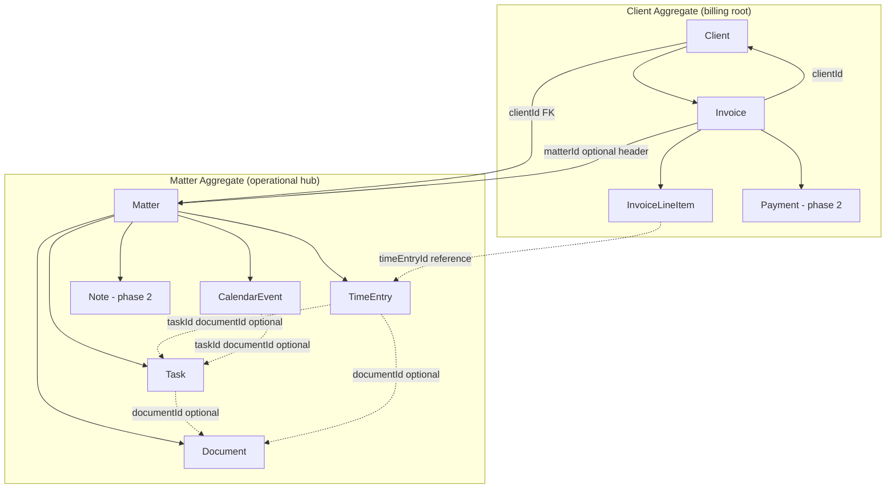
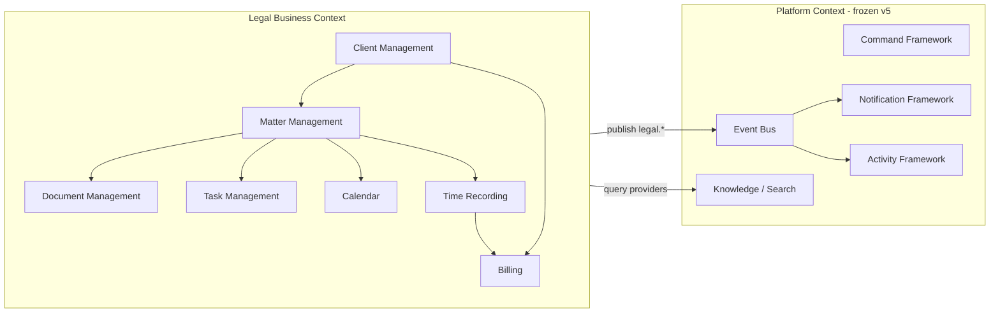
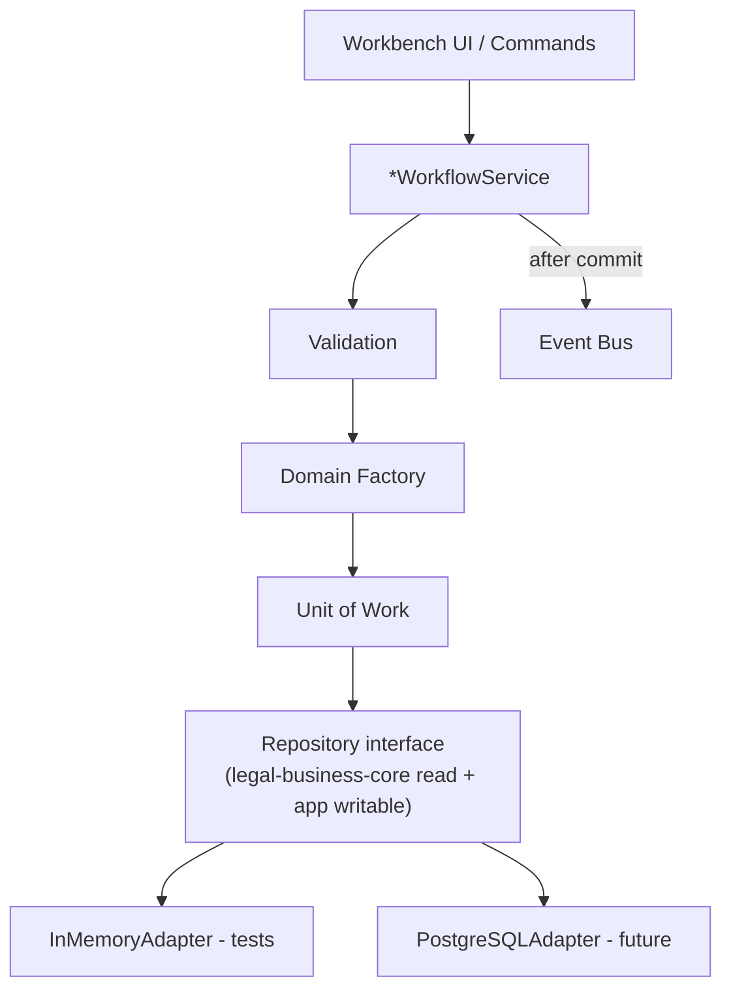
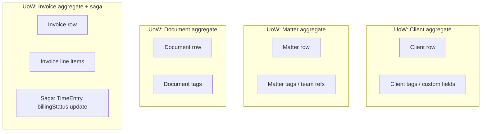
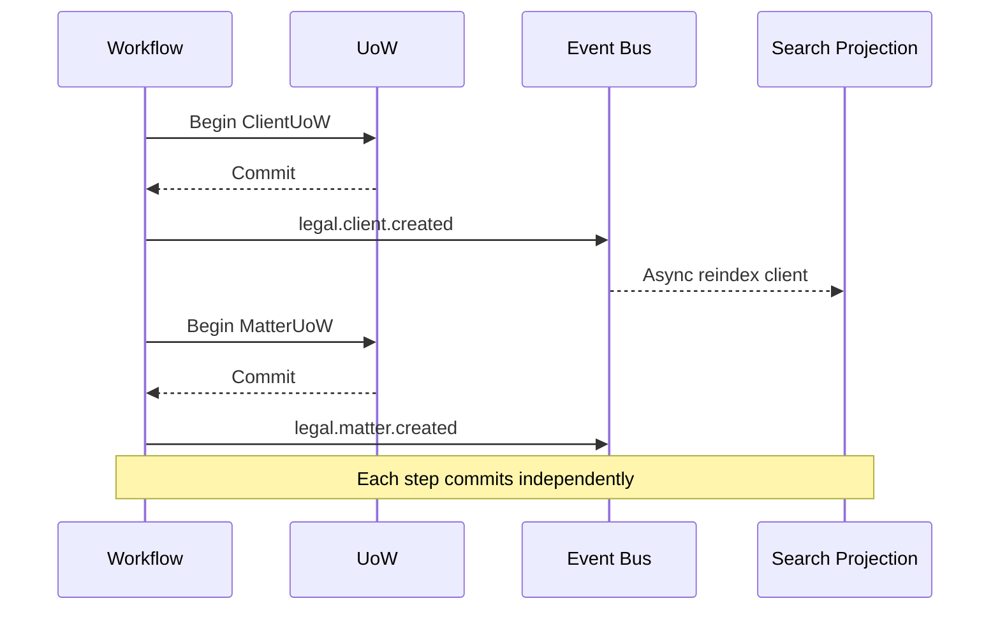
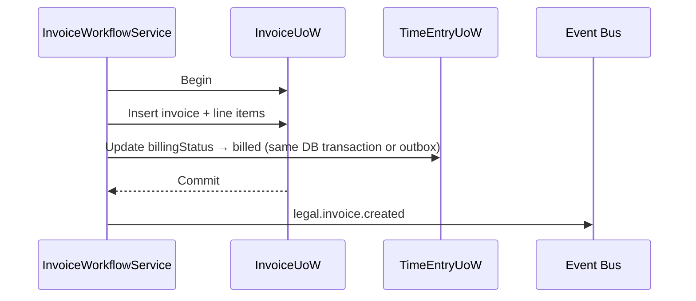
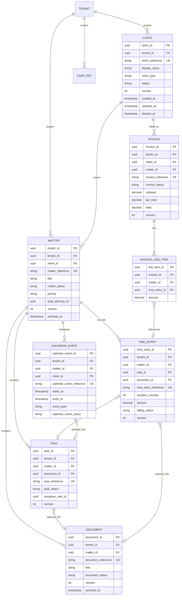
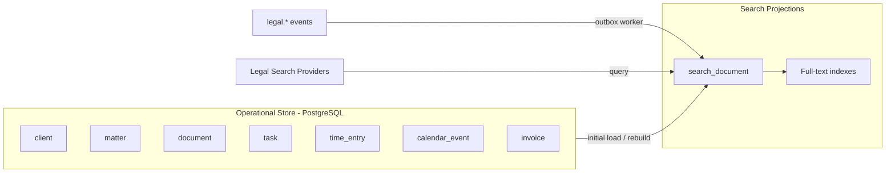
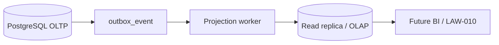
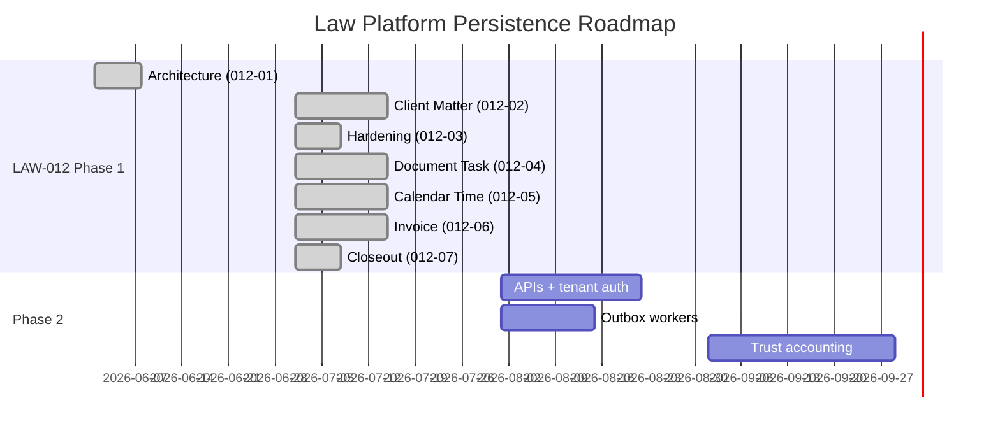

# LAW-012-01 — Persistence Architecture & Data Model

> **Story:** LAW-012-01 — Persistence Architecture & Data Model  
> **Status:** **Complete** — architecture approved; **implementation complete** (LAW-012-02 through LAW-012-06)  
> **Closeout:** [LAW-012-07 completion report](../sprint/LAW-012-07-completion-report.md) · [As-built reference](./LAW-Persistence-Reference-Architecture.md)  
> **Authority:** [LAW-011-01 E2E validation](../sprint/LAW-011-01-completion-report.md) · [Canonical Domain Model](./APZHUB-Law-Domain-Model.md) · [Legal Business Core](./APZHUB-Legal-Business-Core.md)  
> **Platform baseline:** [Platform Version 5.0](../releases/APZHUB-Platform-v5.0.md) — **frozen**

---

## Implementation status (LAW-012-07 update)

| Design element          | LAW-012-01 plan | As-built (LAW-012-02–06)                                       |
| ----------------------- | --------------- | -------------------------------------------------------------- |
| PostgreSQL adapters     | LAW-012-02+     | ✅ 7 entities                                                  |
| `LawPersistenceContext` | LAW-012-02      | ✅                                                             |
| Unit of Work            | Per aggregate   | ✅ 7 UoW runners                                               |
| Outbox                  | Skeleton        | ✅ 23 event types recorded                                     |
| RLS                     | LAW-012-03      | ✅ 9 tables                                                    |
| Search projections      | LAW-012-04+     | ⏸ Deferred — workers not built                                 |
| Billing saga            | LAW-012-04      | ⏸ Partial — invoice persisted; time billing status not updated |
| Trust / Payment         | LAW-013+        | ⏸ Not started                                                  |

See [LAW-Persistence-Data-Model.md](./LAW-Persistence-Data-Model.md) and [LAW-Persistence-Technical-Debt.md](./LAW-Persistence-Technical-Debt.md).

---

## 1. Purpose

This document defines the **persistence architecture** for the APZHUB Law Platform based on the validated in-memory implementation (LAW-002 through LAW-011). It is the authoritative design for database selection, aggregate boundaries, repository adapters, transactions, search projections, audit, security, and reporting — without SQL, migrations, ORM, APIs, or Platform changes.

| Constraint                      | Detail                                                                                       |
| ------------------------------- | -------------------------------------------------------------------------------------------- |
| No implementation in LAW-012-01 | Design only                                                                                  |
| Workflow boundary preserved     | `*WorkflowService` remains the mutation entry point                                          |
| Platform projections unchanged  | Activity, Notification, Search session stores remain Platform-owned until M8+                |
| Canonical model unchanged       | Entity names and ownership follow [APZHUB-Law-Domain-Model.md](./APZHUB-Law-Domain-Model.md) |

---

## 2. Design principles

1. **Validated workflows are the contract** — persistence adapters must satisfy the same operations exercised in `matter-lifecycle.integration.test.ts`.
2. **Repository interfaces stay stable** — read contracts in `legal-business-core`; writable contracts in `apps/law-platform/lib/*/writable-*-repository.ts`.
3. **One aggregate, one transaction** — default commit scope is a single aggregate root; cross-aggregate effects use sagas or eventual consistency.
4. **Events before projections** — domain events (`legal.*`) are the integration boundary; search indexes and read models are derived.
5. **Soft lifecycle, hard audit** — delete/archive is logical; audit records are append-only.
6. **Tenant isolation by default** — every persisted row carries `tenantId` (firm scope).

---

## 3. Aggregate design

### 3.1 Aggregate roots

| Aggregate root    | Module  | In-memory workflow             | Persistence owner   |
| ----------------- | ------- | ------------------------------ | ------------------- |
| **Client**        | LAW-002 | `ClientWorkflowService`        | Client Management   |
| **Matter**        | LAW-003 | `MatterWorkflowService`        | Matter Management   |
| **Document**      | LAW-004 | `DocumentWorkflowService`      | Document Management |
| **Task**          | LAW-005 | `TaskWorkflowService`          | Task Management     |
| **CalendarEvent** | LAW-008 | `CalendarEventWorkflowService` | Calendar Management |
| **TimeEntry**     | LAW-006 | `TimeEntryWorkflowService`     | Time Recording      |
| **Invoice**       | LAW-010 | `InvoiceWorkflowService`       | Billing             |

**Phase 2 aggregates (defined in domain, not yet in app workflows):** Organisation, Contact, Expense, Disbursement, Payment, TrustAccount, TrustTransaction, Note, Folder.

### 3.2 Aggregate diagram



### 3.3 Ownership boundaries

Aligned with domain model §3:

| Rule                                             | Detail                                                                                        |
| ------------------------------------------------ | --------------------------------------------------------------------------------------------- |
| Matter owns operational children                 | Document, Task, CalendarEvent, TimeEntry require `matterId` for matter-scoped records         |
| Client owns billing                              | Invoice always references `clientId`; may reference `matterId` on header and line items       |
| Cross-aggregate references by ID only            | Invoice line items reference `timeEntryId`; no embedded TimeEntry entity in Invoice aggregate |
| Workspace is not an aggregate                    | `composeMatterWorkspaceSnapshot()` is a read model over multiple repositories                 |
| Activity / Notification are not legal aggregates | Platform projections from `legal.*` events — no duplicate legal tables                        |

### 3.4 Bounded context map



---

## 4. Repository architecture

### 4.1 Layer model



### 4.2 Interface inventory

**Read-only (package):** `packages/legal-business-core/src/repositories/index.ts`

| Interface            | Primary key       | List criteria                                       |
| -------------------- | ----------------- | --------------------------------------------------- |
| `ClientRepository`   | `clientId`        | query, status                                       |
| `MatterRepository`   | `matterId`        | query, clientId, status, priority                   |
| `DocumentRepository` | `documentId`      | query, matterId, clientId, status, category         |
| `TaskRepository`     | `taskId`          | query, matterId, status, priority, assignee         |
| `CalendarRepository` | `calendarEventId` | query, matterId, clientId, date range, type, status |
| `TimeRepository`     | `timeEntryId`     | query, matterId, userId, date range                 |
| `InvoiceRepository`  | `invoiceId`       | query, clientId, status                             |

**Writable (app):** extends or mirrors read with mutation operations

| Writable interface                | Create | Update | Soft delete / archive / cancel        |
| --------------------------------- | ------ | ------ | ------------------------------------- |
| `WritableClientRepository`        | ✓      | ✓      | softDelete                            |
| `WritableMatterRepository`        | ✓      | ✓      | softArchive                           |
| `WritableDocumentRepository`      | ✓      | ✓      | softArchive                           |
| `WritableTaskRepository`          | ✓      | ✓      | softArchive; complete = status update |
| `WritableCalendarEventRepository` | ✓      | ✓      | cancel (status)                       |
| `WritableTimeEntryRepository`     | ✓      | ✓      | softDelete                            |
| `WritableInvoiceRepository`       | ✓      | ✓      | cancel → void; markPaid → status      |

### 4.3 Persistence adapter contract

Each adapter implements the existing writable interface without changing workflow signatures:

```text
InMemory*Repository     → current (LAW-002–011 validation)
PostgreSql*Repository   → LAW-012-02+ (implements same interface)
```

**Adapter responsibilities:**

| Concern                 | Adapter                  | Workflow                           |
| ----------------------- | ------------------------ | ---------------------------------- |
| SQL / connection        | Adapter                  | —                                  |
| Optimistic locking      | Adapter                  | —                                  |
| Tenant filter injection | Adapter                  | —                                  |
| Business validation     | —                        | Workflow + domain validators       |
| Event publish           | —                        | Workflow (after successful commit) |
| Audit record write      | Adapter or UoW decorator | Workflow triggers                  |

### 4.4 Unit of Work boundaries



| UoW scope              | Entities committed atomically                          | Trigger                           |
| ---------------------- | ------------------------------------------------------ | --------------------------------- |
| **ClientUoW**          | Client (+ embedded tags/custom fields JSON)            | create, update, delete            |
| **MatterUoW**          | Matter                                                 | create, update, archive           |
| **DocumentUoW**        | Document                                               | create, update, archive           |
| **TaskUoW**            | Task                                                   | create, update, complete, archive |
| **CalendarEventUoW**   | CalendarEvent                                          | create, update, cancel            |
| **TimeEntryUoW**       | TimeEntry                                              | create, update, delete            |
| **InvoiceUoW**         | Invoice + line items                                   | create, update, cancel, markPaid  |
| **InvoiceBillingSaga** | InvoiceUoW + TimeEntry billingStatus (cross-aggregate) | create invoice, cancel invoice    |

**Read-only operations (no UoW):** open, search, workspace open/refresh, invoice preview, unified search execute.

---

## 5. Transaction model

### 5.1 Per-module transaction boundaries

| Module            | Mutating operation                   | Transaction scope                     | Events emitted (post-commit)                    |
| ----------------- | ------------------------------------ | ------------------------------------- | ----------------------------------------------- |
| **Client**        | create / update / delete             | ClientUoW                             | `legal.client.created/updated/deleted`          |
| **Matter**        | create / update / archive            | MatterUoW                             | `legal.matter.created/updated/archived`         |
| **Matter**        | workspace open / refresh             | None (read compose)                   | `workspace.opened` on open only                 |
| **Document**      | create / update / archive            | DocumentUoW                           | `legal.document.created/updated/archived`       |
| **Task**          | create / update / complete / archive | TaskUoW                               | `legal.task.created/updated/completed/archived` |
| **Calendar**      | create / update / cancel             | CalendarEventUoW                      | `legal.calendar.created/updated/cancelled`      |
| **Time**          | create / update / delete             | TimeEntryUoW                          | `legal.time.created/updated/deleted`            |
| **Billing**       | create / update                      | InvoiceUoW (+ saga for billingStatus) | `legal.invoice.created/updated`                 |
| **Billing**       | cancel / markPaid                    | InvoiceUoW                            | `legal.invoice.cancelled/paid`                  |
| **Search**        | execute / openResult                 | None                                  | `legal.search.executed/result.opened`           |
| **Activities**    | —                                    | Platform-managed                      | Mapped from `legal.*` events                    |
| **Notifications** | —                                    | Platform-managed                      | Mapped from `legal.*` events                    |

### 5.2 Cross-module lifecycle transaction (LAW-011-01 gap)

The validated E2E lifecycle (`matter-lifecycle.integration.test.ts`) runs **without a global transaction**. Persistence design preserves this default:



**Invoice create saga (required to close TD-L011-01 / TD-010-03):**



| Pattern           | When to use                            |
| ----------------- | -------------------------------------- |
| Single UoW        | All current module CRUD                |
| Two-phase saga    | Invoice ↔ TimeEntry billingStatus sync |
| Outbox + eventual | Search reindex, analytics read models  |
| No transaction    | Read, search, workspace compose        |

### 5.3 Isolation level recommendation

| Operation                   | Isolation                                      | Rationale                                        |
| --------------------------- | ---------------------------------------------- | ------------------------------------------------ |
| Standard CRUD               | READ COMMITTED                                 | Throughput; optimistic locking handles conflicts |
| Invoice + time billing sync | SERIALIZABLE or SELECT FOR UPDATE on time rows | Prevent double-billing                           |
| Reporting queries           | READ ONLY replica                              | Avoid writer contention                          |

---

## 6. Database model (conceptual)

No SQL. Entity-relationship model for PostgreSQL (recommended store).

### 6.1 Core ER diagram



### 6.2 Supporting tables (phase 2)

| Table                                 | Purpose                                                  |
| ------------------------------------- | -------------------------------------------------------- |
| `contact`                             | Normalised contacts (replaces tag-derived communication) |
| `address`                             | Client/matter addresses                                  |
| `expense`                             | Billable expenses                                        |
| `disbursement`                        | Recoverable disbursements                                |
| `payment`                             | Payment settlement records                               |
| `trust_account` / `trust_transaction` | Trust accounting (LAW-013+)                              |
| `audit_record`                        | Immutable change log                                     |
| `search_projection`                   | Denormalised search documents                            |
| `outbox_event`                        | Reliable event / projection delivery                     |

### 6.3 Reference data (shared, tenant-configurable)

| Entity                   | Storage                                                |
| ------------------------ | ------------------------------------------------------ |
| MatterType, PracticeArea | `reference_data` table or seed JSON + tenant overrides |
| DocumentCategory         | Per validated seeds (`seed-categories.ts`)             |
| Attorney / User rates    | `user_billing_rate` linked to platform `userId`        |

---

## 7. Search strategy

### 7.1 Current state (validated)

Unified Legal Search queries **live in-memory repositories** via seven KDF providers (`legal.*.search`). No derived index.

### 7.2 Target architecture



| Layer                 | Content                                                                          | Update trigger        |
| --------------------- | -------------------------------------------------------------------------------- | --------------------- |
| **Operational data**  | Normalised entity tables                                                         | Workflow UoW commit   |
| **Search projection** | Denormalised `search_document` row per entity                                    | Domain event consumer |
| **Indexes**           | `(tenant_id, entity_type, tsvector)` + B-tree on reference, matter_id, client_id | DDL at deploy         |

### 7.3 Projection document shape

Maps to current `KnowledgeDocument` metadata from providers:

| Field                    | Source                                                              |
| ------------------------ | ------------------------------------------------------------------- |
| `document_id`            | `{sourceId}:{entityId}`                                             |
| `entity_type`            | client, matter, document, task, time_entry, calendar_event, invoice |
| `title` / `description`  | Entity display fields                                               |
| `reference`              | `*Reference` field                                                  |
| `matter_id`, `client_id` | FK scope for workspace/search filters                               |
| `status`                 | Entity status field                                                 |
| `keywords`               | Concatenated searchable text (tags, narrative, notes)               |
| `route`                  | Workbench route for navigation                                      |
| `indexed_at`             | Projection write timestamp                                          |

### 7.4 Index strategy

| Index           | Columns                    | Purpose                                      |
| --------------- | -------------------------- | -------------------------------------------- |
| PK              | `search_document_id`       | Identity                                     |
| Tenant scope    | `(tenant_id, entity_type)` | Partition queries                            |
| Matter scope    | `(tenant_id, matter_id)`   | Workspace-scoped search                      |
| Client scope    | `(tenant_id, client_id)`   | Client-scoped search                         |
| Full-text       | `GIN(tsvector)`            | Unified query (`LIFECYCLE-E2E-2026` pattern) |
| Reference exact | `(tenant_id, reference)`   | Reference boost (ranking)                    |

**Reindex policy:** event-driven incremental; nightly full reconcile; tenant-scoped rebuild on demand.

---

## 8. Audit strategy

### 8.1 Persistence model

| Field             | Detail                                          |
| ----------------- | ----------------------------------------------- |
| `audit_record_id` | UUID                                            |
| `tenant_id`       | Firm scope                                      |
| `entity_type`     | Canonical entity name                           |
| `entity_id`       | PK of affected entity                           |
| `action`          | created, updated, archived, deleted, void, paid |
| `actor_user_id`   | From workflow `actorId`                         |
| `occurred_at`     | UTC timestamp                                   |
| `correlation_id`  | From event envelope                             |
| `before_state`    | JSON snapshot (optional, size-capped)           |
| `after_state`     | JSON snapshot (optional)                        |
| `command_id`      | e.g. `legal.matter.archive`                     |

**Write path:** UoW decorator or workflow hook **after successful commit**, same transaction as outbox when possible.

### 8.2 Retention

| Tier | Retention       | Storage                                                    |
| ---- | --------------- | ---------------------------------------------------------- |
| Hot  | 24 months       | Primary PostgreSQL                                         |
| Warm | 7 years         | Object storage / archive DB (compliance default for legal) |
| Cold | Per firm policy | Glacier / legal hold                                       |

### 8.3 Compliance

- Append-only audit table (no UPDATE/DELETE except legal hold purge)
- Align with `AuditRecord` entity in domain model §1.6
- Complement Platform `capability.action.executed` — legal audit captures **business state**, Platform captures **command execution**

---

## 9. Activity strategy

### 9.1 Persistence (Platform-owned)

Per domain model §1.7 and Platform v5.0 freeze: **legal modules do not create parallel activity stores**.

| Phase               | Model                                                                            |
| ------------------- | -------------------------------------------------------------------------------- |
| **Now (validated)** | `ActivityService` session store; `TIMELINE_SCOPE_PERSONAL`                       |
| **LAW-012-02+**     | Platform M8+ persistence OR legal-side `activity_projection` table fed by events |

### 9.2 Recommended legal-side projection (if Platform deferred)

```text
activity_projection
  activity_id, tenant_id, activity_type_id, source_event_id,
  matter_id (nullable), client_id (nullable), actor_id,
  title, description, occurred_at, payload_summary JSON
```

| Index                                      | Purpose                                       |
| ------------------------------------------ | --------------------------------------------- |
| `(tenant_id, matter_id, occurred_at DESC)` | Matter workspace timeline (closes TD-L011-04) |
| `(tenant_id, actor_id, occurred_at DESC)`  | Personal timeline                             |

### 9.3 Retention

| Scope             | Retention                |
| ----------------- | ------------------------ |
| Matter timeline   | Life of matter + 7 years |
| Personal timeline | 24 months rolling        |

### 9.4 Query model

- **Matter workspace:** `WHERE tenant_id = ? AND matter_id = ? ORDER BY occurred_at DESC`
- **Personal inbox:** existing Activity Framework API with persisted backing store
- **No duplicate timeline in workspace composition** — query projection, do not re-derive from repos

---

## 10. Notification strategy

### 10.1 Persistence (Platform-owned)

Same rule as activities: **NotificationService is authoritative**; legal publishes events only.

| Phase      | Model                                                                      |
| ---------- | -------------------------------------------------------------------------- |
| **Now**    | Session store; routes in `register-law-notification-routes.ts` (36 routes) |
| **Future** | Platform notification persistence OR `notification_inbox` projection       |

### 10.2 Recommended inbox projection

```text
notification_inbox
  notification_id, tenant_id, user_id, route_id, event_id,
  title, body, read, created_at, expires_at
```

### 10.3 Expiry

| Kind                       | TTL                                      |
| -------------------------- | ---------------------------------------- |
| Toast                      | Ephemeral (not persisted)                |
| Inbox                      | 90 days default; configurable per tenant |
| Critical (deadline, court) | 365 days                                 |

### 10.4 Retention

- Unread: never expired until read + 30 days
- Read: purge after TTL
- Legal hold: suspend purge for matter-linked notifications

---

## 11. Versioning & concurrency

### 11.1 Standard columns (all mutable entities)

| Column               | Purpose                                        |
| -------------------- | ---------------------------------------------- |
| `version`            | Optimistic lock counter (integer, starts at 1) |
| `created_at`         | Insert timestamp                               |
| `updated_at`         | Last mutation timestamp                        |
| `created_by_user_id` | Provenance                                     |
| `updated_by_user_id` | Provenance                                     |

### 11.2 Optimistic locking

```text
UPDATE matter SET ..., version = version + 1, updated_at = now()
WHERE matter_id = ? AND tenant_id = ? AND version = ?
-- if row count = 0 → OptimisticLockException → workflow returns conflict to UI
```

Workflow services gain optional `expectedVersion` on update operations in LAW-012-02 (interface extension, not breaking read paths).

### 11.3 Document versioning

- Domain model §3.3: version lineage within document family
- Phase 1: `version` column on document row (integer)
- Phase 2: `document_version` child table with blob storage pointer per version

---

## 12. Security

### 12.1 Tenant isolation

| Mechanism          | Detail                                                       |
| ------------------ | ------------------------------------------------------------ |
| `tenant_id` column | On every operational and projection table                    |
| Repository filter  | All queries inject `tenant_id` from auth context             |
| PostgreSQL RLS     | `USING (tenant_id = current_setting('app.tenant_id')::uuid)` |
| Connection pool    | `SET app.tenant_id` per request                              |

### 12.2 Permissions

- Manifest permissions (`legal.client.view`, `legal.matter.manage`, etc.) enforced at command layer (unchanged)
- Row-level: matter team membership for sensitive matters (phase 2)
- Billing: separate `legal.invoice.view` / `legal.invoice.manage`

### 12.3 Soft delete & archiving

| Entity        | In-memory pattern | Persistence column                  |
| ------------- | ----------------- | ----------------------------------- |
| Client        | softDelete        | `deleted_at`                        |
| Matter        | softArchive       | `archived_at`                       |
| Document      | softArchive       | `archived_at`                       |
| Task          | softArchive       | `archived_at`                       |
| TimeEntry     | softDelete        | `deleted_at`                        |
| CalendarEvent | cancel (status)   | `calendar_event_status = cancelled` |
| Invoice       | void / paid       | `invoice_status`                    |

**Query default:** exclude soft-deleted/archived unless explicit filter (matches repository list behaviour).

### 12.4 Data retention

| Entity            | Active retention                             | Archive policy             |
| ----------------- | -------------------------------------------- | -------------------------- |
| Matter (archived) | Indefinite metadata; blob storage per policy | 7-year default             |
| Client (inactive) | 7 years after last matter closed             | Anonymise PII option       |
| Time entries      | Linked to matter retention                   | Required for billing audit |
| Invoices          | 7–10 years (jurisdiction-dependent)          | Immutable after issued     |
| Audit records     | 7 years minimum                              | Legal hold override        |

---

## 13. Reporting & analytics

### 13.1 Read models

| Read model                  | Source                                      | Consumer                    |
| --------------------------- | ------------------------------------------- | --------------------------- |
| **MatterWorkspaceSnapshot** | Live query / materialised view              | Workspace UI                |
| **MatterSummaryView**       | Denormalised matter + client + counts       | Dashboard                   |
| **BillingSummaryView**      | Invoice + time aggregates per matter/client | Billing UI                  |
| **WIPReportView**           | Unbilled time entries                       | Finance (phase 2)           |
| **ActivityTimelineView**    | `activity_projection`                       | Workspace + global timeline |

### 13.2 Analytics path



- **Phase 1:** SQL views on OLTP (`matter_billing_summary`, `matter_wip_summary`)
- **Phase 2:** Event-driven aggregates to reporting schema
- **Phase 3:** External BI (Power BI / Metabase) via read replica — no Platform change

---

## 14. Technical debt register (persistence-relevant)

| ID         | Source  | Item                                         | Persistence resolution                                                              |
| ---------- | ------- | -------------------------------------------- | ----------------------------------------------------------------------------------- |
| TD-L011-01 | LAW-011 | Time entries stay `unbilled` after invoicing | InvoiceBillingSaga updates `billing_status`                                         |
| TD-L011-02 | LAW-011 | Mark Paid is simulation only                 | `payment` table + invoice status transition rules                                   |
| TD-L011-03 | LAW-011 | Archive has no audit trail                   | `audit_record` + `archived_at`                                                      |
| TD-L011-04 | LAW-011 | Activity not matter-filtered                 | `activity_projection.matter_id` index                                               |
| TD-L011-06 | LAW-011 | No cross-module transaction                  | Documented saga patterns; no global TX                                              |
| TD-010-01  | LAW-010 | Expense/disbursement placeholders            | `expense` / `disbursement` tables                                                   |
| TD-009-04  | LAW-009 | Communication from tags                      | `contact` + `communication` tables                                                  |
| TD-P01     | NEW     | Managed* extra fields not in domain          | Migration adds columns or JSON `extensions`                                         |
| TD-P02     | NEW     | Singleton repos → scoped DI                  | ✅ Partial — `LawPersistenceContext` + factory; auth tenant claim still placeholder |
| TD-P03     | NEW     | No outbox pattern yet                        | ✅ Resolved LAW-012-02+                                                             |

---

## 15. Persistence roadmap

> **Updated LAW-012-07:** Phase 1 implementation complete. See [LAW-Persistence-Roadmap.md](../roadmap/LAW-Persistence-Roadmap.md) for Phase 2 recommendations.



| Phase          | Story                  | Deliverable                          | Status              |
| -------------- | ---------------------- | ------------------------------------ | ------------------- |
| **LAW-012-01** | Architecture           | Design approval                      | ✅                  |
| **LAW-012-02** | Client + Matter        | PostgreSQL adapters, outbox skeleton | ✅                  |
| **LAW-012-03** | Hardening              | RLS, tenant context, outbox wiring   | ✅                  |
| **LAW-012-04** | Document + Task        | Operational entity adapters          | ✅                  |
| **LAW-012-05** | Calendar + Time        | Calendar/time adapters               | ✅                  |
| **LAW-012-06** | Invoice                | Invoice + line items                 | ✅                  |
| **LAW-012-07** | Closeout               | Readiness review                     | ✅                  |
| **Phase 2**    | APIs / Trust / Workers | See roadmap                          | ⏸ Awaiting approval |

---

## 16. Recommendation for LAW-012-02

**Story title:** Persistence Foundation — Client & Matter PostgreSQL Adapters

**Scope:**

1. Introduce `LawPersistenceContext` with `tenantId`, `userId`, and connection management — **no workflow signature changes**.
2. Implement `PostgreSqlClientRepository` and `PostgreSqlMatterRepository` against the interfaces already consumed by `ClientWorkflowService` and `MatterWorkflowService`.
3. Add `version`, audit columns, and `tenant_id` to client/matter tables; flyway migrations owned by LAW-012-02 (first migration story).
4. Feature flag: `LAW_PERSISTENCE_MODE=memory|postgres` to keep integration tests on in-memory adapters.
5. Port `matter-lifecycle.integration.test.ts` to run against postgres adapter in CI (Testcontainers) — proves adapter parity.
6. Implement outbox table skeleton for future search/audit workers.

**Out of scope for LAW-012-02:** Invoice saga, search projections, trust accounting, APIs, Platform changes.

**Success criteria:**

- All existing 147 law-platform tests pass in memory mode
- New adapter parity tests pass against PostgreSQL
- Client + Matter CRUD survives process restart
- No changes to command manifests or event registrations

---

## 17. Stop condition

LAW-012-01 architecture is **complete**. Implementation delivered in LAW-012-02 through LAW-012-06. Formal closeout in [LAW-012-07](../sprint/LAW-012-07-completion-report.md).

Await owner approval before Phase 2 (APIs, Trust Accounting, Outbox workers, Reporting, Payment records).

---

## Appendix A — Validated workflow → persistence mapping

| Lifecycle step (LAW-011-01) | Workflow service                                   | Repository mutation                      | Future UoW        |
| --------------------------- | -------------------------------------------------- | ---------------------------------------- | ----------------- |
| Create Client               | `ClientWorkflowService.createClient`               | `WritableClientRepository.create`        | ClientUoW         |
| Create Matter               | `MatterWorkflowService.createMatter`               | `WritableMatterRepository.create`        | MatterUoW         |
| Open Workspace              | `MatterWorkflowService.openMatterWorkspace`        | Read-only compose                        | —                 |
| Upload Document             | `DocumentWorkflowService.createDocument`           | `WritableDocumentRepository.create`      | DocumentUoW       |
| Create Task                 | `TaskWorkflowService.createTask`                   | `WritableTaskRepository.create`          | TaskUoW           |
| Schedule Event              | `CalendarEventWorkflowService.createCalendarEvent` | `WritableCalendarEventRepository.create` | CalendarEventUoW  |
| Record Time                 | `TimeEntryWorkflowService.createTimeEntry`         | `WritableTimeEntryRepository.create`     | TimeEntryUoW      |
| Generate Invoice            | `InvoiceWorkflowService.createInvoice`             | `WritableInvoiceRepository.create`       | InvoiceUoW + saga |
| Mark Paid                   | `InvoiceWorkflowService.markInvoicePaid`           | `WritableInvoiceRepository.update`       | InvoiceUoW        |
| Archive Matter              | `MatterWorkflowService.archiveMatter`              | `WritableMatterRepository.softArchive`   | MatterUoW         |

## Appendix B — Key source references

| Artifact                 | Path                                                                 |
| ------------------------ | -------------------------------------------------------------------- |
| Canonical domain model   | `docs/architecture/APZHUB-Law-Domain-Model.md`                       |
| E2E lifecycle test       | `apps/law-platform/lib/matter-lifecycle.integration.test.ts`         |
| Lifecycle report builder | `apps/law-platform/lib/matter-lifecycle-report.ts`                   |
| Repository contracts     | `packages/legal-business-core/src/repositories/index.ts`             |
| Writable repositories    | `apps/law-platform/lib/*/writable-*-repository.ts`                   |
| Workspace composition    | `apps/law-platform/lib/matters/matter-workspace-composition.ts`      |
| Search providers         | `apps/law-platform/lib/knowledge/register-legal-search-knowledge.ts` |
| Event registration       | `apps/law-platform/lib/register-law-events.ts`                       |
