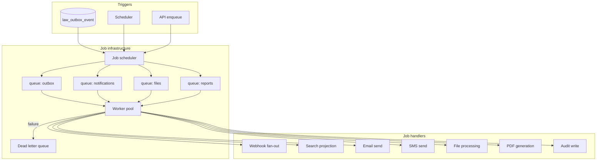
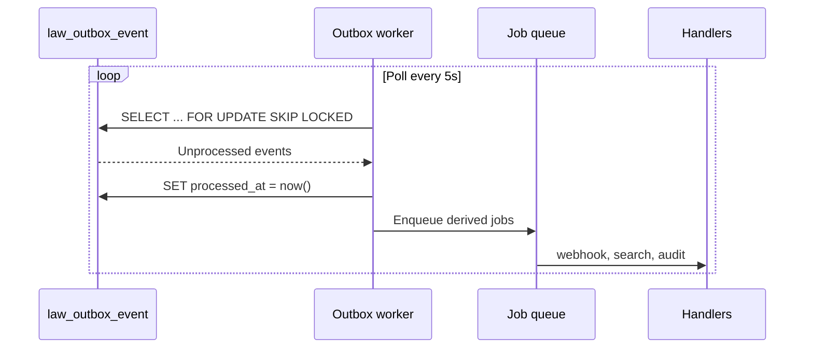

# LAW — Background Job Architecture

> **Milestone:** LAW-014 — Integration Foundation (planning)  
> **Status:** **Planning only** — no workers implemented  
> **Authority:** [LAW-Integration-Reference-Architecture](./LAW-Integration-Reference-Architecture.md) · [LAW-Persistence-Reference-Architecture](./LAW-Persistence-Reference-Architecture.md)  
> **Last updated:** 2026-07-06

---

## 1. Purpose

This document defines background job processing for the Law Platform: job types, queues, scheduling, retries, dead-letter handling, and relationships to the transactional outbox, email/SMS, file processing, reporting, and audit.

---

## 2. Architecture overview



---

## 3. Job types

| Type                 | ID prefix              | Trigger        | Idempotent              |
| -------------------- | ---------------------- | -------------- | ----------------------- |
| Outbox projection    | `job.outbox.project`   | Poll outbox    | Yes                     |
| Webhook delivery     | `job.webhook.deliver`  | Outbox fan-out | Yes (by deliveryId)     |
| Search index update  | `job.search.index`     | Outbox         | Yes                     |
| Email send           | `job.email.send`       | Outbox / API   | Yes (by messageId)      |
| SMS send             | `job.sms.send`         | Outbox / API   | Yes                     |
| File upload finalize | `job.file.finalize`    | API            | Yes                     |
| PDF generation       | `job.pdf.generate`     | API / schedule | Yes                     |
| Report generation    | `job.report.generate`  | Schedule       | Yes                     |
| Audit flush          | `job.audit.write`      | API middleware | Yes                     |
| Invoice reminder     | `job.billing.reminder` | Schedule       | Yes (by invoiceId+date) |

---

## 4. Queues

| Queue           | Priority | Concurrency | Timeout |
| --------------- | -------- | ----------- | ------- |
| `outbox`        | Highest  | 10 workers  | 60s     |
| `notifications` | High     | 20 workers  | 30s     |
| `files`         | Medium   | 5 workers   | 300s    |
| `reports`       | Low      | 2 workers   | 600s    |
| `audit`         | High     | 5 workers   | 10s     |

### Queue technology (decision deferred)

| Option                                    | Pros                                    | Cons                  |
| ----------------------------------------- | --------------------------------------- | --------------------- |
| PostgreSQL `SKIP LOCKED` (poll `law_job`) | No new infra; transactional with outbox | Scale limits          |
| Redis (BullMQ)                            | Mature; fast                            | Additional dependency |
| SQS                                       | Managed; scalable                       | AWS coupling          |

**Recommendation:** Start with PostgreSQL job table co-located with outbox (LAW-014-10); migrate to Redis if throughput requires.

---

## 5. Scheduling

| Schedule              | Job                    | Cron                  |
| --------------------- | ---------------------- | --------------------- |
| Outbox poll           | `job.outbox.project`   | Every 5 seconds       |
| Invoice due reminders | `job.billing.reminder` | Daily 08:00 tenant TZ |
| Report generation     | `job.report.generate`  | Weekly (configurable) |
| Dead letter review    | `job.dlq.sweep`        | Hourly                |
| Stale file cleanup    | `job.file.cleanup`     | Daily                 |

Scheduler runs as separate process or leader-elected worker.

---

## 6. Retries

| Queue         | Max attempts | Backoff             |
| ------------- | ------------ | ------------------- |
| outbox        | 10           | Exponential 1s → 1h |
| notifications | 7            | Exponential 1m → 8h |
| files         | 5            | Exponential 5m → 2h |
| reports       | 3            | Fixed 1h            |

Retry state stored on job record:

```json
{
  "jobId": "uuid",
  "attempt": 3,
  "maxAttempts": 7,
  "nextRunAt": "ISO-8601",
  "lastError": "SMTP timeout"
}
```

---

## 7. Dead-letter handling

Jobs exceeding `maxAttempts` move to `law_job_dead_letter`:

| Field           | Description         |
| --------------- | ------------------- |
| `deadLetterId`  | UUID                |
| `originalJobId` | Source job          |
| `jobType`       | Handler type        |
| `payload`       | Job input JSON      |
| `error`         | Final error message |
| `failedAt`      | Timestamp           |
| `replayable`    | Admin can replay    |

Admin replay: `POST /admin/jobs/dead-letters/{id}/replay` (future).

Relationship to webhook dead letters: separate tables, same admin UX pattern.

---

## 8. Outbox worker relationship



### Outbox claim rules

- Claim batch size: 100 events
- `processed_at IS NULL` → claim → process → mark processed
- Failed processing: `retry_count++`, `next_retry_at` — do not mark processed until success or dead letter
- Ordering: FIFO by `created_at` within tenant

### Idempotency

Handlers must tolerate duplicate delivery (at-least-once). Use `eventId` as idempotency key.

---

## 9. Email / SMS / file processing

### 9.1 Email jobs

| Trigger event             | Template                  |
| ------------------------- | ------------------------- |
| `legal.invoice.created`   | Invoice sent notification |
| `legal.task.*` (due soon) | Task reminder             |
| `legal.calendar.*`        | Hearing reminder          |

Flow: outbox event → `job.email.send` → `EmailService.send()` → provider adapter.

### 9.2 SMS jobs

Same pattern via `SmsService` — higher cost, opt-in per tenant.

### 9.3 File processing

| Step                                | Job                               |
| ----------------------------------- | --------------------------------- |
| API returns pre-signed upload URL   | `POST /documents/{id}/upload-url` |
| Client uploads to storage           | External                          |
| Client confirms upload              | `POST /documents/{id}/finalize`   |
| Worker validates + updates metadata | `job.file.finalize`               |
| Optional OCR                        | `job.file.ocr` (deferred)         |

---

## 10. Reporting jobs

Deferred to post-LAW-014 reporting milestone. Architecture placeholder:

- `job.report.generate` reads aggregates via read replicas
- Output to `FileStorageService` as PDF/CSV
- Notification on completion

---

## 11. Audit jobs

Two paths:

| Path              | Latency   | Use                             |
| ----------------- | --------- | ------------------------------- |
| Synchronous write | Immediate | API mutation audit (middleware) |
| Async flush       | Batched   | High-volume read audit          |

`job.audit.write` batches audit records every 5 seconds for throughput.

---

## 12. Worker deployment

| Aspect         | Design                                            |
| -------------- | ------------------------------------------------- |
| Process model  | Separate Node worker process(es) from Next.js web |
| Scaling        | Horizontal — workers compete via `SKIP LOCKED`    |
| Health         | `/worker/health` endpoint                         |
| Observability  | `jobId`, `correlationId` in structured logs       |
| Tenant context | `runWithLawPersistenceContext` per job            |

---

## 13. Planned tables

| Table                 | Purpose                               |
| --------------------- | ------------------------------------- |
| `law_job`             | Active job queue                      |
| `law_job_dead_letter` | Failed jobs                           |
| `law_outbox_event`    | Existing — source for projection jobs |

---

## 14. Implementation dependencies

| Story      | Deliverable                                          |
| ---------- | ---------------------------------------------------- |
| LAW-014-08 | Outbox worker (poll, claim, dispatch)                |
| LAW-014-10 | Job infrastructure (`law_job` table, worker process) |
| LAW-014-11 | File processing jobs                                 |
| LAW-014-12 | Email/SMS jobs                                       |

---

## 15. Related documents

| Document                                                                    | Purpose                |
| --------------------------------------------------------------------------- | ---------------------- |
| [LAW-Webhook-Architecture](./LAW-Webhook-Architecture.md)                   | Webhook delivery       |
| [LAW-External-Service-Abstractions](./LAW-External-Service-Abstractions.md) | Email, file interfaces |
| [LAW-014 Backlog](../backlog/LAW-014-integration-foundation-backlog.md)     | Stories                |
