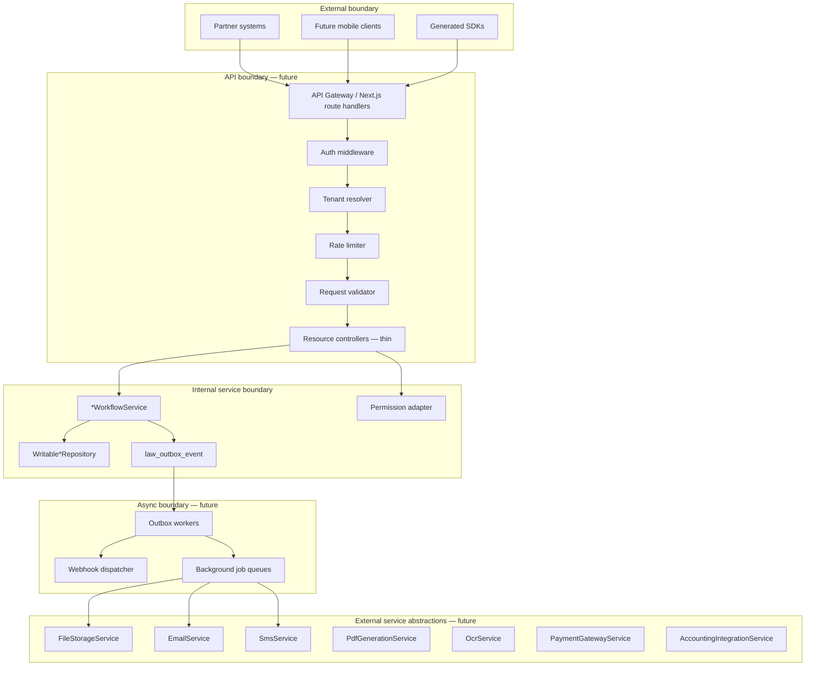
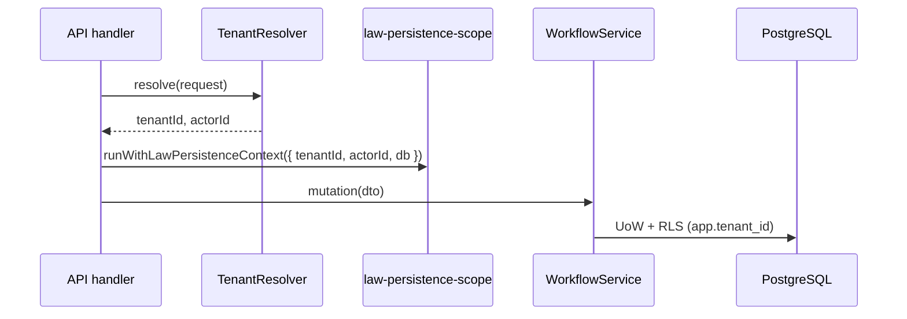
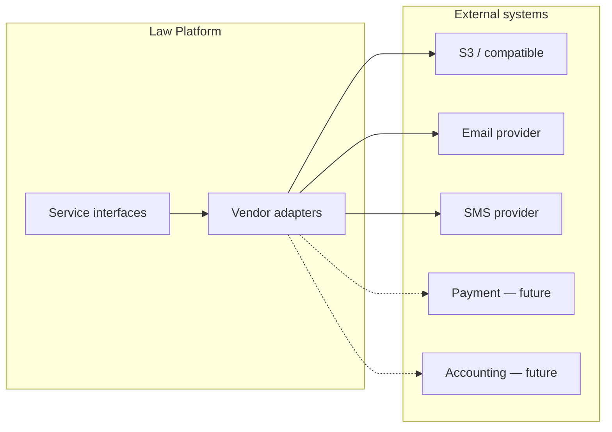

# LAW — Integration Reference Architecture

> **Milestone:** LAW-014 — Integration Foundation (planning)  
> **Status:** **Planning authority** — no implementation in LAW-014  
> **Depends on:** [LAW-Persistence-Reference-Architecture](./LAW-Persistence-Reference-Architecture.md) · [007 Identity & RBAC](../007-identity-authentication-authorisation-rbac-architecture.md) · [013 Security & Zero Trust](../013-security-architecture-zero-trust-framework.md)  
> **Last updated:** 2026-07-06

---

## 1. Purpose

This document defines how the Law Platform exposes secure, versioned, tenant-aware integrations to external consumers and internal services — without duplicating business logic already owned by workflow services and repositories.

LAW-014 establishes the **planning foundation**. Implementation begins in subsequent LAW-014-xx stories after owner approval.

---

## 2. Architectural principles

| Principle                | Rule                                                                                    |
| ------------------------ | --------------------------------------------------------------------------------------- |
| Workflow authority       | All mutations flow through existing `*WorkflowService` classes — APIs are thin adapters |
| Repository neutrality    | API layer calls workflow services; workflows call `getShared*Repository()` via factory  |
| Tenant everywhere        | Every integration path resolves `tenantId` before data access                           |
| Event-first side effects | Outbox events (`legal.*`) are the source of truth for async propagation                 |
| Versioned contracts      | Public DTOs are versioned; domain types in `@apzhub/legal-business-core` are internal   |
| Fail secure              | Unauthenticated, unauthorised, or untenanted requests are rejected — never degraded     |
| No framework duplication | Integration uses platform auth, audit, and event patterns — no parallel stacks          |

---

## 3. Layer model



### 3.1 API boundary (future)

The **API boundary** is the only surface external consumers may call.

| Responsibility               | Owner                                                                           |
| ---------------------------- | ------------------------------------------------------------------------------- |
| HTTP transport               | `apps/web` route handlers under `/api/law/v1/...`                               |
| Request/response DTO mapping | API adapter layer (`apps/law-platform/lib/api/`)                                |
| OpenAPI contract             | `docs/specs/` + generated artifact (future)                                     |
| Error envelope               | Standardised per [LAW-API-Design-Standard](../specs/LAW-API-Design-Standard.md) |

Controllers **must not** contain business rules. They validate transport shape, resolve tenant and actor, check permissions, invoke workflow, and map results to DTOs.

### 3.2 Internal service boundary

The **internal service boundary** is everything below the API adapter.

| Component           | Contract                                                           |
| ------------------- | ------------------------------------------------------------------ |
| Workflow services   | `ClientWorkflowService`, `MatterWorkflowService`, etc.             |
| Repositories        | `Writable*Repository` via `repository-factory.ts`                  |
| Persistence context | `LawPersistenceContext` + `runWithLawPersistenceContext`           |
| Domain types        | `@apzhub/legal-business-core` — not exposed directly on public API |
| Events              | Platform Event Bus (in-process) + transactional outbox (postgres)  |

Internal UI (Workbench) and future API adapters share the same workflow entry points.

---

## 4. Tenant resolution

### 4.1 Resolution order (proposed)

```text
1. API key metadata (service account → tenantId)
2. Bearer token claims (user session → firmId / tenantId)
3. Explicit header X-Tenant-Id (service-to-service only, requires elevated credential)
4. Reject — no default tenant on public API
```

**Contrast with persistence today:** `LawPersistenceContext` falls back to `DEFAULT_LAW_TENANT_ID` for dev/CI. Public APIs **must not** use this fallback.

### 4.2 Propagation



### 4.3 Isolation guarantees

| Layer       | Mechanism                                                                       |
| ----------- | ------------------------------------------------------------------------------- |
| API         | Tenant resolver rejects cross-tenant header spoofing without service credential |
| Application | Repository queries scoped by context `tenantId`                                 |
| Database    | RLS `FORCE` on all `law_*` tables                                               |

---

## 5. Authentication model

| Consumer type                               | Method                                | Notes                                                                                |
| ------------------------------------------- | ------------------------------------- | ------------------------------------------------------------------------------------ |
| Interactive user (future mobile/partner UI) | BetterAuth session → Bearer token     | Aligns with [007](../007-identity-authentication-authorisation-rbac-architecture.md) |
| Server-to-server integration                | API key + secret (hashed at rest)     | Scoped to tenant; rotatable                                                          |
| Internal worker                             | Service identity (mTLS or signed JWT) | No user actor; `actorId` = service principal                                         |
| Webhook receiver (outbound)                 | HMAC signature on payload             | See [LAW-Webhook-Architecture](./LAW-Webhook-Architecture.md)                        |

Authentication establishes **identity** only. Authorisation is a separate step.

---

## 6. Authorization model

Permissions use the existing `legal.*` namespace from Law manifests.

| Layer      | Enforcement                                            |
| ---------- | ------------------------------------------------------ |
| API route  | Route-level permission gate (e.g. `legal.client.view`) |
| Workflow   | Workflow may apply additional business rules           |
| Repository | Tenant isolation only — not permission-aware           |

**Proposed mapping:**

| HTTP method       | Typical permission                                  |
| ----------------- | --------------------------------------------------- |
| GET (list/detail) | `legal.{entity}.view` or `legal.nav.{module}.view`  |
| POST (create)     | `legal.{entity}.create`                             |
| PATCH (update)    | `legal.{entity}.edit`                               |
| DELETE / archive  | `legal.{entity}.delete` or `legal.{entity}.archive` |

API keys carry a **permission subset** configured at issuance — never full admin by default.

---

## 7. DTO versioning

### 7.1 Version strategy

| Element        | Convention                                                        |
| -------------- | ----------------------------------------------------------------- |
| URL version    | `/api/law/v1/...` — breaking changes → `v2`                       |
| DTO suffix     | `ClientV1Response`, `CreateClientV1Request`                       |
| Domain mapping | API DTO ↔ `ClientFormValues` / domain types via dedicated mappers |
| Deprecation    | `Sunset` header + 6-month overlap minimum                         |

### 7.2 Internal vs external types

| Type           | Package                                   | Exposed on API          |
| -------------- | ----------------------------------------- | ----------------------- |
| Domain entity  | `@apzhub/legal-business-core`             | **No**                  |
| Form values    | `apps/law-platform/lib/*/client-types.ts` | **No** (map to API DTO) |
| API DTO        | `apps/law-platform/lib/api/dto/` (future) | **Yes**                 |
| OpenAPI schema | Generated from DTOs                       | **Yes**                 |

### 7.3 Field stability rules

- Required response fields are never removed in the same major version
- New optional fields may be added without version bump
- Enum values may be extended; removal requires major version
- Reference numbers (`clientReference`, `matterReference`) are immutable in API responses

---

## 8. Error model

Standard envelope (see [LAW-API-Design-Standard](../specs/LAW-API-Design-Standard.md)):

```json
{
  "error": {
    "code": "VALIDATION_FAILED",
    "message": "Human-readable summary",
    "details": [
      {
        "field": "displayName",
        "code": "REQUIRED",
        "message": "Display name is required."
      }
    ],
    "correlationId": "corr-uuid",
    "requestId": "req-uuid"
  }
}
```

| HTTP status | Code family                         | When                                   |
| ----------- | ----------------------------------- | -------------------------------------- |
| 400         | `VALIDATION_*`, `MALFORMED_REQUEST` | Schema/business validation             |
| 401         | `UNAUTHENTICATED`                   | Missing/invalid credentials            |
| 403         | `FORBIDDEN`                         | Permission denied                      |
| 404         | `NOT_FOUND`                         | Entity not in tenant scope             |
| 409         | `CONFLICT`, `VERSION_CONFLICT`      | Optimistic concurrency                 |
| 422         | `UNPROCESSABLE`                     | Semantic rejection                     |
| 429         | `RATE_LIMITED`                      | Throttled                              |
| 500         | `INTERNAL_ERROR`                    | Unhandled — no stack trace in response |

---

## 9. Pagination model

Cursor-based pagination for list endpoints (recommended for postgres scale):

```json
{
  "data": [/* ClientV1Response[] */],
  "pagination": {
    "nextCursor": "eyJ...",
    "prevCursor": null,
    "hasMore": true,
    "limit": 25
  }
}
```

| Parameter | Type          | Default | Max |
| --------- | ------------- | ------- | --- |
| `limit`   | integer       | 25      | 100 |
| `cursor`  | opaque string | —       | —   |

Offset pagination (`page`, `pageSize`) permitted for small in-memory dev mode only — not the public contract default.

---

## 10. Filtering model

Filters align with existing `*-repository-filters.ts`:

| Entity   | Filter parameters (proposed)                                                   |
| -------- | ------------------------------------------------------------------------------ |
| Client   | `query`, `status`, `clientType`, `tags`                                        |
| Matter   | `query`, `matterStatus`, `clientId`, `leadAttorneyId`, `practiceAreaId`        |
| Document | `query`, `documentStatus`, `matterId`, `clientId`                              |
| Task     | `query`, `taskStatus`, `matterId`, `assignedToUserId`, `dueBefore`, `dueAfter` |
| Calendar | `query`, `calendarEventStatus`, `matterId`, `startsAfter`, `startsBefore`      |
| Time     | `query`, `billingStatus`, `matterId`, `attorneyId`                             |
| Invoice  | `query`, `invoiceStatus`, `clientId`, `matterId`, `dueBefore`, `dueAfter`      |

Filter query string encoding: `?status=active&clientType=organisation` with documented enum values.

---

## 11. Rate limiting model

| Tier             | Limit (proposed)  | Scope                     |
| ---------------- | ----------------- | ------------------------- |
| Standard API key | 1000 req / 15 min | Per key per tenant        |
| Burst            | 50 req / sec      | Per key                   |
| Webhook delivery | 100 concurrent    | Per tenant                |
| Search           | 60 req / min      | Per key (heavier queries) |

Response headers: `X-RateLimit-Limit`, `X-RateLimit-Remaining`, `X-RateLimit-Reset`, `Retry-After` on 429.

Implementation: platform gateway or middleware (Redis-backed sliding window) — deferred to LAW-014-14.

---

## 12. Audit model

| Event            | Captured                                                                                      |
| ---------------- | --------------------------------------------------------------------------------------------- |
| API request      | `requestId`, `correlationId`, `tenantId`, `actorId`, `method`, `path`, `status`, `durationMs` |
| Mutation         | Entity type, entity ID, action, before/after hash (not full payload in audit log)             |
| Auth failure     | Source IP, key ID (not secret), reason                                                        |
| Webhook delivery | Subscription ID, event ID, attempt, outcome                                                   |

Audit records are **append-only**, tenant-scoped, retained per compliance policy (default 7 years for legal).

Correlation with outbox: `correlationId` on API request = `correlationId` on outbox event when mutation succeeds.

---

## 13. Webhook model (summary)

Full detail: [LAW-Webhook-Architecture](./LAW-Webhook-Architecture.md).

```text
Repository mutation → outbox (legal.*.created) → outbox worker → webhook dispatcher → HTTPS POST to subscriber
```

- Subscribers register endpoint URL + secret per tenant
- Events filtered by type (`legal.client.created`, etc.)
- At-least-once delivery with exponential backoff
- HMAC-SHA256 signature header

---

## 14. Background job model (summary)

Full detail: [LAW-Background-Job-Architecture](./LAW-Background-Job-Architecture.md).

| Job category      | Trigger                 | Examples                             |
| ----------------- | ----------------------- | ------------------------------------ |
| Outbox projection | Poll `law_outbox_event` | Search index, webhook fan-out        |
| Scheduled         | Cron                    | Invoice reminders, report generation |
| On-demand         | API enqueue             | Bulk export, PDF generation          |
| Retry             | Failed job queue        | Email/SMS delivery                   |

---

## 15. External service abstractions (summary)

Full detail: [LAW-External-Service-Abstractions](./LAW-External-Service-Abstractions.md).

Workflows and workers depend on **interfaces**, not vendors:

- `FileStorageService` — document blob storage (metadata remains in `law_document`)
- `EmailService` — transactional email
- `SmsService` — SMS notifications
- `PdfGenerationService` — invoice/report PDFs
- `OcrService` — document text extraction (deferred)
- `PaymentGatewayService` — payment capture (deferred — Trust Accounting)
- `AccountingIntegrationService` — Xero/MYOB sync (deferred)

---

## 16. External integration adapters



Adapter rules:

- One adapter per vendor per interface
- Selected via tenant configuration (`integration_config` table — future)
- Adapters are stateless; credentials from secrets manager
- No vendor SDK types leak past adapter boundary

---

## 17. Related documents

| Document                                                                        | Purpose                 |
| ------------------------------------------------------------------------------- | ----------------------- |
| [LAW-API-Design-Standard](../specs/LAW-API-Design-Standard.md)                  | URL, headers, envelopes |
| [LAW-OpenAPI-Planning](../specs/LAW-OpenAPI-Planning.md)                        | Endpoint catalogue      |
| [LAW-Integration-Security-Model](../security/LAW-Integration-Security-Model.md) | Security controls       |
| [LAW-Webhook-Architecture](./LAW-Webhook-Architecture.md)                       | Webhook design          |
| [LAW-Background-Job-Architecture](./LAW-Background-Job-Architecture.md)         | Job design              |
| [LAW-External-Service-Abstractions](./LAW-External-Service-Abstractions.md)     | Service interfaces      |
| [LAW-014 Backlog](../backlog/LAW-014-integration-foundation-backlog.md)         | Implementation stories  |

---

## 18. Planning verdict

Architecture is **coherent with existing persistence and workflow layers**. Implementation may proceed story-by-story per backlog after owner approval.
