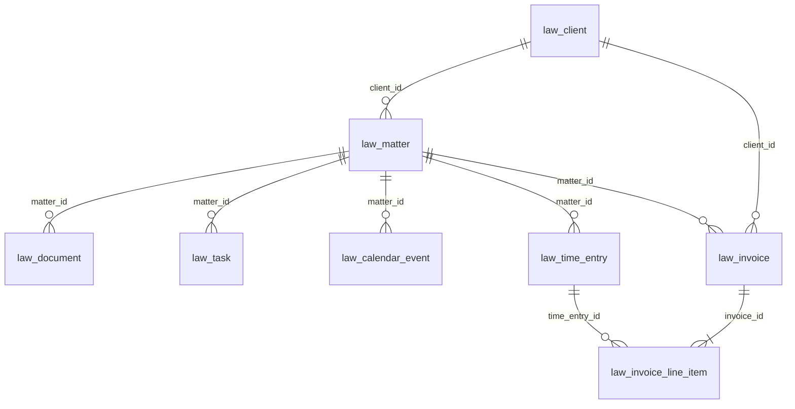

# LAW — Persistence Data Model

> **Schema source:** `packages/config/src/db/legal-schema.ts`  
> **Migrations:** `packages/config/drizzle/0001` – `0008`  
> **Last updated:** 2026-07-06 (LAW-012-07 closeout)

---

## 1. Table inventory

| Table                   | Aggregate               | Migration | RLS  | Soft lifecycle         |
| ----------------------- | ----------------------- | --------- | ---- | ---------------------- |
| `law_client`            | Client                  | 0001      | 0002 | `deleted_at`           |
| `law_matter`            | Matter                  | 0001      | 0002 | `archived_at`          |
| `law_outbox_event`      | — (infrastructure)      | 0001      | 0002 | —                      |
| `law_document`          | Document                | 0003      | 0004 | `archived_at`          |
| `law_task`              | Task                    | 0003      | 0004 | `archived_at`          |
| `law_calendar_event`    | CalendarEvent           | 0005      | 0006 | status = cancelled     |
| `law_time_entry`        | TimeEntry               | 0005      | 0006 | `deleted_at`           |
| `law_invoice`           | Invoice                 | 0007      | 0008 | status = void          |
| `law_invoice_line_item` | InvoiceLineItem (child) | 0007      | 0008 | — (replaced on update) |

**Total:** 9 Law tables (8 aggregate-related + outbox).

---

## 2. Entity relationship diagram



**Note:** Relationships are logical references by ID. No database foreign key constraints (TD-P11).

---

## 3. Common columns

| Column                      | Purpose                                             |
| --------------------------- | --------------------------------------------------- |
| `tenant_id`                 | Firm scope — required on every row                  |
| `version`                   | Optimistic concurrency (where applicable)           |
| `created_at` / `updated_at` | Audit timestamps                                    |
| `*_reference`               | Human-readable reference numbers (INV-, MAT-, etc.) |

---

## 4. Aggregate column highlights

### Client (`law_client`)

`client_type`, `status`, `tags` (jsonb), `custom_fields` (jsonb), `primary_contact_id`, `billing_address_id`, `deleted_at`

### Matter (`law_matter`)

`matter_status`, `practice_area_id`, `lead_attorney_id`, `team_member_ids` (jsonb), `opened_at`, `closed_at`, `archived_at`

### Document (`law_document`)

Metadata only — `file_name`, `mime_type`, `size_bytes` (no blob storage). `document_status`, `folder_id`, `created_by_user_id`

### Task (`law_task`)

`task_status`, `priority`, `due_date`, `assigned_to_user_id`, `document_id` (optional), `completed_at`

### Calendar (`law_calendar_event`)

`starts_at`, `ends_at`, `event_type`, `calendar_event_status`, `owner_user_id`, `time_entry_id` (optional link)

### Time (`law_time_entry`)

`duration_minutes`, `narrative`, `billable`, `billing_status`, `rate`, `amount`, `activity_code`, `deleted_at`

### Invoice (`law_invoice`)

`invoice_status`, `issue_date`, `due_date`, `subtotal`, `tax_total`, `total`, `currency`, `trust_applied_amount`, `expenses_placeholder`, `disbursements_placeholder`, `notes`

### Invoice line item (`law_invoice_line_item`)

`description`, `quantity`, `unit_price`, `amount`, `matter_id`, `time_entry_id`, `expense_id`

---

## 5. Outbox (`law_outbox_event`)

| Column           | Purpose                                                             |
| ---------------- | ------------------------------------------------------------------- |
| `aggregate_type` | client \| matter \| document \| task \| calendar \| time \| invoice |
| `aggregate_id`   | Entity primary key                                                  |
| `event_type`     | `legal.*` event name                                                |
| `payload`        | JSON event body                                                     |
| `tenant_id`      | Tenant scope                                                        |

---

## 6. Indexes

Each aggregate table has:

- Primary key on entity ID
- `law_*_tenant_idx` on `tenant_id`
- Unique index on `(tenant_id, *_reference)` where reference numbers exist
- Matter-scoped indexes on child tables (`tenant_id`, `matter_id`)

---

## 7. Truncate order (test utilities)

```
law_outbox_event
  → law_invoice_line_item → law_invoice
  → law_calendar_event → law_time_entry
  → law_task → law_document
  → law_matter → law_client
```

---

## 8. Phase 2 tables (not implemented)

| Entity                  | Planned purpose                |
| ----------------------- | ------------------------------ |
| `law_payment`           | Payment records                |
| `law_trust_account`     | Trust ledger accounts          |
| `law_trust_transaction` | Trust movements                |
| `law_expense`           | Billable expenses              |
| `law_disbursement`      | Disbursements                  |
| `law_audit_record`      | Compliance audit trail         |
| `*_projection`          | Search / reporting read models |

---

## 9. Verification

```typescript
import { verifyLawMigrations } from "@apzhub/config";
// Requires tags 0001 through 0008
```

See per-story migration notes: `LAW-012-02-Migration-Notes.md` through `LAW-012-06-Migration-Notes.md`.
