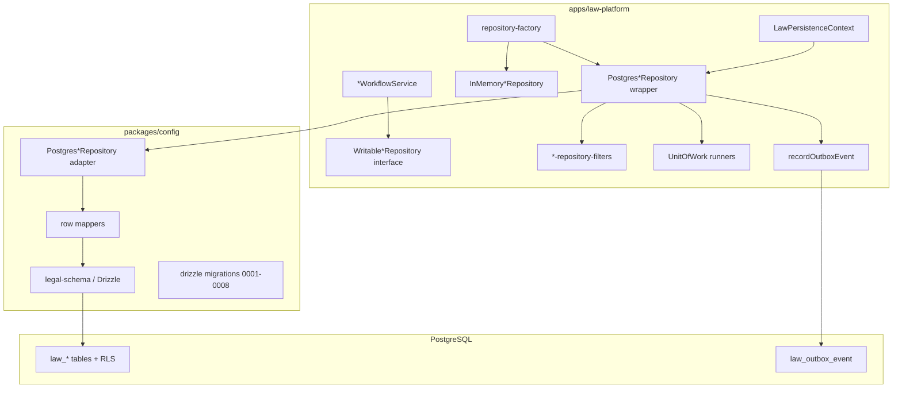
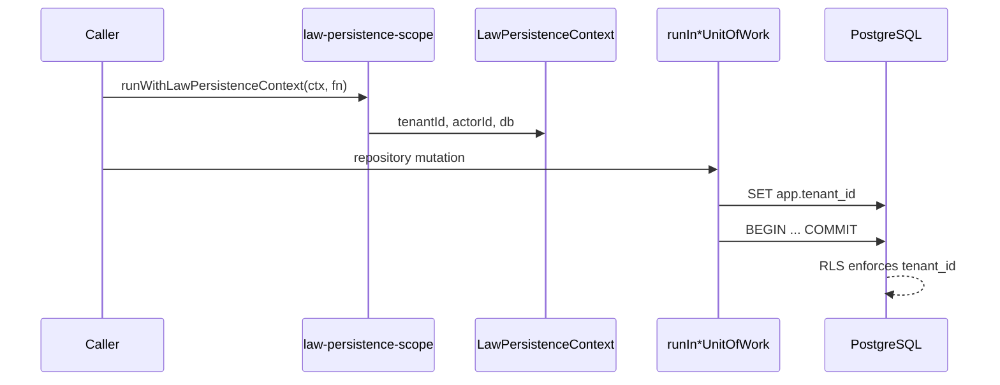
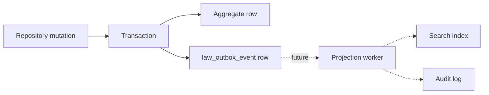

# LAW — Persistence Reference Architecture

> **Authority:** [LAW-012-01](./LAW-012-01-Persistence-Architecture.md) (design) · [LAW-012-persistence-foundation-review](../reviews/LAW-012-persistence-foundation-review.md) (as-built)  
> **Status:** **Implemented** — LAW-012-02 through LAW-012-06  
> **Last updated:** 2026-07-06 (LAW-012-07 closeout)

---

## 1. Overview

The Law Platform persistence layer provides dual-mode repository adapters (in-memory and PostgreSQL) for seven aggregate roots. Workflows remain the sole mutation entry point; repositories are swappable infrastructure beneath `*WorkflowService` classes.



---

## 2. Layer responsibilities

| Layer                   | Package / path                                             | Responsibility                                        |
| ----------------------- | ---------------------------------------------------------- | ----------------------------------------------------- |
| Workflow                | `apps/law-platform/lib/*/*-workflow-service.ts`            | Validation, factory, events, repository orchestration |
| Writable contract       | `apps/law-platform/lib/*/writable-*-repository.ts`         | App-level persistence interface                       |
| In-memory adapter       | `apps/law-platform/lib/*/in-memory-*-repository.ts`        | Seed data, Map storage, dev/CI default                |
| App postgres wrapper    | `apps/law-platform/lib/*/postgres-*-repository.ts`         | UoW, outbox, filter injection                         |
| Config postgres adapter | `packages/config/src/db/adapters/postgres-*-repository.ts` | SQL/Drizzle, relationship validation                  |
| Row mapper              | `packages/config/src/db/law-mappers/*-row-mapper.ts`       | Domain ↔ row translation                              |
| Schema                  | `packages/config/src/db/legal-schema.ts`                   | Drizzle table definitions                             |
| Factory                 | `apps/law-platform/lib/persistence/repository-factory.ts`  | Mode switch, shared instances, seeding                |

---

## 3. Repository mode

```text
LAW_REPOSITORY_MODE=memory   ← default (CI, local dev, workflow tests)
LAW_REPOSITORY_MODE=postgres ← opt-in (requires DATABASE_URL + migrations)
```

| Concern      | Memory                        | PostgreSQL                                    |
| ------------ | ----------------------------- | --------------------------------------------- |
| Storage      | In-process `Map`              | `law_*` tables                                |
| Tenant       | Context ignored for isolation | `tenantId` column + RLS                       |
| Seeding      | Static `SEED_*` arrays        | `seedPostgresLawDataAsync` on first access    |
| Outbox       | Skipped                       | `LAW_OUTBOX_ENABLED` (default on in postgres) |
| Transactions | N/A                           | Drizzle `db.transaction` per UoW              |

---

## 4. Tenant context



**Resolution order:** explicit context → ALS session → `LAW_TENANT_ID` env → `DEFAULT_LAW_TENANT_ID`.

---

## 5. Transaction boundaries

| Aggregate | UoW                       | Child entities in TX         |
| --------- | ------------------------- | ---------------------------- |
| Client    | `ClientUnitOfWork`        | —                            |
| Matter    | `MatterUnitOfWork`        | —                            |
| Document  | `DocumentUnitOfWork`      | —                            |
| Task      | `TaskUnitOfWork`          | —                            |
| Calendar  | `CalendarEventUnitOfWork` | —                            |
| Time      | `TimeEntryUnitOfWork`     | —                            |
| Invoice   | `InvoiceUnitOfWork`       | `law_invoice_line_item` rows |

Cross-aggregate effects use separate transactions + eventual consistency (no global TX).

---

## 6. Outbox pattern



- **Implemented:** transactional outbox writes (23 event types)
- **Not implemented:** workers, replay, dead-letter, idempotent consumers

---

## 7. Sync/async bridge

Workflows are synchronous. PostgreSQL adapters are async internally. `runSync()` (`apps/law-platform/lib/persistence/run-sync.ts`) blocks on promises — documented debt (TD-P04).

---

## 8. Testing architecture

| Layer       | Mechanism                                                         |
| ----------- | ----------------------------------------------------------------- |
| Contract    | `registerWritable*RepositoryContract` — shared assertions         |
| Integration | `describe.runIf(postgresAvailable)` — skips without DB            |
| Outbox      | Dedicated wiring integration tests per entity group               |
| Workflow    | `*-workflow.integration.test.ts` — memory mode E2E                |
| Foundation  | `persistence-foundation.test.ts`, `persistence-hardening.test.ts` |

---

## 9. Extension pattern (for future aggregates)

1. Add Drizzle schema + migration + RLS migration
2. Create row mapper + config postgres adapter
3. Create filters, in-memory repo, app postgres wrapper
4. Add UoW class + runner
5. Wire factory (`create*`, `getShared*`, `reset*`)
6. Add outbox draft helper + aggregate type
7. Register contract test + integration test + outbox wiring test
8. Update `verifyLawMigrations`, truncate/seed utilities

---

## 10. Related documents

| Document                                                                           | Purpose                   |
| ---------------------------------------------------------------------------------- | ------------------------- |
| [LAW-Persistence-Data-Model.md](./LAW-Persistence-Data-Model.md)                   | Table inventory           |
| [LAW-Persistence-Technical-Debt.md](./LAW-Persistence-Technical-Debt.md)           | Debt register             |
| [LAW-Persistence-Roadmap.md](../roadmap/LAW-Persistence-Roadmap.md)                | Next phases               |
| [LAW-012-01-Persistence-Architecture.md](./LAW-012-01-Persistence-Architecture.md) | Original design authority |
