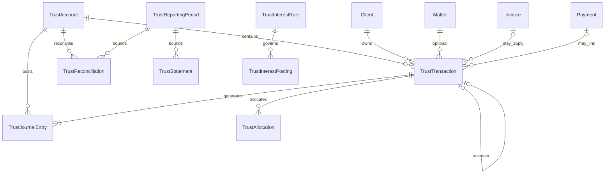

# LAW — Trust Domain Model

> **Milestone:** LAW-015 — Trust Accounting  
> **Story:** LAW-015-01 (planning authority)  
> **Status:** **Canonical trust domain** — supersedes trust sections in [APZHUB-Law-Domain-Model](./APZHUB-Law-Domain-Model.md) for LAW-015+  
> **Authority:** [LAW-Trust-Accounting-Reference-Architecture](./LAW-Trust-Accounting-Reference-Architecture.md)  
> **Last updated:** 2026-07-06

---

## 1. Purpose

Define the canonical Trust Accounting domain: entities, ownership, relationships, aggregate roots, immutability rules, and lifecycles. This model is jurisdiction-adaptable via compliance profiles; entity shapes are stable across implementations.

**No database schema, TypeScript types, or API DTOs in this document.**

---

## 2. Bounded context

```text
┌──────────────────────────────────────────────────────────────┐
│                  Trust Accounting Context                     │
│  TrustAccount · TrustLedger · TrustTransaction · Journal …   │
└───────────────────────────┬──────────────────────────────────┘
                            │ references (IDs only)
┌───────────────────────────▼──────────────────────────────────┐
│              Core Legal Context (existing)                    │
│  Client · Matter · Invoice · Payment · User                  │
└──────────────────────────────────────────────────────────────┘
```

Trust context **references** Client, Matter, Invoice, Payment, User — it does not embed their state.

---

## 3. Entity catalogue

| Entity                     |        Aggregate root?         | Owner module               |
| -------------------------- | :----------------------------: | -------------------------- |
| Trust Account              |               ✅               | Trust Accounting (LAW-015) |
| Trust Ledger (logical)     |     — (view over journal)      | Trust Accounting           |
| Trust Journal Entry        |               ✅               | Trust Accounting           |
| Trust Transaction          |               ✅               | Trust Accounting           |
| Trust Allocation           | ✅ (child of allocation batch) | Trust Accounting           |
| Trust Balance (projection) |         — (read model)         | Trust Accounting           |
| Trust Interest Rule        |               ✅               | Trust Accounting           |
| Trust Interest Posting     |  ✅ (specialised transaction)  | Trust Accounting           |
| Trust Reconciliation       |               ✅               | Trust Accounting           |
| Trust Statement            |               ✅               | Trust Accounting           |
| Trust Transfer             |  ✅ (specialised transaction)  | Trust Accounting           |
| Trust Payment              |     ✅ (subtype workflow)      | Trust Accounting           |
| Trust Receipt              |     ✅ (subtype workflow)      | Trust Accounting           |
| Trust Adjustment           |     ✅ (subtype workflow)      | Trust Accounting           |
| Trust Audit Record         |      — (append-only log)       | Trust Accounting           |
| Trust Reporting Period     |               ✅               | Trust Accounting           |

---

## 4. Entity definitions

### 4.1 Trust Account

| Attribute          | Definition                                                                                                                                                          |
| ------------------ | ------------------------------------------------------------------------------------------------------------------------------------------------------------------- |
| **Definition**     | A regulated bank account holding client funds on behalf of the firm's clients.                                                                                      |
| **Identity**       | `trustAccountId`, `trustAccountCode`                                                                                                                                |
| **Ownership**      | Tenant (firm); administered by users with `legal.trust.manage`                                                                                                      |
| **Key attributes** | `name`, `currency`, `institutionName`, `accountNumberMasked`, `branchCode?`, `complianceProfileId`, `isActive`, `openedAt`, `closedAt?`, `lpcRegistrationRef?` (ZA) |
| **Relationships**  | 1 → n Trust Transactions; 1 → n Trust Journal Entries; 1 → n Trust Reconciliations                                                                                  |
| **Immutability**   | Identity and opening metadata immutable after first post; `isActive` may transition to closed when balance zero and reconciliations complete                        |

### 4.2 Trust Ledger (logical)

| Attribute      | Definition                                                                                                                    |
| -------------- | ----------------------------------------------------------------------------------------------------------------------------- |
| **Definition** | The complete ordered journal for a trust account — not a separate stored aggregate; computed view over Trust Journal Entries. |
| **Levels**     | Firm → Trust Account → Client → Matter (see ADR-0038)                                                                         |

### 4.3 Trust Journal Entry

| Attribute          | Definition                                                                                                                                                                           |
| ------------------ | ------------------------------------------------------------------------------------------------------------------------------------------------------------------------------------ |
| **Definition**     | Immutable double-entry accounting record with debit/credit lines.                                                                                                                    |
| **Identity**       | `journalEntryId`, `journalReference`                                                                                                                                                 |
| **Ownership**      | Tenant; linked to `trustAccountId`                                                                                                                                                   |
| **Key attributes** | `entryDate`, `postedAt`, `postedByUserId`, `lines[]` (accountCode, debit, credit, clientId?, matterId?), `trustTransactionId`, `reversesEntryId?`, `status` (`posted` \| `reversed`) |
| **Immutability**   | **Fully immutable after post**                                                                                                                                                       |
| **Lifecycle**      | Created at transaction post → optionally marked reversed when reversal entry posted                                                                                                  |

### 4.4 Trust Transaction

| Attribute          | Definition                                                                                                                                                                                                                      |
| ------------------ | ------------------------------------------------------------------------------------------------------------------------------------------------------------------------------------------------------------------------------- |
| **Definition**     | Business record of a trust movement that generates journal entry(ies).                                                                                                                                                          |
| **Identity**       | `trustTransactionId`, `transactionReference`                                                                                                                                                                                    |
| **Ownership**      | Tenant                                                                                                                                                                                                                          |
| **Key attributes** | `trustAccountId`, `trustTransactionType`, `amount`, `currency`, `transactionDate`, `clientId`, `matterId?`, `invoiceId?`, `paymentId?`, `narrative`, `status`, `journalEntryIds[]`, `reversesTransactionId?`, `idempotencyKey?` |
| **Types**          | `deposit`, `withdrawal`, `transfer_in`, `transfer_out`, `fee_transfer`, `adjustment`, `interest_posting`, `reversal`                                                                                                            |
| **Immutability**   | Draft mutable; **posted immutable** (amounts, dates, accounts)                                                                                                                                                                  |
| **Lifecycle**      | `draft` → `posted` → (`reversed` when reversal posted)                                                                                                                                                                          |

### 4.5 Trust Allocation

| Attribute          | Definition                                                                                                                                                                              |
| ------------------ | --------------------------------------------------------------------------------------------------------------------------------------------------------------------------------------- |
| **Definition**     | Assignment of trust funds to a client/matter bucket within a trust account.                                                                                                             |
| **Identity**       | `trustAllocationId`                                                                                                                                                                     |
| **Ownership**      | Tenant                                                                                                                                                                                  |
| **Key attributes** | `trustAccountId`, `clientId`, `matterId?`, `allocatedAmount`, `currency`, `trustTransactionId`, `allocationDate`, `allocationType` (`receipt`, `transfer`, `application`, `adjustment`) |
| **Immutability**   | Append-only; corrections via reversing allocation + new allocation                                                                                                                      |
| **Lifecycle**      | Created on post → superseded only by reversal chain                                                                                                                                     |

### 4.6 Trust Balance (projection)

| Attribute          | Definition                                                                                      |
| ------------------ | ----------------------------------------------------------------------------------------------- |
| **Definition**     | Materialised balance snapshot for query performance.                                            |
| **Identity**       | Composite: `tenantId` + scope (`firm` \| `account` \| `client` \| `matter`) + scope ids         |
| **Key attributes** | `balanceAmount`, `currency`, `asOfDate`, `lastJournalEntryId`, `version`                        |
| **Immutability**   | Updated atomically with journal post — historical snapshots retained for reconciliation periods |
| **Authority**      | **Derived from journal** — rebuildable                                                          |

### 4.7 Trust Interest Rule

| Attribute          | Definition                                                                                                                                        |
| ------------------ | ------------------------------------------------------------------------------------------------------------------------------------------------- |
| **Definition**     | Configuration governing interest accrual and posting for a trust account or firm default.                                                         |
| **Identity**       | `trustInterestRuleId`                                                                                                                             |
| **Key attributes** | `trustAccountId?`, `complianceProfileId`, `accrualMethod`, `postingFrequency`, `minimumBalance?`, `strategyRef` (implementation hook), `isActive` |
| **Lifecycle**      | Active rules versioned; changes apply prospectively                                                                                               |

### 4.8 Trust Interest Posting

| Attribute          | Definition                                                                                                |
| ------------------ | --------------------------------------------------------------------------------------------------------- |
| **Definition**     | Specialised Trust Transaction batch crediting interest to client/matter allocations.                      |
| **Identity**       | Extends Trust Transaction                                                                                 |
| **Key attributes** | `interestPeriodStart`, `interestPeriodEnd`, `ruleId`, `lineItems[]` (clientId, matterId?, interestAmount) |
| **Lifecycle**      | `draft` → `approved` → `posted`                                                                           |

### 4.9 Trust Reconciliation

| Attribute          | Definition                                                                                                                                                                          |
| ------------------ | ----------------------------------------------------------------------------------------------------------------------------------------------------------------------------------- |
| **Definition**     | Three-way reconciliation record for a trust account and reporting period.                                                                                                           |
| **Identity**       | `trustReconciliationId`, `reconciliationReference`                                                                                                                                  |
| **Key attributes** | `trustAccountId`, `reportingPeriodId`, `bankStatementBalance`, `ledgerBalance`, `allocationSumBalance`, `varianceAmount`, `status`, `items[]`, `completedAt?`, `completedByUserId?` |
| **Lifecycle**      | `open` → `in_progress` → `completed` \| `failed`                                                                                                                                    |
| **Immutability**   | **Snapshot immutable when completed**                                                                                                                                               |

### 4.10 Trust Statement

| Attribute          | Definition                                                                                                                                                    |
| ------------------ | ------------------------------------------------------------------------------------------------------------------------------------------------------------- |
| **Definition**     | Client or examiner-facing statement for a period.                                                                                                             |
| **Identity**       | `trustStatementId`, `statementReference`                                                                                                                      |
| **Key attributes** | `clientId`, `trustAccountId?`, `matterId?`, `periodStart`, `periodEnd`, `openingBalance`, `closingBalance`, `lineItems[]`, `generatedAt`, `generatedByUserId` |
| **Lifecycle**      | Generated (immutable artefact); regeneration creates new statement version                                                                                    |

### 4.11 Trust Transfer

| Attribute          | Definition                                                                                                    |
| ------------------ | ------------------------------------------------------------------------------------------------------------- |
| **Definition**     | Movement between trust accounts or matter allocations, or authorised trust-to-business transfer.              |
| **Identity**       | Extends Trust Transaction (`transfer_in` / `transfer_out` pair)                                               |
| **Key attributes** | `sourceTrustAccountId?`, `targetTrustAccountId?`, `sourceMatterId?`, `targetMatterId?`, `pairedTransactionId` |
| **Lifecycle**      | Dual post atomic unit — both legs succeed or neither                                                          |

### 4.12 Trust Payment / Trust Receipt

| Attribute          | Definition                                                                        |
| ------------------ | --------------------------------------------------------------------------------- |
| **Trust Receipt**  | Inbound client funds (`deposit` type) — may link to Payment record                |
| **Trust Payment**  | Outbound client funds (`withdrawal` type) — may link to invoice trust application |
| **Identity**       | Extends Trust Transaction                                                         |
| **Key attributes** | `paymentMethod?`, `bankReference?`, `payeeName?`, `payerName?`                    |

### 4.13 Trust Adjustment

| Attribute          | Definition                                                                                                                   |
| ------------------ | ---------------------------------------------------------------------------------------------------------------------------- |
| **Definition**     | Authorised correction before or as alternative to full reversal — still posts journal entries; requires elevated permission. |
| **Identity**       | Extends Trust Transaction (`adjustment` type)                                                                                |
| **Key attributes** | `adjustmentReason`, `approvedByUserId`, `originalTransactionId?`                                                             |

### 4.14 Trust Audit Record

| Attribute          | Definition                                                                                                                                                            |
| ------------------ | --------------------------------------------------------------------------------------------------------------------------------------------------------------------- |
| **Definition**     | Append-only trust-specific audit log entry.                                                                                                                           |
| **Identity**       | `trustAuditRecordId`                                                                                                                                                  |
| **Key attributes** | `entityType`, `entityId`, `action`, `actorUserId`, `occurredAt`, `correlationId`, `trustAccountId?`, `clientId?`, `matterId?`, `payloadSummary`, `journalEntryIds[]?` |
| **Immutability**   | **Append-only**                                                                                                                                                       |

### 4.15 Trust Reporting Period

| Attribute          | Definition                                                                              |
| ------------------ | --------------------------------------------------------------------------------------- |
| **Definition**     | Bounded fiscal/regulatory period for trust reporting and reconciliation.                |
| **Identity**       | `trustReportingPeriodId`                                                                |
| **Key attributes** | `periodStart`, `periodEnd`, `status` (`open`, `closed`), `closedAt?`, `closedByUserId?` |
| **Lifecycle**      | Open → closed (locks new posts to period unless override)                               |

---

## 5. Relationship diagram



---

## 6. Aggregate roots and consistency boundaries

| Aggregate                  | Root entity            | Invariants enforced in root                                          |
| -------------------------- | ---------------------- | -------------------------------------------------------------------- |
| **Trust Account**          | Trust Account          | Active account has valid profile; cannot close with non-zero balance |
| **Trust Transaction**      | Trust Transaction      | Draft validation; post creates journal + allocations atomically      |
| **Trust Journal Entry**    | Trust Journal Entry    | Debits = credits; immutable after post                               |
| **Trust Reconciliation**   | Trust Reconciliation   | Three legs captured; completion requires zero unexplained variance   |
| **Trust Reporting Period** | Trust Reporting Period | Close requires all account reconciliations complete                  |
| **Trust Statement**        | Trust Statement        | Balances match journal for period                                    |

Cross-aggregate operations use **domain events** and **workflow orchestration** — not direct cross-table mutation outside transaction boundary.

---

## 7. Ownership summary

| Scope             | Owner                                                             |
| ----------------- | ----------------------------------------------------------------- |
| Tenant            | All trust entities include `tenantId` — firm owns data            |
| Trust Account     | Firm trust administrator                                          |
| Client funds      | Client identity via `clientId` — firm holds in fiduciary capacity |
| Matter allocation | Matter team; matter partner approval on large transfers (policy)  |
| Journal           | Firm — examiner read access via audit export                      |
| Platform          | No ownership of trust balances — hosts capability only            |

---

## 8. Immutability matrix

| Entity               |  Draft   |       Posted / Active       | Correction path            |
| -------------------- | :------: | :-------------------------: | -------------------------- |
| Trust Transaction    | Editable |          Immutable          | Reversal + new transaction |
| Trust Journal Entry  |   N/A    |          Immutable          | Reversal entry             |
| Trust Allocation     |   N/A    |         Append-only         | Reversal allocation        |
| Trust Reconciliation | Editable | Snapshot locked on complete | New reconciliation period  |
| Trust Statement      |   N/A    |          Immutable          | Regenerate new version     |
| Trust Audit Record   |   N/A    |         Append-only         | Never                      |
| Trust Balance        |   N/A    |      Projection update      | Rebuild from journal       |

---

## 9. Lifecycle state machines

### 9.1 Trust Transaction

```text
draft ──post──► posted ──reverse──► reversed
  │                │
  discard          └── (journal entry remains; status reversed)
  ▼
discarded
```

### 9.2 Trust Reconciliation

```text
open ──► in_progress ──► completed
              │
              └──► failed (requires new attempt)
```

### 9.3 Trust Reporting Period

```text
open ──close──► closed
  ▲                │
  └── reopen (override permission, audit required)
```

---

## 10. Reference to parent domain model

[APZHUB-Law-Domain-Model](./APZHUB-Law-Domain-Model.md) § Trust Account and Trust Transaction remain valid high-level vocabulary. **This document is authoritative** for LAW-015 implementation detail. When conflicts arise, LAW-Trust-Domain-Model wins for trust-specific semantics.

---

## 11. Related documents

| Document               | Path                                                                                               |
| ---------------------- | -------------------------------------------------------------------------------------------------- |
| Reference architecture | [LAW-Trust-Accounting-Reference-Architecture.md](./LAW-Trust-Accounting-Reference-Architecture.md) |
| Specification          | [LAW-Trust-Accounting-Specification.md](../specs/LAW-Trust-Accounting-Specification.md)            |
| ADR-0037               | [Immutable Trust Journal](../adr/ADR-0037-immutable-trust-journal.md)                              |
| ADR-0038               | [Matter Trust Balance Segregation](../adr/ADR-0038-matter-trust-balance-segregation.md)            |

---

_LAW Trust Domain Model — canonical domain for LAW-015._
