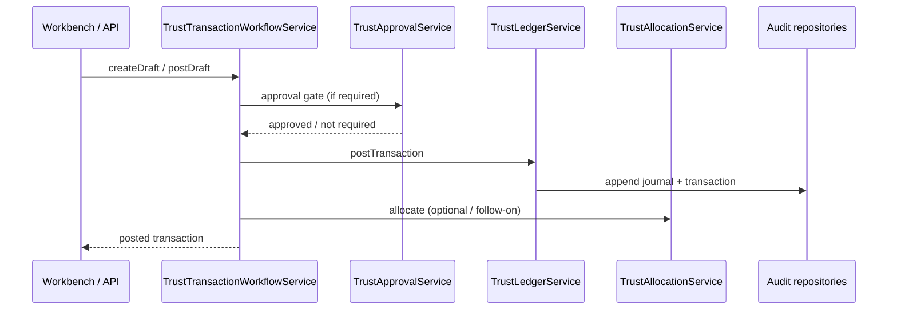
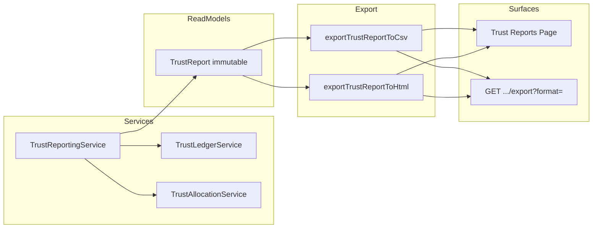

# LAW — Trust Reference Architecture

> **Milestone:** LAW-015 — Trust Accounting  
> **Status:** **Implemented (LAW-015-01 through LAW-015-13)** — canonical post-delivery reference  
> **Supersedes:** planning-only sections of [LAW-Trust-Accounting-Reference-Architecture](./LAW-Trust-Accounting-Reference-Architecture.md) for as-built behaviour  
> **Last updated:** 2026-07-08

---

## 1. Purpose

This document is the **final reference architecture** for Trust Accounting on the Law Platform after LAW-015 delivery. It describes the as-built subsystem: services, persistence, APIs, workbench, and cross-cutting controls.

Trust Accounting holds regulated client funds, maintains matter-level segregation, supports reconciliation and interest, and produces audit-ready records and exports.

---

## 2. Architectural principles

| Principle                  | Implementation                                                               |
| -------------------------- | ---------------------------------------------------------------------------- |
| Law Platform capability    | Module `legal-trust` — not a Platform 5.0 framework extension                |
| Consume, don't modify      | Uses Workbench, Action, Event/Notification, Persistence, API frameworks      |
| Workflow authority         | Mutations through `Trust*Service` / `TrustTransactionWorkflowService`        |
| Immutable financial record | Posted journals immutable; reversals only (ADR-0037)                         |
| Tenant isolation           | `tenantId` on all entities; RLS on PostgreSQL (LAW-015-11)                   |
| Read models separate       | Reporting and exports consume immutable projections — never recompute ledger |

---

## 3. Layered architecture

```text
┌─────────────────────────────────────────────────────────────────────────┐
│ Presentation — Trust Workbench (LAW-015-09)                              │
│   Dashboard · Accounts · Transactions · Allocations · Reconciliation     │
│   Interest · Transfers · Reports · Export CSV / Print View (LAW-015-12)  │
├─────────────────────────────────────────────────────────────────────────┤
│ Law API — /api/law/v1/trust/* (LAW-015-11, LAW-015-12 export)            │
│   withLawApiAuth · tenant binding · permission gates · error envelopes     │
├─────────────────────────────────────────────────────────────────────────┤
│ Application / Domain Services (apps/law-platform/lib/trust/)             │
│   TrustLedgerService · TrustTransactionWorkflowService                   │
│   TrustAllocationService · TrustReconciliationService                    │
│   TrustInterestService · TrustTransferService · TrustReportingService    │
│   TrustApprovalService                                                   │
├─────────────────────────────────────────────────────────────────────────┤
│ Persistence — memory | postgres (LAW_REPOSITORY_MODE)                    │
│   InMemory* repositories · PostgresTrustStore · migrations 0009–0010     │
├─────────────────────────────────────────────────────────────────────────┤
│ Platform 5.0 (frozen) — Auth · Outbox skeleton · Diagnostics patterns    │
└─────────────────────────────────────────────────────────────────────────┘
```

---

## 4. Component map

| Component          | Service                           | Responsibility                                                |
| ------------------ | --------------------------------- | ------------------------------------------------------------- |
| **Ledger**         | `TrustLedgerService`              | Double-entry posting, balance projection, reference numbering |
| **Workflow**       | `TrustTransactionWorkflowService` | Draft → validate → post; reversal requests                    |
| **Allocations**    | `TrustAllocationService`          | Matter/client bucket assignment after post                    |
| **Reconciliation** | `TrustReconciliationService`      | Internal ledger vs allocation control runs                    |
| **Interest**       | `TrustInterestService`            | Rules, accrual, posting workflow                              |
| **Transfers**      | `TrustTransferService`            | Matter-to-matter and account transfer drafts                  |
| **Reporting**      | `TrustReportingService`           | Immutable read-model generation (10 report types)             |
| **Approvals**      | `TrustApprovalService`            | Governance gates for high-risk operations                     |
| **Workbench**      | `TrustWorkbenchService`           | UI adapter over shared in-memory bundle                       |
| **Export**         | `trust-report-export.ts`          | CSV and HTML serializers (presentation only)                  |

---

## 5. Component interaction — transaction post



---

## 6. Component interaction — reporting and export



Reporting never mutates ledger state. Export is presentation-only over `TrustReport.payload`.

---

## 7. Ledger

- **Authority:** `TrustLedgerService` + `TrustJournalEntry` aggregates
- **Chart of accounts:** Trust-specific codes; balanced debits/credits enforced at post
- **Balances:** Materialised projections at account, client, matter scope (ADR-0038)
- **Reversals:** New journal entry referencing original; no in-place edits

Implementation: LAW-015-02. Persistence: LAW-015-11.

---

## 8. Workflow

- **Draft lifecycle:** `draft` → validate → `posted`
- **Types:** deposit, withdrawal, adjustment, reversal (via dedicated flow)
- **Audit:** Append-only workflow audit trail (LAW-015-03)
- **API:** `POST /transactions`, `POST /transactions/{id}/post`, `POST /transactions/{id}/reverse`

---

## 9. Allocations

- **Purpose:** Map posted receipts to client/matter buckets
- **Service:** `TrustAllocationService`
- **API:** `GET /allocations` (list); allocation creation via service layer (no public POST yet)
- **Integrity:** Sum of allocations reconciled against ledger via reconciliation engine

---

## 10. Reconciliation

- **Service:** `TrustReconciliationService`
- **Scope:** Internal two-way (ledger vs allocations) in current release; bank leg deferred
- **Output:** Reconciliation run with warnings/errors; immutable history
- **API:** `POST /reconciliation?trustAccountId=`

---

## 11. Interest

- **Service:** `TrustInterestService`
- **Entities:** `TrustInterestRule`, `TrustInterestPosting`
- **Flow:** create rule → run accrual for period → approve/post posting
- **API:** `GET /interest`, `POST /interest` (accrual); rule creation internal only

---

## 12. Transfers

- **Service:** `TrustTransferService`
- **Types:** matter-to-matter, account-level (profile-dependent)
- **Lifecycle:** draft → approve → post
- **API:** `GET /transfers`, `POST /transfers` (draft); approve/post via approval service

---

## 13. Reporting

- **Service:** `TrustReportingService`
- **Report types (10):** trial balance, ledger, journal, transactions, client/matter statements, allocation, interest, transfer, reconciliation summaries
- **Model:** Immutable `TrustReport` with `sourceCounts` metadata
- **API:** `GET /reports`, `POST /reports`

---

## 14. Approvals

- **Service:** `TrustApprovalService`
- **Governance:** Configurable rules for withdrawals, reversals, transfers, adjustments
- **Lifecycle:** submitted → approved | rejected | cancelled
- **API:** `GET /approvals`, `POST /approvals/{id}/approve|reject`
- **Diagnostics:** `buildDiagnosticsSnapshot()` for pending counts

---

## 15. APIs

Base path: `/api/law/v1/trust`

| Area           | Endpoints                                                                                   |
| -------------- | ------------------------------------------------------------------------------------------- |
| Accounts       | `GET/POST /accounts`, `GET /accounts/{id}`                                                  |
| Transactions   | `GET/POST /transactions`, `POST /transactions/{id}/post`, `POST /transactions/{id}/reverse` |
| Allocations    | `GET /allocations`                                                                          |
| Reconciliation | `POST /reconciliation`                                                                      |
| Interest       | `GET/POST /interest`                                                                        |
| Transfers      | `GET/POST /transfers`                                                                       |
| Approvals      | `GET /approvals`, approve/reject                                                            |
| Reports        | `GET/POST /reports`, `GET /reports/{id}/export?format=csv\|html`                            |
| Diagnostics    | `GET /diagnostics`                                                                          |

Detail: [LAW-015-11 Trust API Notes](./LAW-015-11-Trust-API-Notes.md).

---

## 16. Workbench

- **App:** `@apzhub/law-platform` — routes under `/workspace/law/trust/*`
- **Module:** `services/legal-platform/manifests/law-trust/module.yaml`
- **Data:** In-process `getSharedTrustWorkbench()` with seeded demo data
- **Views:** Dashboard, accounts, transactions, allocations, reconciliation, interest, transfers, reports
- **Exports:** Export CSV and Print View buttons (LAW-015-12)

Detail: [LAW-015-09 Workbench UI Notes](./LAW-015-09-Trust-Workbench-UI-Notes.md).

---

## 17. Persistence modes

| Mode       | Env                            | Use                           |
| ---------- | ------------------------------ | ----------------------------- |
| Memory     | `LAW_REPOSITORY_MODE=memory`   | Default tests, workbench demo |
| PostgreSQL | `LAW_REPOSITORY_MODE=postgres` | Integration, production path  |

Migrations: `0009_law_trust`, `0010_law_trust_rls`. Outbox rows recorded when `LAW_OUTBOX_ENABLED=true` (no workers).

---

## 18. Security

- **Auth:** BetterAuth session via Law API middleware
- **Permissions:** `legal.trust.*` catalogue — see [LAW-Trust-Permissions](../specs/LAW-Trust-Permissions.md)
- **Tenant:** `x-tenant-id` header + session binding; RLS on postgres
- **Superadmin:** Not a bypass — explicit permission tier

---

## 19. Deferred (post LAW-015)

| Item                                                       | Notes                     |
| ---------------------------------------------------------- | ------------------------- |
| Bank feeds / three-way reconciliation                      | LAW-015 stretch           |
| PDF/Excel export engines                                   | Placeholder 422 for PDF   |
| Outbox workers / event bus wiring                          | Rows only                 |
| REST-backed workbench                                      | UI uses in-process bundle |
| Financial Engine extraction                                | FIN-001 — DEFER           |
| Platform integration (events, notifications, billing tabs) | Deferred story            |

---

## 20. Related documents

| Document                                                                         | Purpose                |
| -------------------------------------------------------------------------------- | ---------------------- |
| [LAW-Trust-Domain-Reference](./LAW-Trust-Domain-Reference.md)                    | Canonical domain model |
| [LAW-Trust-Developer-Guide](../developer/LAW-Trust-Developer-Guide.md)           | Developer handbook     |
| [LAW-Trust-Operations-Guide](../operator/LAW-Trust-Operations-Guide.md)          | Operator runbook       |
| [LAW-Trust-v1.0](../releases/LAW-Trust-v1.0.md)                                  | Release notes          |
| [LAW-015-Trust-Accounting-Review](../reviews/LAW-015-Trust-Accounting-Review.md) | Formal review          |
