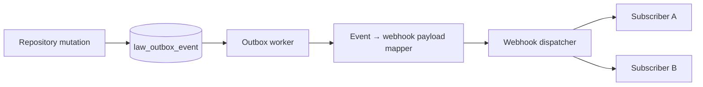
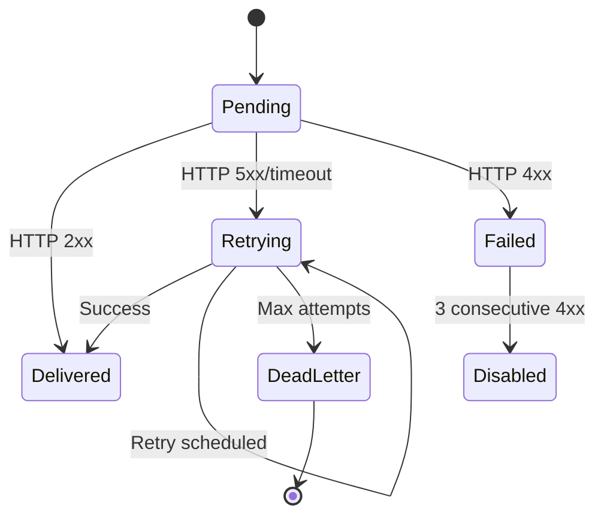

# LAW — Webhook Architecture

> **Milestone:** LAW-014 — Integration Foundation (planning)  
> **Status:** **Planning only** — no webhook implementation  
> **Authority:** [LAW-Integration-Reference-Architecture](./LAW-Integration-Reference-Architecture.md) · [LAW-Integration-Security-Model](../security/LAW-Integration-Security-Model.md)  
> **Last updated:** 2026-07-06

---

## 1. Purpose

This document defines how the Law Platform delivers outbound webhook notifications to external subscribers when domain events occur — building on the existing transactional outbox (`law_outbox_event`).

---

## 2. Event source

### 2.1 Primary source: transactional outbox

Outbox events already written by postgres repositories (23 event types):

| Domain   | Event types                                                                                       |
| -------- | ------------------------------------------------------------------------------------------------- |
| Client   | `legal.client.created`, `legal.client.updated`, `legal.client.deleted`                            |
| Matter   | `legal.matter.created`, `legal.matter.updated`, `legal.matter.archived`                           |
| Document | `legal.document.created`, `legal.document.updated`, `legal.document.archived`                     |
| Task     | `legal.task.created`, `legal.task.updated`, `legal.task.completed`, `legal.task.archived`         |
| Calendar | `legal.calendar.created`, `legal.calendar.updated`, `legal.calendar.cancelled`                    |
| Time     | `legal.time.created`, `legal.time.updated`, `legal.time.deleted`                                  |
| Invoice  | `legal.invoice.created`, `legal.invoice.updated`, `legal.invoice.cancelled`, `legal.invoice.paid` |

### 2.2 Event envelope (webhook payload)

```json
{
  "id": "evt-uuid",
  "type": "legal.client.created",
  "apiVersion": "2026-07-01",
  "createdAt": "2026-07-06T10:00:00.000Z",
  "tenantId": "tenant-uuid",
  "correlationId": "corr-uuid",
  "data": {
    "clientId": "c1000001-...",
    "clientReference": "CLT-2026-00001",
    "displayName": "Harbourview Holdings Pty Ltd"
  }
}
```

`data` contains API DTO subset — not full domain object or internal fields.

### 2.3 Flow



---

## 3. Subscription model

### 3.1 Subscription entity (planned table: `law_webhook_subscription`)

| Field             | Type      | Description                        |
| ----------------- | --------- | ---------------------------------- |
| `subscriptionId`  | UUID      | Primary key                        |
| `tenantId`        | UUID      | Owner tenant                       |
| `url`             | HTTPS URL | Delivery endpoint                  |
| `secret`          | encrypted | HMAC signing secret                |
| `eventTypes`      | string[]  | Filter — e.g. `["legal.client.*"]` |
| `status`          | enum      | `active`, `paused`, `disabled`     |
| `description`     | string    | Admin label                        |
| `createdByUserId` | UUID      | Creator                            |
| `createdAt`       | timestamp | —                                  |

### 3.2 Subscription rules

- HTTPS only (no HTTP in production)
- URL validated at creation (DNS resolve, no private IP ranges — SSRF protection)
- Maximum 10 active subscriptions per tenant (configurable)
- Wildcard patterns: `legal.client.*`, `legal.invoice.paid`
- Paused subscriptions queue events up to 7 days (then drop with audit)

### 3.3 Management API

See [LAW-OpenAPI-Planning](../specs/LAW-OpenAPI-Planning.md) — `/webhook-subscriptions` endpoints.

---

## 4. Delivery model

### 4.1 Delivery record (planned table: `law_webhook_delivery`)

| Field            | Description                      |
| ---------------- | -------------------------------- |
| `deliveryId`     | Unique delivery attempt group    |
| `subscriptionId` | Target subscription              |
| `eventId`        | Source outbox event ID           |
| `attempt`        | Attempt number (1-based)         |
| `status`         | `pending`, `delivered`, `failed` |
| `httpStatus`     | Last HTTP status                 |
| `responseBody`   | Truncated response (max 4 KB)    |
| `nextRetryAt`    | Scheduled retry                  |
| `deliveredAt`    | Success timestamp                |

### 4.2 Delivery semantics

| Property     | Value                                  |
| ------------ | -------------------------------------- |
| Guarantee    | **At-least-once**                      |
| Ordering     | Best-effort per entity ID (not global) |
| Timeout      | 30 seconds per attempt                 |
| Concurrency  | Max 100 in-flight per tenant           |
| Payload size | Max 256 KB                             |

Subscribers **must** deduplicate by `id` (event ID).

---

## 5. Retry model

| Attempt | Delay after failure |
| ------- | ------------------- |
| 1       | Immediate           |
| 2       | 1 minute            |
| 3       | 5 minutes           |
| 4       | 30 minutes          |
| 5       | 2 hours             |
| 6       | 8 hours             |
| 7+      | Dead letter         |

Retry triggers:

- HTTP 5xx
- HTTP 429 (respect `Retry-After` if present)
- Network timeout / connection failure

No retry:

- HTTP 4xx (except 429)
- Invalid URL / SSL error (disable subscription after 3 consecutive)

---

## 6. Signing

See [LAW-Integration-Security-Model](../security/LAW-Integration-Security-Model.md) §10.

Headers on every delivery:

| Header                 | Purpose               |
| ---------------------- | --------------------- |
| `X-Apzhub-Signature`   | HMAC-SHA256           |
| `X-Apzhub-Event-Id`    | Deduplication         |
| `X-Apzhub-Delivery-Id` | Delivery tracking     |
| `X-Apzhub-Event-Type`  | Quick filter          |
| `User-Agent`           | `APZHUB-Webhooks/1.0` |

---

## 7. Failure handling



### Subscriber health

| Condition                  | Action                            |
| -------------------------- | --------------------------------- |
| 3 consecutive 4xx          | Pause subscription + notify admin |
| 7 failed attempts          | Dead letter + notify admin        |
| 24h no successful delivery | Warning notification              |

---

## 8. Dead-letter strategy

### 8.1 Dead-letter queue (planned table: `law_webhook_dead_letter`)

Stores undeliverable events with full payload for manual replay.

| Field            | Description   |
| ---------------- | ------------- |
| `deadLetterId`   | UUID          |
| `subscriptionId` | Target        |
| `eventId`        | Source event  |
| `payload`        | JSON payload  |
| `lastError`      | Error summary |
| `failedAt`       | Timestamp     |
| `replayable`     | Boolean       |

### 8.2 Replay

Admin API (future): `POST /webhook-dead-letters/{id}/replay`

- Creates new delivery attempt
- Audit logged
- Max 3 manual replays per dead letter

### 8.3 Retention

Dead letters retained 30 days, then archived to cold storage.

---

## 9. Tenant isolation

| Control            | Mechanism                                                      |
| ------------------ | -------------------------------------------------------------- |
| Subscription scope | `tenantId` on subscription row                                 |
| Event filtering    | Worker only dispatches events matching subscription `tenantId` |
| Cross-tenant leak  | Impossible by construction — worker query joins on tenant      |
| Admin API          | Subscription CRUD scoped to authenticated tenant               |

---

## 10. Relationship to platform Event Bus

| Channel              | Scope               | Use                                         |
| -------------------- | ------------------- | ------------------------------------------- |
| In-process Event Bus | Single Node process | UI notifications, activity timeline (today) |
| Transactional outbox | Durable, postgres   | Webhooks, search projection, audit (future) |

Webhooks **do not** subscribe to in-process bus directly — outbox is the durable bridge.

---

## 11. Implementation dependencies

| Dependency                       | Story      |
| -------------------------------- | ---------- |
| Outbox worker (poll + claim)     | LAW-014-08 |
| Webhook subscription persistence | LAW-014-09 |
| Webhook dispatcher               | LAW-014-09 |
| Signing + delivery records       | LAW-014-09 |
| Admin API                        | LAW-014-09 |

---

## 12. Related documents

| Document                                                                | Purpose               |
| ----------------------------------------------------------------------- | --------------------- |
| [LAW-Background-Job-Architecture](./LAW-Background-Job-Architecture.md) | Worker infrastructure |
| [LAW-012-03 Outbox Wiring Notes](./LAW-012-03-Outbox-Wiring-Notes.md)   | Existing event types  |
| [LAW-014 Backlog](../backlog/LAW-014-integration-foundation-backlog.md) | Stories               |
