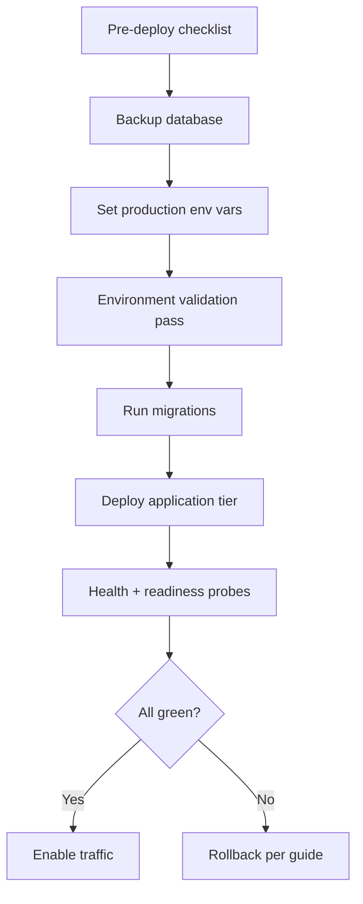
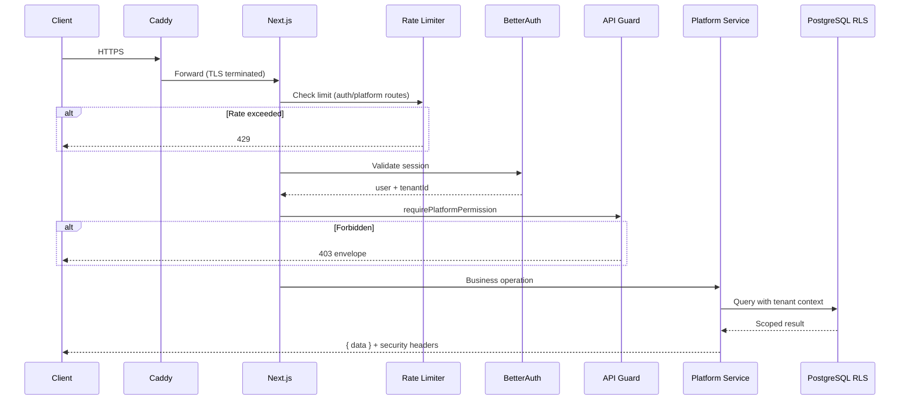
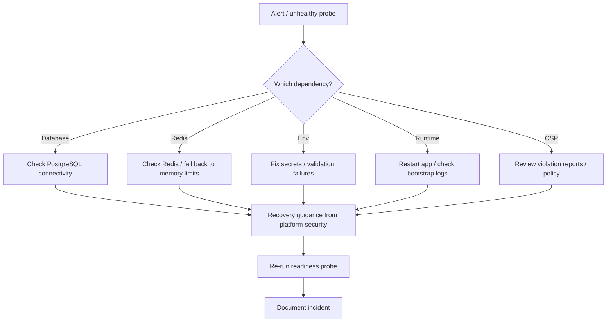

# PCv2-01 — Production Readiness Target Architecture

> **Milestone:** PCv2-01 — planning target state  
> **Status:** Target architecture — **not yet implemented**  
> **Authority:** [PCv2-01 Sprint Guide](../sprint/PCv2-01-Production-Readiness-Sprint-Guide.md) · [Platform Core Reference Architecture](./APZHUB-Platform-Core-Reference-Architecture.md)

---

## Purpose

Describe the **target production architecture** after PCv2-01 completes. This document defines operational flows, security posture, and deployment patterns. It does **not** include workers, dedicated gateway service, Vault, or full observability stack — those are subsequent milestones (PCv2-02, PCv2-04, PCv2-07, PCv2-09).

---

## Architecture overview (post-PCv2-01)

```text
┌─────────────────────────────────────────────────────────────────────────┐
│  Edge (Caddy) — TLS, optional rate limits (config only)                  │
└─────────────────────────────────────────────────────────────────────────┘
                                    │
                                    ▼
┌─────────────────────────────────────────────────────────────────────────┐
│  Application tier (Next.js)                                              │
│  apps/web · apps/law-platform                                          │
│  ├─ @apzhub/platform-bootstrap (shared init)                           │
│  ├─ CSP enforced + violation reporting                                 │
│  ├─ Rate limit middleware (auth + platform APIs)                         │
│  ├─ Session hardening (Better Auth)                                    │
│  └─ Platform API guard (session + permission)                            │
└─────────────────────────────────────────────────────────────────────────┘
                                    │
                    ┌───────────────┼───────────────┐
                    ▼               ▼               ▼
            ┌─────────────┐ ┌─────────────┐ ┌─────────────┐
            │ PostgreSQL  │ │ Redis       │ │ Platform    │
            │ RLS enforced│ │ rate limits │ │ Core pkgs   │
            └─────────────┘ └─────────────┘ └─────────────┘
```

---

## Operational flow

```mermaid
flowchart TD
  subgraph Operator
    OC[Operations Console]
  end

  subgraph Probes
    L[/system/liveness]
    R[/system/readiness]
    H[/system/health]
    D[/security/diagnostics]
  end

  subgraph Services
    SEC[@apzhub/platform-security]
    RT[Platform Runtime bootstrap]
    ID[Identity]
    AUTHZ[Authorization]
  end

  OC --> D
  OC --> H
  L --> SEC
  R --> SEC
  H --> SEC
  D --> SEC
  SEC --> RT
  SEC --> ID
  SEC --> AUTHZ
```

**Operator workflow:**

1. Check **liveness** — process up.
2. Check **readiness** — DB, Redis, env, runtime bootstrap.
3. Review **consolidated diagnostics** — security, identity, governance, resilience.
4. Follow **recovery guidance** if unhealthy.
5. Use **production checklist** before go-live.

---

## Deployment flow



**PCv2-01 additions to deployment:**

- Environment validation **fails closed** in production.
- CSP enforced — verify no violation flood post-deploy.
- RLS integration tests run on staging before promote.
- Shared bootstrap ensures identical init path for web and law-platform.

---

## Request flow (hardened)



**PCv2-01 changes from v1:**

- Rate limiting on sensitive routes (not all routes).
- Stricter session cookies in production.
- Tenant context validated before data access.
- CSP enforced (not Report-Only).

---

## Recovery flow



Recovery remains **manual** in PCv2-01 — automated failover is PCv2-06.

---

## Observability (PCv2-01 scope)

| Pillar | PCv2-01 | PCv2-07 (future) |
|--------|---------|------------------|
| **Health** | Liveness, readiness, health APIs; Operations Console | Prometheus scrape |
| **Logs** | Structured logs with correlation IDs | Loki aggregation |
| **Metrics** | Diagnostic counters in APIs | Prometheus metrics |
| **Traces** | Correlation IDs end-to-end | OpenTelemetry |

**PCv2-01 delivers:** health hierarchy, consolidated diagnostics, CSP violation ingestion, rate limit status in diagnostics.

---

## Background processing dependencies

| Component | PCv2-01 | PCv2-02 |
|-----------|---------|---------|
| Outbox table | Exists (schema) — **not processed** | Worker consumes |
| Event bus | In-process | Async via workers |
| Search index | Sync providers only | Async projection |
| Notifications | Session-only | Persistent + delivery |
| Scheduled jobs | None | Worker platform |

**Planning constraint:** Bootstrap and health endpoints must expose outbox **backlog depth** as a diagnostic (read-only) to prepare for PCv2-02.

---

## Security posture (target)

| Control | v1 (M8-06) | PCv2-01 target |
|---------|------------|----------------|
| CSP | Report-Only | **Enforced** + violation endpoint |
| HSTS | Production | Production (unchanged) |
| Permissions-Policy | Present | Present |
| Rate limiting | Foundation (120/min) | Auth + platform API routes |
| API guard | Partial coverage | **100% privileged routes** |
| Env validation | Warn/fail checks | **Fail closed prod** |
| Session cookies | Standard | **Hardened prod flags** |
| Tenant RLS | Policies exist | **Integration tested** |
| Secrets | Env vars | Env vars (Vault in PCv2-04) |

---

## Secrets (PCv2-01)

```text
Production secrets (environment variables — not Vault yet):
  BETTER_AUTH_SECRET      (≥32 chars)
  DATABASE_URL
  REDIS_URL
  (product-specific keys as documented)

Validation: EnvironmentValidationService at startup
Storage: never in repo, logs, or client bundles
Rotation: manual procedure in Upgrade/Rollback Guide
Future: PCv2-04 Vault references replace plain env
```

---

## Gateway (PCv2-01 vs PCv2-09)

| Capability | PCv2-01 | PCv2-09 |
|------------|---------|---------|
| TLS termination | Caddy (existing) | Caddy / gateway |
| Path routing | Caddy → apps | Central gateway |
| Rate limiting | App middleware + optional Caddy config | Gateway enforcement |
| API keys | Not implemented | Gateway |
| Versioning | Not implemented | Gateway |
| Webhooks | Not implemented | Gateway ingress |

PCv2-01 documents **Caddy rate-limit configuration** as optional edge defence; authoritative limiting remains in application tier.

---

## Workers (planning dependency only)

```text
PCv2-01 prepares:
  - Health diagnostic: outbox_pending_count (read-only)
  - Bootstrap: worker-safe init (no in-process-only assumptions documented)
  - Event schemas: unchanged

PCv2-02 implements:
  - Worker process / container
  - Outbox poller
  - Retry / DLQ
  - Trust event delivery
```

---

## Shared bootstrap package

```text
@apzhub/platform-bootstrap (proposed)
  ensurePlatformRuntimeReady()
  loadOperationalDiagnostics()
  hydrateFrameworkContexts()  — orchestrates existing loaders
  getBootstrapDiagnostics()

Consumers:
  apps/web
  apps/law-platform
```

Eliminates TD-M16-C01 duplication.

---

## Commercial readiness hooks (design only)

| Hook | Location | Purpose |
|------|----------|---------|
| Tenant onboarding design | Architecture doc | Pilot customer flow |
| Governance enablement sequence | Provisioning docs | Product activation |
| Health tenant count | Operations summary | Capacity planning |
| Diagnostics `commercialReadiness` block | Security diagnostics | Pilot gate checklist |

Full commercial provisioning — **PCv2-03**.

---

## Monitoring (PCv2-01)

| Signal | Source | Action |
|--------|--------|--------|
| `/system/readiness` 503 | Load balancer | Remove from pool |
| CSP violation rate | CSP report endpoint | Tune policy |
| Rate limit 429 rate | App logs | Tune limits |
| Env validation fail | Startup log | Block deploy |
| RLS test failure | CI/staging gate | Block promote |

Full metrics stack — **PCv2-07**.

---

## Audit completeness (target)

| Path | Audit signal |
|------|--------------|
| Platform API guard denial | Authorization audit event |
| Admin operations | Operations audit trail |
| Auth login failure | Auth log (structured) |
| Framework actions | Action audit → events (existing) |
| Tenant switch (future) | Identity audit (design in PRH-015) |

---

## References

- [PCv2-01 Sprint Guide](../sprint/PCv2-01-Production-Readiness-Sprint-Guide.md)
- [PCv2-01 Backlog](../backlog/PCv2-01-Backlog.md)
- [Platform Security Reference Architecture](./APZHUB-Platform-Security-Reference-Architecture.md)
- [Operational Resilience Architecture](./APZHUB-Operational-Resilience-Architecture.md)
