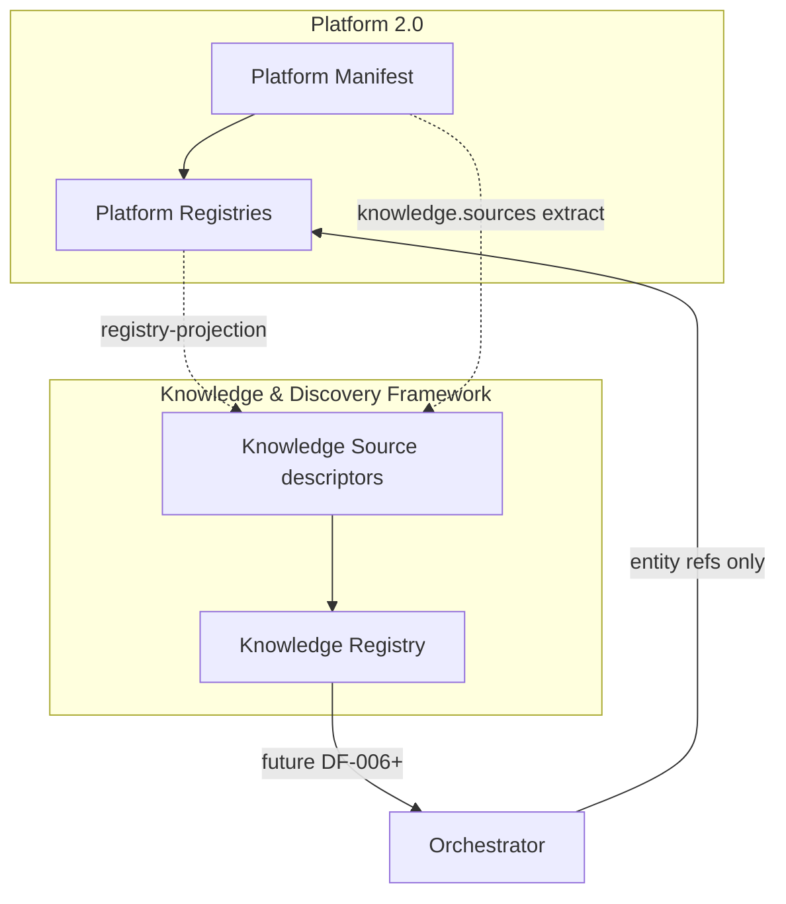

# Knowledge Registry Relationship Model

> **Story:** DF-004 — Manifest-driven Knowledge Source registration  
> **Status:** Canonical model  
> **Authority:** [ADR-0028](../adr/ADR-0028-knowledge-source-model.md) · [Registry Pattern](./APZHUB-Registry-Pattern.md) · [Knowledge Manifest spec](../specs/SPR-005-KDF-knowledge-manifest.md)

---

## Canonical chain

The Knowledge & Discovery Framework **references** platform truth. It does not duplicate Action, Navigation, Capability, or other manifest definitions.

```text
Platform Manifest
        │
        │  validate (Manifest Engine)
        ▼
Platform Registry
  (Action · Workbench · Capability · …)
        │
        │  project / reference (registry-projection)
        ▼
Knowledge Source
  (descriptor in Knowledge Registry)
        │
        │  register (bootstrap)
        ▼
Knowledge Registry
  (sources + providers — registration only)
```

---

## Layer responsibilities

| Layer                  | Owns                                                                 | Does not own                  |
| ---------------------- | -------------------------------------------------------------------- | ----------------------------- |
| **Platform Manifest**  | Actions, navigation, capabilities, services, events                  | Knowledge query results       |
| **Platform Registry**  | Authoritative runtime metadata for execution and navigation          | Search indexes, AI inference  |
| **Knowledge Source**   | Discovery descriptor: id, tier, kind, priority, permission, provides | Action handlers, route tables |
| **Knowledge Registry** | Registered sources and providers, validation, diagnostics            | Query execution, persistence  |

---

## Two registration paths

### 1. Built-in platform catalogue (T0)

At bootstrap, the framework registers **references** to existing platform registries:

```text
PLATFORM_KNOWLEDGE_SOURCE_CATALOGUE
  platform.actions      → Action Registry (future DF-007 provider)
  platform.navigation   → Workbench navigation (future DF-008 provider)
  platform.capabilities → Capability metadata
```

`origin: builtin` — no manifest duplication.

### 2. Manifest-declared sources

Capability manifests may extend with `knowledge.sources`:

```text
Capability manifest (module / component / service / …)
  knowledge:
    sources:
      - id: example.module.search
        …
        │
        ▼
extractKnowledgeSourcesFromCapabilities()
        │
        ▼
mapKnowledgeManifestToSource()  →  origin: manifest, capabilityId set
        │
        ▼
registerManySourcesAtomic()
```

The manifest declares **intent to participate** in discovery. It does not embed Action or Navigation definitions.

---

## Runtime as source of truth



- **Solid arrows:** registration and validation flow (DF-004).
- **Dotted arrows:** reference/projection — no data copy at registration time.
- **Orchestrator (dashed):** deferred to DF-006; routes selections through existing Action/Workbench execution paths ([ADR-0029](../adr/ADR-0029-knowledge-discovery-execution-routing.md)).

---

## Bootstrap sequence

```text
Manifest Discovery (capability records)
        ↓
Knowledge Source Extraction (validate + map)
        ↓
Knowledge Registry.registerManySourcesAtomic()
        ↓
Diagnostics (bootstrap + registry metadata)
```

No provider execution. No orchestration. No persistence.

---

## Duplicate and validation policy

Aligned with [Registry Pattern](./APZHUB-Registry-Pattern.md) fail-fast policy ([ADR-0013](../adr/ADR-0013-registry-fail-fast-policy.md)):

| Policy            | Application                                                           |
| ----------------- | --------------------------------------------------------------------- |
| Unique source ids | Globally unique across platform catalogue + manifest extraction       |
| Atomic batch      | Extraction or registration failure → no partial manifest registration |
| Validation first  | Invalid manifest entries block the entire manifest batch              |

---

## What Knowledge Sources are not

| Misconception                 | Reality                                                |
| ----------------------------- | ------------------------------------------------------ |
| A copy of the Action manifest | A reference descriptor with `provides: [command]`      |
| A new navigation system       | A projection hook for Workbench routes                 |
| A persistence layer           | In-memory registry only (DF-004)                       |
| An execution pipeline         | Registration only; execution stays in Action Framework |

---

## Story traceability

| Topic                         | Story               |
| ----------------------------- | ------------------- |
| Knowledge Source model        | DF-001              |
| Knowledge Registry            | DF-003              |
| Manifest `knowledge.sources`  | DF-004 (this model) |
| Server DTO filter             | DF-005              |
| Action / Navigation providers | DF-007, DF-008      |
| Query orchestration           | DF-006              |

---

_Knowledge Registry Relationship Model — canonical reference for SPR-005._
