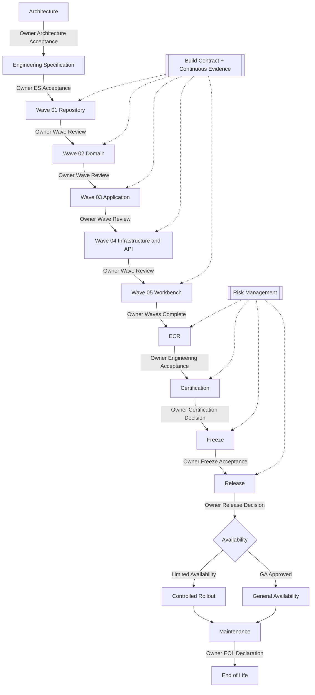

# Lifecycle Diagram

| Item           | Value                                                      |
| -------------- | ---------------------------------------------------------- |
| Document       | Full Engineering Lifecycle Diagram                         |
| Version        | **1.0.0**                                                  |
| Parent         | [../README.md](../README.md)                               |
| Normative text | [../ENGINEERING-LIFECYCLE.md](../ENGINEERING-LIFECYCLE.md) |

---

## Full lifecycle



---

## Gate summary

| Gate                          | Controls               |
| ----------------------------- | ---------------------- |
| Owner Architecture Acceptance | ARCH → ES              |
| Owner ES Acceptance           | ES → Wave 01           |
| Owner Wave Review             | Wave N → Wave N+1      |
| Owner Engineering Acceptance  | ECR → Certification    |
| Owner Certification Decision  | Certification → Freeze |
| Owner Freeze Acceptance       | Freeze → Release       |
| Owner Release / GA Decision   | Release → Limited / GA |
| Owner EOL Declaration         | Maintenance → EOL      |

Agents **SHALL NOT** auto-progress gates. See [../OWNER-GOVERNANCE.md](../OWNER-GOVERNANCE.md).

---

## STOP

```text
LIFECYCLE DIAGRAM
ARCH → ES → WAVES → ECR → CERT → FREEZE → RELEASE → GA/MAINT → EOL
```
