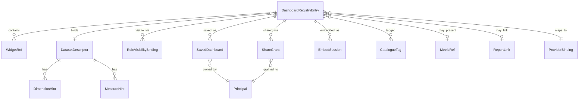
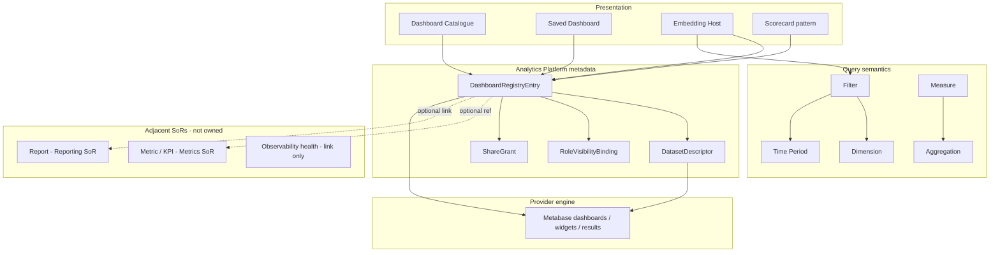

# Analytics Entity Relationships

> **Programme:** APZHUB-PLATFORM-ANALYTICS-002  
> **Classification:** DOCUMENTATION ONLY  
> **Date:** 2026-07-19

---

## 1. Core relationship diagram

---

## 2. Conceptual stack diagram

---

## 3. Relationship table

| From                   | To                          | Cardinality | Nature                        |
| ---------------------- | --------------------------- | ----------- | ----------------------------- |
| DashboardRegistryEntry | ProviderBinding             | 1 : 1       | Required opaque ref           |
| DashboardRegistryEntry | DatasetDescriptor           | N : M       | Logical bind                  |
| DashboardRegistryEntry | WidgetRef                   | 1 : 0..N    | Optional layout               |
| DashboardRegistryEntry | RoleVisibilityBinding       | 1 : 0..N    | Catalogue ACL                 |
| DashboardRegistryEntry | SavedDashboard              | 1 : 0..N    | Per principal/org             |
| DashboardRegistryEntry | ShareGrant                  | 1 : 0..N    | Intra-tenant                  |
| DashboardRegistryEntry | EmbedSession                | 1 : 0..N    | Ephemeral                     |
| DashboardRegistryEntry | CatalogueTag                | N : M       | Grouping                      |
| DatasetDescriptor      | DimensionHint / MeasureHint | 1 : 0..N    | Metadata hints                |
| Dashboard              | Filter / Time Period        | runtime     | Embed context                 |
| Measure                | Aggregation                 | runtime     | Provider query                |
| Dashboard              | Metric / KPI                | 0..N        | Soft reference to Metrics SoR |
| Dashboard              | Report                      | 0..N        | Soft link to Reporting SoR    |

---

## 4. Identity rules

| Rule | Statement                                                                                                                              |
| ---- | -------------------------------------------------------------------------------------------------------------------------------------- |
| R1   | Platform IDs are global and stable for registry/dataset/saved/share entities                                                           |
| R2   | Provider IDs never appear as primary user-facing identifiers                                                                           |
| R3   | Metric/Report foreign keys are optional soft refs — deletion of Metrics/Reporting entities must not corrupt registry (orphan → unlink) |
| R4   | EmbedSession IDs are not durable business keys                                                                                         |

---

## Related

- [ANALYTICS-DOMAIN-MODEL.md](./ANALYTICS-DOMAIN-MODEL.md)
- [ANALYTICS-INFORMATION-MODEL.md](./ANALYTICS-INFORMATION-MODEL.md)
