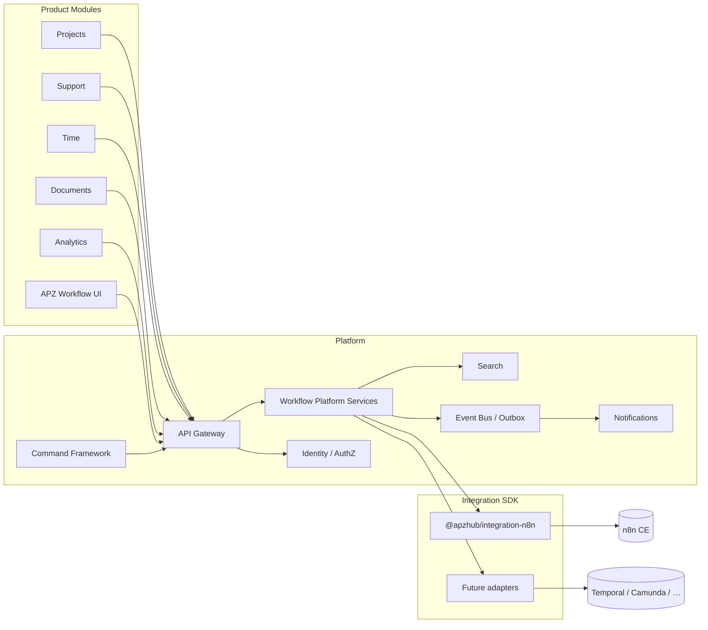

# Workflow Platform — Architecture

> **Programme:** APZHUB-PLATFORM-WORKFLOW-001  
> **Classification:** DOCUMENTATION ONLY  
> **ADRs:** ADR-0068 · ADR-0069  
> **Date:** 2026-07-19

---

## 1. Layered architecture

```text
Presentation (Workbench / Modules)
        ↓
Application HTTP (API Gateway / Route Handlers)
        ↓
Auth → Authz → Validation → Audit
        ↓
Workflow Platform Services (orchestration — no product rules)
        ↓
Integration SDK Adapter (n8n | future)
        ↓
Backend Engine (n8n CE | future)
```

Aligned with constitution layers (003) and Module → Platform Service → Connector → Engine (008).

---

## 2. Context diagram



---

## 3. Relationships

| Peer                                                  | Relationship                                                                                                           |
| ----------------------------------------------------- | ---------------------------------------------------------------------------------------------------------------------- |
| **Projects / Support / Time / Documents / Analytics** | Call own Platform Services; those services may invoke Workflow Platform to start/observe runs — never engines directly |
| **Identity**                                          | Subjects, roles, approval assignees; permissions `workflow.*`                                                          |
| **Notifications**                                     | Workflow Platform publishes events; Attention Engine / Notification Framework delivers                                 |
| **Search**                                            | Workflow registers Search Providers for catalogue metadata                                                             |
| **Command Framework**                                 | Commands execute via Platform Services path only                                                                       |
| **Workbench**                                         | Presentation shell; permission-driven navigation                                                                       |
| **Integration SDK**                                   | Hosts engine adapters; SDK **1.0.0** frozen                                                                            |
| **Platform Services**                                 | Home of Workflow* service implementations                                                                              |
| **Event Bus / Outbox**                                | Async transport — not a workflow engine                                                                                |
| **Metrics / Observe**                                 | Consume health signals; not orchestration                                                                              |

---

## 4. SoR vs Engine planes (current disk)

| Plane            | Path                                                      | Role                                       |
| ---------------- | --------------------------------------------------------- | ------------------------------------------ |
| Management SoR   | `/api/v1/workflows` · `/workspace/workflows`              | Catalogue, templates, versions, validation |
| Engine discovery | `/api/v1/workflows/engine` · `/workspace/workflow-engine` | Read-only n8n metadata                     |

Target architecture may unify commercial UX while preserving plane separation internally.

---

## 5. Data ownership (011)

| Datum                                                  | Owner                                                                                 |
| ------------------------------------------------------ | ------------------------------------------------------------------------------------- |
| Platform workflow IDs, permissions, catalogue metadata | APZHUB Workflow Platform (PostgreSQL metadata)                                        |
| Run history / schedule metadata (target)               | APZHUB (platform) — engine run IDs connector-internal                                 |
| Engine workflow definitions / credentials store        | Engine (via adapter refs) — never authoritative duplicate in platform SoR beyond refs |
| Product domain entities (tickets, projects, …)         | Respective product engines/services                                                   |

---

## 6. Architecture diagrams (index)

| Diagram   | Location                                         |
| --------- | ------------------------------------------------ |
| Context   | §2 above                                         |
| Lifecycle | [WORKFLOW-LIFECYCLE.md](./WORKFLOW-LIFECYCLE.md) |
| Execution | [EXECUTION-MODEL.md](./EXECUTION-MODEL.md)       |
| Security  | [SECURITY-MODEL.md](./SECURITY-MODEL.md)         |

---

## Related

- Historical SoR/Engine architecture docs under `docs/architecture/APZHUB-Workflow-*` and `APZHUB-N8n-*` (engineering baseline; freeze in force)
