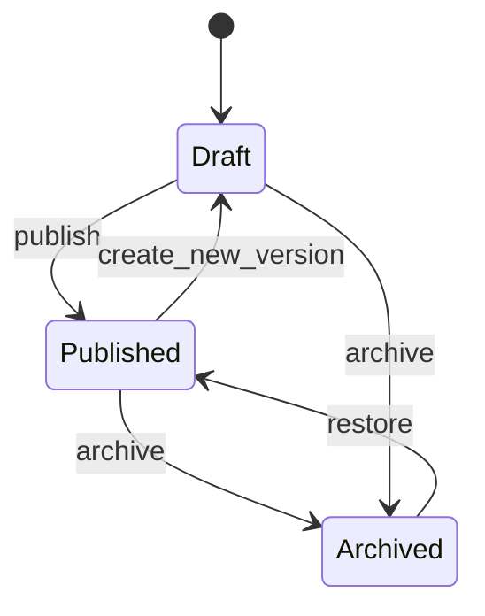
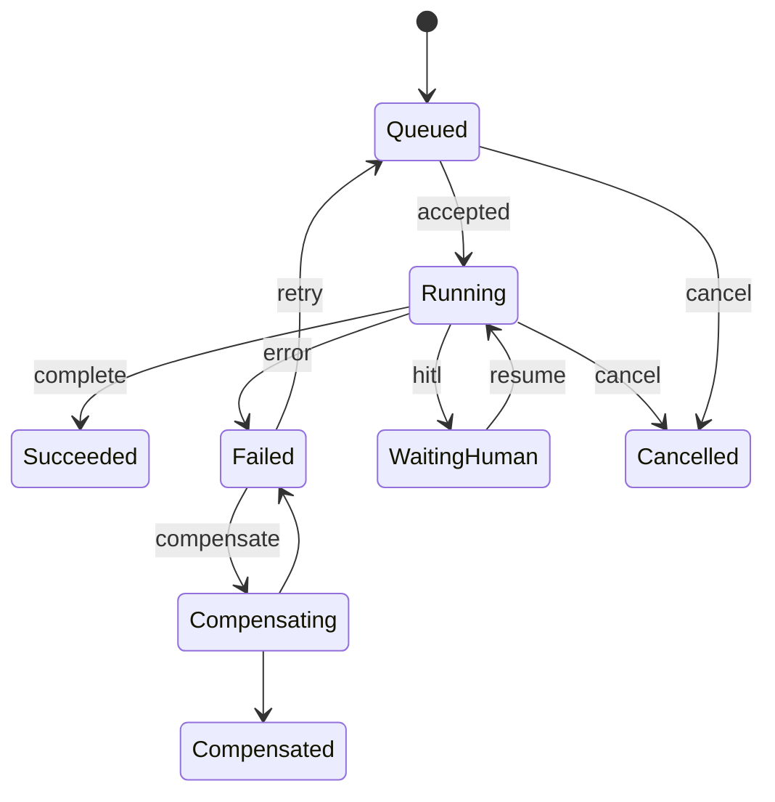
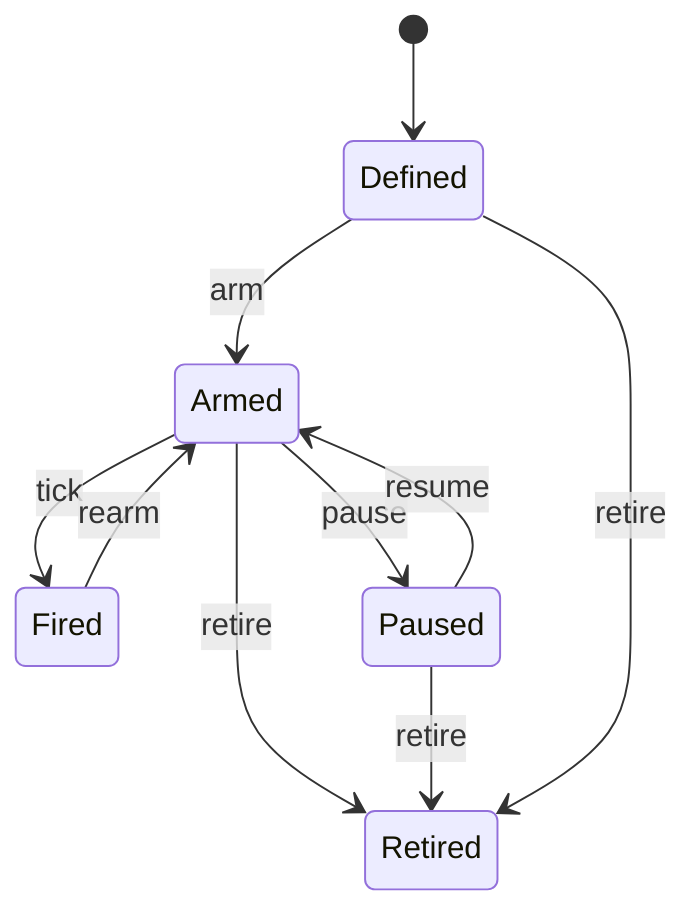
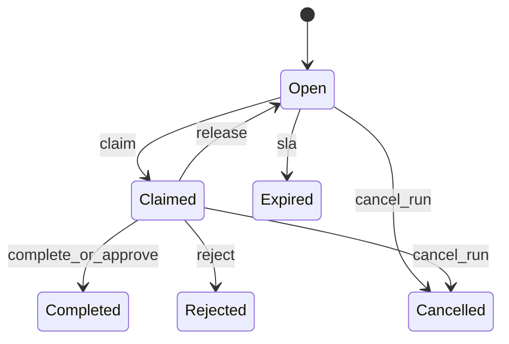
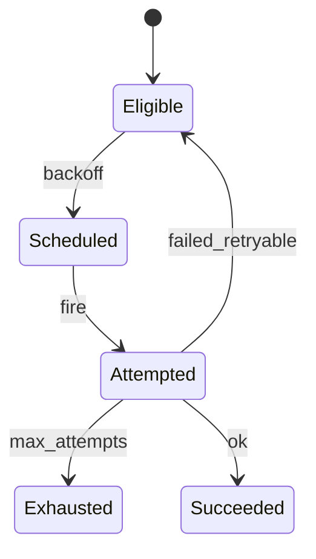
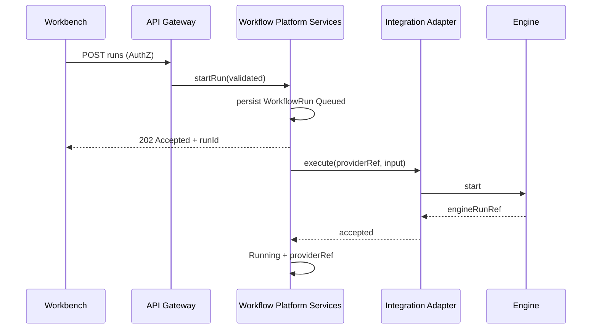

# Workflow Domain Model

> **Programme:** APZHUB-PLATFORM-WORKFLOW-002  
> **Classification:** DOCUMENTATION ONLY  
> **Date:** 2026-07-19  
> **Information model:** [WORKFLOW-INFORMATION-MODEL.md](./WORKFLOW-INFORMATION-MODEL.md)

---

## 1. Domain purpose

Enable governed definition, triggering, execution observation, human-in-the-loop, and operational control of workflows inside APZHUB — with platform-owned metadata/permissions and provider-owned engine mechanics.

---

## 2. Aggregate roots (target persistence)

| Aggregate           | Root                   | Children / value objects                                     |
| ------------------- | ---------------------- | ------------------------------------------------------------ |
| Workflow Catalogue  | `Workflow`             | versions, tags, folder refs, status                          |
| Workflow Version    | `WorkflowVersion`      | `WorkflowDefinition`, parameters, variable bindings          |
| Template            | `WorkflowTemplate`     | definition snapshot, parameters                              |
| Run                 | `WorkflowRun`          | steps, input/output, errors, retries, artifacts, providerRef |
| Instance (optional) | `WorkflowInstance`     | runs[]                                                       |
| Schedule            | `WorkflowSchedule`     | cron/calendar expr, timezone, trigger ref                    |
| Trigger             | `WorkflowTrigger`      | match rules, workflowVersion ref                             |
| Task                | `WorkflowTask`         | kind, assignees, form/approval payload, due                  |
| Credential Binding  | `WorkflowCredential`   | `WorkflowSecretReference`, scopes                            |
| Compensation        | `WorkflowCompensation` | plan steps, status                                           |

---

## 3. Lifecycles & state transitions

### 3.1 Workflow (definition)



### 3.2 WorkflowRun (execution)



### 3.3 WorkflowSchedule



### 3.4 ApprovalTask / ManualTask



### 3.5 WorkflowRetry



---

## 4. Trigger model

| Trigger kind | Starts Run when                                           |
| ------------ | --------------------------------------------------------- |
| `manual`     | Authenticated principal invokes start                     |
| `api`        | Product Platform Service invokes start (service identity) |
| `event`      | Normalised `WorkflowEvent` matches trigger rules          |
| `schedule`   | `WorkflowSchedule` fires                                  |

Triggers never bypass AuthZ. Product services supply correlation refs (projectId, ticketId, …) as WorkflowInput metadata.

---

## 5. Event model

```text
Product/Platform domain event
  → Event Bus envelope (correlation/causation)
  → Workflow Platform normalises to WorkflowEvent
  → Trigger matcher
  → WorkflowRun (Queued)
```

Modules do not subscribe to engines. Workflow Platform publishes run/task events for Notification Framework consumption.

---

## 6. Provider boundaries

| Concern                       | Platform         | Provider (via adapter)      |
| ----------------------------- | ---------------- | --------------------------- |
| Catalogue IDs, AuthZ, audit   | Yes              | No                          |
| Definition storage (metadata) | Yes              | May sync engine copy        |
| Step execution                | Policy + observe | Executes                    |
| Secret values                 | Refs only        | Engine vault / secret store |
| Branding                      | Masked           | Hidden from standard UI     |

---

## 7. Ownership

| Object                               | Created by                | Owned by                             |
| ------------------------------------ | ------------------------- | ------------------------------------ |
| Workflow / Version / Template        | Workflow admin            | Platform (org/tenant scope)          |
| WorkflowRun                          | Trigger / API / schedule  | Platform                             |
| WorkflowTask                         | Runtime when HITL entered | Platform · assigned principal        |
| WorkflowSchedule / Trigger           | Workflow admin            | Platform                             |
| WorkflowCredential + SecretReference | Admin                     | Platform metadata · secret store     |
| Engine workflow/run                  | Adapter sync/execute      | Engine — mapped, not user-facing SoR |

---

## 8. Sequence — start run (target)



---

## Related

- [WORKFLOW-ENTITY-RELATIONSHIPS.md](./WORKFLOW-ENTITY-RELATIONSHIPS.md)
- [EXECUTION-MODEL.md](./EXECUTION-MODEL.md)
- [WORKFLOW-LIFECYCLE.md](./WORKFLOW-LIFECYCLE.md)
