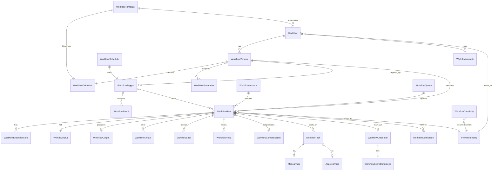
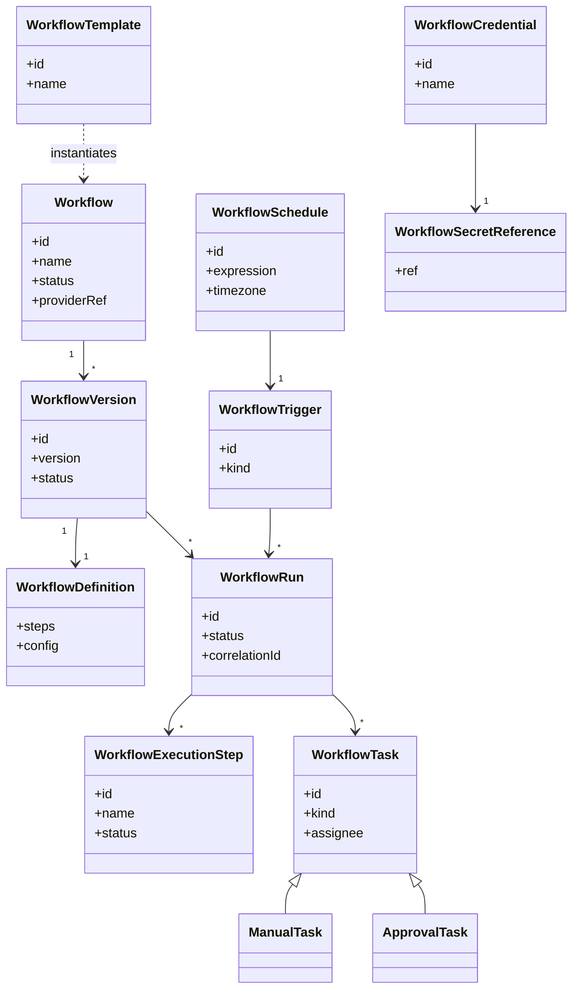
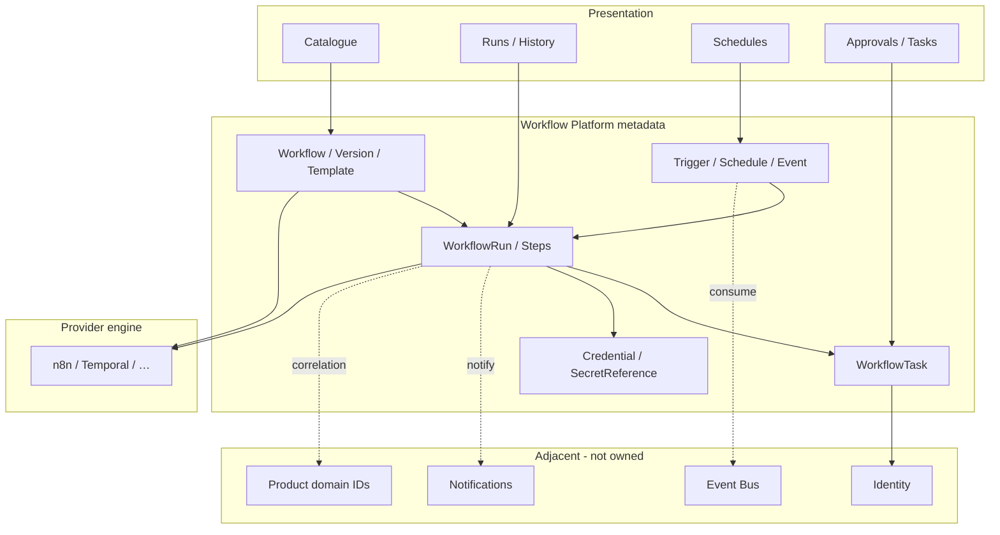

# Workflow Entity Relationships

> **Programme:** APZHUB-PLATFORM-WORKFLOW-002  
> **Classification:** DOCUMENTATION ONLY  
> **Date:** 2026-07-19

---

## 1. Entity relationship diagram

---

## 2. Class diagram (definition + runtime)

---

## 3. Conceptual stack

---

## 4. Cardinality notes

| Relationship                                 | Cardinality                 |
| -------------------------------------------- | --------------------------- |
| Workflow → WorkflowVersion                   | 1:N                         |
| WorkflowVersion → WorkflowRun                | 1:N                         |
| WorkflowInstance → WorkflowRun               | 0..1:N (optional aggregate) |
| WorkflowRun → WorkflowExecutionStep          | 1:N                         |
| WorkflowRun → WorkflowTask                   | 1:N (0 while not waiting)   |
| WorkflowSchedule → WorkflowTrigger           | 1:1                         |
| WorkflowTrigger → WorkflowRun                | 1:N over time               |
| WorkflowCredential → WorkflowSecretReference | 1:1                         |

---

## Related

- [WORKFLOW-DOMAIN-MODEL.md](./WORKFLOW-DOMAIN-MODEL.md)
- [WORKFLOW-INFORMATION-MODEL.md](./WORKFLOW-INFORMATION-MODEL.md)
