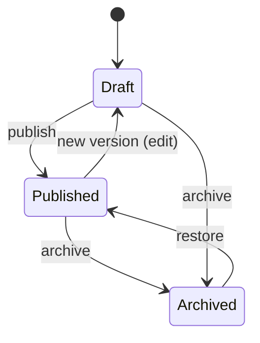
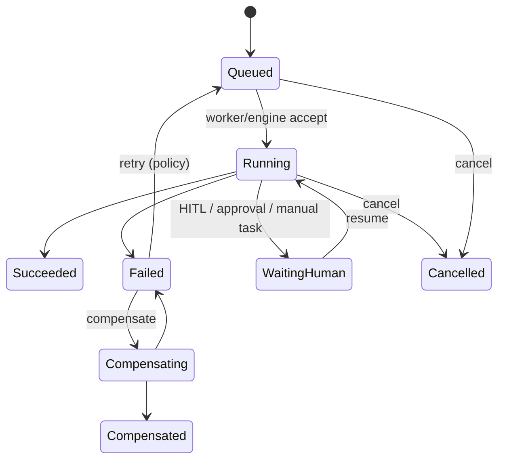

# Workflow Platform — Lifecycle Model

> **Programme:** APZHUB-PLATFORM-WORKFLOW-001  
> **Classification:** DOCUMENTATION ONLY  
> **Date:** 2026-07-19

---

## 1. Definition lifecycle (SoR — baseline)

Platform owns version history, validation gates, and audit of transitions. Engine definition sync (target) occurs only via adapter after AuthZ.

---

## 2. Run lifecycle (target)

---

## 3. Schedule lifecycle (target)

| State   | Meaning                             |
| ------- | ----------------------------------- |
| Defined | Schedule metadata stored (platform) |
| Armed   | Eligible to fire                    |
| Fired   | Trigger created run                 |
| Paused  | Temporarily disabled                |
| Retired | No longer fires                     |

---

## 4. Template lifecycle (baseline)

Templates are first-class SoR entities: create → update → deprecate. Instantiation creates a workflow definition in Draft (or policy-defined) state.

---

## 5. Honesty

Run/schedule lifecycles are **target architecture**. On disk today, certified wave excludes execution and scheduling. Do not implement from this document.
