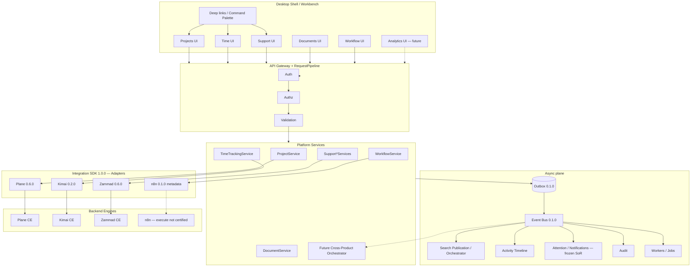
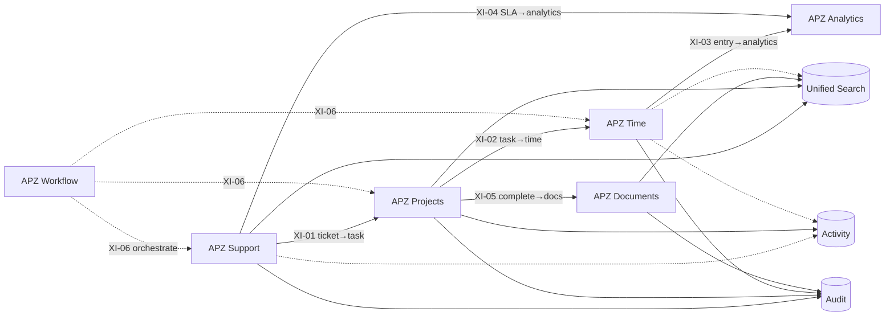
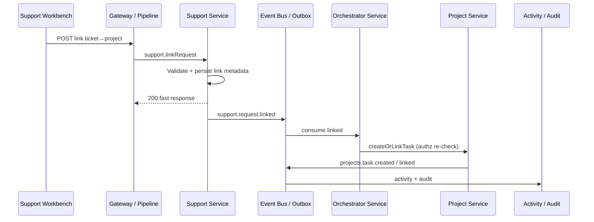

# APZHUB Portfolio Interaction Diagram

> **Programme:** APZHUB-PORTFOLIO-001  
> **Classification:** DOCUMENTATION ONLY  
> **Date:** 2026-07-19  
> **Status:** Complete — **Awaiting Owner Acceptance**  
> **Companion:** [PORTFOLIO-INTEGRATION-STRATEGY](./PORTFOLIO-INTEGRATION-STRATEGY.md)

---

## 1. Platform collaboration (target architecture)

**Legend:** solid = certified / operational path · dashed = future or limited.

---

## 2. Cross-product interaction map (logical)

---

## 3. Event-mediated sequence (example: Support → Projects)

> **Today:** Support Event Bus publish is a **KNOWN-LIMITATION** — sequence is **target design**, not production behaviour.

---

## 4. Boundary checklist (diagram reading guide)

| Allowed                               | Not allowed                           |
| ------------------------------------- | ------------------------------------- |
| UI → `/api/v1` only                   | UI → adapter / engine                 |
| Service → Event Bus                   | Module → Module API                   |
| Orchestrator Platform Service         | n8n calling product UIs               |
| Search / Activity / Audit subscribers | Product-local notification subsystems |
| Deep links between workspaces         | Engine deep links in UI               |

---

## 5. Related

- [PORTFOLIO-INTEGRATION-STRATEGY.md](./PORTFOLIO-INTEGRATION-STRATEGY.md)
- [PLATFORM-EVENT-CATALOGUE.md](./PLATFORM-EVENT-CATALOGUE.md)
- [AUTOMATION-ROADMAP.md](./AUTOMATION-ROADMAP.md)
- [APZHUB-Cross-Product-Search-Integration-Architecture.md](../architecture/APZHUB-Cross-Product-Search-Integration-Architecture.md)
