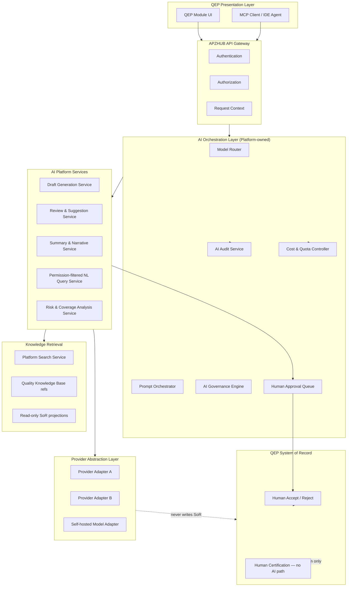
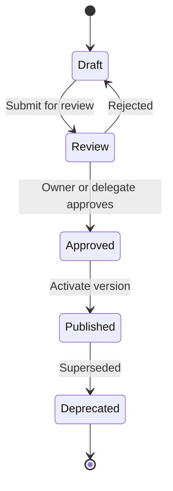
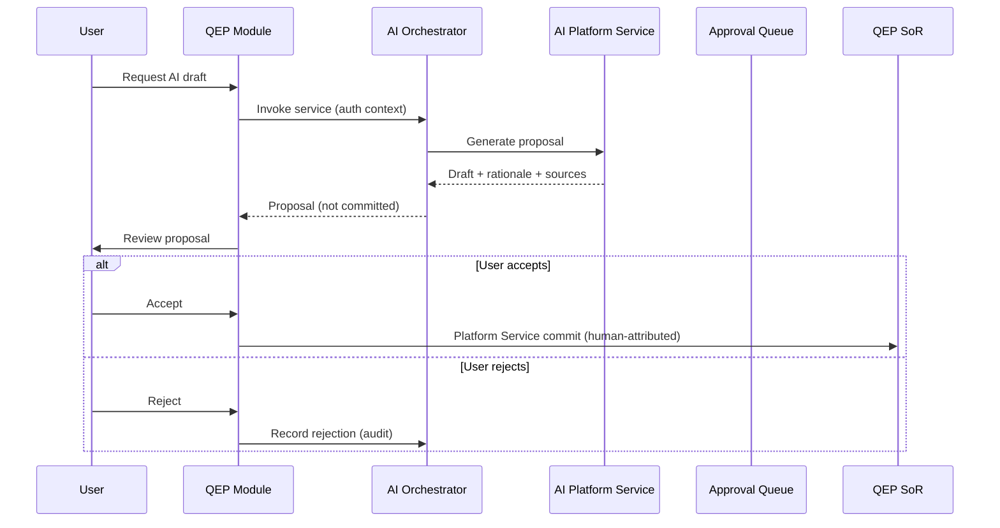

# APZ QEP — AI Architecture

> **Programme:** APZQEP-ARCH-001  
> **Document:** AI-ARCHITECTURE  
> **Status:** Architecture intent — no implementation  
> **Authority:** [AI Constitution](../constitution/AI-CONSTITUTION.md) · Platform 012/024/026/029  
> **Default posture:** AI features **OFF** until Owner-authorised enablement

## Purpose

This document defines the architectural intent for AI capabilities within APZ QEP. AI assists quality engineering workflows — drafting, analysing, summarising, and suggesting — while QEP remains the sole System of Record and humans retain accountability for certification and material state changes.

## Architectural principles

| Principle                           | Architectural intent                                                                                 |
| ----------------------------------- | ---------------------------------------------------------------------------------------------------- |
| AI default OFF                      | Runtime AI disabled until named Owner programme enables feature flags per tenant/org                 |
| AI never SoR                        | Model outputs are provisional artefacts until explicitly accepted into QEP SoR via Platform Services |
| AI never certifies                  | Certification decisions are human-only; AI may summarise readiness, never decide                     |
| Provider abstraction                | Inference backends interchangeable without QEP SoR redesign                                          |
| Permission-filtered knowledge       | Retrieval respects user permissions and tenant boundaries                                            |
| Platform Services only              | AI orchestration calls Platform Services — never connectors or engines directly                      |
| Auditable by design                 | Prompts, models, inputs, outputs, and accept/reject decisions traceable                              |
| Explainability for material outputs | Recommendations affecting verification or readiness include rationale and source refs                |
| Cost governance                     | Routing, quotas, and budgets enforced at orchestration layer                                         |
| Human approval gates                | Mutations and certification-adjacent actions require explicit human confirm                          |

## High-level AI architecture

## Layer responsibilities

| Layer                | Responsibility                                                       | Forbidden                                               |
| -------------------- | -------------------------------------------------------------------- | ------------------------------------------------------- |
| Presentation         | Invoke AI features via Platform APIs; display drafts and approval UX | Direct provider SDK calls; silent SoR commits           |
| Gateway              | Authn, authz, correlation ID, rate limits                            | Business logic or model routing                         |
| AI Orchestration     | Routing, prompt assembly, governance checks, cost control            | Direct connector/engine access                          |
| AI Platform Services | Domain-specific AI workflows for QEP                                 | Persist authoritative business state without human gate |
| Provider Abstraction | Translate requests/responses; health; error translation              | Vendor-specific logic leaking to modules                |
| Knowledge Retrieval  | Permission-filtered context assembly                                 | Cross-tenant retrieval; unrestricted DB                 |
| SoR                  | Authoritative QEP state                                              | AI-autonomous writes                                    |

## Provider abstraction

The provider abstraction layer isolates inference backends from QEP business logic. Adapters conform to a platform integration contract (Integration SDK pattern) and expose capability metadata for routing decisions.

| Concern              | Architectural approach                                                     |
| -------------------- | -------------------------------------------------------------------------- |
| Interchangeability   | Swap or add providers without module changes                               |
| Capability discovery | Adapters declare supported modalities, context limits, streaming           |
| Failover             | Orchestrator may reroute on health/circuit-breaker signals                 |
| Self-hosted first    | Local model adapters preferred where policy requires air-gap               |
| Commercial APIs      | Optional; require Owner approval and DPA posture for personal data         |
| Secret management    | Provider credentials platform-managed; never in modules or prompts in logs |
| Version pinning      | Model versions recorded in audit for reproducibility                       |

### Provider routing matrix (conceptual)

| Routing factor      | Intent                                           |
| ------------------- | ------------------------------------------------ |
| Tenant policy       | Block external APIs in air-gapped profiles       |
| Data classification | Route sensitive prompts to approved local models |
| Task type           | Draft generation vs summarisation vs embedding   |
| Cost tier           | Budget-aware model selection                     |
| Latency SLA         | Fast models for interactive; larger for batch    |
| Availability        | Health-checked failover between adapters         |

## Prompt orchestration

Prompt orchestration assembles governed, versioned prompt templates with runtime context. Templates are owned assets under change control — not ad hoc strings in modules.

| Component               | Role                                                                   |
| ----------------------- | ---------------------------------------------------------------------- |
| Prompt Registry         | Versioned templates with owners and approval workflow                  |
| Context Assembler       | Injects permission-filtered retrieval results                          |
| Guardrail Injector      | Applies constitution rules and tenant policy overlays                  |
| Output Schema Validator | Ensures structured outputs where required                              |
| Redaction Layer         | Strips or masks PII before external provider calls when policy demands |

### Prompt lifecycle

Modules reference prompt **capability identifiers** — not raw prompt text. Orchestration resolves the active approved version at runtime.

## AI Platform Services (QEP)

AI capabilities surface as Platform Services — modules call interfaces, never providers.

| Service (conceptual)             | Purpose                                               | Human gate                   |
| -------------------------------- | ----------------------------------------------------- | ---------------------------- |
| Draft Generation Service         | Propose verification procedures, analyses, risk notes | Accept before SoR write      |
| Review & Suggestion Service      | Review existing artefacts; suggest improvements       | Accept/reject per suggestion |
| Summary & Narrative Service      | Release-readiness narratives (non-authoritative)      | Display only; no cert impact |
| NL Query Service                 | Natural language over permission-filtered data        | Read-only; audit queries     |
| Risk & Coverage Analysis Service | Coverage gaps, regression hints                       | Recommendations only         |
| Agent Orchestration Service      | Multi-step assist workflows                           | Checkpoint human approvals   |

Each service validates permissions, publishes audit events, and returns standard response envelopes per Platform 010.

## Governance and approvals

| Governance domain      | Mechanism                                          |
| ---------------------- | -------------------------------------------------- |
| Feature enablement     | Org/tenant feature flags — default OFF             |
| Prompt changes         | Versioned registry with approval                   |
| Provider allow-list    | Tenant admin selects permitted adapters            |
| Data egress policy     | Block or redact before external inference          |
| Human approval queue   | Pending AI proposals awaiting explicit user action |
| Certification boundary | No AI service endpoint for certify/approve cert    |
| Superadmin             | Audited; not an AI bypass                          |

### Approval flow for mutating proposals

## Knowledge retrieval

AI context is assembled from permission-filtered sources only.

| Source class             | Usage                                                   | SoR status                   |
| ------------------------ | ------------------------------------------------------- | ---------------------------- |
| QEP SoR read projections | Requirements, verifications, defects, evidence metadata | Authoritative when accepted  |
| Quality Knowledge Base   | Playbooks, standards, reusable patterns                 | Authoritative for KB content |
| Platform Search index    | Unified discovery across registered providers           | Derived — not SoR            |
| External connectors      | ALM/CI context via Platform Services                    | Engine-owned; translated     |
| User session context     | Current workspace, filters                              | Ephemeral                    |

Retrieval pipeline enforces tenant isolation, row-level permissions, and audit logging for sensitive queries. AI must never receive unrestricted database connections or bulk exports outside policy.

## Model routing

The model router selects an adapter based on policy, task, cost, and health. Routing decisions are logged with correlation IDs for cost attribution and incident analysis.

| Route class                 | Typical use                                 |
| --------------------------- | ------------------------------------------- |
| Local / self-hosted         | Air-gapped, sensitive data, policy-mandated |
| Tenant-preferred commercial | Customer-approved external API              |
| Platform default            | When tenant has no override                 |
| Degraded / none             | AI disabled — graceful UX messaging         |

## Audit and traceability

| Audit event (conceptual) | Captured data                                     |
| ------------------------ | ------------------------------------------------- |
| AI invocation            | User, tenant, service, correlation ID, timestamp  |
| Prompt version           | Template ID and version hash                      |
| Model used               | Provider, model ID, adapter version               |
| Input scope              | Resource types queried — not full payload in logs |
| Output disposition       | Accepted, rejected, expired, superseded           |
| Cost record              | Tokens/units, routed adapter, budget bucket       |

Audit integrates with Platform Audit Service. Certification-adjacent AI interactions retain extended retention per compliance policy.

## Cost controls

| Control             | Intent                                               |
| ------------------- | ---------------------------------------------------- |
| Per-tenant budgets  | Hard or soft limits with admin alerts                |
| Per-user quotas     | Prevent runaway IDE agent usage                      |
| Task prioritisation | Batch jobs deferred under pressure                   |
| Model tier caps     | Restrict expensive models without entitlement        |
| Usage dashboards    | Role-specific visibility in Administration workspace |
| Chargeback tags     | Optional cost centre attribution                     |

## Human approval — certification boundary

Continuous signals, AI readiness narratives, and automated verification results **never** independently change formal certification state. Architecture enforces:

- No AI service with certify authority
- Certification Platform Service accepts human-attributed decisions only
- MCP tools classified as certify are **not exposed** to autonomous agents
- Readiness AI outputs link to human review tasks, not cert records

## Relationship to MCP and Search

| Integration     | Relationship                                                                                    |
| --------------- | ----------------------------------------------------------------------------------------------- |
| MCP             | IDE agents invoke QEP via governed MCP tools; AI orchestration may serve MCP-initiated requests |
| Platform Search | Primary retrieval index for NL query and context assembly                                       |
| Events          | AI accept/reject publishes platform events for activity and audit                               |

## Deployment mode considerations

| Mode          | AI architectural constraint                         |
| ------------- | --------------------------------------------------- |
| Self-hosted   | Local model adapters; no mandatory external API     |
| Private cloud | Tenant-controlled provider allow-list               |
| Managed cloud | Provider options per contract                       |
| Air-gapped    | External commercial APIs unavailable by policy      |
| Hybrid        | Policy may split inference location vs SoR location |

## Non-goals (this document)

- Provider SDK integration code
- Prompt template content
- API route definitions
- Database schemas for audit or prompt registry
- Model fine-tuning pipelines on customer data without explicit policy

## Acceptance criteria (architecture)

| Criterion          | Verification intent                                 |
| ------------------ | --------------------------------------------------- |
| AI default OFF     | Feature flags documented; no silent enablement      |
| SoR boundary       | No AI write path without human accept service       |
| Cert boundary      | Cert flow has zero AI decision nodes                |
| Provider swap      | Adapter layer documented; modules provider-agnostic |
| Audit completeness | All mutating proposal paths emit audit events       |
| Permission filter  | Retrieval architecture excludes unrestricted DB     |
