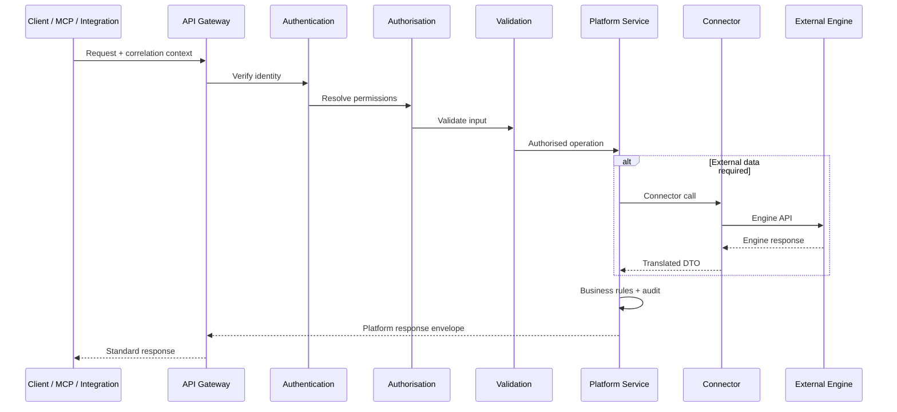
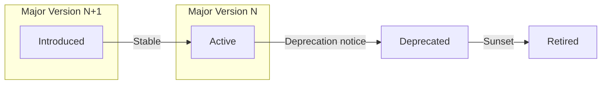

# APZ QEP — API Architecture

> **Programme:** APZQEP-ARCH-001  
> **Status:** Architecture baseline — conceptual design only  
> **Authority:** [Product Constitution](../constitution/PRODUCT-CONSTITUTION.md) · Platform 1.4 (010, 013, 024) · [Security Requirements](../requirements/SECURITY-REQUIREMENTS.md)  
> **Scope:** API principles, categories, governance, and security — **no** endpoint specifications, path lists, OpenAPI documents, or protobuf definitions

---

## 1. Purpose

This document defines the API architecture for APZ QEP as a native APZHUB product. APIs are the primary contract through which modules, integrations, MCP tools, and authorised external consumers interact with quality capabilities. Every API adheres to the platform request path and response envelope standards.

The product answers quality governance questions through **governed, versioned, permission-filtered APIs** — not through direct engine access or undocumented internal calls.

---

## 2. Core API principles

| # | Principle | Architectural meaning |
| - | --------- | --------------------- |
| 1 | **One client API** | All desktop, MCP, and external client traffic passes through APZHUB API Gateway |
| 2 | **Platform Service authority** | Business logic, validation, permissions, and audit live in Platform Services — not in gateway or modules |
| 3 | **Interface-first** | Modules depend on service interfaces; services depend on connector interfaces |
| 4 | **Deny by default** | Unauthenticated and unauthorised requests fail before business logic |
| 5 | **Standard envelope** | Requests carry common context; responses use typed platform envelope with correlation IDs |
| 6 | **No backend leakage** | Error categories are platform-typed; engine details never reach clients |
| 7 | **Versioned evolution** | Breaking changes require governance; additive changes preferred |
| 8 | **Audit by default** | Mutating operations on SoR domains produce audit records |
| 9 | **Async where heavy** | Long-running work returns acceptance + job reference; completion via events |
| 10 | **Self-documented intent** | API categories and ownership documented; formal specs produced in Engineering programmes |

---

## 3. Request path architecture

Every arrow represents a **mandatory** layer — skipping Auth, Authz, or Validation is an architectural defect.

---

## 4. API classification

### 4.1 By consumer type

| Class | Consumers | Exposure | Auth model |
| ----- | --------- | -------- | ---------- |
| **Module APIs** | QEP module UI within APZHUB shell | Internal (Gateway) | User session via BetterAuth |
| **Platform APIs** | Other APZHUB products, shared services | Internal (Gateway) | Service identity or user session |
| **Integration APIs** | Registered API clients, partner systems | External (Gateway, scoped) | OAuth/client credentials + tenant scope |
| **MCP-backed APIs** | IDE agents via MCP Server | External (Gateway via MCP) | User session inheritance |
| **Webhook receivers** | External push sources (CI, ALM) | External (Gateway, verified) | Signature + tenant binding |
| **Admin APIs** | Tenant/platform administrators | Internal (Gateway, elevated) | Admin permissions + audit |
| **Worker APIs** | Background jobs and batch processors | Internal only | Dedicated worker identity |

### 4.2 By operational category

| Category | Domain examples | Mutability | Certification sensitivity |
| -------- | --------------- | ---------- | ------------------------- |
| **Requirements** | Quality requirements, baselines, approval | Read/write | Medium — affects traceability |
| **Verification** | Plans, procedures, sessions, runs | Read/write | High — execution evidence source |
| **Evidence** | Items, packs, reviews, exports | Read/write | Critical — locks on certification |
| **Defects** | Quality defects, linkage, disposition | Read/write | High |
| **Traceability** | Links across requirements, verification, releases | Read/write | High |
| **Risk** | Assessments, acceptances, waivers | Read/write | High — gates certification |
| **Readiness** | Aggregated go/no-go signals | Read/compute | High — feeds certification |
| **Certification** | Requests, decisions, statements | Read/write (human-gated) | **Critical** — immutable on approve |
| **Quality intelligence** | Metrics, trends, dashboards | Read/compute | Low — derived, non-authoritative |
| **Integration** | Connector config, sync status, health | Read/write (admin) | Medium |
| **Administration** | Entitlements, policies, templates | Read/write (admin) | High |
| **Compliance / audit** | Audit queries, exports, retention | Read (export write audited) | Critical |
| **AI assistance** | Draft, analyse, recommend | Read/write (gated) | Medium — never certifies |

---

## 5. Internal vs external APIs

| Dimension | Internal APIs | External APIs |
| --------- | ------------- | ------------- |
| **Definition** | Consumed by APZHUB modules and platform products | Consumed by customer systems, partners, IDE agents |
| **Discovery** | Platform service registry | Integration Centre + developer documentation programme |
| **Authentication** | Platform session (BetterAuth) | OAuth, API keys, MCP session binding |
| **Authorisation** | PermissionService — full user permission model | Scoped client permissions — subset of user/org grants |
| **Rate limiting** | Standard platform limits | Stricter per-client quotas |
| **Versioning** | Co-deployed with platform | Explicit version headers / path strategy (ADR) |
| **Breaking changes** | Coordinated platform release | Deprecation policy + migration window |
| **Audit** | Full user attribution | Client ID + acting user where applicable |
| **Error detail** | Slightly richer for debugging (still no engine raw) | Minimal — security-hardened |

**Rule:** External APIs are a **strict subset** of capabilities exposed through the same Platform Services as internal APIs — never a parallel implementation path.

---

## 6. API versioning governance

| Aspect | Policy |
| ------ | ------ |
| **Version identifier** | Major version in URL or header — exact mechanism deferred to ADR |
| **Additive changes** | New optional fields, new resources — minor/patch within major |
| **Breaking changes** | Removed fields, semantic changes, permission model changes — new major + Owner approval |
| **Deprecation** | Minimum notice period documented in release policy; sunset dates published |
| **Parallel versions** | Supported overlap window for external integrators during migration |
| **Internal consumers** | Migrated coherently with platform releases |
| **Manifest alignment** | Service manifests declare API version compatibility |
| **Certification APIs** | Highest stability tier — breaking changes require exceptional governance |

---

## 7. Security architecture for APIs

| Control | Application |
| ------- | ----------- |
| **Zero Trust** | Every request verified — no trusted network assumptions |
| **Authentication** | BetterAuth for users; service/worker identities for automation |
| **Authorisation** | PermissionService server-authoritative — see [AUTHORISATION-ARCHITECTURE.md](./AUTHORISATION-ARCHITECTURE.md) |
| **Input validation** | Schema validation at Gateway/Service boundary — reject malformed input early |
| **CSRF / XSS** | Platform-central controls — modules do not implement independently |
| **Rate limiting** | Per-user, per-client, per-tenant limits at Gateway |
| **Circuit breakers** | Connector failures isolated — APIs degrade gracefully |
| **Correlation IDs** | Mandatory on all requests — end-to-end tracing |
| **TLS** | Mandatory in transit — no exceptions |
| **Secrets** | Never in API payloads logged; connector credentials platform-managed |
| **AI/MCP** | Tools inherit user permissions; mutating operations audited |
| **Certification gate** | Certification decision APIs require human authority — no service bypass |

---

## 8. Response and error architecture

| Element | Standard |
| ------- | -------- |
| **Success envelope** | Platform-standard structure with data, metadata, correlation ID |
| **Error envelope** | Typed error category, user-safe message, correlation ID, optional field-level validation detail |
| **Forbidden content in errors** | Stack traces, engine URLs, connector credentials, internal IDs of external systems |
| **Pagination** | Cursor or offset strategy — consistent within API category |
| **Filtering / sorting** | Declared query capabilities per resource category |
| **Idempotency** | Mutating APIs support idempotency keys where retry safety required |
| **Optimistic concurrency** | Version/ETag patterns for SoR mutations — prevents silent overwrite |

---

## 9. API ownership model

| Owner | Responsibility |
| ----- | -------------- |
| **Platform Gateway team** | TLS, routing, rate limits, common middleware, correlation |
| **QEP Platform Service teams** | Business rules, validation, permissions, audit, event publication |
| **Connector teams** | Engine translation, health, error mapping |
| **Product architecture** | Category definitions, cross-service consistency, certification sensitivity |
| **Security architecture** | Threat model, authz catalogue alignment, external exposure review |
| **Integration Centre (product)** | External client registration, scope management |

No module team owns a public API surface independently — all APIs are Platform Service contracts.

---

## 10. Async API patterns

Per Platform 012, APIs that trigger long-running work follow **respond fast, process async**:

| Pattern | API behaviour | Completion signal |
| ------- | ------------- | ------------------- |
| **Accepted + job ID** | Return 202-style acceptance with job reference | Event + optional polling |
| **Bulk import** | Validate header → enqueue → progress events | Job status API category |
| **Sync operation** | Enqueue sync → return sync job reference | Integration health + events |
| **Report generation** | Request → job → download link when ready | Notification optional |
| **Certification** | Synchronous decision recording; async notification/audit enrichment | Events to activity/search |

Clients **never** block on connector or engine latency beyond platform timeout thresholds.

---

## 11. API governance process

| Stage | Gate |
| ----- | ---- |
| **Intent** | Product Definition or Architecture ADR identifies API category need |
| **Design** | Service interface definition; permission catalogue entry |
| **Security review** | Threat assessment for external exposure; authz mapping |
| **Manifest** | `service.yaml` declares API surface intent |
| **Implementation** | Engineering programme with contract tests |
| **Documentation** | Developer docs programme — not in this architecture pack |
| **Deprecation** | Owner-approved sunset with integrator notification |

---

## 12. Relationship to other integration patterns

| Pattern | API relationship |
| ------- | ---------------- |
| **Events** | APIs mutate SoR; services publish events for async consumers |
| **Webhooks** | Inbound webhooks invoke same Platform Services as REST |
| **MCP** | Each tool delegates to equivalent Platform Service API operation |
| **Batch** | Worker identities call internal service interfaces — same business rules |
| **Export** | Export APIs permission-gated; export action audited |

---

## 13. Anti-patterns (forbidden)

| Anti-pattern | Impact |
| ------------ | ------ |
| Module-specific undocumented APIs | Fragmentation; authz gaps |
| Gateway business logic | Violates 010 — gateway routes only |
| Raw engine API exposure | Brand leakage; security; no audit |
| Frontend-only permission checks | Security Constitution violation |
| Certification via automation API | Constitutional violation |
| Versionless breaking changes | Integrator breakage; audit confusion |
| Undocumented admin backdoors | Zero Trust violation |

---

## 14. Cross-document references

| Topic | Document |
| ----- | -------- |
| Integration patterns | [INTEGRATION-ARCHITECTURE.md](./INTEGRATION-ARCHITECTURE.md) |
| Event-driven completion | [EVENT-ARCHITECTURE.md](./EVENT-ARCHITECTURE.md) |
| Security controls | [SECURITY-ARCHITECTURE.md](./SECURITY-ARCHITECTURE.md) |
| Identity model | [IDENTITY-ARCHITECTURE.md](./IDENTITY-ARCHITECTURE.md) |
| Permission model | [AUTHORISATION-ARCHITECTURE.md](./AUTHORISATION-ARCHITECTURE.md) |
| Platform API standards | Platform doc 010 |

---

## Document control

| Field | Value |
| ----- | ----- |
| Programme | APZQEP-ARCH-001 |
| Version | 1.0.0-arch |
| Classification | API architecture — conceptual |
| Prohibited content | Endpoint paths, OpenAPI specs, protobuf, schemas, code |
| Next review | After Owner Architecture Acceptance |
