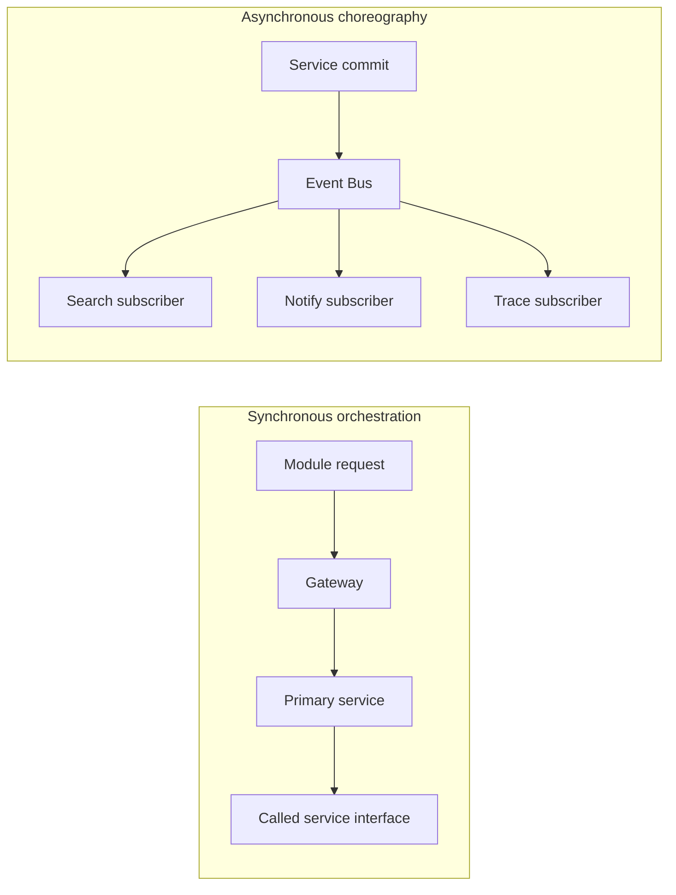
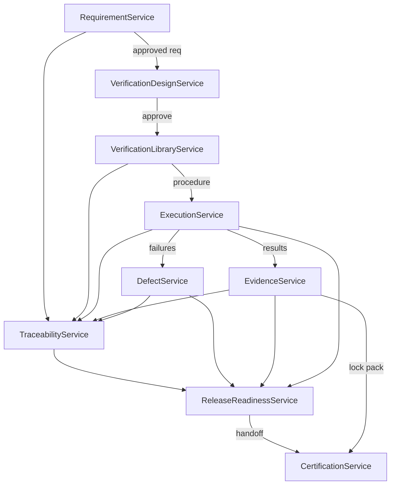

# APZQEP-ARCH-001 — Application Architecture

> **Programme:** APZQEP-ARCH-001  
> **Classification:** ENTERPRISE ARCHITECTURE  
> **Baseline:** APZQEP-DEF-002 (**ACCEPTED**)  
> **Rule:** Logical application architecture only — no code, APIs, or schemas

## Purpose

This document defines the **logical application architecture** for APZ QEP — the application services, their responsibilities, internal communication patterns, ownership boundaries, and alignment to the 22 product modules. It describes **how application logic is structured** within the modular monolith and how it consumes APZHUB Platform Services.

## Application architecture overview

QEP application structure follows **Platform-first modular monolith**:

```text
QEP Modules (Presentation)
  → QEP Application Services (logical)
    → QEP Domain Model (within service boundaries)
      → Shared + QEP Platform Services
        → Connectors
```

Modules contain **no business logic**. Application services encapsulate use cases. Domain rules live inside service boundaries aligned to bounded contexts.

---

## Logical service catalogue

Each logical service maps to one primary bounded context. Services may be co-deployed in the monolith but communicate via **defined interfaces and domain events**.

| Service ID | Logical service | Primary context | Module alignment |
| ---------- | --------------- | --------------- | ---------------- |
| AS-01 | PortfolioService | Portfolio/Projects | M02 |
| AS-02 | RequirementService | Requirements | M03 |
| AS-03 | VerificationLibraryService | Verification | M04 |
| AS-04 | VerificationDesignService | Verification | M05 |
| AS-05 | ExecutionService | Execution | M06 |
| AS-06 | AutomationManagementService | Automation Management | M07 |
| AS-07 | DefectService | Defects | M08 |
| AS-08 | EvidenceService | Evidence | M09 |
| AS-09 | TraceabilityService | Traceability | M10 |
| AS-10 | RiskService | Risk | M11 |
| AS-11 | ReleaseReadinessService | Release Readiness | M12 |
| AS-12 | CertificationService | Certification | M13 |
| AS-13 | QualityIntelligenceService | Quality Intelligence | M14 |
| AS-14 | ReportingService | Reporting | M15 |
| AS-15 | KnowledgeService | Knowledge | M16 |
| AS-16 | AIQualityService | AI | M17 |
| AS-17 | MCPGatewayService | MCP | M18 |
| AS-18 | IntegrationManagementService | Integration | M19 |
| AS-19 | QEPAdministrationService | Administration | M20 |
| AS-20 | QEPAuditService | Audit | M21 |
| AS-21 | QEPSearchFacadeService | Search | M22 |
| AS-22 | HomeCompositionService | *(cross-cutting)* | M01 |

**Note:** AS-22 is a **composition service** aggregating read models from other services for dashboards — it owns no SoR aggregates.

---

## Module-to-service mapping (complete)

| Module | Module name | Primary service(s) | Secondary consumers |
| ------ | ----------- | ------------------ | ------------------- |
| M01 | Home and Command Centre | AS-22 | All services (read) |
| M02 | Portfolio and Projects | AS-01 | AS-02, AS-11 |
| M03 | Requirements | AS-02 | AS-09, AS-04 |
| M04 | Verification Library | AS-03 | AS-05, AS-06 |
| M05 | Verification Design | AS-04 | AS-03 |
| M06 | Execution and Sessions | AS-05 | AS-08, AS-07 |
| M07 | Automation Management | AS-06 | AS-05, AS-03 |
| M08 | Defects | AS-07 | AS-09, AS-11 |
| M09 | Evidence | AS-08 | AS-12, AS-20 |
| M10 | Traceability | AS-09 | AS-11, AS-12 |
| M11 | Risk Management | AS-10 | AS-11, AS-12 |
| M12 | Release Readiness | AS-11 | AS-12 |
| M13 | Certification | AS-12 | AS-20 |
| M14 | Quality Intelligence | AS-13 | AS-11 (read) |
| M15 | Reporting and Analytics | AS-14 | All (read aggregates) |
| M16 | Knowledge and Learning | AS-15 | AS-04, AS-16 |
| M17 | AI Quality Workspace | AS-16 | AS-04, AS-02 (proposals) |
| M18 | MCP and Developer Experience | AS-17 | AS-04, AS-05, AS-08 |
| M19 | Integration Centre | AS-18 | AS-06, AS-07, AS-01 |
| M20 | Administration | AS-19 | All (policy) |
| M21 | Audit and Compliance | AS-20 | Platform Audit |
| M22 | Search and Navigation | AS-21 | Platform Search |

---

## Service responsibilities

### Core quality services

| Service | Responsibilities | Does not |
| ------- | ---------------- | -------- |
| **RequirementService** | CRUD requirements; approval workflow; baselines; import coordination | Own verification procedures |
| **VerificationLibraryService** | Approved procedure library; versions; suites; templates; retirement | Execute runs |
| **VerificationDesignService** | Draft procedures; peer review; approve to library; coverage impact | Auto-approve AI drafts |
| **ExecutionService** | Plans, sessions, runs; step results; retest; session handover | Run external runners |
| **EvidenceService** | Evidence items; packs; review; lock on cert; retention refs | Generic document management |
| **DefectService** | Defect lifecycle; quality issues; external link sync coordination | Full ITSM |
| **TraceabilityService** | Link federation; gap detection; matrix views | Own source aggregates |
| **RiskService** | Risk register; scoring; treatment; human acceptance | Enterprise GRC replacement |

### Release and insight services

| Service | Responsibilities | Does not |
| ------- | ---------------- | -------- |
| **ReleaseReadinessService** | Release scope; gates; waivers; snapshots; explanations | Certify |
| **CertificationService** | Cert requests; multi-approver workflow; decisions; immutable packs | Auto-certify on signals |
| **QualityIntelligenceService** | Derived indicators; explanations; recommendations (non-binding) | Mutate SoR silently |
| **ReportingService** | Dashboards; scheduled reports; export orchestration | Own transactional SoR |
| **KnowledgeService** | Knowledge items; approval; reuse links | Replace wiki |

### Platform-adjacent services

| Service | Responsibilities | Does not |
| ------- | ---------------- | -------- |
| **PortfolioService** | Projects; environments; teams; external project links | ALM workflows |
| **AutomationManagementService** | Asset registry; ingest coordination; flaky signals; promotion queue | Execute automation |
| **IntegrationManagementService** | Integration catalogue; health; sync status | Direct module-to-engine calls |
| **QEPAdministrationService** | QEP policies; entitlements; custom fields; workflow templates | Replace platform IAM |
| **QEPAuditService** | Quality audit investigation views; legal hold coordination | Replace platform audit store |
| **QEPSearchFacadeService** | Register providers; contextual search; saved searches | Standalone search engine |
| **HomeCompositionService** | Aggregate widgets; work queues; alert surfacing | Own business aggregates |

### Assistive services

| Service | Responsibilities | Does not |
| ------- | ---------------- | -------- |
| **AIQualityService** | AI sessions; prompts; recommendations; accept/reject routing | Write SoR without accept |
| **MCPGatewayService** | Tool catalogue; auth; scope; audit; proposal queues | Unrestricted data access |

---

## Shared platform service dependencies

Every QEP application service **must** consume these platform capabilities — not duplicate them:

| Platform service | Usage pattern |
| ---------------- | ------------- |
| **Identity / session** | Resolve actor on every operation |
| **PermissionService** | Authorize before domain mutation |
| **AuditService** | Emit audit records on privileged mutations |
| **EventBus** | Publish domain events post-commit |
| **SearchService** | Register index providers; async indexing |
| **NotificationService** | Publish attention events |
| **DocumentService** | Store evidence blobs by reference |

---

## Internal communication patterns

### Synchronous (orchestration)

Used when **immediate consistency** or **user-facing completion** requires a single response.

| Pattern | Example | Services involved |
| ------- | ------- | ----------------- |
| **Use-case orchestration** | Approve verification → publish to library | AS-04 → AS-03 |
| **Handoff** | Readiness ready → create cert request | AS-11 → AS-12 |
| **Validation fan-out** | Cert review checks evidence completeness | AS-12 → AS-08, AS-09 |
| **Composition read** | Home dashboard widgets | AS-22 → multiple read APIs |

Orchestration stays **within Application layer** — implemented inside a primary service or a dedicated orchestrator that calls service interfaces, never module code.

### Asynchronous (choreography)

Used for **cross-cutting reactions** and ** eventual consistency**.

| Pattern | Example | Mechanism |
| ------- | ------- | --------- |
| **Index update** | Requirement approved → search reindex | Domain event → Search subscriber |
| **Notification** | Certification decided → notify stakeholders | Domain event → Notification subscriber |
| **Trace refresh** | Execution completed → update link graph | Domain event → Traceability subscriber |
| **Intelligence refresh** | Defect closed → recompute indicators | Domain event → QI subscriber |
| **Audit enrich** | AI tool invoked → audit append | Domain event → Audit subscriber |
| **Ingest pipeline** | CI result received → create run results | Integration event → Execution subscriber |



### Orchestration vs choreography rules

| Criterion | Prefer orchestration | Prefer choreography |
| --------- | -------------------- | ------------------- |
| User waiting for outcome | Yes | No |
| Cross-aggregate transaction in one use case | Yes | No |
| Cross-cutting platform reaction | No | Yes |
| Multiple independent subscribers | No | Yes |
| Connector ingest at scale | No | Yes |
| Certification immutability chain | Yes (explicit handoff) | Supporting events only |

**Rule:** Certification and readiness handoffs use **explicit orchestration** with audit trail. Search, notify, and analytics use **choreography**.

---

## Application layer ownership

| Concern | Owner |
| ------- | ----- |
| Use-case scripts (application workflows) | Primary service for initiating use case |
| Cross-service saga (e.g. cert pack lock) | CertificationService orchestrates; EvidenceService participates |
| Transaction boundary | One aggregate per service commit; saga for cross-service |
| Idempotency keys | Application services on ingest and cert operations |
| Correlation ID propagation | Gateway injects; all services preserve |
| Permission check | Each service entry point before domain |
| DTO / view models for modules | Application layer — never expose domain internals |
| Connector invocation | Owning service only (e.g. AS-06 for CI ingest) |

---

## Service interaction diagram (core loop)



---

## Integration application flows

| Flow | Initiator | Path |
| ---- | --------- | ---- |
| ALM requirement import | AS-18 | Connector → AS-02 (staging → human accept) |
| CI result ingest | AS-18 / AS-06 | Connector → event → AS-05 |
| Defect external sync | AS-07 | AS-07 ↔ Connector ↔ tracker |
| AI generation | AS-16 | Connector → draft → human queue → AS-04 |
| MCP propose verification | AS-17 | Tool → proposal queue → AS-04 |

All flows pass **Gateway auth** and **PermissionService** — including MCP and webhook ingress.

---

## Read vs write path separation

| Path | Characteristics | Services |
| ---- | --------------- | -------- |
| **Command** | Mutates SoR; full authz; audit; emits events | AS-02 through AS-12, AS-15, AS-19 |
| **Query (operational)** | Reads authoritative store; permission-filtered | All services |
| **Query (aggregated)** | Dashboards, readiness, trace matrices | AS-09, AS-11, AS-13, AS-14, AS-22 |
| **Query (search)** | Full-text / faceted via platform index | AS-21 + SearchService |

Reporting and intelligence **do not bypass** SoR services for authoritative facts.

---

## Error handling (application level)

| Category | Application behaviour |
| -------- | --------------------- |
| Validation | Fail fast; no partial SoR corruption |
| Authorisation | Standard denial envelope; audited |
| Connector unavailable | Degraded mode; queue retry; honest UI state |
| Conflict (concurrent edit) | Optimistic conflict surfaced to user |
| Ingest parse failure | Dead-letter with operator visibility in AS-18 |

No raw engine errors reach modules — adapters translate to typed categories (010).

---

## MVP application scope

| MVP included services | Phase 2+ depth |
| --------------------- | -------------- |
| AS-01 through AS-12, AS-14, AS-19 through AS-22 | AS-06 full multi-CI |
| AS-18 basic GitHub path | AS-13 predictive |
| AS-16 flags OFF ( plumbing only ) | AS-15 full KB |
| | AS-16, AS-17 enabled post-authorisation |

MVP application path must complete **BS-08 certification** without AS-16 or AS-17 enabled.

---

## Anti-patterns (prohibited)

| Anti-pattern | Correct pattern |
| ------------ | --------------- |
| Module calls another module's service directly | Route via Gateway + owning service |
| TraceabilityService mutates requirements | RequirementService owns requirement aggregate |
| ReportingService writes certification | CertificationService only |
| MCP tool writes execution results directly | Proposal queue → ExecutionService |
| Shared mutable cache as SoR | Authoritative store + derived index |
| Runner invoked from module | Connector ingest only |

---

## Extraction interfaces (future)

Each logical service exposes:

- **Command interface** — mutations for Gateway routing
- **Query interface** — operational reads
- **Event catalogue** — published domain events (see DOMAIN-ARCHITECTURE.md)
- **Health probe** — self-report for Administration workspace

Extraction splits on service ID boundaries without changing interfaces visible to modules.

---

## Related documents

| Document | Relationship |
| -------- | ------------ |
| DOMAIN-ARCHITECTURE.md | Domain rules per service |
| BOUNDED-CONTEXTS.md | Context boundaries |
| ENTERPRISE-ARCHITECTURE.md | Layering overview |
| [PRODUCT-MODULES.md](../product-definition/PRODUCT-MODULES.md) | Module behaviour authority |

---

## Document control

| Version | Date | Change |
| ------- | ---- | ------ |
| 1.0.0-arch | 2026-07-24 | Initial application architecture — APZQEP-ARCH-001 |
