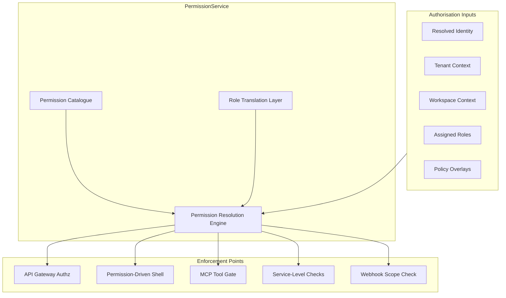
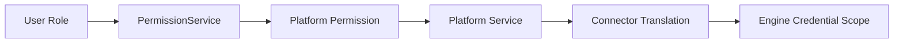
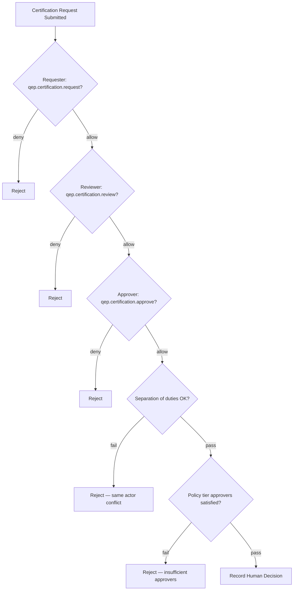
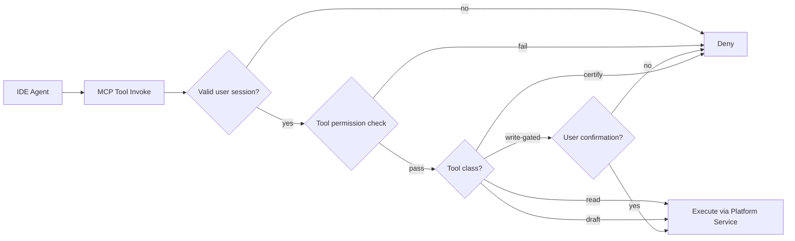

# APZ QEP — Authorisation Architecture

> **Programme:** APZQEP-ARCH-001  
> **Status:** Architecture baseline — conceptual design only  
> **Authority:** [Product Constitution](../constitution/PRODUCT-CONSTITUTION.md) · [Security Constitution](../constitution/SECURITY-CONSTITUTION.md) · [Certification Constitution](../constitution/CERTIFICATION-CONSTITUTION.md) · Platform 1.4 (005, 007, 013)  
> **Scope:** PermissionService model, role translation, permission-driven UI, certification authorities, AI/MCP gates — **no** permission catalogue enumeration, code, or endpoint bindings

---

## 1. Purpose

This document defines the authorisation architecture for APZ QEP. While [IDENTITY-ARCHITECTURE.md](./IDENTITY-ARCHITECTURE.md) establishes who is acting, this document establishes **what they may do** — and equally important, **what they may not do**.

Authorisation is **server-authoritative**. The APZHUB PermissionService is the single source of truth for access decisions. UI filtering, MCP tool availability, and API enforcement all derive from the same resolution — never independent frontend logic.

---

## 2. Authorisation principles

| # | Principle | Meaning |
| - | --------- | ------- |
| 1 | **Deny by default** | No permission → no access |
| 2 | **Server authoritative** | PermissionService resolves on every request |
| 3 | **Platform-owned permissions** | APZHUB owns permission model — not BetterAuth, not engines |
| 4 | **Permission-driven shell** | Activity Bar, Sidebar, commands, search — permission-filtered |
| 5 | **Role translation** | Platform permissions map to capabilities — engine roles never exposed |
| 6 | **Separation of duties** | Certification approval separated from evidence capture where policy requires |
| 7 | **Superadmin is a tier** | Elevated, audited — not a universal bypass |
| 8 | **AI/MCP inherit user** | Tools cannot exceed invoking user's permissions |
| 9 | **No autonomous certify** | Certification permission cannot be granted to AI, MCP, or integrators |
| 10 | **Tenant-scoped** | Permissions evaluated within tenant context always |

---

## 3. Authorisation architecture overview

Every enforcement point consults the same resolution — inconsistencies are architectural defects.

---

## 4. PermissionService model

| Aspect | Design |
| ------ | ------ |
| **Authority** | APZHUB Platform — QEP consumes, does not fork |
| **Resolution timing** | Every API request; shell render; MCP tool invocation; export action |
| **Input context** | Identity, tenant, workspace, resource context (where applicable) |
| **Output** | Allow / deny + resolved capability set for UI |
| **Caching** | Short-lived cache permitted — re-validation on sensitive operations |
| **Audit** | Deny decisions on sensitive resources may be logged per policy |
| **Catalogue ownership** | Product architecture defines QEP permission namespaces — engineering implements catalogue |

### Permission namespace structure (conceptual)

| Namespace prefix | Domain |
| ---------------- | ------ |
| `qep.requirements.*` | Requirements engineering |
| `qep.verification.*` | Verification management and execution |
| `qep.evidence.*` | Evidence capture, packs, export |
| `qep.defects.*` | Defect management |
| `qep.traceability.*` | Traceability links |
| `qep.risk.*` | Risk analysis and acceptance |
| `qep.readiness.*` | Release readiness views |
| `qep.certification.*` | Certification requests and decisions |
| `qep.quality-intelligence.*` | Analytics and dashboards |
| `qep.integrations.*` | Integration Centre |
| `qep.administration.*` | Tenant product admin |
| `qep.compliance.*` | Audit and compliance exports |
| `qep.ai.*` | AI Quality Workspace |

Exact permission keys are defined in Engineering programmes — not in this architecture document.

---

## 5. Role model and role translation

### 5.1 Platform roles (product-facing)

Roles are **bundles of permissions** assigned by Tenant Administrator. Personas from Product Definition map to typical role bundles — personas guide UX; roles enforce access.

| Role family | Primary permissions intent |
| ----------- | ---------------------------- |
| **Viewer** | Read-only across granted scopes |
| **QA Engineer** | Verification execution, evidence capture, defect logging |
| **QA Manager** | Verification design, baselines, team oversight, co-certification review |
| **Release Manager** | Certification request, primary certification decision |
| **Compliance Officer** | Co-approval, audit export, policy oversight |
| **Automation Engineer** | Integration health, runner mapping — no certification |
| **Auditor** | Read audit, export — no mutate, no cert |
| **Tenant Administrator** | User/role management, entitlements, policies |
| **Platform Administrator** | Cross-tenant integration and platform governance |

### 5.2 Role translation to connectors

| Layer | Role representation |
| ----- | ------------------- |
| **QEP UI** | Platform role names only — never engine role names |
| **PermissionService** | Platform permission keys |
| **Platform Service** | Validates permission before connector call |
| **Connector** | Maps authorised operation to engine-scoped credential |
| **External engine** | Connector-internal role — invisible to user |

Users never manage engine permissions through QEP — connectors operate within pre-authorised scopes.

---

## 6. Permission-driven shell

Per Platform Desktop Framework (005) and QEP Product Definition, the APZHUB shell renders QEP surfaces based on resolved permissions:

| Shell element | Permission behaviour |
| ------------- | -------------------- |
| **Activity Bar** | QEP entry visible only if user has any QEP namespace permission |
| **Sidebar navigation** | Module nodes filtered by module-level permissions |
| **Workspace routes** | Deep links re-validate permissions on load |
| **Command palette** | Commands registered with required permissions |
| **Unified search** | Results filtered at query time by PermissionService |
| **Toolbar actions** | Create/edit/certify buttons require explicit grants |
| **Context panel** | Sensitive metadata hidden without read permission |
| **Notifications** | Delivery filtered — user sees only permitted content |
| **Administration surfaces** | Tenant/platform admin permissions required |

**Rule:** Hiding UI elements is **not** a security control — it is UX. Server enforcement remains mandatory.

---

## 7. Superadmin tier

| Aspect | Design |
| ------ | ------ |
| **Nature** | Explicit elevated permission tier — not a normal user persona |
| **Purpose** | Platform operations, cross-tenant governance, break-glass scenarios |
| **Not a bypass** | Superadmin actions still audited; SoR business rules apply |
| **Certification** | Superadmin does **not** default to certifier — certification permissions separate |
| **Visibility** | Distinct admin surfaces — not mixed with standard QEP workspaces |
| **Audit** | All superadmin actions produce enhanced audit records |
| **Assignment** | Platform Owner controlled — not self-service |

Superadmin can administer the platform; it cannot silently rewrite locked certification evidence without governed correction paths.

---

## 8. Certification approval authorities

Certification authorisation is the **highest sensitivity** permission domain — governed by Certification Constitution and Certification Model.

### 8.1 Who may certify

| Actor | Certification authority |
| ----- | ----------------------- |
| **Release Manager** | Primary certifier — default approver |
| **QA Manager** | Co-reviewer; may co-sign per policy |
| **Compliance Officer** | Required co-approver in regulated tenants |
| **Product Owner** | Qualification acknowledgment — not default sole certifier |
| **Executive** | View only — not default certifier |
| **Auditor** | Observe — no cert unless explicitly granted (unusual) |
| **AI Agent** | **Cannot certify** — no permission exists |
| **MCP tools** | **Cannot certify** — no autonomous certify tool |
| **API integrators** | **Cannot certify** — no client scope for cert decision |
| **Service/worker identities** | **Cannot certify** |
| **Automation (CI green)** | **Cannot certify** |

### 8.2 Approval policy tiers

| Policy tier | Required approvers |
| ----------- | ------------------ |
| **Team** | Release Manager |
| **Enterprise** | Release Manager; QA Manager co-sign optional per policy |
| **Regulated** | Release Manager + Compliance Officer (and Security if policy requires) |
| **With qualifications** | Base tier + Product Owner acknowledgment typical |

### 8.3 Certification permission gates

Separation of duties: requester cannot approve own request where policy prohibits.

---

## 9. Domain-specific authorisation patterns

| Domain | Authorisation pattern |
| ------ | --------------------- |
| **Requirements** | Read/write split; baseline approval elevated |
| **Verification** | Design vs execute permissions separated |
| **Evidence** | Capture vs review vs export permissions |
| **Evidence pack lock** | Triggered by certification approval — not direct permission |
| **Defects** | Create vs disposition vs link permissions |
| **Risk** | Assess vs accept/waive — waiver acceptance elevated |
| **Readiness** | Compute (system) vs view vs override (human, audited) |
| **Integrations** | View vs configure vs disable — ops elevated |
| **Administration** | Tenant admin vs platform admin separation |
| **Compliance export** | Export permission + audit; may require Compliance Officer |
| **AI workspace** | Enable AI (tenant) + per-user AI permissions + default OFF |

---

## 10. AI and MCP authorisation gates

| Gate | Requirement |
| ---- | ----------- |
| **Tenant AI enablement** | AI runtime OFF until Tenant Administrator enables |
| **User AI permission** | `qep.ai.*` namespace grants assistant access |
| **MCP tool registration** | Each tool declares required permissions |
| **Tool invocation** | PermissionService validates before execution |
| **Read tools** | Require read permissions on target domain |
| **Draft tools** | Require write-draft permission — non-committing |
| **Write-gated tools** | Require explicit write permission + confirmation flow |
| **Certify tools** | **Not registered** — architectural prohibition |
| **Bulk read tools** | Rate limited; same permission as single read |
| **Context assembly** | Only permission-filtered data included in AI context |
| **Audit** | Mutating MCP invocations audited with user + tool + target |

---

## 11. API and webhook authorisation

| Consumer | Authorisation model |
| -------- | ------------------- |
| **Module API calls** | User session + PermissionService |
| **External API client** | Client credentials + scoped permission subset |
| **Webhook inbound** | Registered endpoint + signature + tenant scope — no broad write |
| **Webhook outbound** | QEP initiates — customer endpoint registered |
| **Worker jobs** | Worker identity + job-type permission |
| **Cross-product API** | Service identity + inter-product permission contract |

External clients receive **strict subsets** — certification approve never in client scope.

---

## 12. Policy overlays

Tenant policies may **restrict** permissions further — never widen beyond platform catalogue:

| Overlay type | Effect |
| ------------ | ------ |
| **Certification policy** | Additional approvers, separation of duties |
| **Evidence policy** | Mandatory review before pack submission |
| **Risk policy** | Waiver acceptance requires elevated role |
| **Retention policy** | Export restrictions for legal hold |
| **AI policy** | Disable AI for specific modules or data classes |
| **Integration policy** | Restrict connector configuration to ops roles |

Policy evaluation occurs after base PermissionService resolution.

---

## 13. Authorisation audit

| Event | Audit requirement |
| ----- | ----------------- |
| Permission grant/revoke | Platform audit |
| Role assignment change | Platform audit + QEP admin view |
| Certification decision | QEP immutable audit |
| Denied cert attempt | Security audit if policy requires |
| MCP mutating tool deny | Security log |
| Superadmin action | Enhanced audit |
| Policy overlay change | Compliance audit |

---

## 14. Anti-patterns (forbidden)

| Anti-pattern | Violation |
| ------------ | --------- |
| Frontend-only permission check | Server must enforce |
| BetterAuth roles as QEP permissions | PermissionService authority |
| Engine role displayed in UI | Role translation rule |
| MCP tool with cert capability | Certification Constitution |
| API client with cert scope | Human accountability |
| Superadmin silent cert bypass | Superadmin tier rules |
| Permission cache without re-validation on cert | Security risk |
| AI context with unfiltered data | Least privilege |

---

## 15. Cross-document references

| Topic | Document |
| ----- | -------- |
| Identity types | [IDENTITY-ARCHITECTURE.md](./IDENTITY-ARCHITECTURE.md) |
| Security architecture | [SECURITY-ARCHITECTURE.md](./SECURITY-ARCHITECTURE.md) |
| MCP integration | [INTEGRATION-ARCHITECTURE.md](./INTEGRATION-ARCHITECTURE.md) |
| API security | [API-ARCHITECTURE.md](./API-ARCHITECTURE.md) |
| Certification model | [../product-definition/CERTIFICATION-MODEL.md](../product-definition/CERTIFICATION-MODEL.md) |
| Role workspaces | [../product-definition/ROLE-WORKSPACES.md](../product-definition/ROLE-WORKSPACES.md) |
| Platform shell permissions | Platform docs 005, 016, 017 |

---

## Document control

| Field | Value |
| ----- | ----- |
| Programme | APZQEP-ARCH-001 |
| Version | 1.0.0-arch |
| Classification | Authorisation architecture — conceptual |
| Prohibited content | Permission key enumeration, code, endpoint bindings |
| Next review | After Owner Architecture Acceptance |
