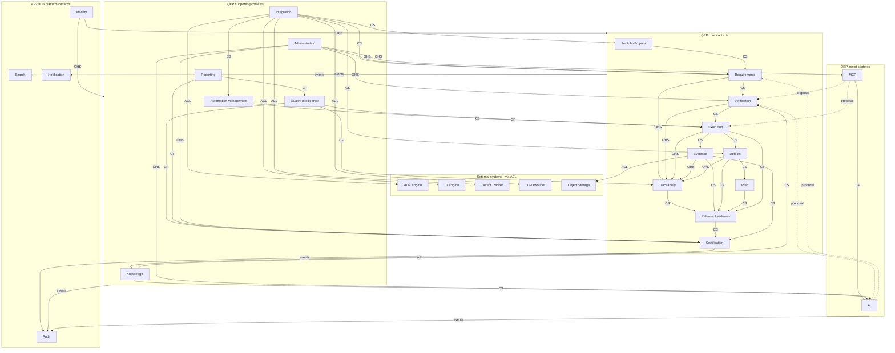

# APZQEP-ARCH-001 — Bounded Contexts

> **Programme:** APZQEP-ARCH-001  
> **Classification:** ENTERPRISE ARCHITECTURE  
> **Baseline:** APZQEP-DEF-002 (**ACCEPTED**)  
> **Rule:** Context mapping only — no implementation

## Purpose

This document defines all **bounded contexts** for APZ QEP using Domain-Driven Design context mapping. Each context has a ubiquitous language, explicit System of Record scope, and defined relationships (partnership, customer-supplier, conformist, anti-corruption layer) to neighbouring contexts. The map guides modular monolith package boundaries and future service extraction.

## Context mapping legend

| Symbol  | Relationship          | Meaning                                   |
| ------- | --------------------- | ----------------------------------------- |
| **ACL** | Anti-Corruption Layer | Translator isolates external model        |
| **CF**  | Conformist            | Downstream accepts upstream model         |
| **CS**  | Customer-Supplier     | Upstream serves downstream via contract   |
| **OHS** | Open Host Service     | Published interface for many consumers    |
| **PL**  | Partnership           | Joint evolution of related contexts       |
| **SK**  | Shared Kernel         | Minimal shared primitives (use sparingly) |

---

## Context catalogue

| Context                   | Ubiquitous language centre                        | SoR scope                   | Module(s)    |
| ------------------------- | ------------------------------------------------- | --------------------------- | ------------ |
| **Requirements**          | Requirement, baseline, acceptance criterion       | Approved requirements       | M03          |
| **Verification**          | Verification procedure, suite, template, approval | Procedures and library      | M04, M05     |
| **Execution**             | Session, run, step result, retest                 | Execution results           | M06          |
| **Evidence**              | Evidence item, pack, lock                         | Evidence metadata and packs | M09          |
| **Defects**               | Defect, quality issue, retest                     | Quality defects             | M08          |
| **Risk**                  | Risk, treatment, acceptance                       | Risk register               | M11          |
| **Traceability**          | Trace link, gap, coverage                         | Link graph and views        | M10          |
| **Release Readiness**     | Release, gate, waiver, snapshot                   | Readiness snapshots         | M12          |
| **Certification**         | Certification, decision, qualification            | Certification history       | M13          |
| **Quality Intelligence**  | Indicator, insight, explanation                   | Derived insights            | M14          |
| **Knowledge**             | Knowledge item, lesson, pattern                   | Approved knowledge          | M16          |
| **Automation Management** | Automation asset, ingest, flaky                   | Automation metadata         | M07          |
| **Portfolio/Projects**    | Project, environment, team                        | Quality scope contexts      | M02          |
| **Integration**           | Connection, sync, health                          | Integration config          | M19          |
| **AI**                    | AI session, recommendation, draft                 | Non-authoritative drafts    | M17          |
| **MCP**                   | Tool, proposal, invocation                        | Tool audit adjunct          | M18          |
| **Administration**        | Policy, entitlement, retention                    | QEP governance config       | M20          |
| **Identity**              | User, role, session                               | Platform identity           | _(platform)_ |
| **Audit**                 | Audit event, investigation, hold                  | Investigation views         | M21          |
| **Search**                | Provider, saved search, index                     | Derived index               | M22          |
| **Reporting**             | Report, dashboard, export                         | Derived aggregates          | M15          |
| **Notification**          | Attention item, subscription                      | Platform delivery           | _(platform)_ |

---

## Context map (diagram)

---

## Context relationship matrix

| Upstream           | Downstream              | Pattern  | Integration mechanism                     |
| ------------------ | ----------------------- | -------- | ----------------------------------------- |
| Portfolio/Projects | Requirements            | CS       | Project scope ID in requirement aggregate |
| Requirements       | Verification            | CS       | Approved requirement refs on procedures   |
| Verification       | Execution               | CS       | Procedure version ID on run/session       |
| Execution          | Evidence                | CS       | Result refs on evidence items             |
| Execution          | Defects                 | CS       | Failure context on defect creation        |
| Core SoR (all)     | Traceability            | OHS      | Link API + domain events                  |
| Traceability       | Release Readiness       | CS       | Gap and coverage snapshots                |
| Evidence           | Release Readiness       | CS       | Completeness checks                       |
| Defects            | Release Readiness       | CS       | Open defect counts                        |
| Risk               | Release Readiness       | CS       | Accepted/open risk posture                |
| Release Readiness  | Certification           | CS       | Explicit handoff + snapshot ID            |
| Evidence           | Certification           | CS       | Pack lock on approve                      |
| Certification      | Knowledge               | CS       | Outcome feeds lessons                     |
| Integration        | Automation Mgmt         | ACL + CS | Normalised ingest events                  |
| Integration        | Requirements            | ACL      | Staged import proposals                   |
| Integration        | Defects                 | ACL      | External issue mapping                    |
| AI                 | Verification            | Proposal | Accept/reject → library promotion         |
| MCP                | Verification, Execution | Proposal | Tool output → approval queues             |
| Administration     | All governed            | OHS      | Policy evaluation at service entry        |
| Identity           | All                     | OHS      | Actor + tenant on every command           |
| All mutating       | Audit                   | Events   | Append audit via platform                 |
| All SoR            | Search                  | Events   | Async index providers                     |
| All notable        | Notification            | Events   | Attention publication                     |

---

## Per-context specifications

### Requirements context

| Attribute           | Detail                                                             |
| ------------------- | ------------------------------------------------------------------ |
| **Core terms**      | Requirement, baseline, acceptance criterion, approval              |
| **Aggregate roots** | Requirement, Baseline                                              |
| **Invariants**      | Approved before verification obligation; version history preserved |
| **ACL**             | ALM issue → staged requirement proposal (Integration)              |
| **Partners**        | Verification (PL on coverage semantics)                            |
| **Anti-corruption** | Reject ALM sprint/status vocabulary in core model                  |

---

### Verification context

| Attribute           | Detail                                                                                             |
| ------------------- | -------------------------------------------------------------------------------------------------- |
| **Core terms**      | Verification procedure, suite, template, design draft, peer review                                 |
| **Aggregate roots** | VerificationProcedure, DesignDraft                                                                 |
| **Invariants**      | Executable procedures are approved library entries; _verification_ not _test case_ in API language |
| **ACL**             | Automation identifier maps from CI (Automation Management)                                         |
| **Partners**        | Requirements, Execution                                                                            |
| **Anti-corruption** | Runner result formats normalised at Automation/Integration boundary                                |

---

### Execution context

| Attribute           | Detail                                                                    |
| ------------------- | ------------------------------------------------------------------------- |
| **Core terms**      | Session, run, step result, handover, retest                               |
| **Aggregate roots** | Session, Run                                                              |
| **Invariants**      | Results reference approved procedure version; manual sessions first-class |
| **ACL**             | CI ingest payload → internal result model                                 |
| **Partners**        | Verification, Evidence, Defects                                           |
| **Anti-corruption** | No pipeline stage vocabulary as domain state                              |

---

### Evidence context

| Attribute           | Detail                                                            |
| ------------------- | ----------------------------------------------------------------- |
| **Core terms**      | Evidence item, pack, lock, chain of custody                       |
| **Aggregate roots** | EvidenceItem, EvidencePack                                        |
| **Invariants**      | Locked packs immutable; blob refs only — not inline binary domain |
| **ACL**             | Platform Documents / object storage                               |
| **Partners**        | Execution, Certification                                          |
| **Anti-corruption** | Storage paths never exposed as business identifiers to UI         |

---

### Defects context

| Attribute           | Detail                                                 |
| ------------------- | ------------------------------------------------------ |
| **Core terms**      | Defect, quality issue, known limitation, retest        |
| **Aggregate roots** | Defect                                                 |
| **Invariants**      | Quality linkage to verification/requirement maintained |
| **ACL**             | External tracker issue ↔ Defect link map               |
| **Partners**        | Execution, Risk                                        |
| **Anti-corruption** | Tracker workflow states mapped — not mirrored as SoR   |

---

### Risk context

| Attribute           | Detail                                      |
| ------------------- | ------------------------------------------- |
| **Core terms**      | Risk, treatment, residual acceptance        |
| **Aggregate roots** | Risk, RiskAcceptance                        |
| **Invariants**      | Acceptance requires human approver identity |
| **ACL**             | None for MVP                                |
| **Partners**        | Release Readiness                           |
| **Anti-corruption** | Distinct from enterprise GRC risk registers |

---

### Traceability context

| Attribute           | Detail                                                |
| ------------------- | ----------------------------------------------------- |
| **Core terms**      | Trace link, orphan, gap, unsupported claim            |
| **Aggregate roots** | TraceLink _(link)_, CoverageSnapshot _(derived)_      |
| **Invariants**      | Does not mutate foreign aggregates — links only       |
| **ACL**             | N/A — internal federation                             |
| **Partners**        | All core contexts (OHS consumer)                      |
| **Anti-corruption** | Source IDs are refs — not embedded foreign aggregates |

---

### Release Readiness context

| Attribute           | Detail                                                           |
| ------------------- | ---------------------------------------------------------------- |
| **Core terms**      | Release, gate, waiver, readiness snapshot                        |
| **Aggregate roots** | Release, ReadinessSnapshot                                       |
| **Invariants**      | Snapshot is point-in-time; does not certify                      |
| **ACL**             | N/A                                                              |
| **Partners**        | Certification (handoff)                                          |
| **Anti-corruption** | Score is explainable decomposition — not opaque ML score as gate |

---

### Certification context

| Attribute           | Detail                                                        |
| ------------------- | ------------------------------------------------------------- |
| **Core terms**      | Certification request, decision, qualification, approver      |
| **Aggregate roots** | Certification                                                 |
| **Invariants**      | Immutable decisions; human actors; evidence lock coordination |
| **ACL**             | N/A                                                           |
| **Partners**        | Release Readiness, Evidence                                   |
| **Anti-corruption** | Reject auto-certify language from external CI                 |

---

### Quality Intelligence context

| Attribute           | Detail                                               |
| ------------------- | ---------------------------------------------------- |
| **Core terms**      | Indicator, insight, explanation, recommendation      |
| **Aggregate roots** | Insight _(derived)_                                  |
| **Invariants**      | Recommendations non-binding; re-cert is request only |
| **ACL**             | Optional AI enrichment                               |
| **Partners**        | Reporting (CF)                                       |
| **Anti-corruption** | Vendor dashboard metrics not imported as authority   |

---

### Knowledge context

| Attribute           | Detail                                    |
| ------------------- | ----------------------------------------- |
| **Core terms**      | Knowledge item, lesson, prompt knowledge  |
| **Aggregate roots** | KnowledgeItem                             |
| **Invariants**      | Approved before reuse in design workflows |
| **ACL**             | N/A                                       |
| **Partners**        | Verification, AI                          |
| **Anti-corruption** | Not a dump of unreviewed AI output        |

---

### Automation Management context

| Attribute           | Detail                                                 |
| ------------------- | ------------------------------------------------------ |
| **Core terms**      | Automation asset, ingest record, flaky signal          |
| **Aggregate roots** | AutomationAsset                                        |
| **Invariants**      | Does not execute; promotes candidates via Verification |
| **ACL**             | CI/CD webhook and API payloads                         |
| **Partners**        | Execution, Integration                                 |
| **Anti-corruption** | Pipeline IDs are refs — not domain aggregates          |

---

### Portfolio/Projects context

| Attribute           | Detail                                       |
| ------------------- | -------------------------------------------- |
| **Core terms**      | Project, environment, team, external link    |
| **Aggregate roots** | Project                                      |
| **Invariants**      | Quality scope anchor — not sprint container  |
| **ACL**             | ALM project sync                             |
| **Partners**        | Requirements                                 |
| **Anti-corruption** | ALM board columns not imported as QEP states |

---

### Integration context

| Attribute           | Detail                                                                       |
| ------------------- | ---------------------------------------------------------------------------- |
| **Core terms**      | Integration, connection, sync job, health                                    |
| **Aggregate roots** | Integration, Connection                                                      |
| **Invariants**      | All engine access via connectors; catalogue is inventory not SoR for quality |
| **ACL**             | **Primary ACL owner** for all engines                                        |
| **Partners**        | Automation, Requirements, Defects, AI providers                              |
| **Anti-corruption** | Every connector implements capability manifest (026)                         |

---

### AI context

| Attribute           | Detail                                                  |
| ------------------- | ------------------------------------------------------- |
| **Core terms**      | AI session, recommendation, draft, accept/reject        |
| **Aggregate roots** | AISession                                               |
| **Invariants**      | Default OFF; no SoR write without accept; never certify |
| **ACL**             | LLM provider request/response normalisation             |
| **Partners**        | Verification, Requirements (targets)                    |
| **Anti-corruption** | Model output labelled non-authoritative                 |

---

### MCP context

| Attribute           | Detail                                                              |
| ------------------- | ------------------------------------------------------------------- |
| **Core terms**      | Tool, invocation, proposal, client session                          |
| **Aggregate roots** | MCPClientSession                                                    |
| **Invariants**      | Tool allowlist; every call audited; mutating tools → proposal queue |
| **ACL**             | IDE protocol ↔ internal proposal commands                           |
| **Partners**        | AI (policy), Verification, Execution                                |
| **Anti-corruption** | Agents cannot obtain bulk export outside permission scope           |

---

### Administration context

| Attribute           | Detail                                               |
| ------------------- | ---------------------------------------------------- |
| **Core terms**      | Policy, entitlement, retention, workflow template    |
| **Aggregate roots** | QEPPolicy, Entitlement                               |
| **Invariants**      | Cannot delete certification history; AI default OFF  |
| **ACL**             | Platform IAM reads                                   |
| **Partners**        | All contexts (policy OHS)                            |
| **Anti-corruption** | Platform roles ≠ QEP certifier roles without mapping |

---

### Identity context (platform)

| Attribute           | Detail                                                                |
| ------------------- | --------------------------------------------------------------------- |
| **Core terms**      | User, session, tenant                                                 |
| **Aggregate roots** | _(Platform)_                                                          |
| **Invariants**      | Authentication via Better Auth; QEP extends with permission catalogue |
| **Relationship**    | OHS to all QEP contexts                                               |
| **Anti-corruption** | QEP never stores credentials                                          |

---

### Audit context

| Attribute           | Detail                                                |
| ------------------- | ----------------------------------------------------- |
| **Core terms**      | Audit event, investigation, legal hold                |
| **Aggregate roots** | InvestigationCase _(view)_                            |
| **Invariants**      | Immutable classes append-only                         |
| **Relationship**    | Conformist to platform audit; enriches with QEP views |
| **Anti-corruption** | QEP views filter — do not duplicate mutable store     |

---

### Search context

| Attribute           | Detail                                                 |
| ------------------- | ------------------------------------------------------ |
| **Core terms**      | Search provider, saved search, index document          |
| **Aggregate roots** | SavedSearch                                            |
| **Invariants**      | Permission filter at query; index derived              |
| **Relationship**    | Conformist to Platform Search                          |
| **Anti-corruption** | Search hit ≠ authoritative record — always link to SoR |

---

### Reporting context

| Attribute           | Detail                           |
| ------------------- | -------------------------------- |
| **Core terms**      | Report, dashboard, export        |
| **Aggregate roots** | ReportDefinition                 |
| **Invariants**      | Read-only to SoR; export audited |
| **Relationship**    | CF downstream of SoR and QI      |
| **Anti-corruption** | No report-driven mutation        |

---

### Notification context (platform)

| Attribute           | Detail                                    |
| ------------------- | ----------------------------------------- |
| **Core terms**      | Attention item, digest, subscription      |
| **Aggregate roots** | _(Platform)_                              |
| **Invariants**      | Modules publish events only               |
| **Relationship**    | Conformist to Platform Notification (021) |
| **Anti-corruption** | No module-local notification stores       |

---

## Shared kernel (minimal)

Shared kernel is **intentionally small** to avoid monolith entanglement:

| Shared concept                  | Usage                                      |
| ------------------------------- | ------------------------------------------ |
| Platform global ID              | All cross-context refs                     |
| Tenant ID                       | Isolation                                  |
| Project scope ID                | Scope anchor                               |
| Actor reference                 | Audit attribution                          |
| Correlation ID                  | Tracing                                    |
| Timestamp (UTC)                 | Ordering                                   |
| Lifecycle status enum (generic) | UI only — not cross-context business rules |

**Prohibited in shared kernel:** Requirement, Verification, Certification business rules; foreign aggregate internals.

---

## Context boundary tests

Use these tests when proposing new features:

| Test                                                | Pass                  | Fail                     |
| --------------------------------------------------- | --------------------- | ------------------------ |
| Does it improve release confidence via quality SoR? | In context            | Wrong product            |
| Does it duplicate ALM/CI/runner authority?          | ACL + ref only        | Boundary violation       |
| Does it mutate foreign aggregate directly?          | Use CS contract/event | Context leak             |
| Does AI/MCP write SoR silently?                     | Proposal + accept     | Guardrail breach         |
| Does it certify without human?                      | Reject                | Constitutional violation |

---

## MVP context priority

| Priority | Contexts required for MVP certification path                                                                                                                                          |
| -------- | ------------------------------------------------------------------------------------------------------------------------------------------------------------------------------------- |
| P0       | Portfolio, Requirements, Verification, Execution, Evidence, Defects, Traceability, Release Readiness, Certification, Administration, Identity, Audit, Search, Reporting, Notification |
| P1       | Automation Management, Integration, Risk                                                                                                                                              |
| P2       | Quality Intelligence, Knowledge, AI, MCP                                                                                                                                              |

---

## Related documents

| Document                                                             | Relationship                   |
| -------------------------------------------------------------------- | ------------------------------ |
| DOMAIN-ARCHITECTURE.md                                               | Domain events and dependencies |
| APPLICATION-ARCHITECTURE.md                                          | Service realisation            |
| [PRODUCT-BOUNDARIES.md](../product-definition/PRODUCT-BOUNDARIES.md) | Product boundary authority     |

---

## Document control

| Version    | Date       | Change                                        |
| ---------- | ---------- | --------------------------------------------- |
| 1.0.0-arch | 2026-07-24 | Initial bounded context map — APZQEP-ARCH-001 |
