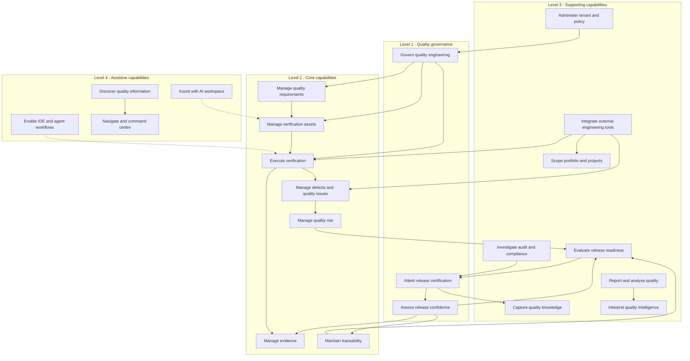
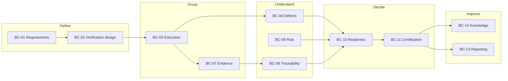
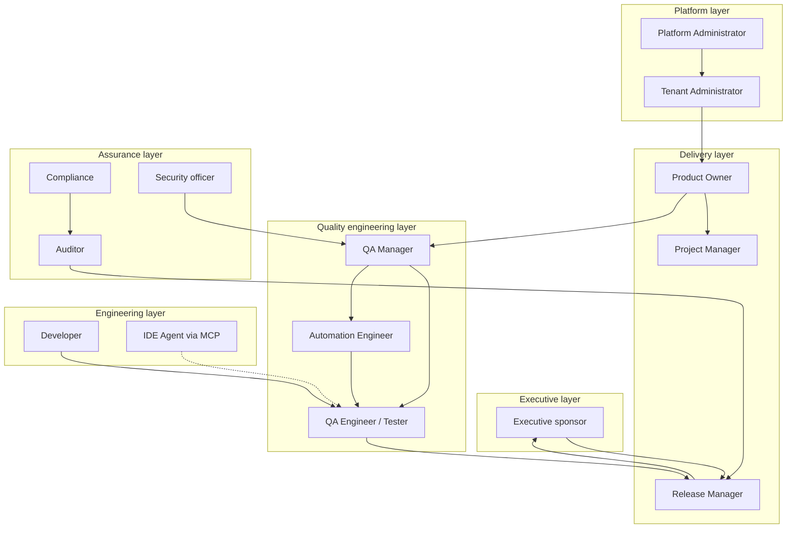

# APZQEP-ARCH-001 — Business Architecture

> **Programme:** APZQEP-ARCH-001  
> **Classification:** ENTERPRISE ARCHITECTURE  
> **Baseline:** APZQEP-DEF-002 (**ACCEPTED**)  
> **Rule:** Business architecture only — no technical implementation

## Purpose

This document defines the **business architecture** of APZ QEP — the business capabilities, business services, ownership boundaries, value streams, and organisational interactions that the product enables. It translates Product Definition into enterprise capability language for portfolio planning, compliance, and operating model design.

## Business mission

APZ QEP enables organisations to **govern enterprise quality engineering** with evidence-backed confidence in release decisions. The business outcome is reduced release risk, audit-ready certification history, and continuous improvement of verification practice — not faster sprint boards or pipeline execution.

---

## Strategic business goals

| Goal | Success indicator | Architectural enabler |
| ---- | ----------------- | --------------------- |
| **Release confidence** | Certification decisions backed by locked evidence packs | Certification + Evidence + Traceability contexts |
| **Verification discipline** | Approved requirements drive verification coverage | Requirements + Verification contexts |
| **Accountability** | Named humans on cert, risk acceptance, waivers | Identity + Certification + Audit |
| **Audit readiness** | Reconstruct who decided what, when, with which proof | Audit + immutable decision records |
| **Method inclusivity** | Manual-first value without automation mandate | Execution context; Automation as adjunct |
| **Controlled innovation** | AI/MCP productivity without SoR corruption | AI + MCP contexts with human gates |
| **Tool coexistence** | ALM/CI remain in place; QEP governs quality SoR | Integration context |

---

## Business capability map

Capabilities are **what the business can do** with QEP — independent of modules or services.

---

## Capability catalogue

| Capability ID | Capability | Description | Primary modules | SoR |
| ------------- | ---------- | ----------- | --------------- | --- |
| BC-01 | Govern quality requirements | Capture, approve, baseline quality-relevant requirements | M03 | QEP |
| BC-02 | Design verification | Author, review, approve verification procedures | M04, M05 | QEP |
| BC-03 | Reuse verification assets | Maintain governed library of procedures and templates | M04 | QEP |
| BC-04 | Plan and execute verification | Run sessions, runs, hybrid and manual execution | M06 | QEP |
| BC-05 | Govern automation health | Register automation references; ingest results — not run tests | M07 | QEP (metadata) |
| BC-06 | Manage defects | Quality defect lifecycle linked to proof chain | M08 | QEP |
| BC-07 | Manage evidence | Capture, pack, lock evidence for claims | M09 | QEP |
| BC-08 | Maintain traceability | Link req ↔ verify ↔ execute ↔ evidence ↔ defect ↔ release | M10 | QEP (links) |
| BC-09 | Manage quality risk | Score, treat, accept residual risk with human approval | M11 | QEP |
| BC-10 | Assess release readiness | Aggregate gates, waivers, explainable posture | M12 | QEP (snapshots) |
| BC-11 | Certify release | Human certification with immutable history | M13 | QEP |
| BC-12 | Interpret quality intelligence | Explainable insights — never autonomous certify | M14 | QEP (derived) |
| BC-13 | Report quality | Operational and executive reporting | M15 | Derived |
| BC-14 | Reuse quality knowledge | Approved lessons, patterns, prompts | M16 | QEP |
| BC-15 | Assist with AI | Governed drafting and analysis | M17 | Non-authoritative until accept |
| BC-16 | Enable MCP/DX | IDE-native governed tool access | M18 | Session/audit only |
| BC-17 | Integrate externals | ALM, CI, trackers, AI providers | M19 | Config + status |
| BC-18 | Administer product | Users, roles, entitlements, policies | M20 | Platform + QEP policy |
| BC-19 | Investigate compliance | Audit search, legal hold, export | M21 | QEP audit views |
| BC-20 | Discover and navigate | Search, favourites, command centre | M01, M22 | Derived index |
| BC-21 | Scope quality context | Portfolios, projects, environments | M02 | QEP |

---

## Business services

Business services are **coarse-grained operations** the organisation performs using QEP. They compose capabilities and may span multiple bounded contexts.

| Business service | Description | Participating capabilities | Accountable persona |
| ---------------- | ----------- | -------------------------- | ------------------- |
| **BS-01 Requirement approval** | Approve requirement for verification obligation | BC-01 | Product Owner |
| **BS-02 Verification design approval** | Peer review and approve procedures | BC-02, BC-03 | QA Manager |
| **BS-03 Verification execution** | Complete session/run with evidence | BC-04, BC-07 | Manual Tester / QA |
| **BS-04 Automation result ingestion** | Link CI results into execution SoR | BC-05, BC-04 | Automation Engineer |
| **BS-05 Defect triage and closure** | Manage defect with retest proof | BC-06, BC-04, BC-07 | QA / Developer |
| **BS-06 Risk acceptance** | Accept residual risk for release scope | BC-09 | Risk approver / RM |
| **BS-07 Readiness assessment** | Produce explainable readiness snapshot | BC-08, BC-10 | Release Manager |
| **BS-08 Release certification** | Human cert decision with locked pack | BC-11, BC-07 | Release Manager |
| **BS-09 Audit investigation** | Reconstruct certification chain | BC-19, BC-08, BC-11 | Auditor |
| **BS-10 Continuous improvement** | Capture lessons into knowledge | BC-14, BC-13 | QA Manager |
| **BS-11 External sync** | Optional ALM/CI/defect sync | BC-17 | Integrator / Admin |
| **BS-12 AI-assisted drafting** | Propose verification/requirements — human accept | BC-15, BC-02 | QA / BA |

---

## Ownership and RACI (enterprise)

| Domain | Responsible | Accountable | Consulted | Informed |
| ------ | ----------- | ----------- | --------- | -------- |
| Requirements approval | BA | Product Owner | QA, Compliance | RM |
| Verification library | QA Engineer | QA Manager | Automation | PO |
| Execution | Tester | QA Manager | Dev | RM |
| Evidence packs | QA / RM | RM | Auditor | Compliance |
| Defects | QA / Dev | QA Manager | PO | RM |
| Risk acceptance | QA / Security | Risk approver | RM, Compliance | Executive |
| Readiness | RM | RM | PO, QA | Executive |
| Certification | RM | RM (+ co-approvers) | Auditor | All stakeholders |
| Tenant policy | Tenant Admin | Tenant Admin | Security | All users |
| Integrations | Platform Admin | Platform Admin | Integrator | QA leadership |

Architecture enforces separation of duties (e.g. certifier ≠ sole evidence reviewer where policy requires) via PermissionService — not UI hiding alone.

---

## Business boundaries

### In scope (business)

| Boundary | Rationale |
| -------- | --------- |
| Quality-relevant requirements | Foundation for verification authority |
| Verification lifecycle | Core product noun |
| Evidence and certification | Trust and compliance |
| Quality traceability | Explainable readiness |
| Quality defects (not full ITSM) | Closed loop with verification |
| Release readiness (not deploy) | Confidence aggregation |

### Out of scope (business)

| Boundary | QEP may still |
| -------- | ------------- |
| Sprint / backlog management (ALM) | Link/sync references |
| Source control | Repository references |
| CI orchestration | Ingest results and metadata |
| Test execution engines | Reference and ingest |
| Autonomous release | Export cert status for external tools |
| Enterprise HR / finance | Org structure mirrors only |

---

## Product lifecycle mapping

Quality Engineering Lifecycle stages (DEF-002) map to business capabilities:

| Lifecycle stage | Business capabilities | Exit artefact |
| --------------- | ---------------------- | ------------- |
| Requirement | BC-01, BC-21 | Approved requirement |
| Requirement approval | BC-01 | Approval record |
| Verification design | BC-02 | Design draft |
| Verification approval | BC-02, BC-03 | Approved procedure in library |
| Execution planning | BC-04 | Plan / session |
| Execution | BC-04, BC-05, BC-07 | Results + evidence links |
| Evaluation | BC-04, BC-06 | Pass/fail disposition |
| Defect / risk | BC-06, BC-09 | Defect or acceptance record |
| Retest | BC-04, BC-07 | Retest evidence |
| Readiness | BC-08, BC-10 | Readiness snapshot |
| Certification | BC-11 | Certification decision |
| Release | *(external)* | Consumes cert statement |
| Learning | BC-14, BC-13 | Knowledge item |

---

## Value streams

### VS-01 Primary: Release confidence

| Step | Activity | Capability | Value |
| ---- | -------- | ---------- | ----- |
| 1 | Approve scope requirements | BC-01 | Clear proof obligations |
| 2 | Design and approve verification | BC-02, BC-03 | Reusable proof specifications |
| 3 | Execute and capture evidence | BC-04, BC-07 | Demonstrable proof |
| 4 | Link and expose gaps | BC-08 | Transparency |
| 5 | Resolve or accept defects/risk | BC-06, BC-09 | Informed trade-offs |
| 6 | Assess readiness | BC-10 | Explainable posture |
| 7 | Certify | BC-11 | Accountable release decision |

**Cycle time metric:** Time from requirement approval to certification decision (organisation-defined targets).

### VS-02 Secondary: Audit and compliance

| Step | Activity | Capability |
| ---- | -------- | ---------- |
| 1 | Identify release under review | BC-20, BC-11 |
| 2 | Reconstruct trace matrix | BC-08 |
| 3 | Verify evidence pack integrity | BC-07, BC-19 |
| 4 | Export investigation pack | BC-19, BC-13 |

### VS-03 Secondary: Continuous improvement

| Step | Activity | Capability |
| ---- | -------- | ---------- |
| 1 | Analyse release outcomes | BC-13, BC-12 |
| 2 | Capture lessons | BC-14 |
| 3 | Reuse in design | BC-02, BC-03 |

---

## Organisational interaction model

QEP **supports** these interactions through role workspaces (DEF-002) — architecture does not embed org hierarchy as authorization source; roles and permissions do.

---

## External actors

| Actor | Relationship | Integration pattern |
| ----- | ------------ | --------------------- |
| **ALM systems** (Jira, Linear, Plane, ADO Boards) | Optional source/sync for requirements and project refs | Connector → Integration capability |
| **SCM** (GitHub, GitLab) | Repository and build references | Connector metadata |
| **CI/CD** | Pipeline events and automated results | Connector ingest → Execution |
| **Test runners** | Execute tests; results ingested | Never QEP identity |
| **Defect trackers** | Optional bidirectional sync | Connector; QEP SoR for quality linkage |
| **Document storage** | Evidence file blobs | Platform Documents + QEP metadata |
| **LLM providers** | AI assist when enabled | Connector; drafts non-authoritative |
| **IDE / MCP clients** | Developer and agent workflows | MCP gateway; audited tool calls |
| **Release / deploy tools** | Consume certification status | Export / webhook (future ENG) |

External actors **never** become authoritative for QEP SoR domains (Constitution Article IV).

---

## Commercial and edition interaction (business)

| Edition dimension | Business impact |
| ----------------- | --------------- |
| Core MVP | BC-01 through BC-11, BC-13, BC-17–21 manual path |
| Automation depth | BC-05 full ingest |
| Intelligence | BC-12 entitled |
| AI workspace | BC-15 entitled; default OFF |
| MCP/DX | BC-16 entitled; phased maturity |

Entitlements are **business constraints** enforced uniformly at Gateway and module registration.

---

## Key business rules (architecture-relevant)

| Rule | Business effect |
| ---- | --------------- |
| No verification without approved requirement (unless waiver) | BC-01 gates BC-02 |
| No certification without readiness handoff | BC-10 gates BC-11 |
| No silent certification | BC-11 requires human actors |
| Evidence lock on approve | BC-07 immutability on cert |
| AI output is draft until accepted | BC-15 cannot directly satisfy BC-11 |
| QEP wins on SoR conflict | External sync is subordinate |

---

## Related documents

| Document | Relationship |
| -------- | ------------ |
| [PRODUCT-CAPABILITIES.md](../product-definition/PRODUCT-CAPABILITIES.md) | Product capability detail |
| [QUALITY-ENGINEERING-LIFECYCLE.md](../product-definition/QUALITY-ENGINEERING-LIFECYCLE.md) | Stage definitions |
| [PERSONAS.md](../product-definition/PERSONAS.md) | Persona catalogue |
| APPLICATION-ARCHITECTURE.md | Logical service realisation |

---

## Document control

| Version | Date | Change |
| ------- | ---- | ------ |
| 1.0.0-arch | 2026-07-24 | Initial business architecture — APZQEP-ARCH-001 |
