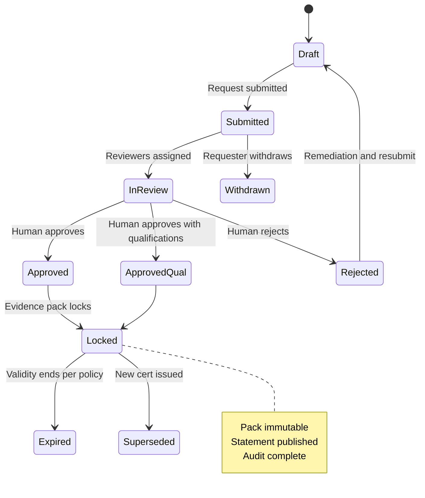
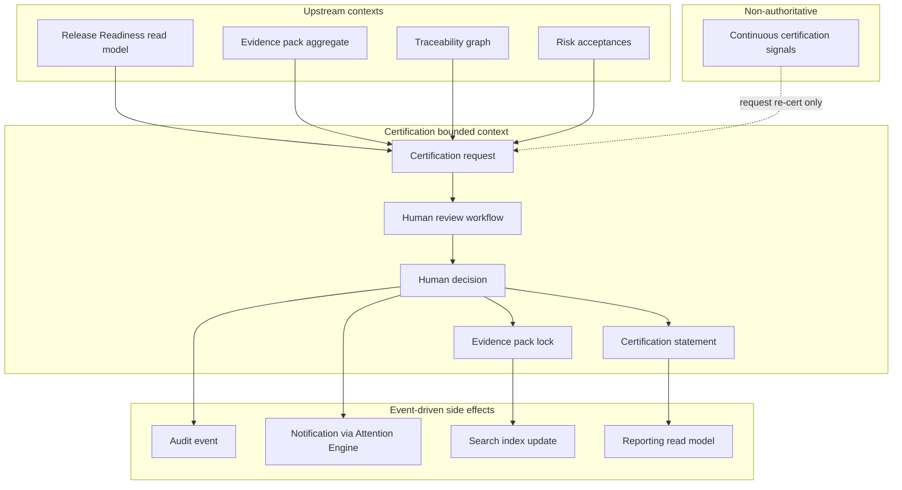
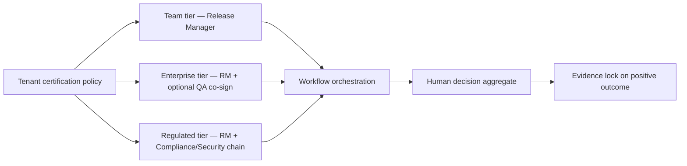

# Completion Report — APZQEP-ARCH-001

> **Programme:** APZQEP-ARCH-001  
> **Title:** APZ QEP Enterprise Architecture Baseline  
> **Classification:** ENTERPRISE ARCHITECTURE  
> **Status:** **IMPLEMENTED / AWAITING OWNER ACCEPTANCE**  
> **Date:** 2026-07-24  
> **Recommendation:** **READY FOR OWNER ARCHITECTURE ACCEPTANCE**  
> **Prerequisite:** APZQEP-DEF-002 Product Definition — **ACCEPTED** (1.0.0-def expanded)

## Summary

APZQEP-ARCH-001 delivered the Enterprise Architecture Baseline for APZ QEP as a native APZHUB product. The pack translates the accepted Product Definition into structural intent: bounded contexts, logical services, information ownership, integration and API principles, AI/MCP governance, cross-cutting platform consumption, deployment posture, and architecture-level decisions — without database design, API specifications, ADRs selecting implementation libraries, or Engineering deliverables.

## Enterprise architecture domains delivered

| Domain | Document(s) | Deliverable |
| ------ | ----------- | ----------- |
| **Pack index & principles** | [README.md](./README.md) | Registry, immutable rules, authority hierarchy |
| **Enterprise overview** | [ENTERPRISE-ARCHITECTURE.md](./ENTERPRISE-ARCHITECTURE.md) | EA views, layering, modular monolith, central outcome mapping |
| **Business architecture** | [BUSINESS-ARCHITECTURE.md](./BUSINESS-ARCHITECTURE.md) | Capabilities, value streams, ownership, external actors |
| **Application architecture** | [APPLICATION-ARCHITECTURE.md](./APPLICATION-ARCHITECTURE.md) | Logical services, orchestration, module alignment (22 modules) |
| **Domain architecture** | [DOMAIN-ARCHITECTURE.md](./DOMAIN-ARCHITECTURE.md) | Major domain responsibilities, events, boundaries |
| **Bounded contexts** | [BOUNDED-CONTEXTS.md](./BOUNDED-CONTEXTS.md) | Context catalogue and context map |
| **Information architecture** | [INFORMATION-ARCHITECTURE.md](./INFORMATION-ARCHITECTURE.md) | SoR ownership, flows, read models, consistency — logical only |
| **Integration architecture** | [INTEGRATION-ARCHITECTURE.md](./INTEGRATION-ARCHITECTURE.md) | REST, events, webhooks, MCP, batch, import/export patterns |
| **API architecture** | [API-ARCHITECTURE.md](./API-ARCHITECTURE.md) | Principles, versioning, governance — no endpoint specs |
| **AI architecture** | [AI-ARCHITECTURE.md](./AI-ARCHITECTURE.md) | Provider abstraction, governance, human approval, default OFF |
| **MCP architecture** | [MCP-ARCHITECTURE.md](./MCP-ARCHITECTURE.md) | MCP gateway, tool registry, authn/authz, audit |
| **Search architecture** | [SEARCH-ARCHITECTURE.md](./SEARCH-ARCHITECTURE.md) | Platform Search consumption, derived index |
| **Workflow architecture** | [WORKFLOW-ARCHITECTURE.md](./WORKFLOW-ARCHITECTURE.md) | QE lifecycle orchestration, human gates |
| **Reporting architecture** | [REPORTING-ARCHITECTURE.md](./REPORTING-ARCHITECTURE.md) | Analytics planes, cert packs, role views |
| **Notification architecture** | [NOTIFICATION-ARCHITECTURE.md](./NOTIFICATION-ARCHITECTURE.md) | Attention Engine consumption |
| **Observability architecture** | [OBSERVABILITY-ARCHITECTURE.md](./OBSERVABILITY-ARCHITECTURE.md) | Metrics, logs, traces, health hierarchy |
| **Deployment architecture** | [DEPLOYMENT-ARCHITECTURE.md](./DEPLOYMENT-ARCHITECTURE.md) | Self-host, cloud, hybrid, air-gap, HA intent |
| **Technology standards** | [TECHNOLOGY-STANDARDS.md](./TECHNOLOGY-STANDARDS.md) | Platform 004 alignment and QEP constraints |
| **Architecture decisions** | [ARCHITECTURE-DECISION-CATALOGUE.md](./ARCHITECTURE-DECISION-CATALOGUE.md) | QEP-AD-001…023 — architecture-level only |
| **Architecture glossary** | [ARCHITECTURE-GLOSSARY.md](./ARCHITECTURE-GLOSSARY.md) | EA terms aligned to product and platform vocabulary |
| **Owner acceptance** | [OWNER-ACCEPTANCE.md](./OWNER-ACCEPTANCE.md) | Acceptance checklist and downstream gate |

## Architecture decisions summary

Twenty-three architecture decisions (QEP-AD-001 through QEP-AD-023) are proposed for Owner Acceptance, covering:

- Modular monolith first and service-extraction-ready seams  
- QEP SoR domains and native product classification  
- Platform Service boundary and connector-only engine access  
- AI default OFF, MCP gateway, human certification, evidence lock, continuous signals non-authoritative  
- Verification primary noun and manual-first MVP architecture  
- Read models, event-driven side effects, derived search  
- Tenancy isolation, BetterAuth authn-only, PermissionService ownership  
- Certification multi-approver, air-gap deployability, self-host-first  
- Zero Trust request pipeline  

Full register: [ARCHITECTURE-DECISION-CATALOGUE.md](./ARCHITECTURE-DECISION-CATALOGUE.md).

## Confirmations

| Confirmation | Status |
| ------------ | ------ |
| APZHUB Platform 1.4 unchanged | Confirmed — QEP extends platform; no platform redesign |
| No Engineering performed | Confirmed |
| No database design (schemas, tables, migrations) | Confirmed |
| No API specifications (paths, OpenAPI, protobuf) | Confirmed |
| No implementation code | Confirmed |
| No Product ADRs selecting libraries beyond Platform 004 | Confirmed — decisions catalogue only |
| Product Definition preserved (DEF-D-001…011) | Confirmed — architecture implements, does not override |
| AI default OFF at architecture layer | Confirmed (QEP-AD-004) |
| Human certification mandatory | Confirmed (QEP-AD-007) |
| Continuous signals never independently change formal cert | Confirmed (QEP-AD-008) |
| Manual verification MVP-capable without automation/AI | Confirmed (QEP-AD-010) |

## Alignment verification

| Source | Alignment |
| ------ | --------- |
| APZHUB Foundation 000–029 | Layering, IAM, gateway, services, events, search, notifications, security, observability |
| APZ QEP Constitution | SoR, certification, AI, security guardrails |
| APZQEP-DEF-002 | 22 modules, personas, workflows, domain models, MVP scope |
| PRODUCT-ARCHITECTURE-STANDARD | Native product, request path, no module→connector bypass |

## Evidence

`docs/operations/evidence/portfolio-recert/20260724T181500Z-APZQEP-ARCH-001.json`

## STOP

Await **Owner Architecture Acceptance** of APZQEP-ARCH-001. Do **not** begin **APZQEP-ENG-001**, database design, API specifications, Product ADRs, or implementation until Acceptance and subsequent named Approvals.

Next authorised programme after Architecture Acceptance: **APZQEP-ENG-001** (Engineering — requires separate Owner authorisation).

---

## Appendix A — Certification lifecycle (architecture view)

Architecture view of the certification bounded context — aligns with [../product-definition/CERTIFICATION-MODEL.md](../product-definition/CERTIFICATION-MODEL.md) and QEP-AD-006, QEP-AD-007, QEP-AD-008, QEP-AD-017. Formal status changes occur only via human decision; continuous signals request re-cert only.

### State flow

### Context interactions

### Multi-approver routing (policy tiers)

### Architecture invariants (certification)

| Invariant | Architecture rule |
| --------- | ------------------- |
| CERT-ARCH-01 | Certification Service owns formal cert state transitions |
| CERT-ARCH-02 | AI/MCP/automation cannot invoke approve/reject transitions |
| CERT-ARCH-03 | Evidence lock is synchronous intent, async side effects via events |
| CERT-ARCH-04 | Continuous signals publish `re_certification_requested` — not status flip |
| CERT-ARCH-05 | Readiness snapshots are inputs — not substitutes for cert decision |
| CERT-ARCH-06 | Locked evidence packs are immutable; supersession creates new lineage |
