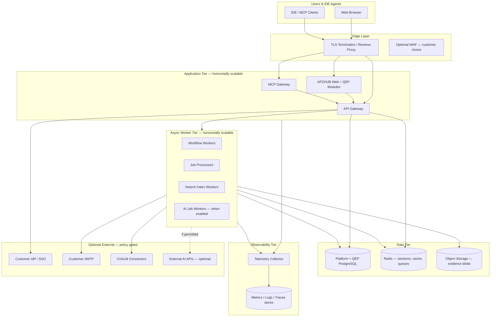
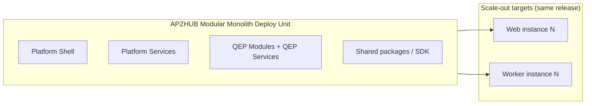
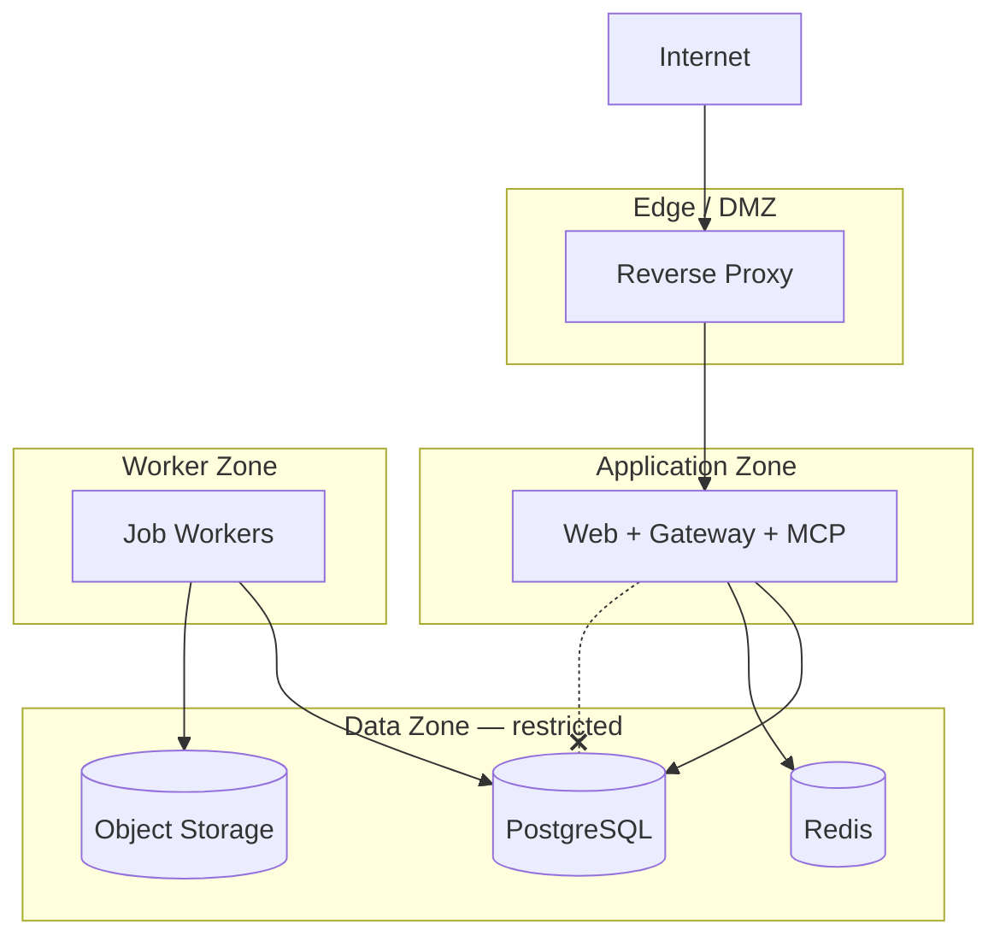

# APZ QEP — Deployment Architecture

> **Programme:** APZQEP-ARCH-001  
> **Document:** DEPLOYMENT-ARCHITECTURE  
> **Status:** Architecture intent — no implementation · no vendor selection  
> **Authority:** [Deployment Model (product experience)](../product-definition/DEPLOYMENT-MODEL.md) · Platform 004 · ENVIRONMENT.md coexistence  
> **Posture:** Modular monolith first · OSS CE self-hosted first

## Purpose

This document defines the **technical deployment topology intent** for APZ QEP as a native APZHUB product module set within a modular monolith. It covers self-hosted, private cloud, managed cloud, hybrid, and air-gapped deployment patterns; high availability; scaling; disaster recovery; and operational boundaries — **without selecting specific cloud vendors, hardware brands, or commercial SaaS products**.

## Architectural principles

| Principle                  | Architectural intent                                                             |
| -------------------------- | -------------------------------------------------------------------------------- |
| Modular monolith first     | QEP deploys as part of APZHUB platform unit — not microservices sprawl initially |
| Self-hosted first          | Full functionality achievable on customer-controlled infrastructure              |
| Platform co-deployment     | QEP cannot run standalone without APZHUB platform services                       |
| Tier separation            | Presentation, application, data, async workers logically separable for scale     |
| Stateless app tier         | Horizontally scalable web/application instances                                  |
| Stateful data tier         | PostgreSQL, Redis, object storage — durable and backed up                        |
| No mandatory external SaaS | Air-gap viable with documented limitations                                       |
| Legacy coexistence         | Non-conflicting ports with legacy `apz-stack` per ENVIRONMENT.md                 |
| Tenant isolation           | Logical isolation in shared deploy; stronger isolation in dedicated deploy       |
| DR intent                  | RPO/RTO defined per mode — implementation in ops programmes                      |

## Deployment topology — reference architecture



## Deployment modes — technical mapping

Product deployment **experiences** (from Deployment Model) map to technical topologies:

| Mode                        | Topology intent                                | Data residency         | External deps                      |
| --------------------------- | ---------------------------------------------- | ---------------------- | ---------------------------------- |
| **Self-hosted**             | Full stack on customer infra                   | Customer-controlled    | Customer chooses                   |
| **Private cloud**           | Dedicated VPC/VNet-style isolation             | Customer cloud account | Customer-controlled                |
| **Managed cloud**           | Provider-operated dedicated or multi-tenant    | Contractual            | Provider-managed                   |
| **Hybrid**                  | SoR self-hosted; optional managed edge/workers | Split per contract     | Split                              |
| **Air-gapped / restricted** | No outbound internet required                  | Fully local            | Local only — limitations published |

## Modular monolith packaging



| Aspect                  | Intent                                                    |
| ----------------------- | --------------------------------------------------------- |
| Single release artifact | Platform + QEP versioned together initially               |
| Internal module seams   | Clear boundaries for future extraction if ever needed     |
| Shared database         | Platform metadata + QEP SoR in PostgreSQL — tenant-scoped |
| Not microservices-first | Avoid operational complexity until scale demands          |

## Tier responsibilities

| Tier           | Components                | Scaling                           | HA intent             |
| -------------- | ------------------------- | --------------------------------- | --------------------- |
| Edge           | TLS proxy, routing        | Active-passive or anycast         | Customer pattern      |
| Application    | Next.js app, gateway, MCP | Horizontal                        | N+1 instances         |
| Workers        | Workflow, jobs, index, AI | Horizontal                        | Queue-backed scale    |
| PostgreSQL     | SoR + platform metadata   | Vertical + read replicas optional | Primary + standby     |
| Redis          | Cache, sessions, pub/sub  | Cluster mode optional             | Sentinel/cluster      |
| Object storage | Evidence files            | Storage scale-out                 | Replication           |
| Observability  | Collectors + backends     | Independent                       | Co-located or central |

## High availability architecture

```mermaid
flowchart TB
  subgraph Region["Primary Site"]
    LB[Load Balancer]
    App1[App instance 1]
    App2[App instance 2]
    W1[Worker pool]
    PG_P[(PostgreSQL Primary)]
    PG_S[(PostgreSQL Standby)]
    Redis_HA[(Redis HA)]
  end

  subgraph DR["DR Site — optional"]
    PG_R[(Replica / Restore target)]
    App_DR[Standby app — cold/warm)]
  end

  LB --> App1
  LB --> App2
  App1 --> PG_P
  App2 --> PG_P
  PG_P --> PG_S
  PG_P -.->|async replication| PG_R
  W1 --> PG_P
  App_DR -.->|failover| PG_R
```

| HA concern     | Architectural intent                                  |
| -------------- | ----------------------------------------------------- |
| App tier       | Stateless; survive instance loss                      |
| Worker tier    | At-least-once jobs; idempotent handlers               |
| Database       | Automated failover pattern — customer implements      |
| Redis          | Session stickiness or shared session store            |
| Object storage | Durability via storage replication                    |
| MCP / Gateway  | Behind same load balancer                             |
| Split-brain    | PostgreSQL quorum / operator runbooks — ops programme |

## Scaling dimensions

| Dimension           | Trigger                   | Scale action                           |
| ------------------- | ------------------------- | -------------------------------------- |
| Concurrent users    | Web latency SLO breach    | Add app instances                      |
| API throughput      | Gateway CPU high          | Add app/gateway instances              |
| Workflow backlog    | Queue depth sustained     | Add workers                            |
| Search index lag    | Lag metric threshold      | Add index workers                      |
| AI demand (enabled) | GPU/CPU queue             | Add AI workers or local model capacity |
| Storage             | Evidence growth           | Expand object storage                  |
| Database            | Connection/query pressure | Read replicas; connection pooling      |

Scale **workers** independently of **web** — cert pack assembly and automation ingest must not require web tier scale-up.

## Network and security zones (intent)



Application tier does **not** receive direct database access from internet. Workers access data zone with least-privilege credentials.

## Air-gapped deployment

| Requirement          | Architectural response                        |
| -------------------- | --------------------------------------------- |
| No outbound internet | All tiers local                               |
| External AI blocked  | Local model adapters only — or AI OFF         |
| MCP IDE local        | IDE talks to local MCP endpoint               |
| Updates              | Offline patch bundle — customer process       |
| Connectors           | CI/ALM within air-gap network only            |
| Observability        | Local metrics/logs/traces                     |
| Limitations          | Published per release — e.g. no commercial AI |

## Hybrid deployment patterns

| Pattern                         | SoR location | Compute location       | Use case              |
| ------------------------------- | ------------ | ---------------------- | --------------------- |
| SoR on-prem, ingest edge        | Customer DC  | Managed ingest workers | Large artifact upload |
| SoR on-prem, read replica cloud | Customer DC  | Cloud read analytics   | Executive dashboards  |
| Identity hybrid                 | Customer IdP | Platform app anywhere  | Enterprise SSO        |

Hybrid requires explicit **connectivity class** documentation — not implicit partial functionality.

## Disaster recovery intent

| Mode                   | RPO intent (conceptual)          | RTO intent (conceptual)          |
| ---------------------- | -------------------------------- | -------------------------------- |
| Self-hosted enterprise | Customer-defined — hours typical | Customer-defined — hours to days |
| Private cloud          | Low hours with replication       | Hours                            |
| Managed                | Contractual SLA                  | Contractual                      |
| Air-gapped             | Backup tape/offline              | Customer runbook                 |

| DR component   | Intent                                   |
| -------------- | ---------------------------------------- |
| PostgreSQL     | Regular backups + WAL/replication        |
| Object storage | Versioned/replicated buckets             |
| Redis          | Accept session loss or persistent backup |
| Configuration  | Infrastructure-as-code in customer repo  |
| Search index   | Rebuild from SoR — not primary DR asset  |
| Cert evidence  | Tier 1 — longest retention backups       |

## Environment coexistence

Per ENVIRONMENT.md, legacy `apz-stack` may run on same host:

| Concern            | Intent                                                  |
| ------------------ | ------------------------------------------------------- |
| Port allocation    | Non-conflicting ports for QEP platform stack            |
| Resource isolation | Container or process boundaries                         |
| Migration          | Gradual cutover — not big-bang required in architecture |

## Operational topology — day-2

| Activity             | Responsible tier                            |
| -------------------- | ------------------------------------------- |
| Deploy upgrade       | Release artifact to app + workers           |
| DB migration         | Platform migration job — maintenance window |
| Certificate rotation | Edge/proxy tier                             |
| Secret rotation      | Platform secret service                     |
| Backup verify        | Customer or provider ops                    |
| Index rebuild        | Worker tier job                             |
| Feature flags        | Platform admin — AI default OFF             |

## Multi-tenancy topology

| Model            | Isolation intent                        |
| ---------------- | --------------------------------------- |
| Shared deploy    | Row-level tenant isolation in SoR       |
| Dedicated deploy | Separate database instance per customer |
| Private cloud    | Dedicated cluster per customer          |

QEP SoR never commingles tenant data without platform enforcement.

## Non-goals

- AWS/Azure/GCP service selection
- Kubernetes vs VM decision
- Specific hardware sizing
- Terraform modules
- Network firewall rule lists

## Acceptance criteria (architecture)

| Criterion             | Intent                                      |
| --------------------- | ------------------------------------------- |
| Topology diagram      | Edge, app, worker, data, obs tiers          |
| Five deployment modes | Self, private, managed, hybrid, air-gap     |
| Modular monolith      | Single deploy unit with scale-out targets   |
| HA/DR intent          | RPO/RTO conceptual without vendor           |
| No vendor lock        | Document explicitly avoids vendor selection |
| Coexistence           | Legacy stack port awareness                 |
