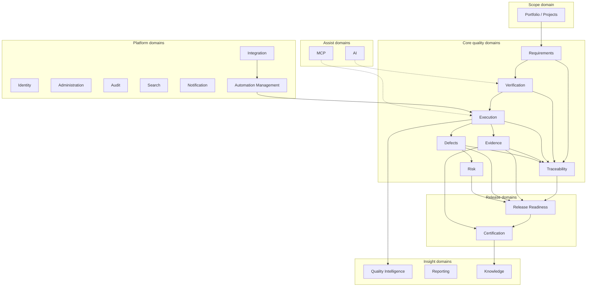

# APZQEP-ARCH-001 — Domain Architecture

> **Programme:** APZQEP-ARCH-001  
> **Classification:** ENTERPRISE ARCHITECTURE  
> **Baseline:** APZQEP-DEF-002 (**ACCEPTED**)  
> **Rule:** Domain architecture only — no schemas, code, or APIs

## Purpose

This document defines the **domain architecture** of APZ QEP — the major business domains, their purposes, responsibilities, information ownership, published events, dependencies, and boundaries. Domains align to bounded contexts (see BOUNDED-CONTEXTS.md) and are realised by logical application services (see APPLICATION-ARCHITECTURE.md).

## Domain architecture principles

| Principle | Meaning |
| --------- | ------- |
| **Verification-centric** | Verification aggregates connect requirements to proof |
| **Aggregate ownership** | One context owns each mutable aggregate root |
| **Invariant enforcement** | Domain rules execute in owning service — not in modules |
| **Event notification** | Cross-domain state change uses past-tense domain events |
| **Immutability classes** | Certification decisions and locked packs are append-only |
| **Non-authoritative assist** | AI/MCP domains never own quality SoR aggregates |

---

## Domain map

---

## Domain summary table

| Domain | Primary aggregates | SoR | Publishes events | Consumes |
| ------ | ------------------ | --- | ---------------- | -------- |
| Portfolio/Projects | Project, Environment, Team | QEP | ProjectActivated, ProjectArchived | Integration (ALM refs) |
| Requirements | Requirement, Baseline | QEP | RequirementApproved, BaselineCreated | Portfolio |
| Verification | Procedure, Suite, Template | QEP | VerificationApproved, VerificationRetired | Requirements |
| Execution | Session, Run, StepResult | QEP | ExecutionCompleted, StepResultRecorded | Verification, Automation |
| Evidence | EvidenceItem, EvidencePack | QEP | EvidencePackLocked, EvidenceReviewed | Execution, Certification |
| Defects | Defect, QualityIssue | QEP | DefectClosed, DefectReopened | Execution |
| Traceability | TraceLink, CoverageView | QEP (links) | TraceGapDetected, LinkCreated | All core SoR |
| Risk | Risk, RiskAcceptance | QEP | RiskAccepted, RiskClosed | Requirements, Defects |
| Release Readiness | Release, Gate, Waiver, Snapshot | QEP | ReadinessAssessed, WaiverApproved | Trace, Evidence, Defects, Risk |
| Certification | Certification, Decision | QEP | CertificationApproved, CertificationRejected | Readiness, Evidence |
| Quality Intelligence | Indicator, Insight | Derived | InsightGenerated | All SoR (read) |
| Knowledge | KnowledgeItem | QEP | KnowledgeApproved | Certification |
| Automation Mgmt | AutomationAsset, IngestRecord | QEP (metadata) | AutomationResultIngested | Integration |
| Integration | Integration, Connection | Config | SyncCompleted, SyncFailed | Connectors |
| AI | AISession, Recommendation | Non-SoR | AIRecommendationAccepted | Knowledge, SoR read |
| MCP | MCPSession, ToolInvocation | Audit adjunct | MCPToolInvoked, ProposalSubmitted | AI policy |
| Administration | Policy, Entitlement | QEP policy | PolicyChanged, EntitlementUpdated | Identity |
| Identity | *(platform)* | Platform | — | Better Auth |
| Audit | AuditView, LegalHold | Platform + QEP views | — | All events |
| Search | SavedSearch, ProviderReg | Derived | — | All SoR |
| Reporting | Report, Export | Derived | ReportExported | Aggregates |
| Notification | *(platform)* | Platform | — | All events |

---

## Domain specifications

### Portfolio / Projects

| Dimension | Definition |
| --------- | ---------- |
| **Purpose** | Provide stable quality scope — projects, applications, environments, teams — without becoming ALM |
| **Responsibilities** | Context hierarchy; owner assignment; external project links; quality profile aggregation |
| **Owned information** | Project, Application, Service, Component, Environment, Team, External link refs |
| **Consumed information** | ALM project metadata (via Integration); downstream quality status (read models) |
| **Published events** | `ProjectCreated`, `ProjectActivated`, `ProjectArchived`, `EnvironmentDefined`, `ExternalLinkAttached` |
| **Dependencies** | Identity (permissions); Integration (optional ALM); Administration (policy) |
| **Boundaries** | Does not own requirements or verification; does not execute sprints |

---

### Requirements

| Dimension | Definition |
| --------- | ---------- |
| **Purpose** | Govern quality-relevant requirements from draft through approval and baseline |
| **Responsibilities** | Types (functional, NFR, security, compliance); acceptance criteria; versioning; approval workflow; import staging |
| **Owned information** | Requirement, AcceptanceCriterion, Baseline, RequirementVersion |
| **Consumed information** | Project scope; optional ALM sync proposals |
| **Published events** | `RequirementCreated`, `RequirementSubmittedForReview`, `RequirementApproved`, `RequirementDeprecated`, `BaselineCreated` |
| **Dependencies** | Portfolio; Traceability (link registration); Administration (workflow policy) |
| **Boundaries** | Not ALM backlog SoR; approved state gates verification obligation |

**Key invariant:** Unapproved requirements cannot obligate verification execution (waiver path excepted via Administration policy).

---

### Verification

| Dimension | Definition |
| --------- | ---------- |
| **Purpose** | Govern verification procedures, suites, and templates as the primary proof specification domain |
| **Responsibilities** | Library governance; design workflow; peer review; versioning; retirement; method tags (manual, automated, hybrid, continuous) |
| **Owned information** | VerificationProcedure, Suite, Template, DesignDraft, ReviewRecord |
| **Consumed information** | Approved requirements; Knowledge patterns; AI drafts (non-authoritative) |
| **Published events** | `VerificationDraftCreated`, `VerificationSubmittedForReview`, `VerificationApproved`, `VerificationRetired`, `SuitePublished` |
| **Dependencies** | Requirements; Verification Design sub-workflow (same context, separate service); Traceability |
| **Boundaries** | Does not execute runs; does not store runner binaries |

**Key invariant:** Library contains only approved procedures; design drafts are not executable until approval promotes to library.

---

### Execution

| Dimension | Definition |
| --------- | ---------- |
| **Purpose** | Plan and record verification execution — sessions, runs, step-level results |
| **Responsibilities** | Manual-first sessions; automated ingest mapping; hybrid flows; retest; handover; progress |
| **Owned information** | ExecutionPlan, Session, Run, StepResult, ExecutionAssignment |
| **Consumed information** | Approved procedures; environment/build refs; automation ingest payloads |
| **Published events** | `ExecutionPlanned`, `SessionStarted`, `SessionCompleted`, `RunCompleted`, `StepResultRecorded`, `RetestInitiated` |
| **Dependencies** | Verification; Portfolio (environment); Automation Management (ingest); Evidence (attachment refs) |
| **Boundaries** | Not a test runner; does not orchestrate CI pipelines |

**Key invariant:** Every recorded result references an approved verification procedure and project context.

---

### Evidence

| Dimension | Definition |
| --------- | ---------- |
| **Purpose** | Govern proof artefacts and packs supporting quality and certification claims |
| **Responsibilities** | Capture metadata; pack composition; review; integrity; retention class; lock on certification |
| **Owned information** | EvidenceItem, EvidencePack, PackMembership, ReviewRecord, LockRecord |
| **Consumed information** | Execution results; approval records; storage refs (Platform Documents) |
| **Published events** | `EvidenceCaptured`, `EvidenceReviewed`, `EvidencePackAssembled`, `EvidencePackLocked` |
| **Dependencies** | Execution; Certification (lock trigger); Administration (retention); Audit |
| **Boundaries** | Blob storage is platform/engine; QEP owns metadata and pack governance |

**Key invariant:** Locked packs are immutable; certification approve triggers lock.

---

### Defects

| Dimension | Definition |
| --------- | ---------- |
| **Purpose** | Track defects and quality issues linked to verification, requirements, and releases |
| **Responsibilities** | Lifecycle; severity; linkage; retest coordination; external sync; quality observations |
| **Owned information** | Defect, QualityIssue, KnownLimitation, ExternalIssueLink |
| **Consumed information** | Execution failures; optional tracker sync |
| **Published events** | `DefectCreated`, `DefectTriaged`, `DefectResolved`, `DefectClosed`, `DefectReopened` |
| **Dependencies** | Execution; Requirements; Traceability; Integration |
| **Boundaries** | Not full ITSM; external tracker not authoritative for QEP linkage |

---

### Traceability

| Dimension | Definition |
| --------- | ---------- |
| **Purpose** | Federate and analyse links across quality objects; detect coverage gaps |
| **Responsibilities** | Link registry; forward/backward views; orphan detection; unsupported cert claim detection |
| **Owned information** | TraceLink, CoverageSnapshot, GapFinding |
| **Consumed information** | Events and refs from Requirements, Verification, Execution, Evidence, Defects, Risk, Release, Certification |
| **Published events** | `TraceLinkCreated`, `TraceLinkRemoved`, `CoverageGapDetected`, `OrphanRequirementDetected` |
| **Dependencies** | All core SoR domains (read + link write) |
| **Boundaries** | Does not own source aggregates — only links and derived views |

**Key invariant:** Gate-critical readiness claims must be explainable via trace graph.

---

### Risk

| Dimension | Definition |
| --------- | ---------- |
| **Purpose** | Govern quality and release risks with explicit human acceptance |
| **Responsibilities** | Scoring; treatment; residual acceptance; evidence linkage; trend views |
| **Owned information** | Risk, RiskTreatment, RiskAcceptance |
| **Consumed information** | Requirements; Defects; Release scope |
| **Published events** | `RiskIdentified`, `RiskTreatmentStarted`, `RiskAccepted`, `RiskClosed` |
| **Dependencies** | Release Readiness; Certification (context); Administration (approver policy) |
| **Boundaries** | Not enterprise GRC SoR |

**Key invariant:** Risk acceptance requires named human approver — never AI.

---

### Release Readiness

| Dimension | Definition |
| --------- | ---------- |
| **Purpose** | Aggregate explainable release posture before certification |
| **Responsibilities** | Release scope; gate evaluation; waivers; snapshots; missing action lists; executive summaries |
| **Owned information** | Release, GateDefinition, GateEvaluation, Waiver, ReadinessSnapshot |
| **Consumed information** | Traceability gaps; execution status; evidence completeness; open defects; accepted risks |
| **Published events** | `ReleaseScopeDefined`, `GateEvaluated`, `WaiverApproved`, `ReadinessAssessed`, `ReadinessHandedToCertification` |
| **Dependencies** | Traceability; Evidence; Defects; Risk; Execution |
| **Boundaries** | Does not certify; does not deploy |

**Key invariant:** Readiness never auto-certifies; handoff to Certification is explicit.

---

### Certification

| Dimension | Definition |
| --------- | ---------- |
| **Purpose** | Record human certification decisions with immutable history |
| **Responsibilities** | Cert request; multi-approver workflow; decisions (Approved, Approved with qualifications, Rejected, etc.); pack lock coordination; reproduction |
| **Owned information** | CertificationRequest, CertificationDecision, CertificationStatement, ApproverRecord |
| **Consumed information** | Readiness snapshot; evidence packs; policy thresholds |
| **Published events** | `CertificationRequested`, `CertificationApproved`, `CertificationApprovedWithQualifications`, `CertificationRejected`, `CertificationWithdrawn`, `CertificationSuperseded` |
| **Dependencies** | Release Readiness; Evidence; Audit; Administration (separation of duties) |
| **Boundaries** | No autonomous certification; continuous signals may request re-cert only |

**Key invariant:** Decisions are immutable; human actors recorded on every decision.

---

### Quality Intelligence

| Dimension | Definition |
| --------- | ---------- |
| **Purpose** | Provide explainable derived insights — never silent accountable decisions |
| **Responsibilities** | Indicators; trends; debt signals; confidence explanations; recommendation surfacing |
| **Owned information** | QualityIndicator, Insight, ScoreExplanation *(derived)* |
| **Consumed information** | Read-only SoR metrics and events |
| **Published events** | `InsightGenerated`, `QualityIndicatorUpdated`, `ReCertificationRecommended` |
| **Dependencies** | All SoR domains (read); AI (optional enrichment) |
| **Boundaries** | Derived only; cannot mutate certification or evidence lock state |

---

### Knowledge

| Dimension | Definition |
| --------- | ---------- |
| **Purpose** | Capture approved reusable quality knowledge |
| **Responsibilities** | Lessons; patterns; prompt knowledge; approval workflow; reuse linkage |
| **Owned information** | KnowledgeItem, PromptKnowledge, ReuseCitation |
| **Consumed information** | Certification outcomes; release history |
| **Published events** | `KnowledgeSubmitted`, `KnowledgeApproved`, `KnowledgeDeprecated` |
| **Dependencies** | Search; AI (grounding when enabled); Verification (reuse) |
| **Boundaries** | Not generic wiki SoR |

---

### Automation Management

| Dimension | Definition |
| --------- | ---------- |
| **Purpose** | Govern automation references and ingested health — not execution |
| **Responsibilities** | Asset registry; framework identification; ingest status; flaky tracking; promotion candidates |
| **Owned information** | AutomationAsset, IngestRecord, FlakySignal, PromotionCandidate |
| **Consumed information** | CI connector payloads; library automation identifiers |
| **Published events** | `AutomationAssetRegistered`, `AutomationResultIngested`, `AutomationHealthDegraded`, `PromotionCandidateSubmitted` |
| **Dependencies** | Integration; Execution (result delivery); Verification (identifier map) |
| **Boundaries** | Never runs tests; never replaces Execution SoR |

---

### Integration

| Dimension | Definition |
| --------- | ---------- |
| **Purpose** | Catalogue and monitor external system connections |
| **Responsibilities** | Connection config refs; health; sync status; failure visibility; webhook/API client registry |
| **Owned information** | Integration, Connection, SyncJob, WebhookSubscription |
| **Consumed information** | Connector health signals |
| **Published events** | `IntegrationConfigured`, `SyncCompleted`, `SyncFailed`, `IntegrationDisabled` |
| **Dependencies** | Administration (credentials policy); Connectors |
| **Boundaries** | No SoR for quality aggregates; anti-corruption at connector |

---

### AI

| Dimension | Definition |
| --------- | ---------- |
| **Purpose** | Governed AI assistance for quality tasks |
| **Responsibilities** | Sessions; prompts; recommendations; accept/reject; audit; confidence display |
| **Owned information** | AISession, AIRecommendation, PromptTemplate *(non-SoR until accepted)* |
| **Consumed information** | Permission-filtered SoR reads; Knowledge |
| **Published events** | `AIRecommendationGenerated`, `AIRecommendationAccepted`, `AIRecommendationRejected`, `AISessionCompleted` |
| **Dependencies** | Integration (providers); target domains (on accept); Administration (AI policy OFF default) |
| **Boundaries** | Never certifies; never silent SoR write |

---

### MCP

| Dimension | Definition |
| --------- | ---------- |
| **Purpose** | Govern IDE and agent access via tool catalogue |
| **Responsibilities** | Client registration; tool allowlist; scoped invocation; proposal queues; audit |
| **Owned information** | MCPClient, ToolPolicy, ToolInvocation, Proposal |
| **Consumed information** | Identity session; Administration MCP policy |
| **Published events** | `MCPClientConnected`, `MCPToolInvoked`, `MCPProposalSubmitted`, `MCPClientRevoked` |
| **Dependencies** | AI policy; target services (proposal routing); Audit |
| **Boundaries** | No unrestricted aggregate access; no bypass of approval queues |

---

### Administration

| Dimension | Definition |
| --------- | ---------- |
| **Purpose** | QEP tenant policy, entitlements, and configurable governance |
| **Responsibilities** | Roles catalogue; retention; cert policy; AI/MCP defaults; custom fields; workflow templates |
| **Owned information** | QEPPolicy, Entitlement, CustomFieldDef, WorkflowTemplate |
| **Consumed information** | Platform Identity |
| **Published events** | `PolicyPublished`, `EntitlementChanged`, `RetentionPolicyUpdated` |
| **Dependencies** | Identity; Platform admin APIs |
| **Boundaries** | Does not replace platform IAM; cannot delete cert history |

---

### Identity

| Dimension | Definition |
| --------- | ---------- |
| **Purpose** | Authenticate actors; QEP consumes platform identity |
| **Responsibilities** | Session resolution; actor attribution |
| **Owned information** | *(Platform SoR)* |
| **Consumed information** | Better Auth |
| **Published events** | *(Platform)* |
| **Dependencies** | APZHUB Identity |
| **Boundaries** | QEP owns permission catalogue — not authentication protocol |

---

### Audit

| Dimension | Definition |
| --------- | ---------- |
| **Purpose** | Investigate quality-related privileged actions |
| **Responsibilities** | Investigation UI; compliance export; legal hold coordination; AI/MCP activity views |
| **Owned information** | InvestigationView, LegalHold *(refs)* |
| **Consumed information** | Platform audit stream; domain events |
| **Published events** | `AuditExportRequested`, `LegalHoldPlaced` |
| **Dependencies** | Platform Audit; all mutating domains |
| **Boundaries** | Append-only immutable classes — no tampering |

---

### Search

| Dimension | Definition |
| --------- | ---------- |
| **Purpose** | Permission-filtered discovery across quality objects |
| **Responsibilities** | Provider registration; saved searches; contextual search; NL search when AI entitled |
| **Owned information** | SavedSearch, NavigationPin *(user prefs adjunct)* |
| **Consumed information** | Derived search index |
| **Published events** | `SearchProviderRegistered` |
| **Dependencies** | Platform Search; domain index subscribers |
| **Boundaries** | Index never authoritative over SoR |

---

### Reporting

| Dimension | Definition |
| --------- | ---------- |
| **Purpose** | Operational and executive reporting |
| **Responsibilities** | Dashboards; exports; scheduled reports; certification pack export orchestration |
| **Owned information** | ReportDefinition, ExportJob *(derived)* |
| **Consumed information** | Aggregates from SoR services |
| **Published events** | `ReportGenerated`, `ReportExported` |
| **Dependencies** | All SoR (read); Evidence (pack export) |
| **Boundaries** | Read-only to SoR |

---

### Notification

| Dimension | Definition |
| --------- | ---------- |
| **Purpose** | Deliver attention events to users |
| **Responsibilities** | *(Platform Attention Engine)* — modules publish, never direct delivery |
| **Owned information** | *(Platform)* |
| **Consumed information** | Domain events |
| **Published events** | *(Platform)* |
| **Dependencies** | Platform Notification |
| **Boundaries** | QEP modules do not implement parallel notification subsystem |

---

## Cross-domain dependency matrix

| Domain | Upstream (depends on) | Downstream (consumers) |
| ------ | --------------------- | ---------------------- |
| Requirements | Portfolio | Verification, Traceability, Readiness |
| Verification | Requirements | Execution, Traceability, Automation |
| Execution | Verification, Portfolio | Evidence, Defects, Traceability, Readiness |
| Evidence | Execution | Certification, Audit, Readiness |
| Defects | Execution | Risk, Readiness, Traceability |
| Traceability | All core | Readiness, Certification, Reporting |
| Risk | Requirements, Defects | Readiness, Certification |
| Readiness | Trace, Evidence, Defects, Risk, Execution | Certification |
| Certification | Readiness, Evidence | Knowledge, Audit, Reporting |
| Quality Intelligence | All SoR (read) | Readiness (advisory), Home |
| AI | SoR read, Knowledge | Verification (on accept) |
| MCP | Identity, AI policy | Verification, Execution (proposals) |

---

## Domain event envelope (logical)

All published events conform to Platform Event SDK envelope (029):

| Field | Purpose |
| ----- | ------- |
| Event type | Past-tense domain name |
| Aggregate ID | Platform global ID |
| Tenant ID | Isolation |
| Correlation ID | End-to-end trace |
| Causation ID | Trigger chain |
| Actor ID | Human or service identity |
| Timestamp | UTC |
| Payload schema version | Evolution marker |

Subscribers must be **idempotent** (at-least-once delivery).

---

## Related documents

| Document | Relationship |
| -------- | ------------ |
| BOUNDED-CONTEXTS.md | Context map and ACL |
| INFORMATION-ARCHITECTURE.md | Information ownership detail |
| [VERIFICATION-MODEL.md](../product-definition/VERIFICATION-MODEL.md) | Verification domain product rules |

---

## Document control

| Version | Date | Change |
| ------- | ---- | ------ |
| 1.0.0-arch | 2026-07-24 | Initial domain architecture — APZQEP-ARCH-001 |
