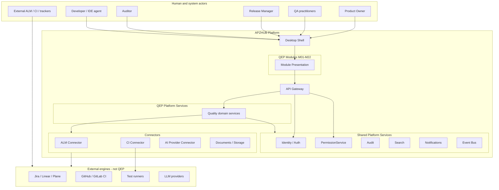
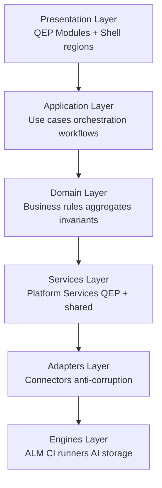
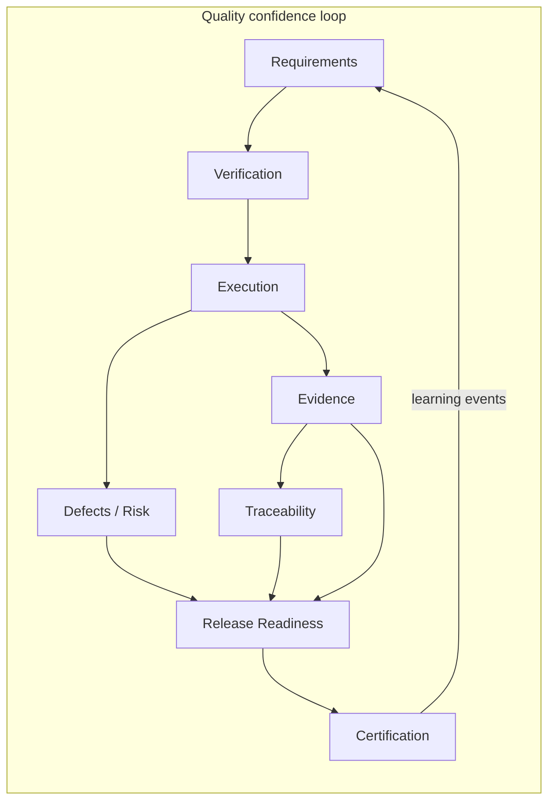
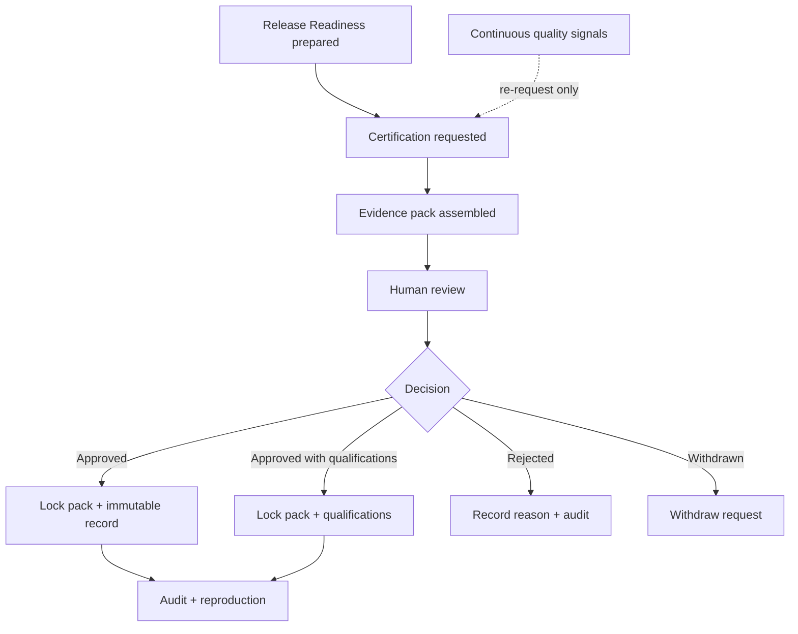

# APZQEP-ARCH-001 — Enterprise Architecture Overview

> **Programme:** APZQEP-ARCH-001  
> **Classification:** ENTERPRISE ARCHITECTURE  
> **Baseline:** APZQEP-DEF-002 (**ACCEPTED**)  
> **Rule:** Enterprise views only — no implementation

## Purpose

This document provides the **overall Enterprise Architecture (EA) overview** for APZ QEP — how the product sits on APZHUB, how architectural principles constrain design, and how structural views combine to deliver Enterprise Quality Engineering. It is the entry point for architects, security reviewers, and programme stakeholders before diving into business, application, domain, context, and information views.

## Product identity (architectural)

| Dimension | Definition |
| --------- | ---------- |
| **Product** | APZ QEP — Enterprise Quality Engineering Platform |
| **Mission** | Govern quality from approved requirements through verification, evidence, and human certification |
| **Central question** | Can this software be released with sufficient confidence? |
| **Platform relationship** | Native APZHUB product module set; consumes platform identity, permissions, audit, search, notifications, events |
| **Deployment posture** | Self-host-first modular monolith on APZHUB stack; extraction-ready service boundaries |

APZ QEP is **not** architecturally modelled as ALM, SCM, CI/CD, test runner, device cloud, or autonomous release bot. Those systems appear as **engines** behind connectors.

---

## Enterprise architecture principles

Principles apply across all views. Violations are architectural defects requiring Owner review.

| ID | Principle | Enterprise implication |
| -- | --------- | ---------------------- |
| EA-01 | Verification-centric domain | Core aggregates orbit *Verification* and *Evidence*, not sprint or pipeline metaphors |
| EA-02 | Quality SoR | Write authority for quality domains terminates in QEP Platform Services |
| EA-03 | Closed-loop governance | No module may short-circuit traceability or certification chain |
| EA-04 | Human accountability | Certification and risk acceptance require identifiable human actors |
| EA-05 | Modular monolith first | Single deployable product unit with internal modularity |
| EA-06 | Extraction readiness | Services communicate via contracts and events, not shared mutable stores |
| EA-07 | Platform composition | Cross-cutting capabilities are platform-owned, not reimplemented per module |
| EA-08 | Zero Trust everywhere | Every tier validates authn, authz, tenant scope, and intent |
| EA-09 | Assist, never decide (AI/MCP) | Assistive layers propose; humans accept into SoR |
| EA-10 | Explainability | Readiness, traceability, and intelligence must support audit narrative |

---

## Architecture views (Zachman-aligned summary)

| View | Question | Primary document |
| ---- | -------- | ---------------- |
| **Scope / Context** | Why and who? | BUSINESS-ARCHITECTURE.md |
| **Business** | What capabilities? | BUSINESS-ARCHITECTURE.md |
| **Information** | What data and ownership? | INFORMATION-ARCHITECTURE.md |
| **Application** | What logical services? | APPLICATION-ARCHITECTURE.md |
| **Domain** | What rules and aggregates? | DOMAIN-ARCHITECTURE.md + BOUNDED-CONTEXTS.md |
| **Technology** | *(Deferred to ENG-001)* | Not in ARCH-001 |

---

## Overall system context

APZ QEP operates as a **product module collection** within the APZHUB desktop shell, backed by **QEP-scoped Platform Services** and **shared platform services**, integrating with external engineering tools via **connectors**.



---

## Layered architecture (mandatory)

QEP implements APZHUB layering without bypass:



| Layer | QEP responsibility | Prohibited |
| ----- | ------------------ | ---------- |
| **Presentation** | Module UI, navigation registration, permission-filtered rendering | Business rules; direct connector calls |
| **Application** | Use-case flows crossing aggregates (e.g. hand readiness to certification) | Persistence logic; engine SDK usage |
| **Domain** | Verification, evidence, certification invariants; state machines | UI concerns; HTTP |
| **Services** | Orchestration, validation, permissions, audit, events, connector coordination | Module-to-module coupling |
| **Adapters** | Translate external models; health; error mapping | SoR ownership |
| **Engines** | External system behaviour | QEP business authority |

---

## Modular monolith first / service extraction ready

### Monolith-first rationale

| Factor | Decision |
| ------ | -------- |
| Team scale (initial) | Single product team benefits from unified deployment and transaction boundaries |
| Quality loop cohesion | Requirements → verification → execution → evidence → certification spans tight consistency needs |
| Operational simplicity | Self-host customers prefer one upgradeable unit |
| MVP timeline | Manual-first path does not justify distributed operational overhead |

### Extraction-ready markers

| Marker | Architectural requirement |
| ------ | ------------------------- |
| **Bounded contexts** | Each context owns vocabulary and SoR slice — see BOUNDED-CONTEXTS.md |
| **Service interfaces** | Application services expose stable logical interfaces inward to modules |
| **Domain events** | Cross-context integration prefers events over shared tables |
| **Anti-corruption layers** | Connectors isolate engine models from domain |
| **No module-to-module calls** | Modules always route through Platform Services |
| **Tenant boundary** | All contexts enforce tenant scope identically |

Future extraction candidates (non-binding, priority order for later programmes):

1. **Integration / ingest** — high external coupling, async-heavy
2. **Reporting / analytics read models** — read-scale separation
3. **AI / MCP gateway** — distinct security and rate posture
4. **Search indexing** — already platform-adjacent

Extraction must **not** change product modules or user-visible behaviour.

---

## Platform-first communication path

Every mutating user or agent action follows:

```text
Client (Shell / Module / MCP client)
  → API Gateway (auth, authz, rate limit, correlation ID)
    → QEP Platform Service (validation, rules, audit)
      → Domain persistence (within service boundary)
      → Connector (if external enrichment or sync)
        → Engine
      → Event Bus (async: search, notify, activity, audit enrich)
```

Modules **never** call connectors or engines. MCP tools **never** bypass Gateway and PermissionService.

---

## Central outcome mapping

Architecture organises around answering the release-confidence question:

| Stage | Architectural anchor | Primary contexts |
| ----- | -------------------- | ---------------- |
| Intent | Scope and approved needs | Portfolio/Projects, Requirements |
| Design | Governed verification specs | Verification |
| Execute | Sessions and runs | Execution, Automation Management |
| Prove | Artefacts and lineage | Evidence, Traceability |
| Remediate | Failures and uncertainty | Defects, Risk |
| Aggregate | Explainable posture | Release Readiness, Quality Intelligence |
| Decide | Human attestation | Certification |
| Learn | Reuse and improve | Knowledge, Reporting |
| Operate | Policy and investigation | Administration, Identity, Audit, Integration |



---

## Cross-cutting platform capabilities

QEP **consumes** these APZHUB capabilities — does not reimplement:

| Capability | QEP usage |
| ---------- | --------- |
| **Identity / Better Auth** | Authentication; QEP owns authorisation catalogue |
| **PermissionService** | Module and action visibility; certifier separation of duties |
| **Audit** | Immutable privileged action stream; M21 investigation UI |
| **Event Bus** | Domain events for async processing |
| **Search** | Unified index; M22 module; permission-filtered query |
| **Notifications** | Attention engine; modules publish, never direct SMTP |
| **Documents / storage** | Evidence file references; pack integrity metadata in QEP SoR |

---

## Security architecture summary (Zero Trust)

| Control plane | Architectural placement |
| ------------- | ------------------------ |
| Authentication | Gateway + platform identity |
| Authorisation | PermissionService before every service operation |
| Tenant isolation | Mandatory context on all reads/writes |
| AI/MCP tool allowlists | Administration policies; default deny |
| Certification immutability | Domain invariants + audit append-only classes |
| Connector credentials | Platform secret refs — never in modules |
| Correlation / causation IDs | Propagated Gateway → Service → Event → Audit |

Detailed security rules remain in QEP Security Constitution; this EA overview requires **architectural compliance**, not replacement.

---

## Deployment architecture (logical)

| Topology | Description |
| -------- | ----------- |
| **Standard self-host** | APZHUB stack + QEP modules/services as product bundle |
| **Tenant model** | Single tenant per deployment default; multi-tenant platform metadata where APZHUB supports |
| **Edition gates** | M14–M18 entitlements enforced at Gateway and module registration |
| **AI default** | Feature flags OFF; no AI provider required for MVP |
| **MCP default** | Catalogue defined; connectivity optional post-MVP |

Physical sizing, containers, and HA patterns belong to Engineering and platform infrastructure programmes.

---

## Quality attributes (architecture drivers)

| Attribute | Target posture |
| --------- | -------------- |
| **Auditability** | Every certification and approval reconstructable from SoR + audit |
| **Explainability** | Readiness and trace views justify decisions in human language |
| **Consistency** | Strong consistency within aggregate; eventual for search/notify |
| **Availability** | Aligns with APZHUB platform SLA; ingest async on connector degradation |
| **Extensibility** | Connectors and module manifest registration without core forks |
| **Accessibility** | WCAG AA via shared design system (006, 028) |
| **Privacy** | Tenant data residency; evidence retention policies |

---

## Relationship to product modules (M01–M22)

Modules are **presentation and registration boundaries** aligned to user mental models. Internal service count may differ from module count. See APPLICATION-ARCHITECTURE.md for logical service mapping. Module behaviour is fixed by DEF-002; architecture refines **internal structure only**.

---

## Governance and change control

| Change type | Authority |
| ----------- | --------- |
| Product behaviour | Owner via Definition amendment |
| Architecture principle | Owner Architecture Acceptance or amendment programme |
| Technology selection | Engineering ADRs post ENG-001 |
| Platform foundation | APZHUB governance |

---

## Certification lifecycle (architecture view)

Formal certification is a **human decision** over a locked evidence pack. Continuous quality signals may only trigger re-request — they never flip certification status.



---

## Document map

| Need | Read |
| ---- | ---- |
| Capabilities and value streams | BUSINESS-ARCHITECTURE.md |
| Services and orchestration | APPLICATION-ARCHITECTURE.md |
| Domain rules and events | DOMAIN-ARCHITECTURE.md |
| DDD contexts | BOUNDED-CONTEXTS.md |
| Information ownership | INFORMATION-ARCHITECTURE.md |
| Integration / API / Events | INTEGRATION · API · EVENT |
| Security / Identity / Authz | SECURITY · IDENTITY · AUTHORISATION |
| AI / MCP | AI-ARCHITECTURE · MCP-ARCHITECTURE |
| Ops / Deploy | OBSERVABILITY · DEPLOYMENT · TECHNOLOGY-STANDARDS |
| Decisions | ARCHITECTURE-DECISION-CATALOGUE.md |
| Pack control | README.md |

---

## Document control

| Version | Date | Change |
| ------- | ---- | ------ |
| 1.0.0-arch | 2026-07-24 | Initial EA overview — APZQEP-ARCH-001 |
