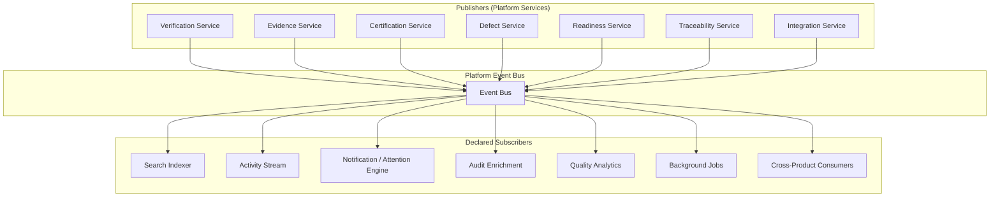
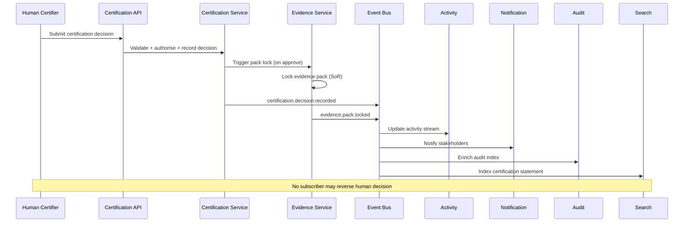
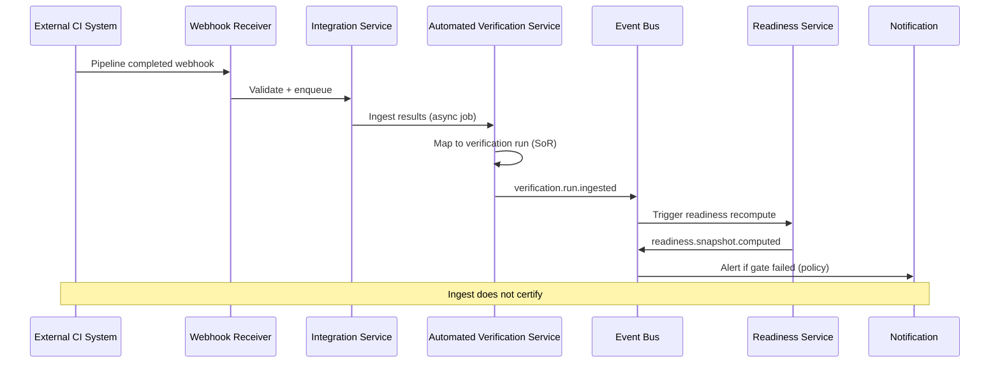
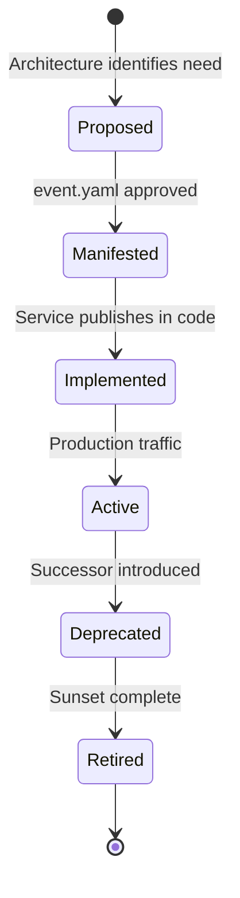

# APZ QEP — Event Architecture

> **Programme:** APZQEP-ARCH-001  
> **Status:** Architecture baseline — conceptual design only  
> **Authority:** [Product Constitution](../constitution/PRODUCT-CONSTITUTION.md) · Platform 1.4 (012, 029) · [Evidence Model](../product-definition/EVIDENCE-MODEL.md) · [Certification Model](../product-definition/CERTIFICATION-MODEL.md)  
> **Scope:** Business event ownership, publishers, subscribers, lifecycle, and governance — **no** message schemas, payload definitions, or `event.yaml` implementations

---

## 1. Purpose

This document defines the event-driven architecture for APZ QEP. Events enable decoupled, asynchronous processing across search indexing, activity streams, notifications, audit enrichment, analytics, and cross-product collaboration — while keeping Platform Services as the authoritative mutation path.

Events communicate **that something happened** in the quality lifecycle. They do not replace SoR storage, certification decisions, or audit immutability requirements.

---

## 2. Event architecture principles

| #   | Principle                       | Meaning                                                                                      |
| --- | ------------------------------- | -------------------------------------------------------------------------------------------- |
| 1   | **Services publish**            | Platform Services publish events — modules do not publish directly to the bus                |
| 2   | **Past-tense naming**           | Events name completed facts: `{domain}.{entity}.{verb}`                                      |
| 3   | **Manifest first**              | `event.yaml` before code (Platform 029)                                                      |
| 4   | **At-least-once delivery**      | Subscribers must be idempotent                                                               |
| 5   | **Correlation everywhere**      | Correlation ID on envelope; causation ID when derived                                        |
| 6   | **Tenant context mandatory**    | Multi-tenant operations never omit workspace/org context                                     |
| 7   | **Audit complement**            | Security-critical mutations also write immutable audit — events are not the sole audit store |
| 8   | **No certification via events** | Events signal certification outcomes — humans decide via governed APIs                       |
| 9   | **Additive evolution**          | Prefer additive payload fields; breaking changes require governance                          |
| 10  | **Respond fast**                | Request handlers publish events and return — subscribers process async                       |

---

## 3. Event bus topology

Modules **subscribe to UI state** via Platform APIs and real-time channels — not by consuming the raw bus directly.

---

## 4. Business event ownership

| Domain        | Owning Platform Service | Authoritative SoR           | Event purpose                            |
| ------------- | ----------------------- | --------------------------- | ---------------------------------------- |
| Requirements  | Requirements Service    | QEP requirements            | Sync, search, activity                   |
| Verification  | Verification Service    | QEP verification            | Search, activity, readiness recompute    |
| Evidence      | Evidence Service        | QEP evidence                | Search, audit, certification prep        |
| Defects       | Defect Service          | QEP defects                 | Search, activity, traceability           |
| Traceability  | Traceability Service    | QEP links                   | Search, readiness, gap alerts            |
| Risk          | Risk Service            | QEP risk records            | Readiness, certification gates           |
| Readiness     | Readiness Service       | QEP readiness snapshots     | Dashboards, certification input          |
| Certification | Certification Service   | QEP certification decisions | Activity, notifications, portfolio views |
| Integration   | Integration Service     | QEP integration state       | Health dashboards, ops alerts            |
| AI assistance | AI Quality Service      | None (supporting only)      | Activity, audit of AI actions            |
| Compliance    | Compliance Service      | QEP audit references        | Retention, export triggers               |

**Rule:** If a domain is QEP SoR, its owning Platform Service is the **sole authorised publisher** for business events in that domain.

---

## 5. Event categories

### 5.1 Lifecycle events

State transitions on governed objects: created, updated, submitted, approved, rejected, archived, superseded.

| Typical domain | Example event intent (naming pattern only)                   |
| -------------- | ------------------------------------------------------------ |
| Verification   | Verification plan baselined; session completed; run ingested |
| Evidence       | Evidence item captured; pack submitted; pack locked          |
| Certification  | Request submitted; decision recorded; statement published    |
| Defect         | Defect opened; linked to verification; disposition changed   |
| Readiness      | Snapshot computed; gate failed; gate passed                  |

### 5.2 Certification events (critical tier)

Certification events carry **elevated governance** because they affect release confidence and audit posture.

| Event intent                      | Publisher             | Subscriber expectations                                        |
| --------------------------------- | --------------------- | -------------------------------------------------------------- |
| Certification request submitted   | Certification Service | Activity, notification to reviewers, audit                     |
| Certification review assigned     | Certification Service | Notification, activity                                         |
| Certification decision recorded   | Certification Service | Activity, notification, audit, analytics, search               |
| Evidence pack locked              | Evidence Service      | Audit, certification history, export readiness                 |
| Certification statement published | Certification Service | Cross-product consumers, activity, portfolio analytics         |
| Re-certification requested        | Certification Service | Notification, activity — **does not change cert status alone** |
| Certification expired             | Certification Service | Notification, readiness recompute, portfolio views             |
| Certification superseded          | Certification Service | Audit chain preservation, history views                        |

**Constitutional constraint:** No event subscriber may **auto-approve** or **auto-flip** certification status. Continuous signals may publish _re-certification requested_ — humans decide.

### 5.3 Evidence events (critical tier)

| Event intent               | Publisher          | Subscriber expectations                        |
| -------------------------- | ------------------ | ---------------------------------------------- |
| Evidence item captured     | Evidence Service   | Search, activity, pack completeness            |
| Evidence review completed  | Evidence Service   | Activity, audit                                |
| Evidence pack assembled    | Evidence Service   | Certification readiness, activity              |
| Evidence pack submitted    | Evidence Service   | Certification workflow, notification           |
| Evidence pack locked       | Evidence Service   | Immutable audit, export, certification binding |
| Evidence exported          | Evidence Service   | Compliance audit, export history               |
| Evidence retention applied | Compliance Service | Audit, admin reporting                         |

Locked pack events are **immutable markers** — subscribers must not attempt to mutate locked content.

### 5.4 Audit events (platform complement)

| Event intent                      | Publisher                   | Purpose                                  |
| --------------------------------- | --------------------------- | ---------------------------------------- |
| Privileged action performed       | Domain Service + Audit      | Activity, compliance reporting           |
| Permission changed                | Platform Permission Service | QEP admin audit views                    |
| Integration configuration changed | Integration Service         | Security audit, Integration Centre       |
| AI recommendation generated       | AI Quality Service          | Explainability, activity                 |
| AI draft accepted / rejected      | AI Quality Service          | Audit, traceability                      |
| MCP tool invoked (mutating)       | MCP Gateway / Service       | Security audit                           |
| Export performed                  | Compliance Service          | Regulatory audit trail                   |
| Policy changed                    | Administration Service      | Compliance, certification rule recompute |

Audit events **complement** immutable audit storage — they do not replace it (RR-010).

### 5.5 Integration events

| Event intent                   | Publisher                      | Purpose                                      |
| ------------------------------ | ------------------------------ | -------------------------------------------- |
| Sync job completed / failed    | Integration Service            | Integration Centre health, ops alerts        |
| Unlinked run detected          | Automated Verification Service | Notification to automation engineer          |
| External reference linked      | Traceability Service           | Search, readiness                            |
| Webhook received and processed | Integration Service            | Audit, retry management                      |
| Connector health degraded      | Connector runtime              | Administration Workspace, Integration Centre |

### 5.6 Derived / analytical events

| Event intent                | Publisher                    | Purpose                                  |
| --------------------------- | ---------------------------- | ---------------------------------------- |
| Readiness snapshot computed | Readiness Service            | Dashboards, certification input          |
| Coverage gap detected       | Quality Intelligence Service | Notification (non-authoritative)         |
| Risk threshold exceeded     | Risk Service                 | Readiness gate, notification             |
| Trend anomaly detected      | Quality Intelligence Service | Executive dashboards — **advisory only** |

Derived events **never** mutate SoR without a subsequent governed API operation.

---

## 6. End-to-end event flow (certification path)

---

## 7. End-to-end event flow (verification ingest path)

---

## 8. Subscriber registry model

| Subscriber              | Consumes                               | Must not                          |
| ----------------------- | -------------------------------------- | --------------------------------- |
| **Search indexer**      | CRUD events across domains             | Mutate SoR                        |
| **Activity stream**     | Lifecycle + certification + evidence   | Grant permissions                 |
| **Notification engine** | Assignment, failure, cert, gate events | Send without permission filter    |
| **Audit enrichment**    | Privileged + cert + evidence events    | Replace immutable audit store     |
| **Quality analytics**   | Verification, defect, cert, readiness  | Auto-certify or auto-waive        |
| **Background jobs**     | Sync completion, retention, recompute  | Bypass authz                      |
| **Cross-product**       | Portfolio-level cert, project linkage  | Write QEP SoR without service API |

Subscribers declare interest in event manifests — undeclared consumption is forbidden in production.

---

## 9. Event lifecycle governance

| Stage               | Gate                                                                |
| ------------------- | ------------------------------------------------------------------- |
| **Proposed**        | Product Definition or Architecture identifies business need         |
| **Manifested**      | `event.yaml` with publisher, subscribers, version, sensitivity tier |
| **Security review** | Required for certification, evidence, audit, permission events      |
| **Implemented**     | Contract tests — publisher and subscriber idempotency               |
| **Active**          | Monitored — volume, latency, failure rate                           |
| **Deprecated**      | Subscribers migrated; documented sunset                             |
| **Retired**         | No longer emitted                                                   |

---

## 10. Event sensitivity tiers

| Tier                       | Examples                              | Controls                                           |
| -------------------------- | ------------------------------------- | -------------------------------------------------- |
| **Public derived**         | Dashboard metric refreshed            | Standard tenant isolation                          |
| **Internal operational**   | Sync job status                       | Service identity consumption                       |
| **Business confidential**  | Defect opened, risk accepted          | Permission-filtered subscribers                    |
| **Certification critical** | Decision recorded, pack locked        | Audit complement mandatory; restricted subscribers |
| **Security privileged**    | Permission changed, MCP mutating tool | Security audit; minimal subscriber set             |

---

## 11. Idempotency and ordering

| Concern                | Policy                                                                       |
| ---------------------- | ---------------------------------------------------------------------------- |
| **Delivery guarantee** | At-least-once                                                                |
| **Duplicate handling** | Subscribers deduplicate on event ID and/or business key                      |
| **Ordering**           | Per-aggregate ordering preferred (e.g., single certification request stream) |
| **Out-of-order**       | Subscribers tolerate reordering; reconcile via SoR read when needed          |
| **Poison messages**    | Dead-letter queue with ops alerting                                          |
| **Replay**             | Controlled replay for subscriber recovery — audited, permission-gated        |

---

## 12. Cross-product event interactions

QEP participates in the APZHUB portfolio event catalogue as a publisher and consumer:

| Direction                | Intent                                                               |
| ------------------------ | -------------------------------------------------------------------- |
| **QEP publishes**        | Certification status, quality gate outcomes for portfolio visibility |
| **QEP consumes**         | Project/release context from Projects product (when integrated)      |
| **QEP does not consume** | Events that would silently mutate certification or locked evidence   |

Cross-product consumption follows Platform Integration standards — references, not authority transfers.

---

## 13. Anti-patterns (forbidden)

| Anti-pattern                               | Why forbidden                         |
| ------------------------------------------ | ------------------------------------- |
| Module publishes directly to bus           | Bypasses service validation and audit |
| Event as sole audit store                  | RR-010 requires immutable audit       |
| Subscriber mutates SoR                     | Violates service authority            |
| Auto-certify on event                      | Constitutional violation              |
| Undeclared subscriber                      | Governance and security gap           |
| Synchronous event chain in request         | Violates respond-fast principle       |
| Locked evidence mutation via event handler | SoR integrity violation               |

---

## 14. Cross-document references

| Topic                    | Document                                                                                     |
| ------------------------ | -------------------------------------------------------------------------------------------- |
| Integration patterns     | [INTEGRATION-ARCHITECTURE.md](./INTEGRATION-ARCHITECTURE.md)                                 |
| API async patterns       | [API-ARCHITECTURE.md](./API-ARCHITECTURE.md)                                                 |
| Security and audit       | [SECURITY-ARCHITECTURE.md](./SECURITY-ARCHITECTURE.md)                                       |
| Certification model      | [../product-definition/CERTIFICATION-MODEL.md](../product-definition/CERTIFICATION-MODEL.md) |
| Evidence model           | [../product-definition/EVIDENCE-MODEL.md](../product-definition/EVIDENCE-MODEL.md)           |
| Platform event standards | Platform docs 012, 029                                                                       |

---

## Document control

| Field              | Value                                                             |
| ------------------ | ----------------------------------------------------------------- |
| Programme          | APZQEP-ARCH-001                                                   |
| Version            | 1.0.0-arch                                                        |
| Classification     | Event architecture — conceptual                                   |
| Prohibited content | Message schemas, payload fields, event.yaml implementations, code |
| Next review        | After Owner Architecture Acceptance                               |
