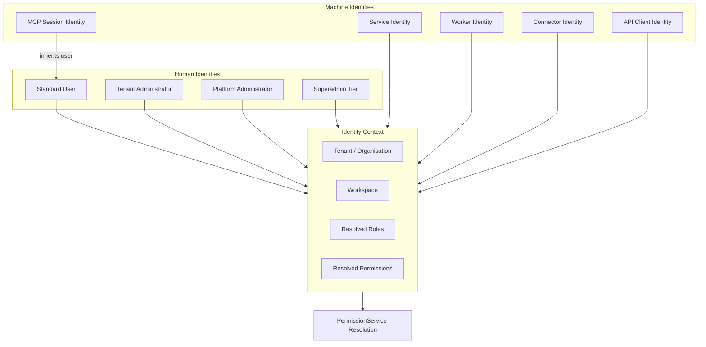
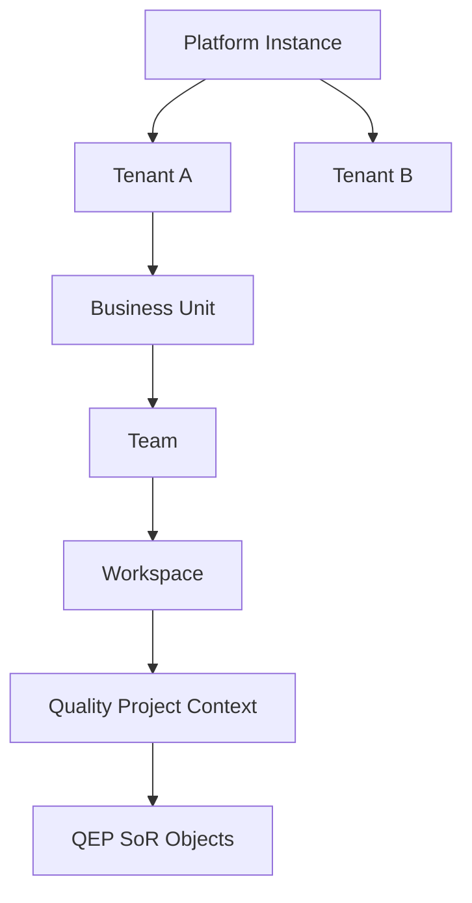
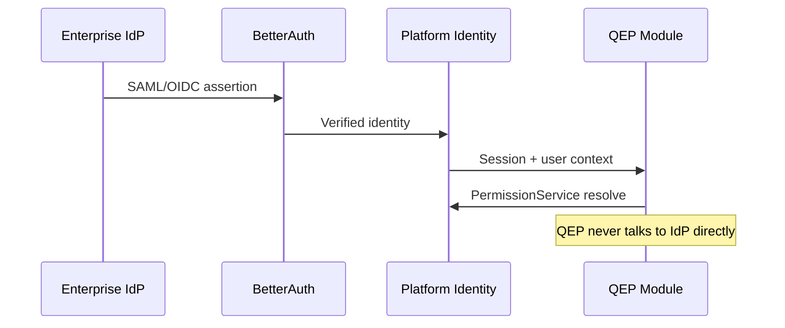
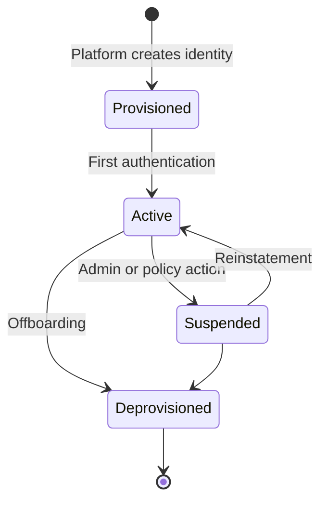

# APZ QEP — Identity Architecture

> **Programme:** APZQEP-ARCH-001  
> **Status:** Architecture baseline — conceptual design only  
> **Authority:** [Product Constitution](../constitution/PRODUCT-CONSTITUTION.md) · [Security Constitution](../constitution/SECURITY-CONSTITUTION.md) · Platform 1.4 (007, 011, 013)  
> **Scope:** Identity types, tenancy, session model, federation, and delegation — **no** implementation code, schema, or protocol specifications

---

## 1. Purpose

This document defines the identity architecture for APZ QEP. Identity establishes **who** is acting in the platform. Authorisation — defined separately — establishes **what** they may do. QEP consumes APZHUB Platform Identity; it does not operate an independent authentication engine or permission store.

The architectural split is mandatory:

| Concern               | Owner                                               |
| --------------------- | --------------------------------------------------- |
| **Authentication**    | BetterAuth via Platform Identity — verify identity  |
| **Authorisation**     | APZHUB PermissionService — grant or deny capability |
| **Provisioning**      | APZHUB platform — users, tenants, role assignment   |
| **Audit attribution** | Platform + QEP — bind actions to resolved identity  |

---

## 2. Identity principles

| #   | Principle                              | Meaning                                                                                     |
| --- | -------------------------------------- | ------------------------------------------------------------------------------------------- |
| 1   | **Single SSO**                         | One login across APZHUB — no QEP-specific login screens                                     |
| 2   | **Platform-owned identity**            | User records, tenant membership, and session lifecycle are platform metadata                |
| 3   | **Authentication ≠ authorisation**     | BetterAuth verifies identity; PermissionService decides access                              |
| 4   | **No engine identity exposure**        | Backend engine user accounts are connector-internal — never user-facing                     |
| 5   | **Least privilege identities**         | Every identity type receives minimum necessary scope                                        |
| 6   | **Tenant isolation**                   | Identity context includes tenant — cross-tenant identity confusion prevented                |
| 7   | **Auditable attribution**              | Every SoR mutation binds to a resolved identity (human or service)                          |
| 8   | **Delegation is explicit**             | Acting-on-behalf requires governed delegation — never implicit                              |
| 9   | **Machine identities are first-class** | Services, workers, connectors, and API clients have distinct identity types                 |
| 10  | **Federation ready**                   | Enterprise IdP federation via Platform Identity — QEP does not implement SAML/OIDC directly |

---

## 3. Identity taxonomy

---

## 4. Human identities

| Identity class             | Description                                 | Typical QEP activities                                     |
| -------------------------- | ------------------------------------------- | ---------------------------------------------------------- |
| **Standard user**          | Authenticated organisation member           | Verification execution, evidence capture, defect logging   |
| **QA Engineer**            | Standard user with verification permissions | Manual/exploratory sessions, procedure design              |
| **QA Manager**             | Elevated quality governance                 | Baselines, co-certification review, team oversight         |
| **Release Manager**        | Release scope owner                         | Certification request and primary certification decision   |
| **Compliance Officer**     | Regulated environment approver              | Co-approval on certification in regulated tenants          |
| **Automation Engineer**    | Integration-focused user                    | Runner mapping, ingest health — cannot certify             |
| **Auditor**                | Read-heavy compliance role                  | Audit investigation, export — no cert by default           |
| **Tenant Administrator**   | Org-level admin                             | Entitlements, policies, user role assignment within tenant |
| **Platform Administrator** | Cross-tenant platform ops                   | Integration governance, tenant provisioning                |
| **Superadmin tier**        | Explicit elevated platform tier             | Audited platform operations — **not a security bypass**    |

Personas map to permission bundles — persona names are product vocabulary; PermissionService resolves concrete grants.

---

## 5. Machine identities

| Identity class           | Purpose                                            | Scope                                                 | Lifecycle                                |
| ------------------------ | -------------------------------------------------- | ----------------------------------------------------- | ---------------------------------------- |
| **Service identity**     | Platform Service inter-service calls               | Service-specific operations                           | Platform-managed rotation                |
| **Worker identity**      | Background jobs: batch, sync, retention, recompute | Job-type scoped                                       | Short-lived tokens preferred             |
| **Connector identity**   | Outbound calls to external engines                 | Per-connector, per-tenant engine scope                | Credential rotation via Platform secrets |
| **API client identity**  | External integrator systems                        | Client registration scope — subset of org permissions | Client credential rotation               |
| **MCP session identity** | IDE/agent tool invocations                         | **Inherits invoking user** — no independent elevation | Bound to user session lifetime           |
| **Webhook identity**     | Inbound external system attribution                | Source system + tenant binding                        | Registered endpoint credentials          |

Machine identities **never** hold certification approval authority.

---

## 6. Tenancy model

| Concept                     | Architectural meaning                                           |
| --------------------------- | --------------------------------------------------------------- |
| **Platform**                | APZHUB instance — deployment boundary                           |
| **Tenant / organisation**   | Primary isolation boundary for QEP SoR                          |
| **Business unit**           | Optional sub-structure for large enterprises                    |
| **Team**                    | Collaboration group within tenant                               |
| **Workspace**               | APZHUB shell workspace context — may align with quality project |
| **Quality project context** | QEP scope for requirements, verification, releases              |

**Rule:** Every QEP SoR query includes tenant context. Cross-tenant access is forbidden except for explicitly audited platform administrator operations.

---

## 7. Session model

| Aspect                  | Design                                                             |
| ----------------------- | ------------------------------------------------------------------ |
| **Session authority**   | Platform Identity / BetterAuth                                     |
| **Session binding**     | User + tenant + workspace context                                  |
| **Handoff**             | Silent session across APZHUB products — no re-login                |
| **Expiry**              | Platform session TTL; refresh via Platform Identity                |
| **Revocation**          | Platform-admin or tenant-admin revocation propagates immediately   |
| **Concurrent sessions** | Platform policy — QEP does not maintain parallel session store     |
| **MCP binding**         | MCP server validates active platform session before tool execution |
| **API client sessions** | Token-based; scoped to registered client and tenant                |

Session establishment is **authentication**. Permission resolution on each request is **authorisation** — session alone grants nothing.

---

## 8. Federation architecture

| Federation type                | Owner                                    | QEP role                       |
| ------------------------------ | ---------------------------------------- | ------------------------------ |
| **Enterprise IdP (SAML/OIDC)** | Platform Identity configuration          | Consume authenticated identity |
| **Social / email login**       | BetterAuth providers                     | Consume authenticated identity |
| **Engine SSO (ALM, CI)**       | Connector layer — forward-auth or tokens | Connector-internal only        |
| **AI provider auth**           | AI Provider Connector                    | Outbound inference only        |

QEP modules and MCP tools **never** implement federation protocols directly. Per-engine SSO is connector configuration documented per integration ADR.

---

## 9. Roles and permissions (identity perspective)

Identity architecture defines **who exists** and **how they authenticate**. Permission architecture defines **what they can do**.

| Layer               | Identity concern              | Authorisation concern (see sibling doc) |
| ------------------- | ----------------------------- | --------------------------------------- |
| User record         | Platform Identity             | Role assignment                         |
| Group membership    | Platform Identity             | Group → permission mapping              |
| Tenant membership   | Platform Identity             | Tenant-scoped permission resolution     |
| Service account     | Machine identity registration | Service permission scope                |
| Certification actor | Human identity required       | Certification approval permission       |

Backend engine roles (e.g., ALM project admin) are **connector-internal**. Platform permissions translate to connector capabilities without exposing engine role names in QEP UI.

---

## 10. Delegation model

| Delegation type           | Governance                                             |
| ------------------------- | ------------------------------------------------------ |
| **Role assignment**       | Tenant Administrator assigns roles — audited           |
| **Temporary elevation**   | Time-bound if supported — explicit approval + audit    |
| **Acting on behalf**      | Documented delegation chain for certification co-sign  |
| **API client delegation** | Client acts for org — scoped; human owner registered   |
| **AI assistant**          | No delegation — operates as invoking user only         |
| **Service impersonation** | Forbidden for certification — human identity mandatory |

Delegation **never** grants certification authority to non-human identities.

---

## 11. Identity lifecycle

| Event                  | QEP behaviour                                                          |
| ---------------------- | ---------------------------------------------------------------------- |
| **User provisioned**   | Available for role assignment; no SoR access until permissions granted |
| **User suspended**     | Immediate permission denial; active sessions invalidated by Platform   |
| **User deprovisioned** | Historical audit attribution preserved; no new actions                 |
| **Tenant provisioned** | Empty QEP SoR; default policies applied                                |
| **Tenant offboarded**  | Retention and legal hold per compliance policy before purge            |

---

## 12. Identity in certification and evidence

| Requirement                | Identity binding                                                               |
| -------------------------- | ------------------------------------------------------------------------------ |
| **Certification decision** | Named human approver identity — immutable record                               |
| **Evidence capture**       | Capturer identity on evidence metadata                                         |
| **Evidence review**        | Reviewer identity recorded                                                     |
| **Export**                 | Exporter identity audited                                                      |
| **AI draft**               | Invoking user identity + AI action marker — non-authoritative until acceptance |
| **Rejection rationale**    | Rejecting human identity required                                              |

No identity type except authorised human users may appear as certification approver.

---

## 13. Identity security controls

| Control                            | Application                                               |
| ---------------------------------- | --------------------------------------------------------- |
| **MFA**                            | Platform Identity policy — enforced per tenant/deployment |
| **Password policy**                | BetterAuth / IdP managed                                  |
| **Account lockout**                | Platform Identity                                         |
| **Session hijacking prevention**   | TLS, secure cookies, platform CSRF                        |
| **Service credential rotation**    | Platform-managed schedules                                |
| **Connector credential isolation** | Per-tenant — compromise containment                       |
| **Audit of identity changes**      | Platform audit + QEP admin views                          |

---

## 14. Anti-patterns (forbidden)

| Anti-pattern                                 | Violation                          |
| -------------------------------------------- | ---------------------------------- |
| QEP-local user database for authentication   | Single SSO principle               |
| QEP-local permission store                   | PermissionService authority        |
| Exposing engine user accounts in UI          | Brand masking + connector boundary |
| MCP independent identity with elevated scope | Permission inheritance rule        |
| Service identity as certifier                | Human accountability               |
| Cross-tenant identity without audit          | Tenant isolation                   |
| Shared human credentials for connectors      | Least privilege                    |

---

## 15. Cross-document references

| Topic                         | Document                                                                                     |
| ----------------------------- | -------------------------------------------------------------------------------------------- |
| Authorisation and permissions | [AUTHORISATION-ARCHITECTURE.md](./AUTHORISATION-ARCHITECTURE.md)                             |
| Security controls             | [SECURITY-ARCHITECTURE.md](./SECURITY-ARCHITECTURE.md)                                       |
| MCP identity binding          | [INTEGRATION-ARCHITECTURE.md](./INTEGRATION-ARCHITECTURE.md)                                 |
| Certification actors          | [../product-definition/CERTIFICATION-MODEL.md](../product-definition/CERTIFICATION-MODEL.md) |
| Personas                      | [../product-definition/PERSONAS.md](../product-definition/PERSONAS.md)                       |
| Platform IAM                  | Platform doc 007                                                                             |

---

## Document control

| Field              | Value                                            |
| ------------------ | ------------------------------------------------ |
| Programme          | APZQEP-ARCH-001                                  |
| Version            | 1.0.0-arch                                       |
| Classification     | Identity architecture — conceptual               |
| Prohibited content | Schema, protocol specs, code, credential formats |
| Next review        | After Owner Architecture Acceptance              |
