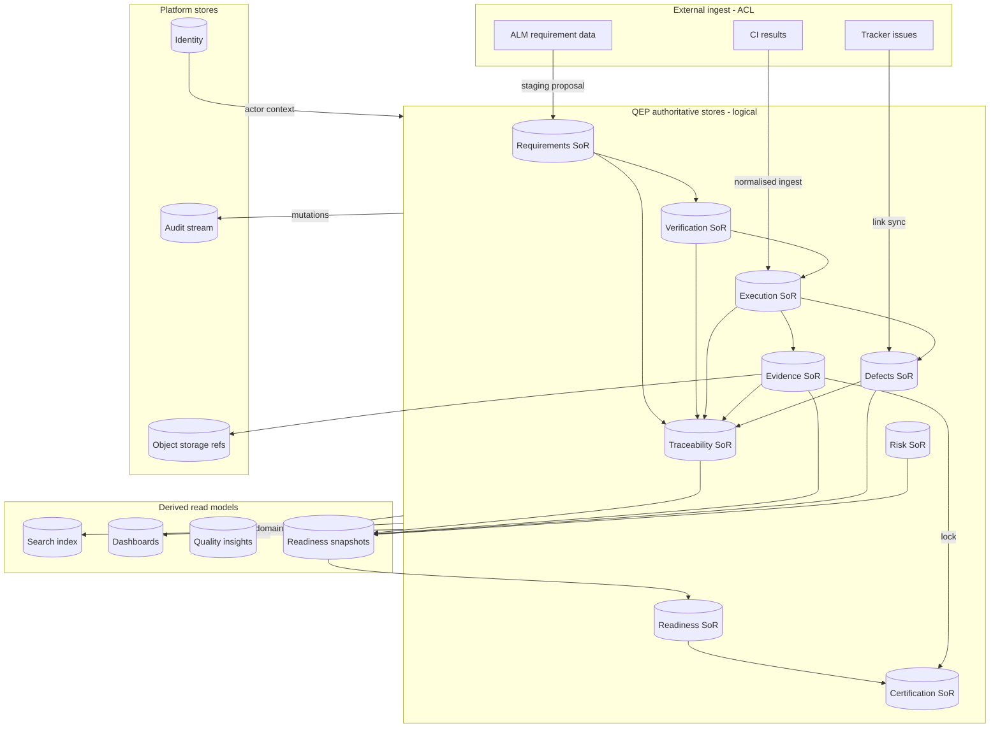
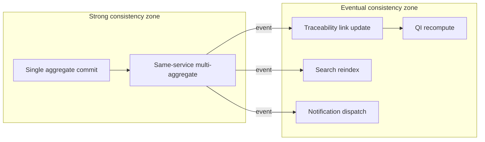

# APZQEP-ARCH-001 — Information Architecture

> **Programme:** APZQEP-ARCH-001  
> **Classification:** ENTERPRISE ARCHITECTURE  
> **Baseline:** APZQEP-DEF-002 (**ACCEPTED**)  
> **Rule:** Logical information architecture only — no physical schema, tables, types, or storage design

## Purpose

This document defines the **enterprise information architecture** for APZ QEP — authoritative information ownership, information flows, lifecycle rules, consistency boundaries, read models, and reference/master data. It complements the product-level [INFORMATION-ARCHITECTURE.md](../product-definition/INFORMATION-ARCHITECTURE.md) with **architectural** ownership and flow semantics required for Engineering — without prescribing database design.

## Information architecture principles

| ID | Principle | Meaning |
| -- | --------- | ------- |
| IA-01 | One System of Record per datum | Each quality fact has exactly one authoritative owner |
| IA-02 | QEP SoR for quality domains | Requirements, verification, execution results, evidence metadata, defects (quality), certification, trace links, risk — QEP authoritative |
| IA-03 | Platform SoR for cross-cutting identity | Users, sessions, base audit stream — platform authoritative |
| IA-04 | Engines are references | ALM, CI, runners, trackers contribute — never own QEP quality truth |
| IA-05 | Derived never authoritative | Search index, dashboards, QI insights, readiness snapshots (after supersede) — derived |
| IA-06 | Immutability classes | Certification decisions, locked evidence packs, approved baselines — append-only or versioned |
| IA-07 | AI non-authoritative until accept | AI/MCP outputs are staging information until human promotes to SoR |
| IA-08 | Tenant isolation | All information scoped to tenant — no cross-tenant refs |
| IA-09 | Correlation preserved | Information flows carry correlation IDs for audit reconstruction |
| IA-10 | Evidence before narrative | Readiness and cert narratives must reference evidence lineage |

---

## Authoritative ownership map

| Information class | Authoritative owner | Non-authoritative copies |
| ----------------- | ------------------- | ------------------------ |
| Quality requirement content and approval state | QEP Requirements | ALM issue mirrors |
| Verification procedure content and approval | QEP Verification | Automation repo files |
| Execution sessions, runs, step results | QEP Execution | CI job logs (reference) |
| Evidence item metadata and pack membership | QEP Evidence | Object storage blobs |
| Defect quality record and linkages | QEP Defects | External tracker issues |
| Trace links and gap findings | QEP Traceability | — |
| Risk and acceptance records | QEP Risk | — |
| Release scope and readiness snapshots | QEP Release Readiness | — |
| Certification decisions and statements | QEP Certification | External release tools (consumer) |
| Knowledge items (approved) | QEP Knowledge | — |
| Automation asset metadata and ingest status | QEP Automation Management | CI system config |
| Integration connection config refs | QEP Integration | Secret values in platform vault |
| QEP policies and entitlements | QEP Administration | — |
| AI sessions and recommendations (pre-accept) | QEP AI (staging) | — |
| MCP tool invocations | QEP MCP + Platform Audit | — |
| User identity and authentication | Platform Identity | — |
| Permission assignments (QEP catalogue) | QEP Administration + PermissionService | — |
| Audit events (canonical stream) | Platform Audit | QEP investigation views |
| Search index documents | Platform Search (derived) | — |
| Notification delivery state | Platform Notification | — |
| Project/org/team structure (quality scope) | QEP Portfolio | ALM project names |
| Report/export job metadata | QEP Reporting (derived) | — |
| Quality indicators and insights | QEP Quality Intelligence (derived) | — |

---

## Information classification

| Class | Description | Examples | Retention |
| ----- | ----------- | -------- | --------- |
| **Governed SoR** | Mutable under rules; audit on change | Requirement, procedure, defect | Policy-driven |
| **Immutable record** | Append-only after milestone | Certification decision, locked pack | Long / legal hold |
| **Versioned history** | Supersede not delete | Requirement versions, procedure versions | Policy-driven |
| **Derived read model** | Rebuild from events | Search doc, dashboard aggregate | Rebuildable |
| **Staging** | Awaiting human accept | AI draft, import proposal, MCP proposal | Short TTL |
| **Reference** | External ID pointer | ALM issue key, CI build ID | While link valid |
| **Secret ref** | Credential pointer only | Connector token ref | Platform vault policy |

---

## Core information entities (logical)

Grouped by owning context — **not** physical tables.

### Scope and governance

| Entity | Owner | Key relationships |
| ------ | ----- | ----------------- |
| Tenant | Platform / Administration | Root scope |
| Organisation | Administration | Parent of teams |
| Team | Portfolio | Assigned to projects |
| Project | Portfolio | Parent of requirements, releases |
| Environment | Portfolio | Used by execution |
| QEP Policy | Administration | Constrains workflows |
| Entitlement | Administration | Gates modules M14–M18 |

### Quality chain

| Entity | Owner | Key relationships |
| ------ | ----- | ----------------- |
| Requirement | Requirements | → procedures via trace |
| Baseline | Requirements | Frozen requirement set |
| VerificationProcedure | Verification | → runs/sessions |
| Session / Run | Execution | → results, evidence |
| StepResult | Execution | → defects on fail |
| EvidenceItem | Evidence | → pack, storage ref |
| EvidencePack | Evidence | → certification lock |
| Defect | Defects | → requirement, verification |
| TraceLink | Traceability | Cross-entity edge |
| Risk / RiskAcceptance | Risk | → release scope |
| Release | Release Readiness | → snapshot |
| ReadinessSnapshot | Release Readiness | Point-in-time aggregate |
| Certification | Certification | → decision, approvers |

### Supporting and derived

| Entity | Owner | Nature |
| ------ | ----- | ------ |
| AutomationAsset | Automation Management | Reference metadata |
| IngestRecord | Automation Management | Staging → execution |
| Integration | Integration | Config + health |
| KnowledgeItem | Knowledge | Approved reuse |
| Insight | Quality Intelligence | Derived |
| SavedSearch | Search | User preference |
| ReportExport | Reporting | Derived job |

---

## Information flow diagram



---

## Lifecycle information rules

### Requirement lifecycle (information)

| State | Meaning | Downstream effect |
| ----- | ------- | ----------------- |
| Draft | Editable work-in-progress | No verification obligation |
| In review | Awaiting approval | Trace may exist as draft links |
| Approved | Authoritative need | Enables verification design obligation |
| Deprecated | Retained history | No new verification |
| Superseded | Replaced by version | Trace points to successor |

### Verification lifecycle (information)

| State | Meaning | Downstream effect |
| ----- | ------- | ----------------- |
| Design draft | Not in library | Not executable |
| Approved | In library | Executable |
| Retired | Historical | No new runs |

### Execution lifecycle (information)

| State | Meaning | Evidence |
| ----- | ------- | -------- |
| Planned | Scheduled | — |
| In progress | Active session/run | Partial results allowed |
| Completed | Terminal success path | Results + evidence refs |
| Cancelled | Abandoned | Audit reason |

### Evidence lifecycle (information)

| State | Meaning | Mutability |
| ----- | ------- | ---------- |
| Captured | Registered | Editable metadata |
| Reviewed | Reviewer attested | Limited edit |
| Packaged | In pack | Pack composition locked |
| Locked | Certification linked | **Immutable** |

### Certification lifecycle (information)

| State | Meaning | Mutability |
| ----- | ------- | ---------- |
| Requested | Awaiting review | Cancellable |
| In review | Approvers active | — |
| Decided | Terminal decision | **Immutable** |
| Expired / Superseded | Historical | Append-only supersede record |

---

## Consistency boundaries

| Boundary | Consistency model | Rationale |
| -------- | ----------------- | --------- |
| Within single aggregate (e.g. Certification) | Strong / immediate | Invariants must hold on commit |
| Cross-aggregate same context (e.g. pack + items) | Transactional in service | Evidence pack integrity |
| Cross-context (Execution → Traceability) | Eventual via domain event | Loose coupling; extraction-ready |
| Search index | Eventual | Rebuild tolerated; never SoR |
| Readiness snapshot | Point-in-time consistent read | Snapshot ID immutability after publish |
| External sync (ALM) | Eventual + human accept for SoR | ACL staging |
| Connector ingest | At-least-once + idempotent | Duplicate CI events safe |



---

## Read models

| Read model | Source SoR | Refresh trigger | Consumer |
| ---------- | ---------- | --------------- | -------- |
| Trace matrix | Requirements, Verification, Execution, Evidence, Defects | Link/event | M10, M12, M13 |
| Coverage gap list | Traceability | Link change | M10, M12 |
| Execution progress board | Execution | Result events | M06, M01 |
| Open defect summary | Defects | Defect events | M01, M12 |
| Readiness snapshot | Multiple SoR | Assessment command | M12, M13 |
| Cert history timeline | Certification | Cert events | M13, M21 |
| Home work queue | Execution, Approvals | Assignment events | M01 |
| Executive dashboard | Reporting aggregates | Scheduled/event | M15 |
| Quality insight panel | QI derived | Batch/event | M14 |
| Global search hit | Search index | Index subscriber | M22 |

Read models **must** be reconstructable from SoR + events — not independently edited.

---

## Reference and master data

### Master data (managed in QEP)

| Master entity | Steward | Change frequency |
| ------------- | ------- | ---------------- |
| Project catalogue | Portfolio admin | Low |
| Environment definitions | Project owner | Medium |
| Verification templates | QA Manager | Medium |
| Gate policy templates | Administration | Low |
| Role-permission catalogue | Administration | Low |
| Defect severity/priority scales | Administration | Low |
| Retention policy classes | Administration | Low |
| Custom field definitions | Administration | Medium |

### Reference data (external pointers)

| Reference | Stored as | Authoritative for |
| --------- | --------- | ----------------- |
| ALM issue key | External link on requirement/defect | ALM for issue content |
| Repository URL | Project reference | SCM |
| CI pipeline / build ID | Execution context | CI engine |
| Automation test ID | Procedure field + Automation asset | Runner repo |
| Storage object key | Evidence item ref | Object storage |
| Tracker issue ID | Defect external link | Tracker |
| LLM model ID | AI session config | Provider |

References include **sync timestamp** and **health** where Integration monitors — never imply external authority over QEP SoR fields.

---

## Information flows by business scenario

### Scenario 1: Manual verification to certification

```text
Requirement (approved)
  → VerificationProcedure (approved)
    → Session + StepResults
      → EvidenceItems (refs)
        → TraceLinks (auto + manual)
          → ReadinessSnapshot
            → CertificationDecision + EvidencePack (locked)
              → Audit events (immutable)
                → Search index (async)
```

### Scenario 2: CI ingest

```text
CI webhook → Integration ACL → IngestRecord (staging)
  → idempotent map → Run + StepResults in Execution SoR
    → Evidence refs (log URLs)
      → AutomationManagement health update
        → Traceability link refresh (eventual)
          → Readiness recalculation (on demand)
```

### Scenario 3: AI-assisted design (when enabled)

```text
AIQualityService draft (staging)
  → human review in AI Workspace
    → accept → VerificationDesign draft
      → peer review → VerificationProcedure (approved)
        → rejects leave staging only — never SoR
```

### Scenario 4: MCP proposal

```text
MCPToolInvoked (audited)
  → Proposal queue (staging)
    → human approve → target service command
      → SoR mutation with actor = human (agent as tool context only)
```

---

## Data volume and retention (architectural drivers)

| Information class | Growth driver | Retention architectural note |
| ----------------- | ------------- | ---------------------------- |
| Step results | Execution frequency | Policy classes per project |
| Evidence metadata | Capture richness | Linked to cert locks |
| Audit events | All mutations | Platform retention + legal hold |
| Search index | Object count | Rebuild — not archived as SoR |
| AI sessions | When enabled | Shorter retention unless accepted |
| Snapshots | Release cadence | Immutable after publish |

Physical tiering and archival mechanics belong to Engineering.

---

## Security and privacy (information)

| Concern | Architectural control |
| ------- | --------------------- |
| PII in evidence | Classification tags; access roles |
| Cross-project leakage | Project scope on every entity |
| Auditor access | Read-only investigation views |
| AI data boundary | Tenant policy; no cross-tenant training |
| Export | Audited; permission-gated |
| Legal hold | Supersedes normal retention delete |

---

## Conflict resolution

| Conflict | Resolution |
| -------- | ---------- |
| ALM issue vs QEP requirement | QEP approved state wins for quality obligation |
| CI re-run duplicate | Idempotent ingest key on execution |
| Concurrent requirement edit | Optimistic versioning surfaced to user |
| External tracker closed, QEP open | Sync proposal — human reconcile |
| Search index stale | Reindex job — SoR wins on read |

---

## Alignment with product definition IA

APZQEP-DEF-002 [INFORMATION-ARCHITECTURE.md](../product-definition/INFORMATION-ARCHITECTURE.md) defines **product object semantics** for users. This document adds:

- Authoritative ownership and non-authoritative boundaries
- Consistency models and read model catalogue
- Information flow scenarios for architecture and Engineering
- Reference vs master data classification

On object meaning conflict, Product Definition prevails; on ownership/conflict resolution, this document prevails for architecture.

---

## Related documents

| Document | Relationship |
| -------- | ------------ |
| DOMAIN-ARCHITECTURE.md | Domain events |
| BOUNDED-CONTEXTS.md | Context ownership |
| [SYSTEM-OF-RECORD.md](../constitution/SYSTEM-OF-RECORD.md) | Constitutional SoR |
| [EVIDENCE-MODEL.md](../product-definition/EVIDENCE-MODEL.md) | Evidence product rules |

---

## Document control

| Version | Date | Change |
| ------- | ---- | ------ |
| 1.0.0-arch | 2026-07-24 | Initial information architecture — APZQEP-ARCH-001 |
