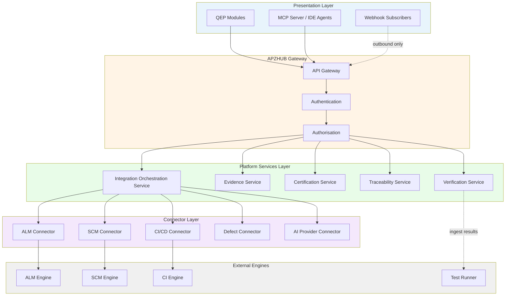

# APZ QEP — Integration Architecture

> **Programme:** APZQEP-ARCH-001  
> **Status:** Architecture baseline — conceptual design only  
> **Authority:** [Product Constitution](../constitution/PRODUCT-CONSTITUTION.md) · [Product Definition](../product-definition/PRODUCT-DEFINITION.md) · [Product Boundaries](../product-definition/PRODUCT-BOUNDARIES.md) · Platform 1.4 (008, 009, 010, 026)  
> **Scope:** Integration patterns, boundaries, and governance — **no** endpoint specifications, schemas, or implementation code

---

## 1. Purpose

This document defines how APZ QEP integrates with external systems, platform services, and agent channels while preserving its identity as an **Enterprise Quality Engineering Platform**. Integration is a means to enrich quality governance — not to transform QEP into ALM, SCM, CI/CD, or an automation runner.

The central architectural invariant:

```text
QEP Module → APZHUB API Gateway → Platform Service → Connector → External Engine
```

Modules and extensions **never** bypass Platform Services or call backend engines directly.

---

## 2. Architectural principles

| Principle | Statement | Constitutional basis |
| --------- | --------- | -------------------- |
| **Platform-first** | All integration traffic enters through APZHUB Gateway and Platform Services | Article II §8 Platform-first |
| **API-first** | Capabilities are exposed as governed, versioned APIs — not ad hoc scripts | Article II §9 API-first |
| **Self-host-first** | Connectors target Community Edition / self-hosted OSS engines where applicable | Platform 004, 026 |
| **Zero Trust** | Every integration call verifies identity, permission, integrity, intent, and context | Security Constitution |
| **Least privilege** | Connectors, workers, MCP tools, and webhooks receive minimum necessary scope | Security Constitution |
| **SoR discipline** | QEP remains authoritative only for quality SoR domains; external systems are references or sync sources | SYSTEM-OF-RECORD |
| **Event-driven where appropriate** | Async ingestion, notifications, search indexing, and audit use Platform Event Bus — not synchronous coupling | Platform 012, 029 |
| **QEP is not the runner** | QEP governs and ingests verification results; it does not execute tests as product identity | Product Boundaries |
| **Brand masking** | Backend engine brands never appear in user-facing integration surfaces | Product Constitution Article I |

---

## 3. Integration boundary model

APZ QEP integrates **with** engineering ecosystems; it does **not** replace them.

| External domain | QEP role | External system role | Integration posture |
| ----------------- | -------- | -------------------- | ------------------- |
| ALM / work tracking | Quality project context; requirement sync | Work item lifecycle | Read/sync via connector; QEP governs quality approval |
| SCM | Repository and commit references for traceability | Source hosting | Link/reference ingest; no code hosting |
| CI/CD | Pipeline metadata and automated verification results | Build and deploy execution | Ingest only; no pipeline orchestration |
| Test runners / frameworks | Result ingestion and mapping to verification objects | Execution | Reference runners; never become QEP identity |
| Defect trackers | Quality defect SoR with optional sync | External ticket lifecycle | Bidirectional sync optional; QEP owns quality linkage |
| Device clouds | Evidence references attached to sessions | Device execution | Attachment references only |
| Document storage | Evidence file storage via Platform Documents | Blob storage | QEP owns evidence metadata and pack integrity |
| Observability | Operational quality signals consumption | Metrics/logs/traces | Read-only consumption via Platform Observability |
| AI model providers | Inference for governed assistants | Model hosting | Provider adapter; QEP SoR unchanged |
| IDE / agents | MCP as preferred governed channel | Local tooling | MCP Server → Gateway → Services |

### Boundary test

A proposed integration is **in-boundary** when it improves the answer to *Can this software be released with sufficient confidence?* through governed quality information. It is **out-of-boundary** when it primarily manages work items, pipelines, code hosting, or unrestricted agent automation without QE SoR purpose.

---

## 4. Layered integration topology



---

## 5. Integration pattern catalogue

### 5.1 REST (synchronous request/response)

| Aspect | Design decision |
| ------ | --------------- |
| **Use when** | Interactive module operations, on-demand reads, controlled writes, MCP tool backing |
| **Entry point** | APZHUB API Gateway only |
| **Ownership** | Platform Services own orchestration, validation, permissions, and audit |
| **Connector role** | Translate platform DTOs to engine APIs; never expose raw engine errors to clients |
| **QEP constraints** | No module→connector calls; no certification via unattended REST without human gate |
| **Versioning** | Governed API versioning — see [API-ARCHITECTURE.md](./API-ARCHITECTURE.md) |

REST is the default pattern for user-initiated and agent-initiated operations requiring immediate feedback.

### 5.2 Events (asynchronous platform bus)

| Aspect | Design decision |
| ------ | --------------- |
| **Use when** | Search indexing, activity streams, notifications, audit enrichment, async ingestion completion, cross-product collaboration |
| **Publisher** | Platform Services only — modules publish through services |
| **Consumers** | Declared subscribers: search, activity, notification, audit, jobs, analytics |
| **Delivery** | At-least-once; idempotent subscribers |
| **QEP domains** | Verification completed, evidence captured, certification decided, defect linked, readiness changed |
| **Governance** | `event.yaml` manifest before implementation (Platform 029) |

See [EVENT-ARCHITECTURE.md](./EVENT-ARCHITECTURE.md) for ownership and lifecycle.

### 5.3 Webhooks (inbound and outbound)

| Aspect | Design decision |
| ------ | --------------- |
| **Inbound** | External systems (CI, ALM) push notifications to Gateway-registered webhook endpoints |
| **Outbound** | QEP notifies customer systems of quality lifecycle milestones (certification, readiness) |
| **Security** | Signature verification, tenant-scoped secrets, replay protection, rate limits |
| **Processing** | Validate → authorise → enqueue → async Platform Service handler — never long-running in request thread |
| **Audit** | All webhook-triggered mutations audited with source system attribution |

Webhooks are **signals**, not authoritative SoR transfers. Conflicts resolve in favour of QEP SoR after human review where required.

### 5.4 MCP (Model Context Protocol)

| Aspect | Design decision |
| ------ | --------------- |
| **Posture** | **Preferred** governed channel for IDE and agent integrations |
| **Path** | IDE/Agent → QEP MCP Server → Gateway → Auth → Authz → Platform Services |
| **Tool mapping** | Every MCP tool maps to an authorised Platform Service operation |
| **Tool classes** | Read (permission-filtered), Draft (non-committing), Write-gated (explicit confirm), **no autonomous Certify** |
| **Identity** | User session and permissions enforced server-side; tools inherit user scope — no escalation |
| **Audit** | Mutating tools audited; certification requires human UI/API approval flow |

MCP is the **integration channel** for agents; AI model providers are **inference backends** — orthogonal concerns.

### 5.5 Batch (scheduled and bulk operations)

| Aspect | Design decision |
| ------ | --------------- |
| **Use when** | Nightly syncs, bulk mapping of unlinked runs, retention sweeps, report generation, re-indexing |
| **Execution** | Dedicated worker identities with least privilege |
| **Lifecycle** | Job states: queued → running → succeeded/failed/dead-letter; idempotent retries |
| **Boundaries** | Batch jobs call Platform Services — never connectors from modules or MCP tools directly |
| **Observability** | Correlation IDs on all batch operations; health reported to Administration Workspace |

Batch operations **respond fast at scheduling time** and process asynchronously per Platform 012.

### 5.6 Import (data migration and bulk load)

| Aspect | Design decision |
| ------ | --------------- |
| **Use when** | Legacy TCMS migration, bulk verification library load, external requirement import |
| **Validation** | Schema validation and business rule checks before SoR commit |
| **Provenance** | Every imported record carries source system, import batch ID, and actor |
| **Certification** | Imported historical certification records are read-only references — new certs require human decision |
| **Conflict** | Duplicate detection and merge rules governed by Integration Orchestration Service |

Import is a controlled, audited pathway — not a backdoor around permissions or certification gates.

### 5.7 Export (audit, compliance, customer delivery)

| Aspect | Design decision |
| ------ | --------------- |
| **Use when** | Audit pack delivery, regulatory export, customer evidence bundle, offline review |
| **Scope** | Permission-filtered; export actions themselves audited |
| **Locked evidence** | Exports of certified packs reflect locked state — no silent alteration |
| **Format** | Structured export envelopes with metadata; format choices are engineering decisions outside this document |
| **Retention** | Export history retained per compliance policy |

### 5.8 Streaming (real-time updates)

| Aspect | Design decision |
| ------ | --------------- |
| **Use when** | Live verification session updates, readiness dashboard refresh, integration health streams |
| **Transport** | Platform-standard streaming (WebSockets, SSE) via Gateway — not direct engine streams to clients |
| **Authorisation** | Subscription scoped to tenant, workspace, and permission |
| **Backpressure** | Circuit breakers on degraded connectors; graceful degradation in UI |
| **SoR** | Streaming delivers **derived views** — authoritative state remains in Platform Services |

---

## 6. External platform interaction matrix

| Interaction type | Direction | Typical source/target | Platform Service owner | Connector required |
| ---------------- | --------- | --------------------- | ---------------------- | ------------------ |
| Requirement sync | Inbound | ALM | Requirements / Traceability | ALM connector |
| Commit/build reference | Inbound | SCM / CI | Traceability / Automated Verification | SCM / CI connector |
| Test result ingest | Inbound | CI / runner | Automated Verification | CI / runner connector |
| Defect sync | Bidirectional | Defect tracker | Defect Management | Defect connector |
| Evidence file storage | Outbound ref | Document storage | Evidence Management | Documents connector |
| Certification status | Outbound | Release / ALM | Certification | Optional webhook |
| AI inference | Outbound | Model provider | AI Quality Workspace | AI provider connector |
| Agent tool call | Inbound | IDE via MCP | Domain-specific QEP services | MCP server (product) |
| Audit export | Outbound | Customer GRC | Compliance / Audit | None (platform) |

---

## 7. Connector governance

| Governance area | Requirement |
| --------------- | ----------- |
| **Manifest** | `integration.yaml` before connector implementation (Platform 026) |
| **Capability discovery** | Connectors declare supported capabilities, health checks, and error translation |
| **Secrets** | Connector credentials via Platform secret patterns — never in code or logs |
| **Health** | Connectors self-report; Integration Centre surfaces status |
| **Circuit breakers** | Gateway and connector layers fail gracefully; no cascade to SoR corruption |
| **Error translation** | Backend errors mapped to typed platform error categories — no raw engine exposure |
| **Edition** | Community Edition / self-hosted OSS APIs preferred; Enterprise dependencies require Owner approval |

---

## 8. Integration Centre (product module alignment)

The Integration Centre module (M19) is the **product-facing inventory** of governed integrations. Architecture aligns module capabilities with connector reality:

| Integration Centre capability | Architectural backing |
| ----------------------------- | --------------------- |
| Integration catalogue | Connector registry + manifest metadata |
| Connection status / health | Connector health hierarchy (Platform 014) |
| Webhook registration | Gateway webhook management |
| API client registry | OAuth/client credentials via Platform Identity |
| MCP client registry | MCP server tool manifest + auth binding |
| Sync status / failures | Integration Orchestration Service job state |
| Audit of integration actions | Platform Audit + QEP quality audit events |

---

## 9. Anti-patterns (forbidden)

| Anti-pattern | Why forbidden | Remediation |
| ------------ | ------------- | ----------- |
| Module → Connector direct call | Bypasses validation, authz, audit | Route through Platform Service |
| Agent → database direct access | Zero Trust violation | MCP → Gateway → Services |
| Auto-certify on green pipeline | Constitutional violation | Human certification gate |
| QEP as CI orchestrator | Product boundary violation | Ingest-only CI connector |
| QEP as test runner | Product identity violation | Reference external runners |
| Shared connector superuser | Least privilege violation | Dedicated connector identities per tenant |
| Silent sync overwriting locked evidence | SoR integrity violation | Conflict detection + human review |
| Unregistered shadow integration | Governance gap | Integration Centre registration mandatory |

---

## 10. Cross-document references

| Topic | Document |
| ----- | -------- |
| API principles and categories | [API-ARCHITECTURE.md](./API-ARCHITECTURE.md) |
| Event ownership and flows | [EVENT-ARCHITECTURE.md](./EVENT-ARCHITECTURE.md) |
| Zero Trust and threat boundaries | [SECURITY-ARCHITECTURE.md](./SECURITY-ARCHITECTURE.md) |
| Identity and session model | [IDENTITY-ARCHITECTURE.md](./IDENTITY-ARCHITECTURE.md) |
| PermissionService and cert authz | [AUTHORISATION-ARCHITECTURE.md](./AUTHORISATION-ARCHITECTURE.md) |
| MCP product strategy | [../MCP-INTEGRATION-STRATEGY.md](../MCP-INTEGRATION-STRATEGY.md) |
| Extensibility surfaces | [../product-definition/EXTENSIBILITY.md](../product-definition/EXTENSIBILITY.md) |

---

## 11. Architecture decisions deferred to ADRs

The following require product ADRs after Owner Architecture Acceptance — not defined here:

- Specific connector engine selections per deployment profile
- Webhook signature algorithm choices
- Batch scheduling infrastructure
- Import format specifications
- Streaming transport selection per client type
- Marketplace / partner extension hosting model

---

## Document control

| Field | Value |
| ----- | ----- |
| Programme | APZQEP-ARCH-001 |
| Version | 1.0.0-arch |
| Classification | Integration architecture — conceptual |
| Prohibited content | Endpoints, schemas, code, protobuf, OpenAPI paths |
| Next review | After Owner Architecture Acceptance |
