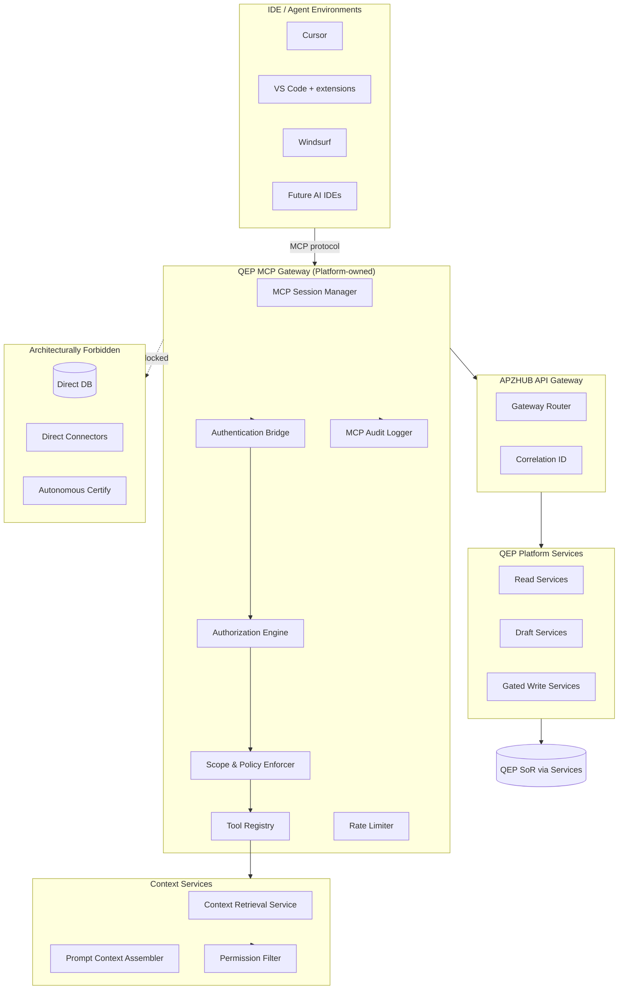
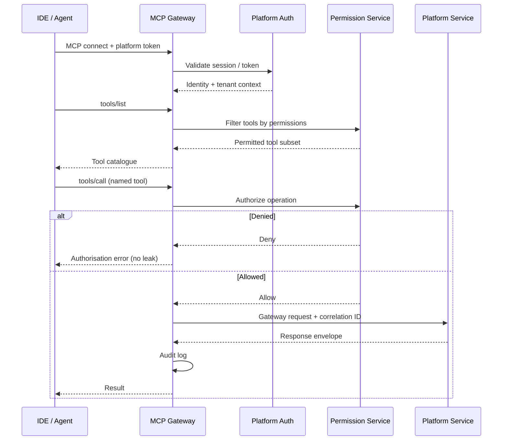
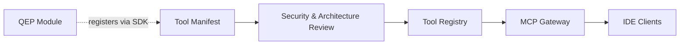

# APZ QEP — MCP Architecture

> **Programme:** APZQEP-ARCH-001  
> **Document:** MCP-ARCHITECTURE  
> **Status:** Architecture intent — no implementation  
> **Authority:** [MCP Integration Strategy](../MCP-INTEGRATION-STRATEGY.md) · Platform 010/013/024 · AI Constitution rule 17  
> **Protocol:** Model Context Protocol — preferred governed integration for IDE/agent access

## Purpose

This document defines the architectural intent for Model Context Protocol (MCP) integration in APZ QEP. MCP provides a standard, tool-oriented bridge between AI IDEs/agents and QEP capabilities while enforcing Zero Trust: authenticated, authorised, scoped, and audited access with no direct database or connector bypass.

## Architectural principles

| Principle                     | Architectural intent                                                |
| ----------------------------- | ------------------------------------------------------------------- |
| MCP as governed channel       | IDE/agents reach QEP only through MCP gateway and registered tools  |
| Platform Services only        | Every tool maps to authorised Platform Service operations           |
| Authn/authz server-side       | User identity and permissions enforced on every tool invocation     |
| Scoped tools                  | Least-privilege tool definitions; no omnibus admin tools for agents |
| Audited mutations             | Write-capable tools emit audit records with correlation IDs         |
| Human gates for certify       | Certification tools not exposed for autonomous agent execution      |
| No unrestricted DB            | Agents never receive SQL, ORM, or raw datastore access              |
| Extensibility                 | New tools registered via manifest; not hardcoded in gateway         |
| Orthogonal to model providers | MCP transports tool calls; inference backends are separate          |

## High-level MCP architecture

## MCP gateway responsibilities

The MCP Gateway is a platform-owned boundary — not a module-local server. It terminates MCP sessions from IDE clients, validates identity, resolves tool definitions, and forwards authorised operations to QEP Platform Services through the APZHUB API Gateway.

| Responsibility         | Description                                            |
| ---------------------- | ------------------------------------------------------ |
| Session management     | Bind MCP session to platform user identity and tenant  |
| Tool discovery         | Expose registered tools matching user permissions      |
| Request validation     | Schema validation for tool inputs                      |
| Policy enforcement     | Tenant MCP policy, air-gap restrictions, feature flags |
| Response normalisation | Standard envelopes; no raw backend errors              |
| Audit emission         | Log tool, user, scope, outcome, correlation ID         |
| Circuit breaking       | Protect services from agent abuse or runaway loops     |

## Tool registry

Tools are registered declaratively (manifest-first per Platform SDK) before implementation. The registry is the authoritative catalogue of agent-accessible capabilities.

| Registry attribute      | Intent                                         |
| ----------------------- | ---------------------------------------------- |
| Tool identifier         | Stable, namespaced ID                          |
| Tool class              | Read, Draft, Write-gated, Admin-read           |
| Mapped Platform Service | Single service operation per tool              |
| Permission requirements | Platform permission keys                       |
| Input schema reference  | Validated parameters — conceptual only in ARCH |
| Mutating flag           | Triggers approval UX and enhanced audit        |
| Certification proximity | Flag for cert-adjacent tools — extra gates     |
| Deprecation lifecycle   | Versioned tool evolution                       |

### Tool classification

| Class             | Agent capability                      | Human gate                  | Examples (conceptual)                                   |
| ----------------- | ------------------------------------- | --------------------------- | ------------------------------------------------------- |
| **Read**          | Query permission-filtered data        | None for read               | List verifications, coverage summary, readiness signals |
| **Draft**         | Propose artefacts                     | Accept in UI/API before SoR | Suggest verification procedure, risk note               |
| **Write (gated)** | Mutate SoR with explicit confirm      | Mandatory user confirmation | Create draft verification record                        |
| **Certify**       | **Not exposed**                       | Human certification UI only | N/A — architecturally absent from MCP                   |
| **Admin-read**    | Operational read for privileged roles | Authz only                  | Health summary, queue depth (no secrets)                |

## Authentication and authorization

| Auth concern        | Approach                                               |
| ------------------- | ------------------------------------------------------ |
| Identity            | Platform BetterAuth session or approved token exchange |
| Token scope         | MCP-specific scopes; short-lived where possible        |
| Tenant binding      | Every call carries org/tenant context                  |
| Permission re-check | Authz on every tool call — not just connect            |
| Superadmin          | Distinct tools; fully audited; not agent-default       |
| Revocation          | Session kill propagates to active MCP connections      |

## Context retrieval and prompt context

MCP tools do not assemble arbitrary prompts from raw database dumps. Context retrieval flows through governed services:

| Stage             | Function                                                |
| ----------------- | ------------------------------------------------------- |
| Intent resolution | Tool determines required context types                  |
| Permission filter | Only resources user may access                          |
| Retrieval         | Platform Search + SoR read services                     |
| Assembly          | Prompt Context Assembler builds bounded context package |
| Redaction         | Policy-based PII/sensitive field masking                |
| Size limits       | Token/context caps prevent over-collection              |

Prompt context for IDE agents follows the same permission and audit rules as in-product AI — MCP is a channel, not a privilege escalation path.

## IDE integration intent

APZ QEP architecturally supports governed integration with developer environments. Product intent is **adjacency** — agents assist QE work in the IDE without becoming an alternate product shell.

| Environment     | Integration intent          | Notes                                   |
| --------------- | --------------------------- | --------------------------------------- |
| **Cursor**      | Primary AI IDE adjacency    | MCP-native; QEP tools in agent workflow |
| **VS Code**     | Broad editor support        | MCP extension or compatible bridge      |
| **Windsurf**    | AI IDE adjacency            | Same governance model as Cursor         |
| **Replit**      | Cloud IDE adjacency         | Token and network policy considerations |
| **Kilo**        | Owner-listed target         | Future adapter when prioritised         |
| **Future IDEs** | Extensible via MCP standard | No IDE-specific SoR bypass              |

### IDE integration rules

| Rule               | Statement                                                            |
| ------------------ | -------------------------------------------------------------------- |
| Single API surface | All IDE traffic through Gateway → Services                           |
| No local SoR       | IDE never holds authoritative QEP state                              |
| Draft vs commit    | Agent proposals visible in QEP UI for acceptance                     |
| Certify in product | Certification actions only in QEP certification surfaces             |
| Offline            | Air-gapped mode may disable external IDE cloud sync — local MCP only |

## Governance

| Governance area     | Mechanism                                       |
| ------------------- | ----------------------------------------------- |
| MCP enablement      | Tenant feature flag — may default OFF           |
| Tool allow-list     | Admin selects enabled tools per org             |
| Agent rate limits   | Per-user and per-tenant throttles               |
| Loop detection      | Circuit breakers for repeated mutating calls    |
| Data classification | Block tools that would egress restricted data   |
| Change control      | Tool manifest approval before registry publish  |
| Penetration posture | Security review programme before production MCP |

## Audit

| Audit dimension | Captured                                  |
| --------------- | ----------------------------------------- |
| Who             | Platform user identity                    |
| What            | Tool ID, service operation, resource refs |
| When            | Timestamp with correlation ID             |
| Outcome         | Success, deny, validation error           |
| Mutations       | Before/after refs for gated writes        |
| Agent metadata  | IDE type, session ID where available      |

MCP audit feeds Platform Audit Service and Administration workspace views. Certification-adjacent tool attempts (if misconfigured) alert operators.

## Extensibility

| Extension type          | Path                                                  |
| ----------------------- | ----------------------------------------------------- |
| New read tool           | Manifest + service mapping + permission keys          |
| New draft tool          | Manifest + AI/draft service + approval UX link        |
| New integration context | Connector via Platform Services — not MCP-direct      |
| Third-party MCP server  | **Not permitted** for QEP SoR — gateway is sole entry |

Modules register tool **intent** via Platform SDK; they do not embed MCP servers.

## Relationship to AI architecture

| Concern             | MCP role                   | AI orchestration role          |
| ------------------- | -------------------------- | ------------------------------ |
| IDE agent calls QEP | MCP tools                  | —                              |
| Model inference     | —                          | Provider adapters              |
| Draft generation    | MCP may invoke draft tools | Orchestrator assembles prompts |
| Knowledge           | Context retrieval services | Same retrieval pipeline        |
| Audit               | MCP audit stream           | AI audit stream — correlated   |

MCP and model providers are **orthogonal**: an agent may use Claude or a local model while calling the same QEP MCP tools.

## Security constraints

| Threat                           | Mitigation                                  |
| -------------------------------- | ------------------------------------------- |
| Privilege escalation via agent   | Server-side authz every call                |
| SQL injection / DB exfiltration  | No DB tools; service-layer access only      |
| Cross-tenant leakage             | Tenant context mandatory; filter at service |
| Autonomous certification         | Certify tool class absent                   |
| Prompt injection to bypass gates | Input validation; human confirm for writes  |
| Unaudited mutations              | Audit mandatory for mutating tools          |

## Deployment mode considerations

| Mode          | MCP behaviour                                           |
| ------------- | ------------------------------------------------------- |
| Self-hosted   | MCP gateway co-deployed with platform                   |
| Air-gapped    | No external IDE cloud dependency required for local MCP |
| Managed cloud | MCP endpoint exposed per tenant isolation model         |
| Hybrid        | Policy may restrict MCP origin networks                 |

## Non-goals

- MCP server implementation code
- Tool JSON schemas
- OAuth flow specifications
- IDE extension store listings

## Acceptance criteria (architecture)

| Criterion                   | Intent                                           |
| --------------------------- | ------------------------------------------------ |
| No direct DB path           | Architecture diagrams show no agent→DB edge      |
| Tool-service mapping        | Every tool maps to exactly one service operation |
| Certify absent              | Tool registry excludes autonomous certification  |
| Audit on mutate             | All write-gated tools emit audit events          |
| Permission-filtered context | Context retrieval never bypasses authz           |
