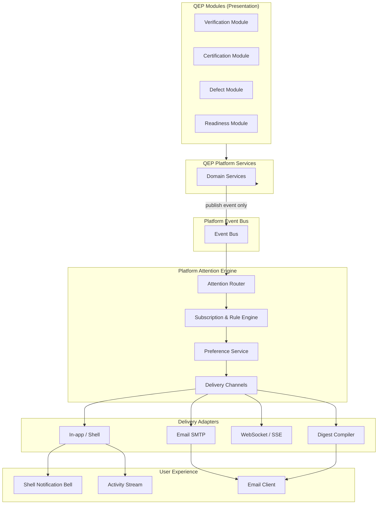
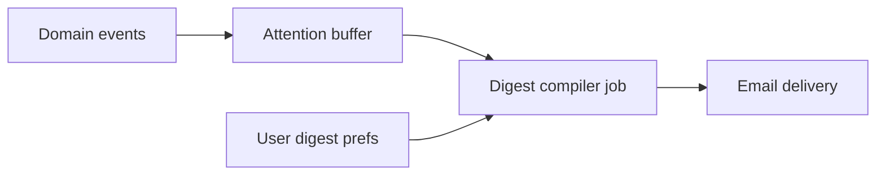

# APZ QEP — Notification Architecture

> **Programme:** APZQEP-ARCH-001  
> **Document:** NOTIFICATION-ARCHITECTURE  
> **Status:** Architecture intent — no implementation  
> **Authority:** Platform 021 (Notifications & Attention) · Platform 029 (Events) · QEP Constitution  
> **Rule:** Modules publish events — never send notifications directly

## Purpose

This document defines how APZ QEP delivers user attention, notifications, activity streams, and digests by **consuming** the APZHUB Attention Engine. QEP modules emit domain events; the platform decides delivery channels, frequency, and permission-filtered visibility. QEP shall not implement a product-local notification subsystem.

## Architectural principles

| Principle                  | Architectural intent                                       |
| -------------------------- | ---------------------------------------------------------- |
| Events not notifications   | QEP publishes past-tense domain events to Event Bus        |
| Platform Attention Engine  | Central delivery, routing, and preference application      |
| No product-local subsystem | No QEP-specific email service, push server, or inbox DB    |
| Permission-filtered        | Recipients see only what their roles permit                |
| User preferences           | Platform Preference Service controls channels and digests  |
| Searchable activity        | Activity stream indexed via Platform Search                |
| Async delivery             | Notification processing never blocks business request path |
| Human gate awareness       | Cert and approval tasks use attention priorities — not AI  |
| Audit adjacency            | Sensitive notifications logged; not a substitute for audit |

## Notification consumption architecture

## Event-driven model

QEP communicates **what happened** — not **how to notify**.

| Step | Actor             | Action                                      |
| ---- | ----------------- | ------------------------------------------- |
| 1    | Platform Service  | Validate business operation; commit SoR     |
| 2    | Platform Service  | Publish domain event with standard envelope |
| 3    | Event Bus         | Deliver to subscribers (at-least-once)      |
| 4    | Attention Engine  | Match subscriptions; apply preferences      |
| 5    | Delivery adapters | Send in-app, email, digest, etc.            |
| 6    | User              | Receives attention in shell or channel      |

Modules **never** call SMTP, push APIs, or third-party notification SaaS directly.

## QEP domain events (notification intent)

Events follow Platform Event SDK naming — past tense, schema-validated. Conceptual catalogue:

| Event (conceptual)                     | Typical subscribers         | Attention priority         |
| -------------------------------------- | --------------------------- | -------------------------- |
| `verification_run.completed`           | QA manager, assignees       | Normal                     |
| `verification_run.failed`              | Assignees, release manager  | High                       |
| `defect.created`                       | Dev lead, QA                | Normal                     |
| `defect.severity_escalated`            | QA manager, risk            | High                       |
| `approval.task.created`                | Named approver              | High                       |
| `approval.task.overdue`                | Approver + escalation chain | Urgent                     |
| `certification.request.submitted`      | Cert approvers              | Urgent                     |
| `certification.decision.recorded`      | Stakeholders                | High                       |
| `readiness.gate.failed`                | Release manager             | High                       |
| `continuous_signal.threshold_exceeded` | QA manager, compliance      | High — re-cert intent only |
| `evidence.pack.locked`                 | Audit subscribers           | Normal                     |
| `ai.proposal.awaiting_review`          | Requesting user             | Normal                     |

Continuous signal events **request attention for re-certification** — they do not emit "certified" or "decertified" autonomously.

## Attention types

| Type                    | Platform handling                | QEP role                          |
| ----------------------- | -------------------------------- | --------------------------------- |
| **Realtime alert**      | WebSocket/SSE to active session  | Publish triggering event          |
| **In-app notification** | Shell bell + notification centre | Provide deep link metadata        |
| **Activity stream**     | Platform activity feed           | Event payload for rendering       |
| **Email**               | SMTP adapter per tenant policy   | None — platform sends             |
| **Digest**              | Scheduled rollup                 | Event types registered for digest |
| **Reminder**            | Timer-based Attention Engine     | Approval due dates via workflow   |

## Digests

Digests reduce noise for high-volume QE activity.

| Digest (conceptual) | Cadence      | Content                                |
| ------------------- | ------------ | -------------------------------------- |
| Daily QA summary    | Daily        | Runs completed, open defects, blockers |
| Weekly management   | Weekly       | Readiness trends, gate status          |
| Approval pending    | Daily        | Open human tasks assigned to user      |
| Cert pipeline       | Weekly       | In-flight cert requests                |
| Compliance rollup   | Configurable | Audit-relevant events                  |

Digest compilation is **platform-owned**. QEP registers event types and summary render hints — not cron jobs in modules.

## Subscriptions and rules

| Mechanism             | Description                                         |
| --------------------- | --------------------------------------------------- |
| Default subscriptions | Role-based defaults (QA manager gets gate failures) |
| User overrides        | Platform Preference Service                         |
| Entity watch          | User watches project/release — platform tracks      |
| Mute / snooze         | Platform — not module-local                         |
| Escalation rules      | Workflow + Attention — approver overdue chains      |

## Permission filtering

| Rule                       | Intent                                             |
| -------------------------- | -------------------------------------------------- |
| Recipient permission check | User must have read access to event subject        |
| Tenant isolation           | No cross-tenant notification leakage               |
| Classification             | Restricted events → restricted recipient sets      |
| Agent/MCP                  | Agents do not receive human task emails by default |

Failed permission checks **drop** notification silently — no "you are not allowed" leak to unauthorised users.

## Certification and approval notifications

Human gates depend on reliable attention without bypassing accountability:

| Scenario               | Notification intent                                    |
| ---------------------- | ------------------------------------------------------ |
| Cert reviewer assigned | Urgent in-app + email per prefs                        |
| Cert decision recorded | Notify requester and subscribers                       |
| Re-cert signal         | Notify cert owners — triggers workflow not auto-decert |
| AI draft ready         | Notify requester — not cert approvers unless submitted |

AI never receives cert approval notifications as actionable on behalf of humans.

## Activity stream vs audit

| Concern    | Activity stream    | Audit log           |
| ---------- | ------------------ | ------------------- |
| Purpose    | User awareness     | Compliance evidence |
| Mutability | Derived display    | Immutable           |
| Retention  | User-facing policy | Long retention      |
| Owner      | Platform Attention | Platform Audit      |
| QEP role   | Event publisher    | Event publisher     |

## IDE / MCP adjacency

| Path              | Behaviour                                                    |
| ----------------- | ------------------------------------------------------------ |
| MCP tool poll     | Agent may fetch user's pending tasks via service — not email |
| IDE notifications | Optional IDE bridge — still platform-attention sourced       |
| No MCP notify     | Agents do not push shell notifications directly              |

## Observability

| Metric                     | Purpose            |
| -------------------------- | ------------------ |
| Event publish rate         | QEP service health |
| Attention delivery latency | Platform SLO       |
| Failed email delivery      | Ops alert          |
| Digest compile errors      | Data quality       |

Correlation IDs link business events to notification deliveries for support investigations.

## Anti-patterns (forbidden)

| Anti-pattern                  | Violation                                          |
| ----------------------------- | -------------------------------------------------- |
| `sendEmail()` in module       | Direct notification                                |
| QEP notification table as SoR | Duplicates platform                                |
| Module toast for other users  | Cross-user delivery belongs to platform            |
| Signal → cert notification    | Misleading cert state messaging                    |
| Webhook from module to Slack  | Bypass Attention Engine (use platform integration) |

## Deployment considerations

| Mode        | Intent                                     |
| ----------- | ------------------------------------------ |
| Self-hosted | SMTP configured at platform tier           |
| Air-gapped  | Email optional; in-app and digest internal |
| Managed     | Platform operator manages delivery infra   |

## Non-goals

- Email template HTML
- WebSocket protocol specs
- Event JSON schemas
- Notification preference UI mockups

## Acceptance criteria (architecture)

| Criterion            | Intent                                                   |
| -------------------- | -------------------------------------------------------- |
| Event-only publish   | Modules do not send notifications                        |
| Platform Attention   | Single delivery engine documented                        |
| Digest model         | Platform-owned compilation                               |
| Cert/signal boundary | Signals trigger re-cert attention — not auto cert change |
| No local subsystem   | Explicit prohibition documented                          |
