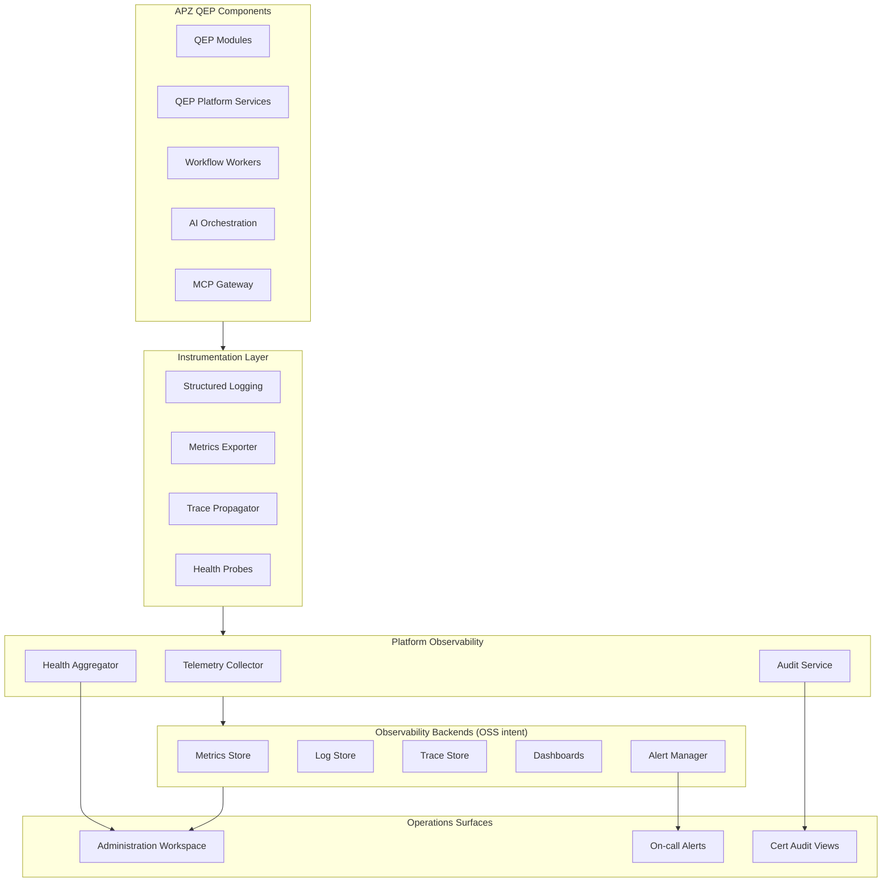
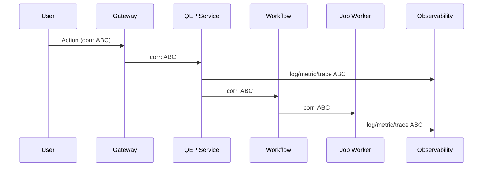
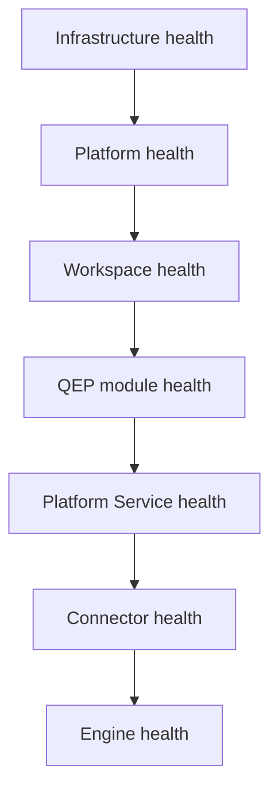

# APZ QEP — Observability Architecture

> **Programme:** APZQEP-ARCH-001  
> **Document:** OBSERVABILITY-ARCHITECTURE  
> **Status:** Architecture intent — no implementation  
> **Authority:** Platform 014 (Observability) · Platform 010 (Correlation IDs) · QEP Constitution  
> **Rule:** Four pillars — metrics, logs, traces, health — correlated end-to-end

## Purpose

This document defines how APZ QEP participates in APZHUB observability: structured logging, metrics, distributed tracing, health reporting, alerting, audit visibility, and operations dashboards. QEP components self-report through platform standards; correlation IDs tie user actions, workflows, AI invocations, and MCP tool calls into investigable trails.

## Architectural principles

| Principle                  | Architectural intent                                                    |
| -------------------------- | ----------------------------------------------------------------------- |
| Four pillars               | Metrics, logs, traces, health — all mandatory                           |
| Correlation IDs            | End-to-end on every request, event, job, AI call, MCP tool              |
| Health hierarchy           | Platform → workspace → module → service → connector → engine            |
| Self-reporting             | Every QEP service and integration reports health                        |
| Structured logs            | Machine-parseable; no secrets or PII dumps                              |
| Audit distinct             | Audit log for compliance — not a debug log substitute                   |
| Administration workspace   | Ops console consumes platform observability backends                    |
| OSS self-hosted first      | Prometheus, Grafana, Loki, OpenTelemetry-compatible — no mandatory SaaS |
| Permission-gated ops views | Backend dashboards masked from standard users                           |
| Cert-adjacent sensitivity  | Enhanced logging retention for certification paths                      |

## Observability architecture

## Correlation ID model

| Context           | Correlation propagation                            |
| ----------------- | -------------------------------------------------- |
| HTTP/API request  | Gateway generates or accepts; forwards to services |
| Workflow instance | Workflow ID + parent request correlation           |
| Background job    | Inherited from triggering event                    |
| AI invocation     | Links prompt, model, user, proposal ID             |
| MCP tool call     | Session ID + tool name + user                      |
| Event bus message | Causation ID + correlation ID in envelope          |
| Search query      | Optional user session link for support             |

Support staff trace `ABC` across logs, traces, audit, and AI audit for incident resolution.

## Logging architecture

| Log category  | Content                                       | Retention tier  |
| ------------- | --------------------------------------------- | --------------- |
| Application   | Service operations, errors, warnings          | Standard        |
| Access        | API access — user, route, outcome             | Standard        |
| Security      | Auth failures, authz denials, anomaly signals | Extended        |
| Audit         | Business-meaningful immutable events          | Compliance tier |
| AI audit      | Model, prompt version, disposition            | Extended        |
| MCP audit     | Tool invocations                              | Extended        |
| Cert-adjacent | Certification service operations              | Compliance tier |

### Logging rules

| Rule             | Intent                                                      |
| ---------------- | ----------------------------------------------------------- |
| Structured JSON  | Parseable fields — timestamp, level, service, correlationId |
| No secrets       | API keys, tokens, passwords never logged                    |
| PII minimisation | Mask or omit personal data per policy                       |
| Error context    | Category and correlation — not raw stack to users           |
| Log levels       | Consistent semantics across QEP services                    |

## Metrics architecture

| Metric domain   | Examples (conceptual)                | Consumer        |
| --------------- | ------------------------------------ | --------------- |
| Request latency | p50/p95/p99 by service               | SLO dashboards  |
| Error rate      | 4xx/5xx by route                     | Alerting        |
| Workflow        | Queue depth, job duration, DLQ size  | Ops             |
| AI              | Invocations, token usage, cost       | FinOps          |
| MCP             | Tool call rate, deny rate            | Security        |
| Search index    | Lag seconds                          | Data quality    |
| Certification   | Requests in flight, time-to-decision | Management      |
| Connector       | Health, circuit breaker state        | Integration ops |

Metrics export through OpenTelemetry-compatible instrumentation to platform collector.

## Distributed tracing

| Span boundary    | Trace intent                                |
| ---------------- | ------------------------------------------- |
| Gateway ingress  | Root span                                   |
| Platform Service | Business operation span                     |
| Workflow step    | Child span                                  |
| Connector call   | External span with masked attributes        |
| AI provider      | Inference span — latency and adapter        |
| Database         | Optional ORM spans — no query text with PII |

Traces enable latency breakdown for slow certification pack assembly or automation ingest jobs.

## Health hierarchy

Aligned with Platform 014:

| Level     | QEP contribution                               |
| --------- | ---------------------------------------------- |
| Platform  | QEP product registers with platform catalogue  |
| Module    | Each module reports feature availability       |
| Service   | Each QEP Platform Service exposes health probe |
| Connector | CI/ALM/AI adapters report upstream status      |
| Synthetic | Optional canary workflows in ops programme     |

Health states: **healthy**, **degraded**, **unhealthy**, **unknown** — with reason codes for Administration workspace.

### Health probe intent (conceptual)

| Component             | Probe checks                                   |
| --------------------- | ---------------------------------------------- |
| QEP web module        | Routes load; dependency reachability           |
| Certification Service | SoR connectivity; workflow engine reachability |
| AI Orchestrator       | Provider adapter health (when enabled)         |
| MCP Gateway           | Auth bridge; tool registry loaded              |
| Search provider       | Index lag within threshold                     |
| Job workers           | Queue consumer alive; DLQ not flooding         |

## Alerting architecture

| Alert class  | Trigger intent                   | Routing                         |
| ------------ | -------------------------------- | ------------------------------- |
| Availability | Service unhealthy > threshold    | On-call                         |
| Latency SLO  | p95 breach sustained             | Platform ops                    |
| Error spike  | Error rate anomaly               | On-call                         |
| Security     | Authz deny burst, MCP abuse      | Security ops                    |
| Data         | Index lag critical; workflow DLQ | Data/on-call                    |
| Cert SLA     | Approval overdue beyond policy   | QA management — not auto-action |
| Cost         | AI budget threshold              | Tenant admin                    |

Alerts fire from metrics/rules engine — not from application email code. Alert payloads include correlation ID samples and runbook links (future ops docs).

## Audit and observability intersection

| Dimension  | Observability                | Audit                          |
| ---------- | ---------------------------- | ------------------------------ |
| Audience   | Operators, SRE               | Compliance, cert reviewers     |
| Mutability | Retention policies           | Immutable                      |
| Content    | Technical + business signals | Business decisions and access  |
| QEP duty   | Emit both streams            | Cert events mandatory in audit |

Certification decisions appear in audit — not only in metrics.

## Operations dashboards

| Dashboard (conceptual) | Audience          | Content                                                       |
| ---------------------- | ----------------- | ------------------------------------------------------------- |
| QEP overview           | Platform ops      | Health rollup, error rates                                    |
| QE pipeline            | QA management     | Workflow throughput — not a substitute for product dashboards |
| AI usage               | Tenant admin      | Cost, quota, model distribution                               |
| MCP security           | Security          | Deny rates, unusual tools                                     |
| Connector status       | Integration admin | CI/ALM adapter health                                         |
| Cert operations        | Compliance        | Request volume, SLA — no PII                                  |

Standard users see product Quality Dashboards — not raw Prometheus/Grafana unless entitled admin.

## QEP-specific observability concerns

| Concern                | Architectural response                                       |
| ---------------------- | ------------------------------------------------------------ |
| Long-running ingest    | Job metrics + progress events                                |
| Evidence pack assembly | Trace cert path end-to-end                                   |
| Continuous signals     | Metric for signal volume; alert on processing backlog        |
| Air-gapped             | Full observability stack local — no external telemetry SaaS  |
| Multi-tenant           | Metrics labelled by tenant for isolation — access controlled |

## Deployment mode considerations

| Mode        | Observability intent                       |
| ----------- | ------------------------------------------ |
| Self-hosted | Customer operates observability backends   |
| Managed     | Provider may operate backends per contract |
| Air-gapped  | No phone-home telemetry                    |
| Hybrid      | Correlation IDs span split deployments     |

## Anti-patterns (forbidden)

| Anti-pattern                   | Why                             |
| ------------------------------ | ------------------------------- |
| printf debugging in production | Unstructured                    |
| Module-local Grafana           | Fragments ops                   |
| Audit log for debug            | Wrong retention and mutability  |
| Missing correlation ID         | Cannot trace cert incidents     |
| Health always green            | Dishonest degraded state hiding |
| User-visible stack traces      | Security and UX                 |

## Non-goals

- Prometheus scrape config
- Grafana dashboard JSON
- Log retention day counts (policy docs elsewhere)
- Alertmanager routing YAML

## Acceptance criteria (architecture)

| Criterion         | Intent                                   |
| ----------------- | ---------------------------------------- |
| Four pillars      | Metrics, logs, traces, health documented |
| Correlation model | End-to-end ID propagation defined        |
| Health hierarchy  | QEP placement in platform hierarchy      |
| Audit separation  | Audit vs observability distinguished     |
| Cert sensitivity  | Cert-adjacent logging called out         |
| No SaaS mandate   | OSS self-hosted backends as intent       |
