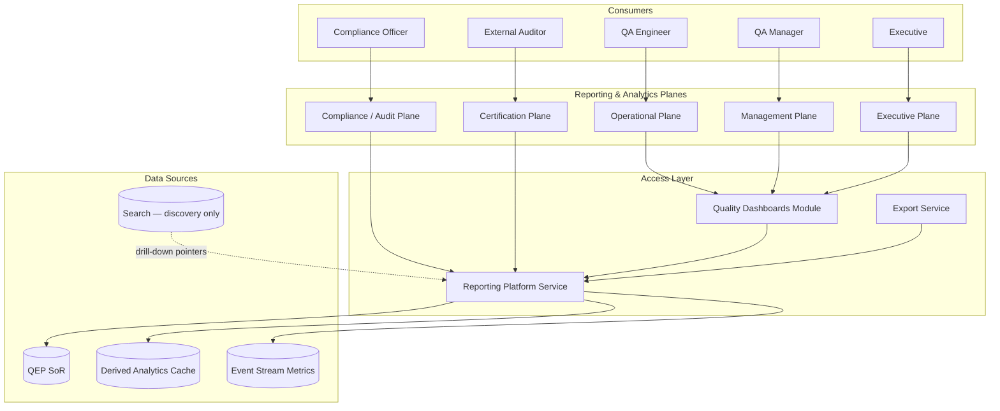
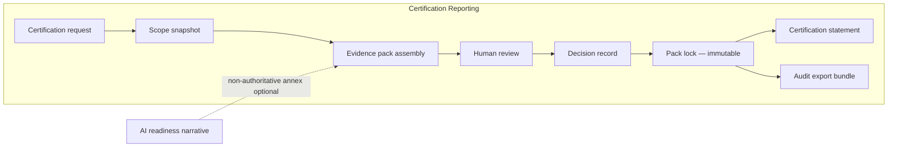
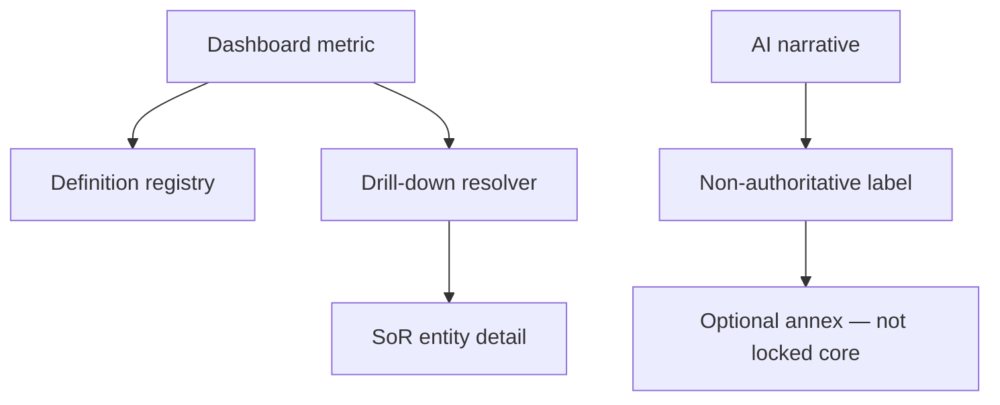

# APZ QEP — Reporting Architecture

> **Programme:** APZQEP-ARCH-001  
> **Document:** REPORTING-ARCHITECTURE  
> **Status:** Architecture intent — no implementation  
> **Authority:** QEP Evidence & Certification models · Platform Analytics adjacency · Constitution  
> **Rule:** Reports reflect SoR; AI narratives are non-authoritative

## Purpose

This document defines the architectural intent for reporting, analytics, and export capabilities in APZ QEP. Reporting spans operational quality metrics, executive dashboards, certification evidence packs, and audit-facing exports — with role-specific views, explainability, and clear separation between authoritative SoR data and derived analytics.

## Architectural principles

| Principle            | Architectural intent                                               |
| -------------------- | ------------------------------------------------------------------ |
| SoR authoritative    | Reports source truth from QEP SoR via Platform Services            |
| Derived analytics    | Aggregations and caches are reconstructible — not SoR              |
| Role-specific planes | Different views for QA, manager, executive, compliance, admin      |
| Cert packs immutable | Evidence packs lock at certification decision — report snapshot    |
| Explainability       | Material metrics link to underlying records and definitions        |
| AI non-authoritative | AI-generated narratives labelled and excluded from cert evidence   |
| Async heavy reports  | Large exports run as jobs — not request handlers                   |
| Platform adjacency   | Shared analytics infrastructure where platform provides capability |
| Permission-filtered  | Every report respects user permissions and classification          |

## Reporting planes

## Plane definitions

| Plane                  | Audience                          | Content focus                                         | Refresh               |
| ---------------------- | --------------------------------- | ----------------------------------------------------- | --------------------- |
| **Operational**        | Testers, QA engineers             | Run status, defects, coverage gaps, my tasks          | Near real-time        |
| **Management**         | QA managers, release managers     | Progress, gate status, resource load, trends          | Hourly / event-driven |
| **Executive**          | Directors, product leadership     | Release confidence, risk summary, cert status rollup  | Daily / on-demand     |
| **Compliance / Audit** | Compliance, internal audit        | Traceability, approval chains, retention, access logs | On-demand + scheduled |
| **Certification**      | Cert approvers, external auditors | Evidence packs, decision records, qualifications      | Snapshot at decision  |

## Certification reporting architecture

Certification reporting is the most sensitive plane — tied to human decisions and immutable evidence.

| Artefact                | Authority               | Mutability                  |
| ----------------------- | ----------------------- | --------------------------- |
| Evidence pack (locked)  | Authoritative for cert  | Immutable post-approval     |
| Decision record         | Authoritative           | Immutable                   |
| Certification statement | Authoritative published | Superseded only by new cert |
| Readiness dashboard     | Derived pre-decision    | Mutable until cert          |
| AI narrative            | Non-authoritative       | Never in locked pack core   |

## Role-specific analytics

| Role               | Primary dashboards      | Key metrics (conceptual)                 |
| ------------------ | ----------------------- | ---------------------------------------- |
| Manual tester      | My runs, procedures due | Completion rate, failures assigned       |
| QA engineer        | Coverage, traceability  | Req–verification linkage %               |
| QA manager         | Release readiness       | Gate pass rate, open defects by severity |
| Risk manager       | Risk heatmaps           | Open risks, waived items                 |
| Release manager    | Readiness timeline      | Blockers, cert pending                   |
| Compliance officer | Audit trail reports     | Approval completeness, retention         |
| Executive          | Quality posture summary | Cert status, trend vs prior release      |
| Tenant admin       | Usage, entitlements     | Seat usage, feature adoption             |

Dashboards consume Reporting Platform Service — modules do not query SoR directly for analytics.

## Metric and aggregation model

| Layer              | Description                       | SoR?                         |
| ------------------ | --------------------------------- | ---------------------------- |
| Raw facts          | Runs, results, defects, approvals | Yes — in SoR                 |
| Derived metrics    | Pass rates, coverage %, MTTR      | No — computed                |
| Snapshots          | Point-in-time readiness           | No — labelled with timestamp |
| Cert pack contents | Selected SoR refs at lock         | Snapshot copy refs           |

Aggregations rebuild from SoR on demand or via scheduled jobs. Cache invalidation follows domain events.

## Explainability

Material metrics and AI-adjacent summaries must be explainable — users can drill to underlying records.

| Explainability element | Intent                                         |
| ---------------------- | ---------------------------------------------- |
| Metric definition      | Documented formula and scope                   |
| Drill-down             | Link to SoR entities (permission-checked)      |
| Time window            | Explicit period for aggregates                 |
| Filters applied        | Workspace, project, release scope visible      |
| Exclusions             | Waived/deferred items listed                   |
| AI content labelling   | "AI-generated summary — not evidence"          |
| Source lineage         | Cert pack lists evidence item refs with hashes |

## Export architecture

| Export type              | Delivery                               | Execution                |
| ------------------------ | -------------------------------------- | ------------------------ |
| Cert audit bundle        | PDF + structured archive               | Async job post-lock      |
| Traceability matrix      | Spreadsheet / document                 | Async job                |
| Compliance access report | CSV / PDF                              | Scheduled or on-demand   |
| Executive summary        | PDF                                    | Async job                |
| Raw evidence refs        | Manifest with signed URLs via platform | Async — permission gated |

Exports embed generation timestamp, user identity, correlation ID, and scope — not live mutable data for cert bundles.

## Relationship to Quality Analytics module

| Concern            | Owner                                                   |
| ------------------ | ------------------------------------------------------- |
| Dashboard UX       | Quality Dashboards module (presentation)                |
| Metric logic       | Reporting Platform Service                              |
| Cert pack assembly | Certification Service + Reporting Service               |
| Platform Analytics | Shared infra for cross-product metrics where applicable |

## AI in reporting

| Allowed                                    | Forbidden                            |
| ------------------------------------------ | ------------------------------------ |
| Draft executive summary for review         | AI text in locked evidence pack core |
| Explain metric anomalies (labelled)        | AI as cert decision input            |
| Suggest report sections                    | Silent inclusion in audit export     |
| Natural language query over permitted data | Cross-tenant analytics               |

## Permission and classification

| Control            | Application                                           |
| ------------------ | ----------------------------------------------------- |
| Row-level security | Reports filter by project/workspace                   |
| Classification     | Restricted defects/evidence excluded from lower roles |
| Export permission  | Separate entitlement for bulk export                  |
| Auditor role       | Time-bound read access to cert bundles                |
| Masking            | PII masked per policy in operational reports          |

## Observability of reporting

| Signal              | Purpose           |
| ------------------- | ----------------- |
| Report job duration | Capacity planning |
| Export volume       | Abuse detection   |
| Failed aggregations | Data quality      |
| Cache staleness     | UX accuracy       |

## Deployment considerations

| Mode          | Reporting intent                          |
| ------------- | ----------------------------------------- |
| Self-hosted   | Export storage on customer S3-compatible  |
| Air-gapped    | No external BI SaaS required              |
| Large tenants | Async exports mandatory; worker scale-out |

## Anti-patterns (forbidden)

| Anti-pattern                  | Why                               |
| ----------------------------- | --------------------------------- |
| Dashboard direct SQL          | Bypasses services and permissions |
| Live cert pack                | Must be point-in-time snapshot    |
| AI-signed cert statement      | Violates human accountability     |
| Module-local report engine    | Duplicates platform reporting     |
| Search index as report source | Index not authoritative           |

## Non-goals

- Report template implementations
- Chart library selection
- PDF engine choice
- SQL for analytics queries

## Acceptance criteria (architecture)

| Criterion              | Intent                              |
| ---------------------- | ----------------------------------- |
| Five planes documented | Op, mgmt, exec, compliance, cert    |
| Cert immutability      | Pack lock architecture explicit     |
| Explainability         | Drill-down and AI labelling defined |
| Async exports          | Heavy exports off request path      |
| Permission model       | Role table maps to filtered views   |
