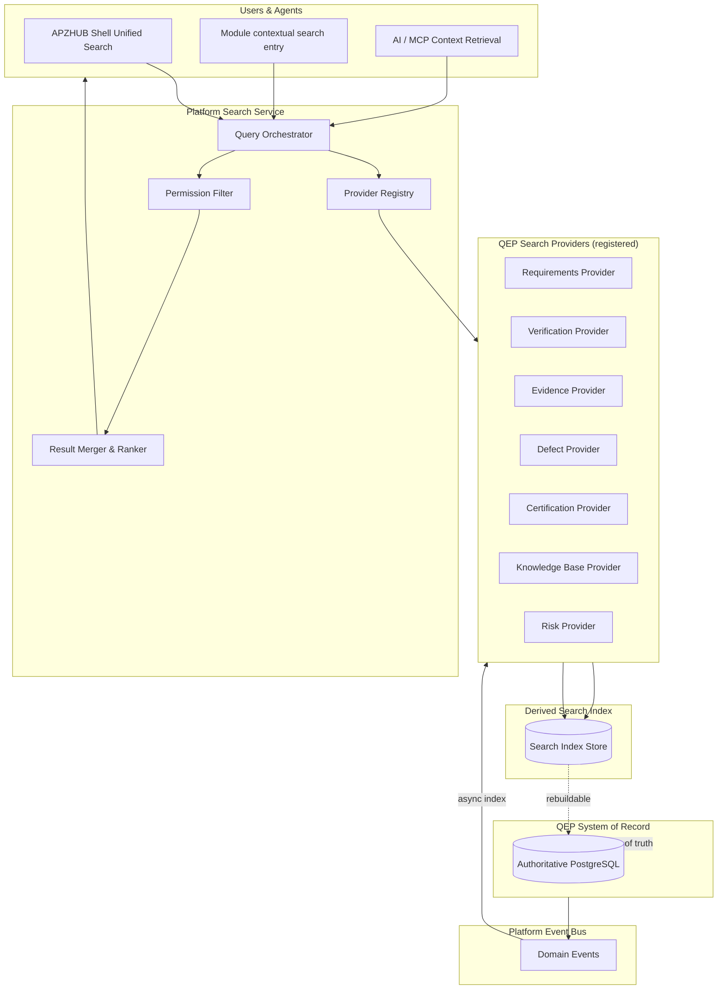
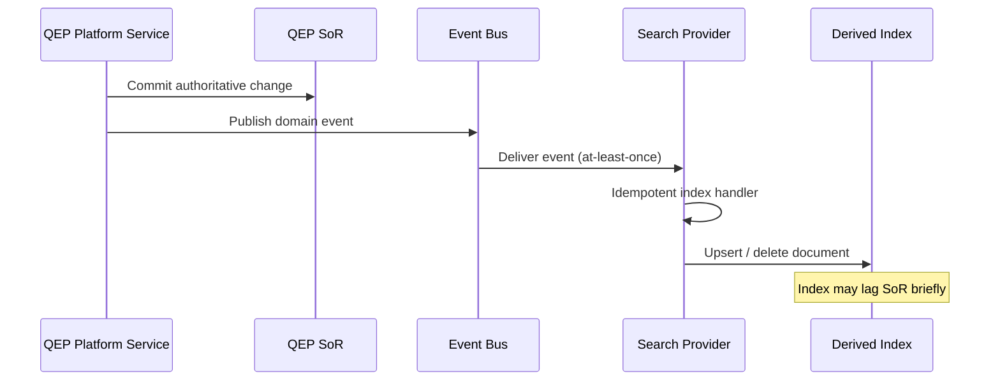

# APZ QEP — Search Architecture

> **Programme:** APZQEP-ARCH-001  
> **Document:** SEARCH-ARCHITECTURE  
> **Status:** Architecture intent — no implementation  
> **Authority:** Platform 020 (Unified Search) · Platform 011 (Data) · QEP Constitution  
> **Rule:** Derived index is **not** System of Record

## Purpose

This document defines how APZ QEP consumes the APZHUB Unified Search capability. QEP modules discover quality engineering artefacts through a single platform search experience — permission-filtered at query time, asynchronously indexed from authoritative SoR, with no module-local search subsystems or standalone search UIs.

## Architectural principles

| Principle | Architectural intent |
| --------- | --------------------- |
| One search experience | Users search QEP content via Platform Search — not per-module engines |
| Provider registration | QEP registers Search Providers for its artefact types |
| Permission-filtered | Results filtered by user permissions on every query |
| Derived index | Search index is reconstructible from SoR — never authoritative |
| Event-driven indexing | SoR changes publish events; index updates async |
| No module search UI | Modules contribute providers and result renderers — not search boxes |
| AI retrieval adjacency | AI and MCP context retrieval may consume same index |
| Self-hosted first | Platform OSS search backends (PostgreSQL FTS initial; OpenSearch/Meilisearch future) |

## Search consumption architecture

## Platform Search consumption model

QEP is a **consumer and contributor** to Platform Search — it does not operate an independent search cluster for product artefacts.

| Role | QEP responsibility |
| ---- | ------------------ |
| Consumer | Invoke Platform Search for unified discovery |
| Contributor | Register providers with schemas, permissions, and index handlers |
| Non-owner | Does not own global search infrastructure |
| Event publisher | Emit indexable change events from Platform Services |

## Search provider registration intent

Each QEP domain registers a Search Provider declaring artefact types, permission keys, index mapping intent, and result presentation hints.

| Provider (conceptual) | Indexed artefact types | Permission domain |
| --------------------- | ---------------------- | ----------------- |
| Requirements Provider | Requirements, objectives, links | Requirements read |
| Verification Provider | Plans, procedures, suites, runs | Verification read |
| Evidence Provider | Evidence items, pack metadata | Evidence read |
| Defect Provider | Defects, linkages | Defect read |
| Certification Provider | Requests, statements (non-sensitive fields) | Certification read |
| Knowledge Base Provider | Playbooks, standards, articles | KB read |
| Risk Provider | Risks, assessments | Risk read |
| Release Readiness Provider | Readiness snapshots, gate summaries | Readiness read |

### Provider manifest attributes (conceptual)

| Attribute | Purpose |
| --------- | ------- |
| Provider identifier | Stable registration key |
| Artefact type catalogue | What entity types are searchable |
| Permission keys | Required for result inclusion |
| Index event subscriptions | Which platform events trigger re-index |
| Field visibility classes | Public, internal, restricted (for index and display) |
| Ranking hints | Boost recency, certification proximity, etc. |
| Deep link resolver | Navigate from result to QEP workspace |

## Indexing model

Indexing is **asynchronous** and **event-driven** — consistent with Platform 012 respond-fast, process-async.

| Indexing rule | Intent |
| ------------- | ------ |
| SoR first | Index updates only after successful SoR commit |
| Idempotent handlers | Duplicate events do not corrupt index |
| Delete propagation | Tombstone or remove on SoR delete/archive |
| Reindex capability | Full rebuild from SoR for disaster recovery |
| No index-as-SoR | Business decisions never read index alone for authority |
| Sensitive field exclusion | PII and secrets never indexed |

## Permission-filtered query

Every search query applies permission filtering **at query time** — not only at index time.

| Filter stage | Description |
| ------------ | ----------- |
| Authentication | Valid platform session required |
| Tenant scope | Results limited to user's org/tenant |
| Permission intersection | Provider checks user permissions per artefact |
| Row-level rules | Workspace, project, classification filters |
| Superadmin | Audited elevated visibility — not default |
| Agent/MCP | Same permission model as interactive user |

### Permission failure behaviour

| Scenario | Behaviour |
| -------- | --------- |
| No permission | Result omitted — not shown as "denied" entry |
| Partial provider access | Merge results from permitted providers only |
| Classification block | Restricted artefacts excluded entirely |

## Derived index — not SoR

| Aspect | SoR | Search Index |
| ------ | --- | -------------- |
| Authority | Authoritative for business truth | Convenience for discovery |
| Durability | Immutable audit requirements | Rebuildable |
| Certification evidence | Accepted evidence packs in SoR | Not evidentiary |
| Conflict resolution | SoR wins always | Re-index on mismatch detection |
| Backup priority | Tier 1 | Tier 2 — regenerable |
| Legal hold | SoR holds apply | Index refresh paused per policy |

Health checks compare index lag and sample checksums against SoR projections — alerts on sustained drift.

## Unified search UX consumption

| Entry point | Behaviour |
| ----------- | --------- |
| Shell Command Palette / Unified Search | Cross-product including QEP artefacts |
| Module workspace | Contextual search scoped to module filters |
| Deep links | Search results link to QEP routes with permission re-validation |
| Empty states | Guide users when index lag or no permission |

QEP modules **do not** implement standalone search pages duplicating Platform Search.

## AI and MCP retrieval

| Consumer | Usage |
| -------- | ----- |
| AI NL Query Service | Search as retrieval backend for permission-filtered answers |
| MCP Context Retrieval | Tool calls assemble context via Search + read services |
| Quality Intelligence | Aggregations may use search for discovery — metrics from analytics plane |

AI must treat search hits as **pointers** — authoritative detail loaded from SoR read services.

## Ranking and relevance (intent)

| Signal | Weight intent |
| ------ | ------------- |
| Text match | Primary relevance |
| Recency | Boost recent artefacts |
| Lifecycle state | Deprioritise archived |
| User workspace context | Boost current project scope |
| Role | QA vs executive — no permission bypass via ranking |

Ranking never surfaces artefacts the user cannot access.

## Observability

| Metric | Purpose |
| ------ | ------- |
| Index lag | Time from event to indexed |
| Query latency | Platform SLO tracking |
| Provider error rate | Failed index handlers |
| Reindex duration | DR drill measurement |
| Zero-result rate | UX and coverage signal |

Correlation IDs link search queries to originating user sessions and AI invocations.

## Deployment considerations

| Mode | Search intent |
| ---- | ------------- |
| Self-hosted | Platform search backend co-located |
| Air-gapped | No external search SaaS dependency |
| Scale-out | Index tier scales independently of QEP SoR — still derived |

## Anti-patterns (forbidden)

| Anti-pattern | Why forbidden |
| ------------ | ------------- |
| Module-local Elasticsearch | Fragments experience; duplicates ops |
| Index-driven certification | Violates SoR authority |
| Unfiltered admin search API | Cross-tenant leakage risk |
| Synchronous full reindex in request | Violates async architecture |
| Search as audit log | Audit is immutable SoR/platform audit |

## Non-goals

- Index mapping JSON schemas
- Search API endpoint definitions
- OpenSearch cluster sizing guides
- Provider implementation code

## Acceptance criteria (architecture)

| Criterion | Intent |
| --------- | ------ |
| Provider registration | All major QEP artefact families have provider intent |
| Permission filter | Documented at query time for every path |
| Event-driven index | No synchronous index in user request path |
| SoR authority | Explicit table: index never authoritative |
| No module search subsystem | Single Platform Search consumption documented |
