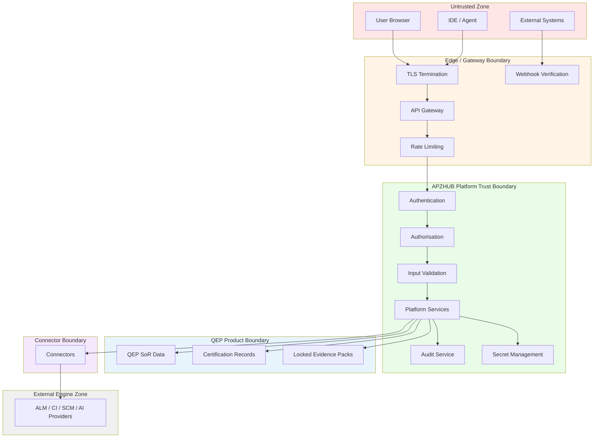
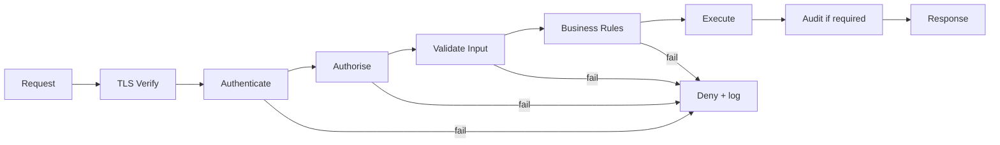

# APZ QEP — Security Architecture

> **Programme:** APZQEP-ARCH-001  
> **Status:** Architecture baseline — conceptual design only  
> **Authority:** [Security Constitution](../constitution/SECURITY-CONSTITUTION.md) · [Security Requirements](../requirements/SECURITY-REQUIREMENTS.md) · Platform 1.4 (013, 014)  
> **Scope:** Zero Trust security model, controls, boundaries, and compliance posture — **no** implementation code, configuration, or cryptographic specifications

---

## 1. Purpose

This document defines the security architecture for APZ QEP as an enterprise quality platform handling certification evidence, audit trails, and regulated data. Security is inherent — not bolted on. Every layer from client to external engine participates in a consistent Zero Trust model aligned with APZHUB Platform 1.4.

QEP protects the integrity of quality SoR domains: requirements, verification, evidence, certification, defects, risk, traceability, and audit.

---

## 2. Security principles (constitutional)

| Principle                 | Architectural application                                                                                                          |
| ------------------------- | ---------------------------------------------------------------------------------------------------------------------------------- |
| **Zero Trust**            | Verify identity, permission, integrity, intent, and context on every request — never trust network location or prior session alone |
| **Least privilege**       | Users, services, workers, connectors, MCP tools, and API clients receive minimum necessary rights                                  |
| **Defence in depth**      | Multiple independent controls — no single layer is sufficient                                                                      |
| **Secure by default**     | Private, denied, audited — explicit grant required for access                                                                      |
| **Audit by default**      | Privileged and certification actions audited without opt-in                                                                        |
| **Encryption by default** | TLS in transit; sensitive data encrypted at rest per Platform standards                                                            |
| **Secrets management**    | No secrets in code, logs, or repositories                                                                                          |
| **Compliance by design**  | POPIA/GDPR/ISO/SOC intent shapes data minimisation, retention, and access                                                          |

---

## 3. Security boundaries

**Trust rule:** Data crosses boundaries only through verified, authorised, audited channels.

---

## 4. Threat model summary

| Threat category                  | QEP exposure                                | Primary controls                                       |
| -------------------------------- | ------------------------------------------- | ------------------------------------------------------ |
| **Unauthenticated access**       | SoR tampering, cert fraud                   | Gateway auth, deny by default                          |
| **Privilege escalation**         | Unauthorized certification, evidence access | PermissionService, least privilege                     |
| **Cross-tenant access**          | Data leakage between organisations          | Tenant isolation on all SoR queries                    |
| **Injection attacks**            | SoR corruption, data exfiltration           | Input validation, parameterised access, OWASP controls |
| **Connector compromise**         | Lateral movement to engines                 | Dedicated connector credentials, circuit breakers      |
| **AI/MCP abuse**                 | Auto-certify, bulk exfiltration             | Tool authz gates, no autonomous certify, audit         |
| **Webhook spoofing**             | False ingest, DoS                           | Signature verification, replay protection              |
| **Insider threat**               | Audit tampering, cert backdating            | Immutable audit, separation of duties                  |
| **Evidence tampering post-cert** | Audit failure, regulatory liability         | Pack lock on approval, correction via new decision     |
| **Secrets exposure**             | Engine and tenant compromise                | Platform secret management, no logging of credentials  |

---

## 5. Identity and authentication architecture

| Actor type             | Authentication mechanism                             | Session model                                  |
| ---------------------- | ---------------------------------------------------- | ---------------------------------------------- |
| **Human users**        | BetterAuth (Platform Identity) — authentication only | Platform session; single SSO across APZHUB     |
| **Service identities** | Platform-issued credentials                          | Short-lived tokens; scoped to service          |
| **Worker identities**  | Dedicated job credentials                            | Batch/async operations only                    |
| **API clients**        | OAuth / client credentials                           | Tenant-scoped; acts on behalf of org           |
| **MCP sessions**       | Bound to authenticated user session                  | Inherits user identity — no separate privilege |
| **Connectors**         | Per-connector, per-tenant credentials                | Outbound only to declared engines              |
| **Webhook sources**    | Shared secret / signature verification               | Inbound only to registered endpoints           |

**Rule:** BetterAuth authenticates; APZHUB PermissionService authorises. QEP does not operate a separate login engine.

See [IDENTITY-ARCHITECTURE.md](./IDENTITY-ARCHITECTURE.md) for full identity model.

---

## 6. Authorisation architecture

| Layer                         | Responsibility                                                                   |
| ----------------------------- | -------------------------------------------------------------------------------- |
| **PermissionService**         | Server-authoritative permission resolution                                       |
| **Role translation**          | Platform permissions → QEP capability grants — backend roles never exposed in UI |
| **Permission-driven shell**   | UI surfaces filtered by resolved permissions                                     |
| **Certification authorities** | Human approval chains — AI/MCP/integrators excluded                              |
| **Superadmin tier**           | Explicit elevated tier — audited, not a bypass                                   |

See [AUTHORISATION-ARCHITECTURE.md](./AUTHORISATION-ARCHITECTURE.md) for permission catalogue architecture.

---

## 7. Data protection

| Data class                | Examples                                | Protection                                             |
| ------------------------- | --------------------------------------- | ------------------------------------------------------ |
| **Platform metadata**     | Nav state, preferences, session refs    | Platform PostgreSQL; tenant-isolated                   |
| **QEP SoR business data** | Verification, defects, traceability     | Tenant-isolated; access via PermissionService          |
| **Evidence metadata**     | Capture info, classification, retention | Tenant-isolated; export audited                        |
| **Evidence content**      | Files, logs, screenshots                | Platform Documents / object storage; encrypted at rest |
| **Locked evidence packs** | Post-certification bundles              | Immutability enforced at service layer                 |
| **Certification records** | Decisions, statements, approvers        | Immutable history; retention ≥ policy default          |
| **Audit records**         | Privileged actions, cert changes        | Append-only; no silent deletion                        |
| **AI prompts/responses**  | Assistant interactions                  | Classified; retention per AI policy; non-authoritative |
| **Connector secrets**     | Engine API tokens                       | Platform secret store; never in SoR plaintext          |
| **Personal data**         | User names, emails in audit             | Minimised; POPIA/GDPR lawful basis documented          |

---

## 8. Encryption architecture

| State              | Requirement                                                       |
| ------------------ | ----------------------------------------------------------------- |
| **In transit**     | TLS mandatory for all client, MCP, webhook, and connector traffic |
| **At rest**        | Platform-standard encryption for databases and object storage     |
| **Secrets**        | Encrypted at rest in platform secret management                   |
| **Backups**        | Encrypted; access controlled and audited                          |
| **Exports**        | Customer responsibility post-download; QEP audits export action   |
| **Key management** | Platform-owned — product does not implement custom crypto         |

Cryptographic e-signatures for certification are optional future capability (RR-009) — actor/timestamp/rationale mandatory regardless.

---

## 9. Audit architecture

| Audit domain                | Trigger                                   | Retention intent                     |
| --------------------------- | ----------------------------------------- | ------------------------------------ |
| **Certification decisions** | Every approve/reject/qualify              | ≥ 7 years default intent             |
| **Evidence pack lock**      | Certification approval                    | Aligned with certification retention |
| **Privileged admin**        | Permission, policy, tenant config changes | Per compliance policy                |
| **Integration changes**     | Connector config, webhook registration    | Security audit tier                  |
| **AI/MCP activity**         | Mutating tool calls, draft acceptance     | Explainability and security          |
| **Export actions**          | Audit pack, evidence export               | Regulatory support                   |
| **Authentication events**   | Platform Identity                         | Platform retention                   |

Audit complements event bus — see [EVENT-ARCHITECTURE.md](./EVENT-ARCHITECTURE.md). Certification and privileged history is **immutable** (RR-010).

---

## 10. Security pipeline (every request)

No stage may be skipped for mutating SoR operations.

---

## 11. AI and MCP security

| Control                         | Requirement                                                       |
| ------------------------------- | ----------------------------------------------------------------- |
| **Permission inheritance**      | AI tools and MCP tools operate within invoking user's permissions |
| **No privilege escalation**     | Tools cannot grant themselves or user additional rights           |
| **No autonomous certification** | Certify operations require human approval flow                    |
| **Draft vs commit**             | AI drafts are non-authoritative until human acceptance            |
| **Audit**                       | Mutating MCP tool invocations logged with user, tool, target      |
| **Data minimisation**           | AI context includes only permission-filtered data                 |
| **Provider isolation**          | Model provider credentials platform-managed; QEP SoR unchanged    |
| **Default OFF**                 | AI runtime disabled until tenant explicitly enables               |

---

## 12. Connector and integration security

| Control                   | Application                                                       |
| ------------------------- | ----------------------------------------------------------------- |
| **Dedicated credentials** | Per-connector, per-tenant — no shared superuser                   |
| **Outbound only**         | Connectors initiate to declared engines — no inbound engine trust |
| **Scope limitation**      | Connector credentials scoped to minimum engine permissions        |
| **Health isolation**      | Connector failure does not expose platform internals              |
| **Error sanitisation**    | Engine errors translated — no credential leakage in errors        |
| **Webhook verification**  | Inbound payloads verified before processing                       |
| **Rate limiting**         | Per-source webhook and API client limits                          |

---

## 13. Compliance architecture

| Regime                          | Architectural intent                                            |
| ------------------------------- | --------------------------------------------------------------- |
| **POPIA (RR-001)**              | Personal data minimised; purpose documented; retention enforced |
| **GDPR (RR-002)**               | EU subject rights via Platform patterns where applicable        |
| **ISO 9001 (RR-003)**           | QEP artefacts support QMS process evidence                      |
| **ISO 27001 (RR-004)**          | Align with Platform Zero Trust and access management            |
| **SOC 2 (RR-005)**              | Audit exports support control narratives                        |
| **OWASP (RR-006)**              | Gateway + validation + central security headers                 |
| **Audit retention (RR-007)**    | Certification audit long retention                              |
| **Evidence retention (RR-008)** | Per evidence class lifecycle                                    |
| **Industry overlays (RR-011)**  | Vertical rules cannot weaken cert/audit immutability            |

Compliance is **by design** — controls embedded in architecture, not checklist afterthought.

---

## 14. Operational security

| Capability                   | Platform alignment                                                           |
| ---------------------------- | ---------------------------------------------------------------------------- |
| **Health monitoring**        | Connector, service, module health hierarchy (014)                            |
| **Administration Workspace** | Permission-gated ops console — backend dashboards masked from standard users |
| **Incident response**        | Correlation IDs enable trace reconstruction                                  |
| **Vulnerability management** | Platform CI security checks — product inherits                               |
| **Backup and recovery**      | Platform infrastructure — RPO/RTO per deployment ADR                         |
| **Legal hold**               | Suspend retention deletion without audit erasure                             |

---

## 15. Security governance

| Activity                     | Owner                    | Frequency                               |
| ---------------------------- | ------------------------ | --------------------------------------- |
| Threat model review          | Security architecture    | Major releases; new integration classes |
| Permission catalogue review  | Product + security       | Each architecture increment             |
| MCP tool security review     | Security + product       | Before tool class activation            |
| External API exposure review | Security                 | Before external API programme           |
| Penetration testing          | Platform + product       | Per release policy                      |
| Compliance mapping           | Compliance officer input | Annual or regime change                 |

Temporary security exceptions require **Owner Approval** with scope, expiry, and compensating controls — per Security Constitution.

---

## 16. Forbidden patterns

| Pattern                         | Violation                   |
| ------------------------------- | --------------------------- |
| Frontend-only security          | Security Constitution       |
| Module → engine trust shortcut  | Zero Trust + Platform-first |
| Disabling audit for performance | Owner Approval required     |
| Shared connector credentials    | Least privilege             |
| Auto-certify on green pipeline  | Certification Constitution  |
| Silent audit rewrite            | RR-010                      |
| Secrets in repository           | SEC-004                     |
| Superadmin as universal bypass  | Authorisation architecture  |

---

## 17. Cross-document references

| Topic                 | Document                                                                             |
| --------------------- | ------------------------------------------------------------------------------------ |
| Identity model        | [IDENTITY-ARCHITECTURE.md](./IDENTITY-ARCHITECTURE.md)                               |
| Authorisation model   | [AUTHORISATION-ARCHITECTURE.md](./AUTHORISATION-ARCHITECTURE.md)                     |
| Integration security  | [INTEGRATION-ARCHITECTURE.md](./INTEGRATION-ARCHITECTURE.md)                         |
| API security          | [API-ARCHITECTURE.md](./API-ARCHITECTURE.md)                                         |
| Audit events          | [EVENT-ARCHITECTURE.md](./EVENT-ARCHITECTURE.md)                                     |
| Security Constitution | [../constitution/SECURITY-CONSTITUTION.md](../constitution/SECURITY-CONSTITUTION.md) |

---

## Document control

| Field              | Value                                              |
| ------------------ | -------------------------------------------------- |
| Programme          | APZQEP-ARCH-001                                    |
| Version            | 1.0.0-arch                                         |
| Classification     | Security architecture — conceptual                 |
| Prohibited content | Code, crypto specs, config, implementation details |
| Next review        | After Owner Architecture Acceptance                |
