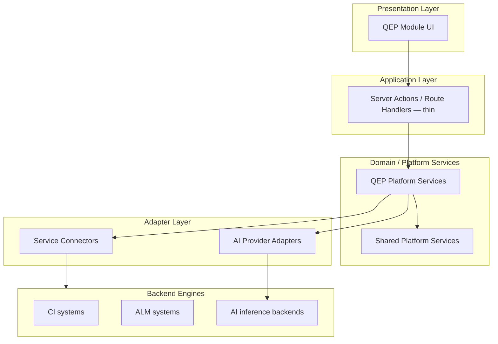
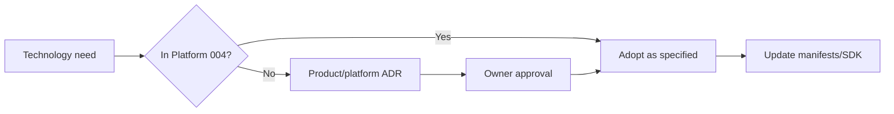

# APZ QEP — Technology Standards

> **Programme:** APZQEP-ARCH-001  
> **Document:** TECHNOLOGY-STANDARDS  
> **Status:** Architecture intent — no implementation  
> **Authority:** APZHUB Foundation 004 (Technology Stack) · 003 (Layered Architecture) · 024 (Platform SDK) · QEP Constitution  
> **Posture:** Modular monolith · OSS Community Edition self-hosted first

## Purpose

This document defines approved technology standards and architectural constraints for APZ QEP as a native APZHUB product. Standards align with Platform document 004 and foundation docs 000–029. This is **standards intent only** — no code, schemas, endpoints, or implementation choices beyond architectural approval.

## Scope

| In scope                                      | Out of scope                    |
| --------------------------------------------- | ------------------------------- |
| Approved languages, frameworks, infra classes | Version pinning in package.json |
| Architectural constraints for QEP             | Sprint guides or CI YAML        |
| OSS CE preference                             | Vendor-specific cloud SKUs      |
| Modular monolith boundaries                   | Database DDL                    |
| Integration patterns                          | API route definitions           |

## Core technology stack (platform-aligned)

APZ QEP inherits the APZHUB mandatory stack. QEP adds **product constraints** — not alternate technologies.

| Layer          | Approved standard                              | QEP constraint                                              |
| -------------- | ---------------------------------------------- | ----------------------------------------------------------- |
| Monorepo       | pnpm workspace                                 | QEP lives under `/modules`, `/services` — not isolated repo |
| Language       | TypeScript strict                              | No `any`; strict mode mandatory                             |
| Frontend       | Next.js App Router, React                      | Module UI in shell — no isolated layouts                    |
| Styling        | Tailwind CSS, design tokens                    | No hardcoded colours — tokens only                          |
| UI components  | shadcn/ui in shared `/packages/ui`             | No one-off module component libraries                       |
| Icons          | Lucide                                         | Consistent iconography                                      |
| Forms          | React Hook Form + Zod                          | Validation at boundary                                      |
| Data fetching  | TanStack Query                                 | No ad hoc fetch in presentation                             |
| Tables         | TanStack Table                                 | Shared DataTable patterns                                   |
| Backend        | Next.js Server Actions + Route Handlers        | Business logic in Platform Services only                    |
| Authentication | BetterAuth                                     | Authn only — APZHUB owns authz/permissions                  |
| Platform DB    | PostgreSQL                                     | Platform metadata + QEP SoR — tenant-ready                  |
| Cache / queue  | Redis                                          | Sessions, cache, job queues                                 |
| Blob storage   | S3-compatible object storage                   | Evidence artefacts                                          |
| Edge proxy     | Caddy (primary) or Nginx                       | TLS termination, routing                                    |
| API style      | REST-first, versioned                          | Standard request/response envelope                          |
| Testing        | Vitest, Playwright, Storybook                  | Full pyramid mandatory before release                       |
| Lint/format    | ESLint, Prettier                               | CI gate on every commit                                     |
| Container      | Docker Compose (dev/prod intent)               | Self-hosted deploy unit                                     |
| Observability  | OSS-compatible OTel, Prometheus, Loki, Grafana | Self-hosted first                                           |
| Search         | Platform Search — PostgreSQL FTS initial       | Derived index — not SoR                                     |
| Events         | Platform Event Bus                             | Modules publish — not notify directly                       |
| AI             | Provider adapters via Integration SDK          | Default OFF; never SoR                                      |
| MCP            | Platform MCP Gateway                           | Auth/scoped/audited                                         |
| IDE            | Cursor, VS Code, etc. via MCP                  | No direct SoR access                                        |

## Architectural layering (mandatory)

| Rule                       | Statement                                       |
| -------------------------- | ----------------------------------------------- |
| No layer bypass            | Presentation never calls connectors             |
| Module → Service only      | Modules invoke Platform Service interfaces      |
| Service → Connector        | Connectors translate engines — internal clients |
| No backend models in UI    | DTOs/view models at presentation boundary       |
| Business logic in services | Not in React components or route handlers       |

## Modular monolith standard

| Standard            | Intent                                                     |
| ------------------- | ---------------------------------------------------------- |
| Deploy unit         | QEP ships with APZHUB platform — single monolith initially |
| Module SDK          | Every module: `module.yaml` manifest before code           |
| Service SDK         | Every service: `service.yaml` manifest before code         |
| Integration SDK     | Every connector: `integration.yaml` before code            |
| Event SDK           | Every event: `event.yaml` before code                      |
| UI Component SDK    | Shared components: `component.yaml` + Storybook            |
| Registry discovery  | No hardcoded module lists in shell                         |
| Extraction deferred | Seams documented; microservices only if proven necessary   |

## QEP-specific technology constraints

| Constraint                 | Rationale                                 |
| -------------------------- | ----------------------------------------- |
| AI default OFF             | Feature flags until Owner programme       |
| AI never SoR               | Draft/accept pattern in services          |
| Human certification        | No automated cert API for AI/agents       |
| MCP governed               | Gateway mandatory for IDE access          |
| No unrestricted DB         | ORM access only in Platform Services      |
| Workflow platform          | No bespoke workflow engine in QEP         |
| Search platform            | No module-local Elasticsearch requirement |
| Notifications platform     | No module email/push stack                |
| Evidence in object storage | Large blobs not in PostgreSQL rows        |
| Immutable cert audit       | Append-only audit patterns                |
| Permission-driven UI       | Shell hides unauthorised nav/commands     |
| Correlation IDs            | Mandatory on all service boundaries       |

## Data technology standards

| Data type                  | Storage standard             | Authority                       |
| -------------------------- | ---------------------------- | ------------------------------- |
| QEP business entities      | PostgreSQL (QEP SoR)         | Authoritative                   |
| Platform identity/sessions | PostgreSQL + Redis           | Platform                        |
| Permissions/roles          | PostgreSQL                   | Platform — not BetterAuth alone |
| Evidence binary content    | S3-compatible object storage | Authoritative blob              |
| Evidence metadata          | PostgreSQL                   | Authoritative refs              |
| Search index               | Platform search backend      | Derived                         |
| Analytics cache            | PostgreSQL or approved cache | Derived                         |
| Job queue                  | Redis (or platform-approved) | Operational                     |
| Audit log                  | PostgreSQL immutable store   | Compliance                      |

| Forbidden                     | Reason                |
| ----------------------------- | --------------------- |
| Duplicate SoR in module DB    | Violates single SoR   |
| Search index as cert evidence | Not authoritative     |
| AI provider memory as SoR     | AI never SoR          |
| Secrets in code/repo          | Security constitution |

## Security technology standards

| Area          | Standard                                       |
| ------------- | ---------------------------------------------- |
| Zero Trust    | Verify every request — auth, authz, validation |
| TLS           | Mandatory in transit                           |
| CSRF/XSS      | Central platform middleware                    |
| Secrets       | Platform secret references — encrypted         |
| Rate limiting | Gateway-level                                  |
| Audit         | Platform Audit Service                         |
| Superadmin    | Explicit tier — audited                        |
| PII           | Minimise; POPIA/GDPR-aligned processing        |

## Integration technology standards

| Integration class | Pattern                                      |
| ----------------- | -------------------------------------------- |
| CI/CD results     | Service Connector — OSS APIs first           |
| ALM/requirements  | Service Connector — CE where possible        |
| AI commercial API | Integration Adapter — optional, policy-gated |
| AI local model    | Self-hosted adapter — air-gap                |
| SMTP              | Platform notification adapter                |
| Customer IdP      | BetterAuth + platform SSO config             |
| MCP IDE           | MCP Gateway → Platform Services              |

Connectors **never** expose engine SDKs to modules or UI.

## Frontend technology standards

| Standard                | Requirement                                |
| ----------------------- | ------------------------------------------ |
| Shell embedding         | All QEP routes inside APZHUB shell regions |
| Themes                  | Dark/light via Presentation Engine tokens  |
| Accessibility           | WCAG AA target                             |
| Motion                  | Subtle — Motion library where approved     |
| Storybook               | Mandatory for shared QEP UI contributions  |
| No business logic in UI | Presentation only — services own rules     |
| Permission gates        | Server authoritative; UI mirrors           |

## Quality and release standards

| Standard                | Source                                             |
| ----------------------- | -------------------------------------------------- |
| Definition of Done      | Platform 015                                       |
| CI every commit         | Lint, types, build, tests, Playwright, security    |
| No skip lifecycle       | Requirements → architecture → design → impl → test |
| Architecture compliance | PR checks against 001–029 + QEP constitution       |
| Self-hosted CI runners  | OSS toolchain — no mandatory commercial CI         |

## OSS Community Edition preference

| Area           | CE / self-hosted first  | Enterprise optional                   |
| -------------- | ----------------------- | ------------------------------------- |
| CI connectors  | OSS API integrations    | EE-only features avoided as mandatory |
| ALM connectors | OSS where available     | Document EE gaps                      |
| Observability  | Prometheus/Grafana/Loki | SaaS not required                     |
| Search         | PostgreSQL FTS          | OpenSearch/Meilisearch future option  |
| AI             | Local models            | Commercial APIs optional              |
| Auth           | BetterAuth self-hosted  | —                                     |

Mandatory Enterprise Edition dependencies are **architectural defects** unless Owner-approved exception.

## Technology decision process

QEP shall not introduce parallel stacks (e.g. alternate web framework, alternate auth) without ADR and Owner acceptance.

## Explicitly unapproved for QEP

| Technology / pattern           | Reason                          |
| ------------------------------ | ------------------------------- |
| Direct module → PostgreSQL     | Bypasses service layer          |
| Module-local microservice      | Violates modular monolith first |
| GraphQL as primary client API  | REST-first per 010 unless ADR   |
| MongoDB as QEP SoR             | PostgreSQL standard             |
| Firebase / Supabase as primary | Platform stack is PostgreSQL    |
| Autonomous agent certification | Constitution violation          |
| Unaudited MCP tools            | Security violation              |
| Commercial-only mandatory deps | OSS CE first violation          |

## Relationship to platform SDK manifests

| SDK                        | QEP usage                       |
| -------------------------- | ------------------------------- |
| Module SDK (025)           | Each QEP module registered      |
| Integration SDK (026)      | CI, ALM, AI adapters            |
| Platform Service SDK (027) | All QEP business services       |
| UI Component SDK (028)     | Shared QEP UI in `/packages/ui` |
| Event SDK (029)            | All QEP domain events           |

Manifest-before-code is **mandatory** — no exceptions for "small" modules.

## Deployment technology alignment

| Concern         | Standard                                   |
| --------------- | ------------------------------------------ |
| Packaging       | Docker containers                          |
| Orchestration   | Customer choice — not mandated             |
| Reverse proxy   | Caddy or Nginx                             |
| Process manager | Container-native or systemd — customer ops |
| Migrations      | Platform-controlled PostgreSQL migrations  |
| Feature flags   | Platform feature service                   |

## Non-goals

- Package version matrix
- Dockerfile contents
- ESLint rule lists
- TypeScript config files

## Acceptance criteria (architecture)

| Criterion              | Intent                                        |
| ---------------------- | --------------------------------------------- |
| Platform 004 alignment | Stack table matches foundation                |
| QEP constraints        | AI, MCP, cert, SoR rules in constraints table |
| Layering diagram       | No bypass documented                          |
| Modular monolith       | Monolith-first explicit                       |
| OSS CE                 | CE preference documented                      |
| Unapproved list        | Forbidden patterns listed                     |
