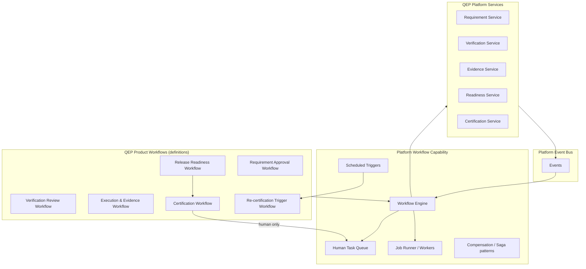
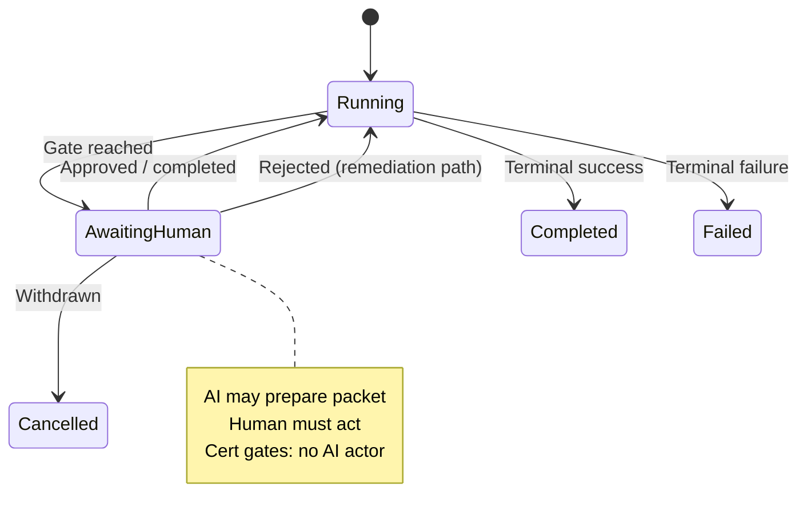
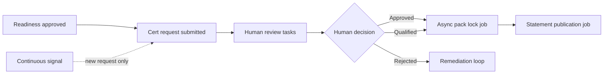
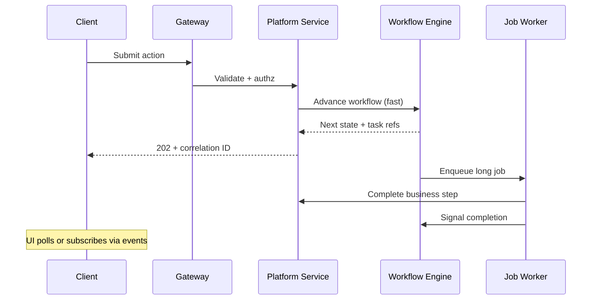

# APZ QEP — Workflow Architecture

> **Programme:** APZQEP-ARCH-001  
> **Document:** WORKFLOW-ARCHITECTURE  
> **Status:** Architecture intent — no implementation  
> **Authority:** Platform 012 (Events & Jobs) · QEP Quality Engineering Lifecycle · Certification Constitution  
> **Rule:** No long-running work in request handlers · No workflow bypass

## Purpose

This document defines the architectural relationship between **APZ QEP product workflows** and the **APZHUB platform workflow capability**. QEP orchestrates the quality engineering lifecycle — requirements through certification — using platform workflow primitives for human gates, async processing, and auditability without embedding ad hoc state machines in request handlers or bypassing platform boundaries.

## Architectural principles

| Principle              | Architectural intent                                                          |
| ---------------------- | ----------------------------------------------------------------------------- |
| Product vs platform    | QEP defines QE lifecycle workflows; platform provides orchestration engine    |
| Human gates mandatory  | Approval steps require authenticated human actors — not AI or timers alone    |
| Async by default       | Long-running steps execute as jobs — not in HTTP/request handlers             |
| No workflow bypass     | Modules invoke Workflow Platform Service — no direct state mutation shortcuts |
| Idempotent jobs        | Retries safe; correlation IDs on all transitions                              |
| Audit every transition | Workflow state changes emit audit and activity events                         |
| Cert isolation         | Certification workflow on dedicated human-only path                           |
| Continuous signals     | May trigger re-entry — never auto-complete certification                      |
| Modular monolith       | Workflow definitions co-deployed with QEP; engine platform-owned              |

## Conceptual layering

## Product workflows vs platform capability

| Dimension     | QEP product workflows                       | Platform workflow capability            |
| ------------- | ------------------------------------------- | --------------------------------------- |
| Ownership     | QEP domain definitions                      | APZHUB reusable engine                  |
| Content       | QE lifecycle stages, gates, SLAs            | Execution, persistence, retries, timers |
| Customisation | Per-tenant policy overlays                  | Stable engine API                       |
| UI            | QEP task surfaces in modules                | Task framework in shell                 |
| Persistence   | Workflow instance refs in platform metadata | Engine stores orchestration state       |
| Integration   | Calls QEP Platform Services                 | Generic — other products reuse          |

QEP **does not** ship a separate workflow product. It **registers** workflow definitions that the platform engine executes.

## QE lifecycle orchestration map

Aligned with [Quality Engineering Lifecycle](../product-definition/QUALITY-ENGINEERING-LIFECYCLE.md):

| Workflow (conceptual)      | Triggers                       | Human gates                       | Async jobs                   |
| -------------------------- | ------------------------------ | --------------------------------- | ---------------------------- |
| Requirement approval       | Requirement submitted          | PO / delegate approve             | Notification, search index   |
| Verification design review | Design draft complete          | QA manager / peer approve         | —                            |
| Verification approval      | Review passed                  | Approver sign-off                 | Plan generation              |
| Execution planning         | Verification approved          | Optional plan approve             | Schedule runs                |
| Execution & evidence       | Run started / completed        | Tester attestation on manual runs | Ingest automation results    |
| Result evaluation          | Results recorded               | QA disposition                    | Defect creation              |
| Defect / risk handling     | Failure detected               | Risk acceptor for waivers         | Retest orchestration         |
| Release readiness          | Evidence sufficient            | Readiness reviewer                | Aggregate gates              |
| Certification              | Readiness approved             | **Named cert approvers**          | Pack lock, statement publish |
| Re-certification           | Signal / expiry / scope change | Same as certification             | Signal correlation           |

## Human gates architecture

| Gate type              | Allowed actors                 | Forbidden                               |
| ---------------------- | ------------------------------ | --------------------------------------- |
| Standard approval      | Permission-holding human users | AI, system cron, anonymous              |
| Risk acceptance        | Risk approver role             | Automation alone                        |
| Certification          | Named cert approvers           | AI, MCP certify tool, continuous signal |
| Waiver / qualification | Compliance-delegated human     | Silent auto-waiver                      |

Human tasks appear in assignee queues with full context links. Delegation and escalation follow platform identity rules.

## Certification workflow isolation

Certification is the highest-accountability workflow. Architectural constraints:

| Constraint             | Intent                                                              |
| ---------------------- | ------------------------------------------------------------------- |
| Dedicated definition   | Cert workflow separate from readiness automation                    |
| Human-only transitions | Approve/reject/qualify actions require human auth context           |
| Evidence pack lock     | Async job locks pack on positive decision — after human act         |
| Continuous signals     | Publish `re_certification_requested` — do not transition cert state |
| AI preparation         | AI may assemble draft pack summary — human submits request          |
| Audit retention        | Extended retention on cert workflow events                          |

## Async processing — no request-handler long-running work

| Work type                | Execution model               | Max request path                        |
| ------------------------ | ----------------------------- | --------------------------------------- |
| User form save           | Synchronous service call      | Validate + persist + respond            |
| Approval submission      | Synchronous enqueue + respond | Create task instance                    |
| Automation result ingest | Async job                     | Acknowledge receipt; process in worker  |
| Evidence pack assembly   | Async job                     | Return job ID; poll/subscribe           |
| Readiness aggregation    | Async job                     | Event-triggered                         |
| Cert pack lock           | Async job                     | After human decision event              |
| Bulk export              | Async job                     | Never block UI thread                   |
| Search reindex           | Async subscriber              | Event-driven                            |
| AI draft generation      | Async or streaming            | Not holding HTTP connection for minutes |

### Request vs async boundary

## Workflow triggers

| Trigger source     | Example                            |
| ------------------ | ---------------------------------- |
| User action        | Submit for approval                |
| Platform event     | Verification run completed         |
| Schedule           | Certification expiry check         |
| Continuous signal  | Coverage drift threshold           |
| External connector | CI pipeline result ingested        |
| Admin              | Force re-run aggregation (audited) |

All triggers carry correlation IDs linking to originating business entities.

## Compensation and failure

| Failure mode            | Architectural response                      |
| ----------------------- | ------------------------------------------- |
| Job failure             | Retry with backoff; DLQ after threshold     |
| Partial evidence ingest | Workflow waits in compensating state        |
| Human timeout           | Escalation policy — not auto-approve        |
| Service unavailable     | Circuit breaker; workflow paused with alert |
| Duplicate event         | Idempotent workflow signal handling         |

## Relationship to notifications and search

| Capability    | Interaction                                                    |
| ------------- | -------------------------------------------------------------- |
| Notifications | Workflow publishes events; Attention Engine notifies assignees |
| Search        | Workflow completion events update search index async           |
| Audit         | Every transition logged immutably                              |
| Reporting     | Workflow metrics feed analytics plane                          |

## Anti-patterns (forbidden)

| Anti-pattern                        | Violation                              |
| ----------------------------------- | -------------------------------------- |
| Sleep in API handler waiting for CI | Long-running in request path           |
| Module-local cron for cert expiry   | Bypass platform workflow               |
| Auto-approve on timer               | Human gate bypass                      |
| Signal → certified                  | Continuous signal changing formal cert |
| Direct SoR patch skipping workflow  | Workflow bypass                        |
| AI webhook completes cert step      | AI certifying                          |

## Deployment and scale

| Concern        | Intent                                              |
| -------------- | --------------------------------------------------- |
| Worker scaling | Horizontal job workers independent of web tier      |
| Workflow state | Platform metadata store — durable                   |
| Air-gapped     | Full workflow engine local — no external dependency |
| HA             | Engine clustered; at-least-once delivery            |

## Non-goals

- BPMN diagram files
- Workflow engine vendor selection
- State table schemas
- API contracts for workflow signals

## Acceptance criteria (architecture)

| Criterion        | Intent                                                        |
| ---------------- | ------------------------------------------------------------- |
| Platform engine  | QEP workflows run on platform capability — not bespoke engine |
| Human cert gates | Cert workflow documented as human-only                        |
| Async boundary   | Long work listed with job execution model                     |
| Signal boundary  | Continuous signals cannot complete cert                       |
| No bypass        | All mutations flow through services + workflow                |
