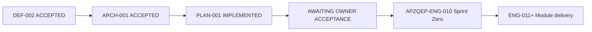

# APZQEP-PLAN-001 — Completion Report

> **Programme:** APZQEP-PLAN-001  
> **Title:** APZ QEP Engineering Planning Baseline  
> **Classification:** ENGINEERING PLANNING  
> **Status:** **IMPLEMENTED / AWAITING OWNER ACCEPTANCE**  
> **Date:** 2026-07-24  
> **Recommendation:** **READY FOR OWNER ENGINEERING PLAN ACCEPTANCE**  
> **Prerequisite:** APZQEP-ARCH-001 — **ACCEPTED** (1.0.0-arch)

## Summary

APZQEP-PLAN-001 delivered the **Engineering Planning Baseline** for APZ QEP as a native APZHUB product. The pack translates the accepted Enterprise Architecture (ARCH-001) and Product Definition (DEF-002) into actionable Engineering intent: Sprint Zero definition, cross-release dependency map, team structure, MVP scope mapping, testing roadmap, and validation checklist — **without** database design, API specifications, ADRs selecting implementation libraries, repository mutations, or production code.

## Engineering planning domains delivered

| Domain | Document(s) | Deliverable |
| ------ | ----------- | ----------- |
| **Sprint Zero** | [SPRINT-ZERO.md](./SPRINT-ZERO.md) | Monorepo extension intent, CI/lint/test/build, secrets, local dev, containerisation, Platform 1.4 coexistence |
| **Dependency map** | [DEPENDENCY-MAP.md](./DEPENDENCY-MAP.md) | Critical path, parallel/blocked/high-risk work; releases 0.1–1.0; mermaid graphs |
| **Team plan** | [TEAM-PLAN.md](./TEAM-PLAN.md) | Platform, Backend, Frontend, QA, AI, DevOps, Architecture, Product — RACI by release |
| **MVP plan** | [MVP-PLAN.md](./MVP-PLAN.md) | Must/Should/Could/Deferred aligned to DEF-002 manual certification path |
| **Testing roadmap** | [TESTING-ROADMAP.md](./TESTING-ROADMAP.md) | Document 015 pyramid mapped to releases; `@mvp-cert` E2E scenario |
| **Validation** | [IMPLEMENTATION-CHECKLIST.md](./IMPLEMENTATION-CHECKLIST.md) | Author sign-off **PASS** |
| **Owner acceptance** | [OWNER-ACCEPTANCE.md](./OWNER-ACCEPTANCE.md) | Acceptance checklist and downstream gate |

## Confirmations

| Confirmation | Status |
| ------------ | ------ |
| APZHUB Platform 1.4 unchanged | **Confirmed** — QEP extends platform; no platform redesign |
| No Engineering performed | **Confirmed** — planning documents only |
| No database design (schemas, tables, migrations) | **Confirmed** |
| No API specifications (paths, OpenAPI, protobuf) | **Confirmed** |
| No implementation code | **Confirmed** |
| No repository package creation | **Confirmed** — layout intent only; execution in ENG-010 |
| Product Definition preserved (DEF-002 MVP) | **Confirmed** — manual certification without AI/MCP |
| Architecture preserved (ARCH-001) | **Confirmed** — modular monolith, bounded contexts, platform consumption |
| All modules M01–M22 scheduled | **Confirmed** — see IMPLEMENTATION-CHECKLIST |
| All logical services AS-01–AS-22 scheduled | **Confirmed** |
| Next programme identified | **Confirmed** — **APZQEP-ENG-010** (Repository Bootstrap & Sprint Zero) |
| AI default OFF at planning layer | **Confirmed** — M17/M18 deferred post-1.0 |
| Human certification on critical path | **Confirmed** — release 0.9 (MVP) |

## Alignment verification

| Source | Alignment |
| ------ | --------- |
| APZHUB Foundation 000–029 | Layering, IAM, gateway, services, events, quality pyramid |
| APZ QEP Constitution | SoR, certification, AI guardrails |
| APZQEP-DEF-002 | 22 modules, MVP scope, manual-first |
| APZQEP-ARCH-001 | Application services, bounded contexts, deployment, technology standards |
| ENVIRONMENT.md | Legacy `apz-stack` coexistence; port non-conflict intent |

## Release plan summary

| Release | Theme | MVP milestone |
| ------- | ----- | ------------- |
| 0.1 | Bootstrap & CI (ENG-010) | Engineering foundation |
| 0.2 | Identity, tenant, permissions | Authenticated workspace |
| 0.3 | Portfolio & projects | Project quality workspace |
| 0.4 | Requirements | Approved scope |
| 0.5 | Verification library & design | Approved verifications |
| 0.6 | Execution & sessions | Manual sessions |
| 0.7 | Evidence & traceability | Coverage gaps visible |
| 0.8 | Defects & risk | Closed-loop quality |
| 0.9 | Certification, readiness, basic QI | **MVP** — `@mvp-cert` green |
| 1.0 | General Availability | GA hardening |

## Evidence

**Path:** `docs/operations/evidence/portfolio-recert/20260724T183600Z-APZQEP-PLAN-001.json`

| Field | Value |
| ----- | ----- |
| Programme | APZQEP-PLAN-001 |
| Pack root | `docs/products/apzqep/engineering-plan/` |
| Deliverable count | 8 documents |
| Baseline version | 1.0.0-plan |
| Engineering performed | false |
| Next programme | APZQEP-ENG-010 |
| Next programme status | NOT_AUTHORISED_UNTIL_PLAN_ACCEPTANCE |

## Lifecycle position



## Document inventory

| File | Purpose | Line count (approx.) |
| ---- | ------- | -------------------- |
| SPRINT-ZERO.md | Sprint 0 / ENG-010 scope within APZHUB monorepo | 228 |
| DEPENDENCY-MAP.md | Critical path, parallel/blocked/risk; releases 0.1–1.0 | 250 |
| TEAM-PLAN.md | Eight teams, capacity, RACI by release | 289 |
| MVP-PLAN.md | MoSCoW MVP aligned to DEF-002 manual cert path | 205 |
| TESTING-ROADMAP.md | Document 015 pyramid per release; `@mvp-cert` | 260 |
| IMPLEMENTATION-CHECKLIST.md | Validation; M01–M22; author PASS | 204 |
| COMPLETION-REPORT.md | This document | — |
| OWNER-ACCEPTANCE.md | Owner gate; ENG-010 downstream | — |

## Architecture decision coverage (planning level)

Planning respects ARCH-001 decisions without re-deciding them:

| Decision | Planning reflection |
| -------- | ------------------- |
| QEP-AD-001 Modular monolith first | Single deployable; service seams in DEPENDENCY-MAP |
| QEP-AD-004 AI default OFF | M17 deferred; feature flag in Sprint Zero |
| QEP-AD-006 Evidence lock | Release 0.9; TESTING-ROADMAP immutability test |
| QEP-AD-007 Human certification | Release 0.9 critical path (MVP) |
| QEP-AD-010 Manual verification MVP | MVP-PLAN Must Have M05/M06 |
| QEP-AD-017 Certification multi-approver | TEAM-PLAN RACI; TESTING-ROADMAP SoD tests |

## MVP certification path (planning confirmation)

```mermaid
sequenceDiagram
  participant Admin
  participant BA as Business Analyst
  participant QA as QA Engineer
  participant RM as Release Manager
  participant SYS as QEP Platform

  Admin->>SYS: Provision tenant + project (0.2–0.3)
  BA->>SYS: Approve requirements (0.4)
  QA->>SYS: Design + approve verifications (0.5)
  QA->>SYS: Execute manual session (0.6)
  QA->>SYS: Attach evidence; view traceability gaps (0.7)
  QA->>SYS: Defect + retest; risk accept (0.8)
  RM->>SYS: Release readiness assessment (0.9)
  RM->>SYS: Human certification decision (0.9)
  SYS->>SYS: Lock evidence pack
  Note over SYS: No AI/MCP on path — MVP at 0.9
```

## Risk register (planning phase)

| Risk | Likelihood | Impact | Mitigation in plan |
| ---- | ---------- | ------ | ------------------ |
| Critical path slip at 0.4 or 0.5 | Medium | High | DEPENDENCY-MAP; dedicated BE capacity |
| Evidence lock complexity | Medium | High | Early 0.7 spike; lock at 0.9; CERT-ARCH invariants |
| Platform authz mapping errors | Medium | High | 0.2 permission matrix tests |
| E2E flakiness on cert path | High | Medium | TESTING-ROADMAP idempotent fixtures |
| Scope creep into AI/MCP MVP | Low | High | MVP-PLAN explicit Deferred tier |
| Legacy stack port conflict | Low | Medium | SPRINT-ZERO ENVIRONMENT.md addendum |

## STOP

Await **Owner Engineering Plan Acceptance** of APZQEP-PLAN-001.

Do **not** begin **APZQEP-ENG-010**, repository bootstrap, database design, API specifications, Product ADRs, or implementation until Plan Acceptance and subsequent named Approvals.

**Next authorised programme after Plan Acceptance:** **APZQEP-ENG-010** (Repository Bootstrap & Sprint Zero).

---

| Version | Date | Change |
| ------- | ---- | ------ |
| 1.0.0-plan | 2026-07-24 | Initial completion report — APZQEP-PLAN-001 |
| 1.0.1-plan | 2026-07-24 | Release mappings aligned to RELEASE-PLAN.md |
